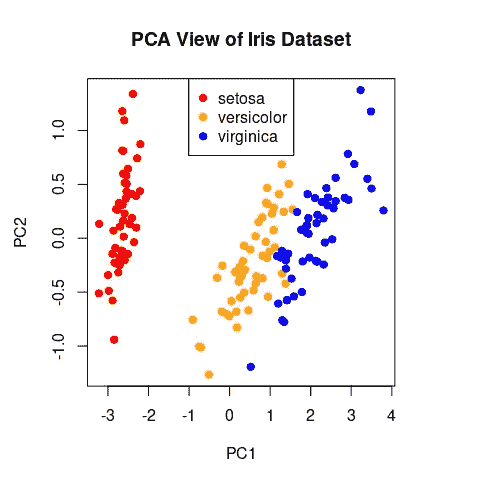
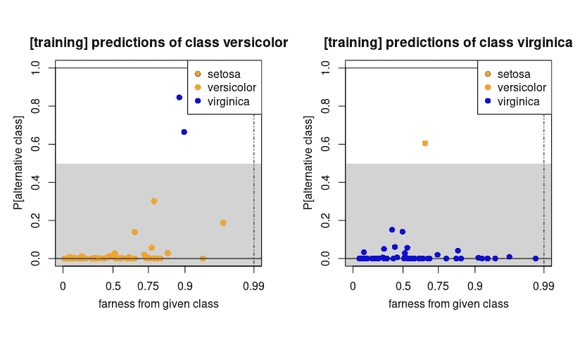
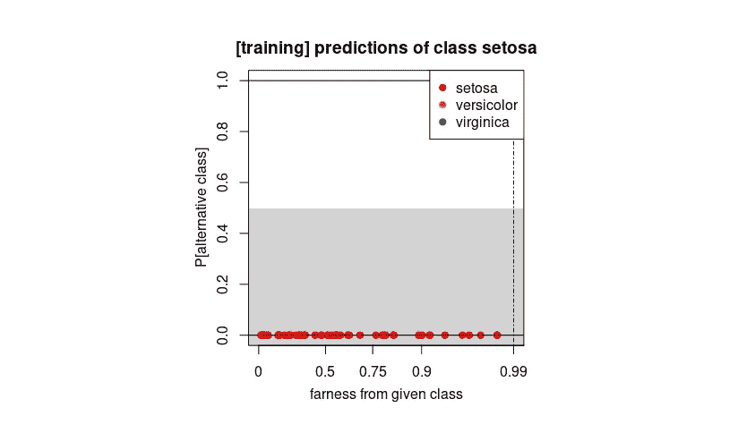
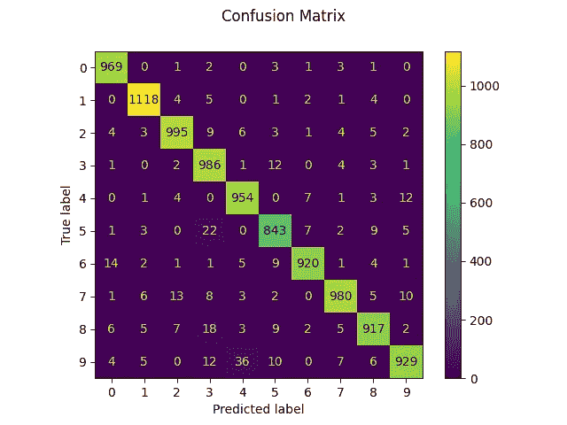
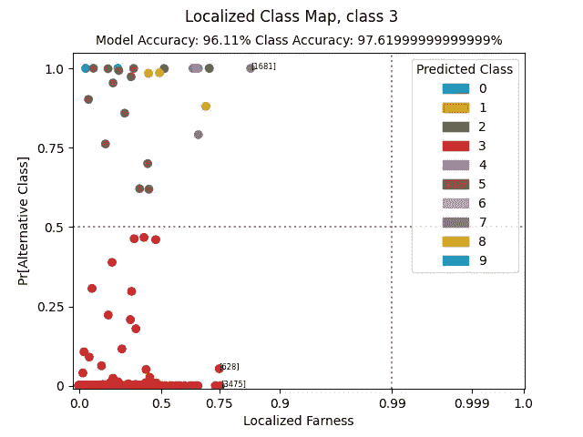
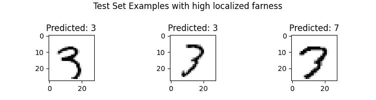
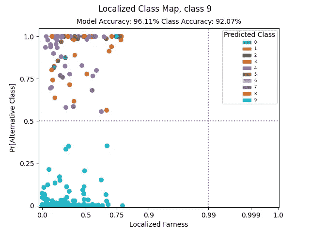
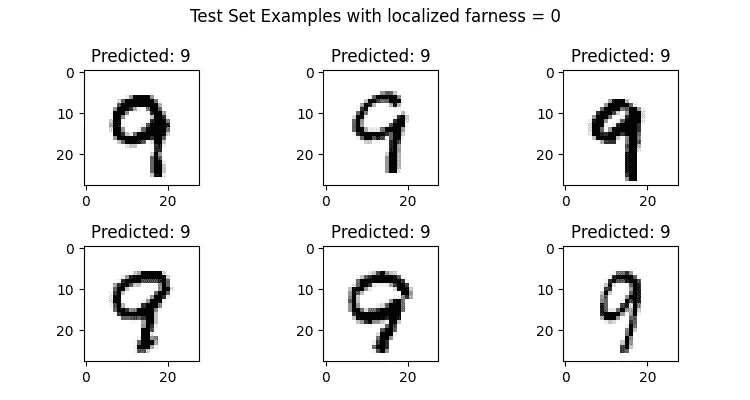
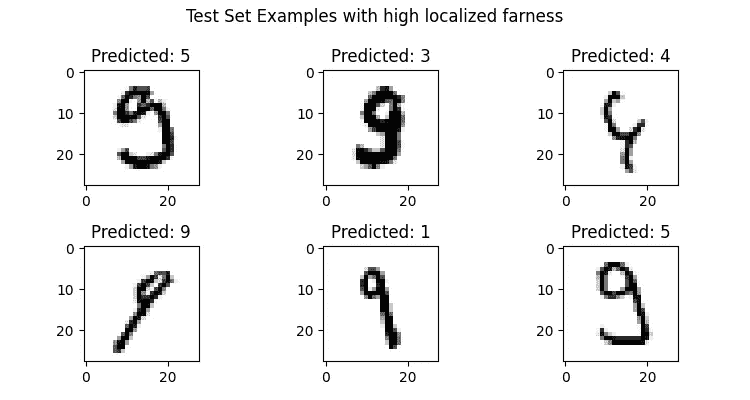

# 带类别映射的可解释人工智能(XAI)

> 原文：<https://towardsdatascience.com/explainable-ai-xai-with-class-maps-d0e137a91d2c>

## 介绍一个新颖的可视化工具，它用 R 和 Python 中的例子解释了分类算法的结果。

查尔斯·德鲁维奥在 [Unsplash](https://unsplash.com?utm_source=medium&utm_medium=referral) 上拍摄的照片

# 对模型解释的需求

分类算法旨在识别一组观察值属于哪个组。机器学习实践者通常构建多个模型，并选择最终的分类器，该分类器优化在保留的测试集上的一组准确度度量。有时，**从业者和利益相关者想要从分类模型中得到更多，而不仅仅是预测。他们可能希望知道分类器决策背后的原因，尤其是当它是为高风险应用而构建时**。例如，考虑一种医疗设置，其中分类器确定患者处于患病的高风险中。如果医学专家能够了解这一预测的影响因素，他们就可以利用这一信息来帮助确定合适的治疗方法。

一些模型，如单一决策树，是透明的，这意味着它们显示了它们如何做出决策的机制。然而，更复杂的模型往往是相反的——它们通常被称为“黑箱”,因为它们不能解释它们是如何做出决策的。不幸的是，选择透明模型而不是黑盒并不总能解决可解释性问题。一组观察值和它的标签之间的关系对于一个简单的模型来说常常太复杂而不能满足需要；透明度是以准确性为代价的[1]。

黑盒模型在高风险应用中的使用越来越多，加上对解释的需求，导致了**可解释的 AI (XAI)** ，的发展，这是一套帮助人类理解机器学习模型输出的方法。可解释性是负责任地开发和使用人工智能的关键部分。

# 可视化分类器的视角

当我们无法直接从分类器中得到解释时，我们可以使用*事后解释，*一种 XAI 方法，解释模型的预测，但不一定揭示它是如何工作的[3]。可视化是一种以简单、友好的方式解释复杂决策的强大方法。此外，可视化工具可以很容易地放置在机器学习管道中，允许自动解释训练集、测试集或特殊子集(例如，可视化分类器在敏感组中的性能)。

[Raymaekers 等人(2021)](https://arxiv.org/abs/2007.14495) 引入了**分类图**，这是一种可视化工具，它将分类器输出的概率映射到它进行预测的观测值的分布。类别图从分类器的角度向我们展示了观察*，揭示了分类器的决策规则和数据结构之间的关系。从业者可以使用类别映射来确定分类模型是否只在边缘情况下出错，或者是否遗漏了人类可以容易识别的观察结果。我们还可以了解一个分类器是否在子观察组中表现一致，表明其公平程度。*

从本质上来说，**类别映射帮助我们在部署模型之前轻松地确定我们是否可以信任它**。

理解一个类别映射的最好方法是用一个简单的例子(*注意:这个例子和后面所有例子的代码可以在这篇文章的结尾找到。*)

# 示例:对虹膜数据集进行分类

考虑对基准鸢尾数据集进行分类的任务，该数据集包含对鸢尾花的 150 个观察结果的四个属性，平均分为三个物种:setosa、versicolor 和 virginica。为了了解数据的结构，我们首先展示一个主成分分析(PCA)视图，用类别标签进行着色:

iris 数据集的主成分分析(PCA)视图，由地面实况分类标签着色。“setosa”虹膜作为一个独特的群体出现，而“versicolor”和“virginica”有一些重叠，使它们更难按作者分类

刚毛藻属物种作为一个独特的群体存在，而杂色花和海滨花有更多的共同点。分类器很可能难以对来自后两类的观察结果进行分类。

由于数据似乎是线性可分的，我们选择拟合线性判别分析分类器(注意:在这个例子中，我们不进行训练/测试分离，而是将分类器拟合到整个数据集)。我们获得了具有 98%准确度的拟合分类器。我们可以就此打住，或者我们可以问:分类器在哪里出错，为什么？

让我们来看一张**分类地图**，上面有地面实况标签“云芝”和“弗吉尼亚”:

带有地面实况标签“杂色”(左)和“弗吉尼亚”(右)的观测分类图。类别映射显示了分类器对数据的观点。每个观察值都是一个点，由分类器的预测类别着色。y 轴显示观察值属于备选类别的概率。x 轴是 farness，这是一个对象距离其类中心有多远的度量。这里，错误分类的观察远离它们的类别，表明它们是按作者分类|图像的挑战性例子

类别图将属于单个类别的地面实况标签的观察可视化为散点图。每个观察值都被其预测的类别着色。对于每个观察值，类别图反映了观察值属于另一个类别(在 y 轴上)的**概率，以及它与自己的类别**(在 x 轴上)的距离的**度量。这些量分别被称为备选分类的概率(PAC)和模糊度，并且从训练的分类器中导出。感兴趣的读者可以在 [Raymaekers et al. (2021)](https://arxiv.org/abs/2007.14495) 中找到每个量的数学定义。**

横向看，属于类别“versicolor”的观察值的类别图(左)显示分类器将大多数观察值视为其类别的典型。一些观察被认为是“远离”他们的类。海滨锦鸡儿花的情况大致相似，但这类观察的分布更为分散——有更多的高远度观察。垂直查看每个类别图，我们可以看到每个观察值属于其类别的条件概率，该概率来自经过训练的分类器。大多数观察结果被认为极有可能属于它们的基本事实类别。然而，总共有三个观察结果被错误分类。查看数据的 PCA 视图，毫不奇怪地看到分类器发现云芝花和海滨花之间的混淆。

我们还可以看到分类器如何使用基本事实标签“setosa”来查看观察结果:

类“setosa”的类映射。分类器确定所有的观察都属于作者的同一类别|图像

纵向看，我们看到分类器非常确定这一类的所有观察值都属于它们的真实标签。不管观察值相对于其类中心位于何处，这都是正确的。

虽然这个例子比典型的分类问题简单得多，但它展示了类别映射背后的思想。使用这个工具，我们能够看到特定分类器是如何查看数据的。我们知道“setosa”类很容易分类，而其他两个类更具挑战性。分类器会在非典型的观察值上出错。

在类别图中绘制的两个量都来自一个经过训练的分类器，使得该方法**依赖于模型。**目前，类别映射可用于以下分类器:判别分析、K-最近邻、支持向量机、决策树、随机森林和神经网络。

但是如果我们想要其他分类模型的解释呢？

# *本地化的*类别映射:一个与模型无关的类别映射

第二种类别映射是**本地化类别映射**，类别映射的模型不可知版本，在 [Kawa (2021)](https://github.com/nurakawa/localized-classmap/blob/main/msc_thesis_kawa.pdf) 中介绍。y 轴保持不变，它显示了某个观察值属于其基本类别的条件概率。本地化类别图的 x 轴显示 ***本地化的距离*，这是一种使用数据的本地质量来评估对象在数据空间中的位置**的度量。这显示了分类器在数据的局部和全局结构方面的表现。

局部远度通过在它的局部邻域内寻找来测量一个观察值离它的类有多远。它基于 [Napierala (2015)](https://link.springer.com/article/10.1007/s10844-015-0368-1) 中提出的方法。对于观测值 *i* 的 *k-* 邻域，局部距离计算来自相同地面实况类的邻域的加权比率。如果 *i* 属于几乎所有邻居都属于同一类的邻域，则它具有较低的局部距离；本质上，它生活在它的类成员附近。如果我住在一个大多数邻居都来自不同阶层的社区，那么它就远离了自己的阶层。在定义中(可以在[这篇博文](https://nurakawa.github.io/localized-class-map)中找到)，更近的邻居被赋予更大的权重。用户确定适当的 *k* ，或者邻域的大小，默认设置为 *k=10。*

通过用局部化的远度替换远度，我们可以为任何分类器制作类别映射(如果数据不是数字，我们可以使用高尔距离来找到其最近的邻居)。此外，数据分布的结果视图不依赖于分类器。因此，我们可以使用这个版本的类别映射来了解数据分类的难度，并对同一数据比较不同的分类器。

与原始的类别映射一样，我们用一个基准示例来解释本地化的类别映射。更详细的解释和例子可以在[这里](https://github.com/nurakawa/localized-classmap/blob/main/msc_thesis_kawa.pdf)找到。

# 示例:对手写数字进行分类

机器学习中的一个基准问题是 MNIST 手写数字数据集的[分类。我们在 60，000 个手写数字的训练集上训练了一个多层感知器(MLP)，在 10，000 个数字的保留测试集上获得了 96.11%的准确率。为了了解该分类器的性能，我们可以查看混淆矩阵:](https://en.wikipedia.org/wiki/MNIST_database)

*图 1:反映测试集性能的 MLP 分类器的混淆矩阵*

水平查看图像，我们可以看到分类器对测试集中的每个标签(数字 0-9)的表现。对于具有真实标签“3”的图像，我们看到分类器将大多数图像识别到它们的真实类别。但是，它错误地将 12 个图像标识为“5”。查看具有真实标签“9”的观察，我们看到分类器在“9”和“4”之间具有最大的混淆。

对于某些应用，混淆矩阵给出了足够好的分类图像。然而，有时我们想知道更多。举个例子，

*   分类器会在哪些例子中出错？
*   分类器会犯人类也会犯的错误吗？或者，它会在相对简单的例子上出错吗？
*   有些类比其他类更难分类吗？换句话说，有些课程包含许多具有挑战性的例子和/或污染吗？

正如在第一个例子中，我们可以从分类器*的角度使用类别映射来回答这些问题。*为了获得模型不可知的视图，我们可以为测试集中的每个数字绘制一个**本地化的类别映射图**。下面是带有基本事实标签“3”的观察的本地化类别图:

*带有基础真值标签“3”的测试集观测值的本地化类别图。分类器对此类的性能优于其整体性能。大多数被错误分类的观测值都有很高的局部距离，这意味着它们生活在不同的邻域内*

像以前一样，每个观察都被可视化为点，用预测标签着色。y 轴仍为备选类别概率(PAC ),反映了分类器将观察值分配到备选类别的可能性。在这里，我们看到大多数观测值的 PAC = 0；分类器非常确信它们属于它们自己的类。然而，相当多的点具有较高的 PAC 值，反映了分类器对其类成员的不确定性。

在 x 轴上，我们有**局部远度**，它测量一个观察值相对于它自己的类有多远(这里，我们使用默认值 *k* 来计算局部远度)。大多数物体具有相对较低的局部远度，这意味着它们是数字“3”的典型例子。然而，一些对象偏离了它们的类。我们在本地化类别映射中确定了三个示例，并将其绘制如下:

*带有地面真实标签“3”的观察结果的例子，其具有高的局部远度。他们是他们班的非典型例子* |作者图片

从左向右看，前两个图像具有接近 0 的 PAC 分类器非常确定它们属于数字“3 ”,尽管它们看起来与平均数字不同。最后一个图像的 PAC = 1:分类器非常确定这个图像是数字“7”。分类器相信这一点是明智的；对于人类来说，图像分类是一个具有挑战性的例子。

我们还可以从同一个分类器中绘制一个本地化的类别映射，这一次是使用地面实况标签“9”的例子，这一次使用 *k* =40 个最近邻居来计算本地化的距离:

*带有基本事实标签“9”的测试集观察的本地化类别映射。即使在相对同质的邻域中，分类器的表现也很差。它在类别“9”和“4”之间有最大的混淆* |作者图片

对于这个类，分类器的性能相对较差。事实上，我们看到相当多的点被错误地归类为数字“4”。不管观测的局部距离有多远，分类器似乎都会出错。分类器遗漏了一些简单的例子，并且正确地识别了一些具有挑战性的例子。这表明**分类器没有根据观察值的局部距离**做出决定。例如，如果我们使用 k-最近邻分类器，我们会发现局部距离和 PAC 之间有很强的相关性。

正如我们之前所做的，我们可以查看局部化远度= 0 的观测示例(它们是这一类的典型示例):

*地面实况标签为“9”的观测值示例，其局部化距离为零。他们是他们班的典型代表* |作者图片

以及具有相对较高的局部远距的那些，其位于接近其他数字的邻域中:

*地面实况标签为“9”的观察结果示例具有较高的局部距离。他们是他们班上的非典型例子，大多数被作者错误分类*

我们可以看到为什么每个例子都生活在不同的社区。在顶行中，示例类似于它们被预测的数字；右上角的例子可能真的是数字“4”。最下面一行更容易被人识别，但仍然显示了标准数字“9”的非典型例子。

# 结论

机器学习实践者和利益相关者通常需要对分类算法的结果进行解释。我们介绍了类别图，这是一种新颖的可视化工具，有助于最终用户理解分类器如何做出决策。然后，我们介绍本地化的类别映射，这是类别映射的模型无关扩展。使用基准测试示例，我们已经看到类别映射和本地化类别映射都有助于我们回答关于分类器如何工作的几个问题，例如:

*   分类器是否根据对象的难度做出决策？或者说，是不是在典型事例上犯了错误？
*   数据是相对同质的，还是有大量具有挑战性的例子？
*   一个量词哪里有混淆？
*   为什么分类器会在特定的观察上出错？

虽然这篇文章的重点是分享类别映射的基本思想和它的本地化版本，但是这个工具的用途不仅仅是可视化一个分类算法。它还可以用来比较不同的分类器对相同的数据，评估一个分类器的公平性。为了更详细地了解类别映射，我们参考了原始论文[5]及其关联的 [R 包](https://rdrr.io/cran/classmap/man/classmap.html)。对于本地化的类别映射，我们参考[2]及其相关的[实现](https://github.com/nurakawa/localized-classmap)。

# 代码示例:R 和 Python 中的类别映射

两个版本的类别映射都是开源的，易于使用。类别映射在 CRAN 上的 R 包`classmap`中实现。

本地化的 classmap 是用 Python 和 R 实现的，并且是用流行的机器学习框架构建的。在 Python 中，可以为大多数`scikit-learn`分类器绘制本地化的类别映射。在 R 中，本地化的类别映射与`caret`兼容。下面，我们用每种语言展示可重复的例子。

# r 示例:Iris—类别映射

# Python 示例:MNIST-本地化类别映射

在 R 中，本地化的类别映射被实现为兼容`caret`，这是一个包含大量分类模型的机器学习框架。下面，我们用 Iris 数据集展示一个例子的一部分(完整的例子是[这里是](https://github.com/nurakawa/localized-classmap/blob/main/examples/example_iris.R))。

# r 示例:Iris —本地化类别映射

感谢阅读！

# 参考

[1] Amina Adadi 和 Mohammed Berrada，[窥视黑盒内部:关于可解释人工智能的调查(XAI)](https://ieeexplore.ieee.org/document/8466590) 2018，IEEE Xplore

[2]卡瓦，N. [可视化分类结果](https://github.com/nurakawa/localized-classmap/blob/main/msc_thesis_kawa.pdf)，2021，Github

[3] Lipton，Z. C .，[模型可解释性的神话:在机器学习中，可解释性的概念既重要又不稳定](https://arxiv.org/abs/1606.03490)，2018，arXiv

[4] Napierala，k .和 Stefanowski，j .，[少数类示例的类型及其对从不平衡数据中学习分类器的影响](https://link.springer.com/article/10.1007/s10844-015-0368-1)，2015，智能信息系统杂志

[5] Raymaekers，j .、Rousseeuw，P. J .和 Hubert，m .，[可视化分类结果的分类图](https://arxiv.org/abs/2007.14495#:~:text=The%20goal%20is%20to%20visualize,regression%2C%20and%20coupling%20pairwise%20classifications.)，2021 年，技术计量学