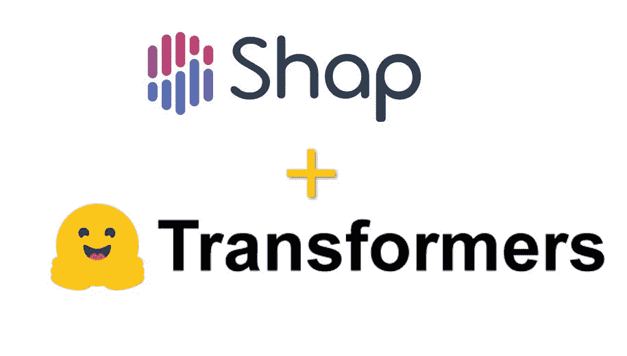
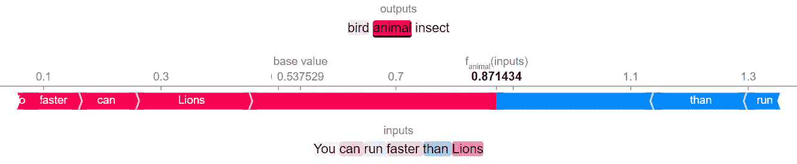
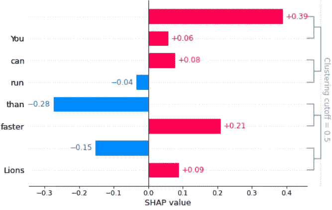

# 基于文本数据训练的模型的可解释机器学习:结合 SHAP 和变压器模型

> 原文：<https://towardsdatascience.com/explainable-machine-learning-for-models-trained-on-text-data-combining-shap-with-transformer-5095ea7f3a8>

## 解释文本分类器变得容易与拥抱脸零杆学习与 SHAP


图像来源— [Unsplash](https://images.unsplash.com/photo-1586769506823-483a8228a6eb?ixlib=rb-1.2.1&raw_url=true&q=80&fm=jpg&crop=entropy&cs=tinysrgb&ixid=MnwxMjA3fDB8MHxwaG90by1wYWdlfHx8fGVufDB8fHx8&auto=format&fit=crop&w=1170)

# 给你一个背景

[**【XML】**](https://www.amazon.com/dp/1803246154/ref=as_sl_pc_as_ss_li_til?tag=adib0073-20&linkCode=w00&linkId=74817cc3f53ad04fe861a6ed9f619830&creativeASIN=1803246154)或[**可讲解人工智能(XAI)**](https://www.amazon.com/dp/1803246154/ref=as_sl_pc_as_ss_li_til?tag=adib0073-20&linkCode=w00&linkId=74817cc3f53ad04fe861a6ed9f619830&creativeASIN=1803246154) 是所有工业级**机器学习(ML)** 或**人工智能(AI)** 系统的必需品。没有可解释性，ML 总是被怀疑地采用，从而限制了在业务用例中使用 ML 的好处。

[](https://www.amazon.com/Applied-Machine-Learning-Explainability-Techniques/dp/1803246154?_encoding=UTF8&pd_rd_w=Wr6SJ&content-id=amzn1.sym.716a1ed9-074f-4780-9325-0019fece3c64&pf_rd_p=716a1ed9-074f-4780-9325-0019fece3c64&pf_rd_r=6P2PM599T97MRG7NZD9J&pd_rd_wg=m4qUW&pd_rd_r=6e349d93-5ba0-4bfe-9055-905c0153fe58&linkCode=li3&tag=adib0073-20&linkId=35506e1847de5c011fc57aa66c2b1d8e&language=en_US&ref_=as_li_ss_il)  

由于文本数据非常丰富，因此有很大的机会解决涉及文本数据的数据科学问题。但与此同时，文本数据非常嘈杂，为了概括文本模型，需要大量的数据。最近，transformer 模型在文本数据方面显示出了很好的结果，而不是传统的**自然语言处理(NLP)** 方法。然而，在大量的原始文本数据上训练 transformer 模型是麻烦且资源昂贵的。幸运的是，随着预先训练的 transformer 模型的出现，使用原始文本数据构建 AI 应用程序的过程已经得到了极大的简化。**抱脸变形金刚模型**([https://github.com/huggingface/transformers](https://github.com/huggingface/transformers))被认为是在海量文本数据上训练出来的最先进的预训练模型。就个人而言，我是拥抱脸框架的忠实粉丝，因为我可以使用几行代码在各种应用程序上利用预先训练的模型。预先训练的模型可以很容易地下载并在任何自定义数据集上进行微调，并且可以非常容易地与其他生产级应用程序集成。

不幸的是，变压器是非常复杂的模型，很难解释。因此，为了简化模型解释过程，我们将探索最流行的 XAI 框架之一**SHAP**([https://github.com/slundberg/shap](https://github.com/slundberg/shap))。在这篇文章中，我们将详细讨论如何使用 SHAP 来解释**抱脸零拍学习模型**并附带代码教程。



图片来源: [GitHub](https://raw.githubusercontent.com/PacktPublishing/Applied-Machine-Learning-Explainability-Techniques/main/Chapter07/images/Shap_HF.jpg)

# 什么是零拍学习？

零镜头学习(Zero shot learning)(ZSL)是一个机器学习过程，其中在推理时间，学习者观察来自类的样本，这些样本在 [t](https://en.wikipedia.org/wiki/Machine_learning#Training_models) he 训练过程中没有观察到，但它需要预测它们所属的类。ZSL 使我们能够应用一个经过训练的模型，而无需对任何带标签的样本进行微调。从技术上来说，这个概念对于文本模型和生产系统来说是一个游戏规则的改变者，有了 ZSL，推广任何定制的应用程序就容易多了。看看这个:[https://discuse . hugging face . co/t/new-pipeline-for-zero-shot-text-class ification/681](https://discuss.huggingface.co/t/new-pipeline-for-zero-shot-text-classification/681)了解更多关于使用拥抱脸变形金刚使用 ZSL 的信息。

# **什么是 SHAP** ？

正如 https://github.com/slundberg/shap 在 SHAP 的 GitHub 知识库中所描述的那样:

> SHAP(SHapley Additive explaints)是一种解释任何机器学习模型输出的博弈论方法。它将最优信用分配与使用博弈论及其相关扩展的经典 Shapley 值的本地解释联系起来。

这是最流行的 XAI 方法之一，因为它可以为不同类型的数据(如表格、文本和图像)提供模型不可知的解释能力。

[](https://www.amazon.com/Applied-Machine-Learning-Explainability-Techniques/dp/1803246154?_encoding=UTF8&pd_rd_w=Wr6SJ&content-id=amzn1.sym.716a1ed9-074f-4780-9325-0019fece3c64&pf_rd_p=716a1ed9-074f-4780-9325-0019fece3c64&pf_rd_r=6P2PM599T97MRG7NZD9J&pd_rd_wg=m4qUW&pd_rd_r=6e349d93-5ba0-4bfe-9055-905c0153fe58&linkCode=li3&tag=adib0073-20&linkId=35506e1847de5c011fc57aa66c2b1d8e&language=en_US&ref_=as_li_ss_il)  

如果你对 XAI 概念不太熟悉，我强烈推荐你观看过去在 2021 年 APAC 人工智能加速器节上发表的关于 XAI 的演讲:

我想让这篇文章更加实用，因为网上有大量的资源可以用来了解概念和算法。在 paper with code([https://paperswithcode.com/search?q_meta=&q _ type =&q = zero+shot+learning](https://paperswithcode.com/search?q_meta=&q_type=&q=zero+shot+learning))上可以找到的研究文献将是了解更多关于 ZSL 的一个很好的起点。让我们开始用 SHAP 为 ZSL 模型应用模型可解释性。

# 设置

在来自 Google Colab 或您的本地环境的 Python Jupyter 笔记本中安装以下库，以成功执行代码:

```
**!**pip install --upgrade numpy shap transformers
```

请确保在继续之前导入以下 Python 库:

```
**import** numpy **as** np
**import** shap
**import** transformers
**from** transformers **import** ZeroShotClassificationPipeline
**from** typing **import** Union, List
```

有时，这些 Python 框架的不同版本会产生不同的结果。因此，请检查您的环境中安装的版本，我们可以在评论中讨论，以防您在安装的版本中遇到任何问题。我在这个例子中使用的版本是:

```
Shap version used: 0.40.0
Hugging Face transformer version used: 4.14.1
```

# 加载拥抱脸预训练模型

现在，我们将使用来自拥抱脸的预先训练的变形金刚模型。

```
model **=** AutoModelForSequenceClassification**.**from_pretrained("valhalla/distilbart-mnli-12-3")
tokenizer **=** AutoTokenizer**.**from_pretrained("valhalla/distilbart-mnli-12-3")
```

**DistilBart-MNLI** 主要是一个 **BART 汇总模型**([https://huggingface.co/valhalla/distilbart-mnli-12-1](https://huggingface.co/valhalla/distilbart-mnli-12-1))但是我们将把它用于我们的 ZSL 模型。

# 设置模型管线

我们可以使用以下方法设置模型管线:

```
*# Create a custom pipeline that only requires the text parameter* 
*# for the __call__ method and provides a method to set the labels*
**class** ZeroShotModelPipeline(ZeroShotClassificationPipeline):
    *# Overwrite the __call__ method*
    **def** __call__(self, *****args):
        out **=** super()**.**__call__(args[0], self**.**set_labels)[0]

        **return** [[{"label":x[0], "score": x[1]}  **for** x **in** zip(out["labels"], out["scores"])]]

    **def** set_labels(self, labels: Union[str,List[str]]):
        self**.**set_labels **=** labels**def** score_and_visualize(text, shap_values):
    prediction **=** pipe(text)
    print(f"Model predictions are: {prediction}")
    shap**.**plots**.**text(shap_values)*# Assign the labels for the classification model*
model**.**config**.**label2id**.**update({v:k **for** k,v **in** enumerate(labels)})
model**.**config**.**id2label**.**update({k:v **for** k,v **in** enumerate(labels)})pipe **=** ZeroShotModelPipeline(model**=**model, tokenizer**=**tokenizer, return_all_scores**=True**)# Setting up the inference text data and the corresponding labels
text = ["You can run faster than Lions"]
labels = ["bird", "animal", "insects"]# Setting the on-the-fly labels to the model pipeline
pipe**.**set_labels(labels)
```

# 解释的 SHAP

接下来，我们将使用 SHAP 模型的可解释性。我们将使用 SHAP 可解释对象，并应用于管道模型。

```
*# SHAP Explainer*
explainer **=** shap**.**Explainer(pipe)
shap_values **=** explainer(text)score_and_visualize(text, shap_values)
```

这将为您提供以下结果和力图可视化:

```
Model predictions are: [[{'label': 'animal', 'score': 0.8714343905448914}, {'label': 'bird', 'score': 0.10309296101331711}, {'label': 'insect', 'score': 0.025472665205597878}]]
```



从 SHAP 框架的力图生成的输出(图片由作者提供)

你也可以得到条形图，找出 Shapley 值对句子中单词的影响。

```
*# Let's visualize the feature importance towards the outcome - animal*
shap**.**plots**.**bar(shap_values[0,:,'*animal*'])
```



从 SHAP 框架的条形图生成的输出(图片由作者提供)

如你所见，使用 SHAP，你可以很容易地突出那些对模型的决策有正面或负面影响的单词。将 SHAP 用于模型不可知可解释性的过程类似于任何其他的 ML 模型。我发现这非常有趣，因为即使复杂的变压器模型也可以用几行代码来解释。执行时间也很快！

完整的笔记本可以在 GitHub 资源库中找到—[https://GitHub . com/packt publishing/Applied-Machine-Learning-explability-Techniques/blob/main/chapter 07/Explaining _ transformers . ipynb](https://github.com/PacktPublishing/Applied-Machine-Learning-Explainability-Techniques/blob/main/Chapter07/Explaining_Transformers.ipynb)。

# 更多关于应用机器学习可解释技术

如果你喜欢这篇文章，并且想了解更多关于可解释 AI (XAI)的知识，请看看我的书 **"** [**应用机器学习可解释技术**](https://www.amazon.com/dp/1803246154/ref=as_sl_pc_as_ss_li_til?tag=adib0073-20&linkCode=w00&linkId=74817cc3f53ad04fe861a6ed9f619830&creativeASIN=1803246154) **"** ，这是 GitHub 知识库，其中包含了许多关于书中各个章节的实践教程:[https://GitHub . com/packt publishing/Applied-Machine-Learning-explability-Techniques](https://github.com/PacktPublishing/Applied-Machine-Learning-Explainability-Techniques)。如果你喜欢 GitHub 资源库中提供的教程，请在资源库中做 fork 和 star，以示你对这个项目的支持！这本书现在可以在亚马逊上买到。

[](https://www.amazon.com/Applied-Machine-Learning-Explainability-Techniques/dp/1803246154?_encoding=UTF8&pd_rd_w=Wr6SJ&content-id=amzn1.sym.716a1ed9-074f-4780-9325-0019fece3c64&pf_rd_p=716a1ed9-074f-4780-9325-0019fece3c64&pf_rd_r=6P2PM599T97MRG7NZD9J&pd_rd_wg=m4qUW&pd_rd_r=6e349d93-5ba0-4bfe-9055-905c0153fe58&linkCode=li3&tag=adib0073-20&linkId=35506e1847de5c011fc57aa66c2b1d8e&language=en_US&ref_=as_li_ss_il)  

本文到此为止！希望你觉得有用。你愿意分享反馈或讨论想法吗？请看下一部分。

# 让我们连接

如果你想联系我分享任何反馈，请随时过来，在 LinkedIn 上说*嗨*——[https://www.linkedin.com/in/aditya-bhattacharya-b59155b6/](https://www.linkedin.com/in/aditya-bhattacharya-b59155b6/)，我们也可以通过我网站上提到的其他方式联系:[https://aditya-bhattacharya.net/contact-me/](https://aditya-bhattacharya.net/contact-me/)。我的其他媒介物品也可以从这里轻松获得:[https://adib0073.medium.com/](https://adib0073.medium.com/)。快乐学习:)