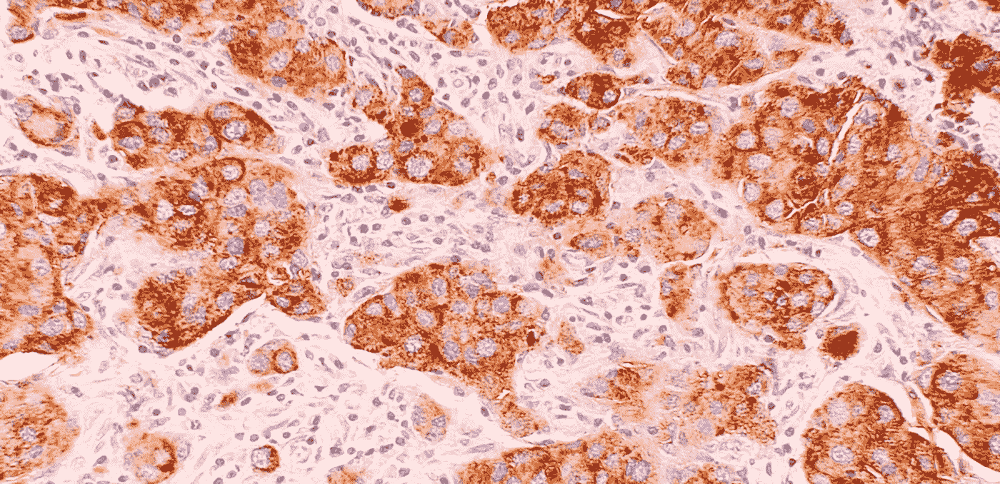
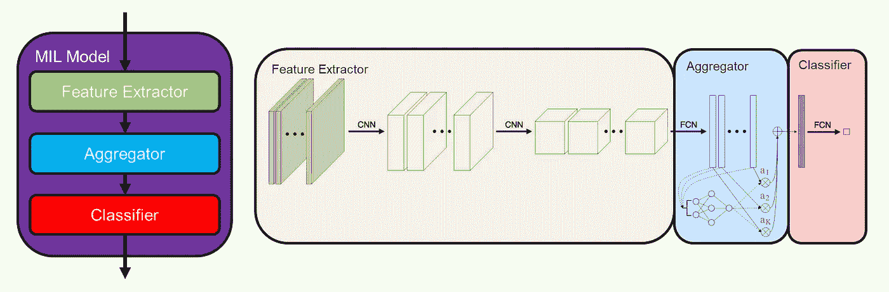
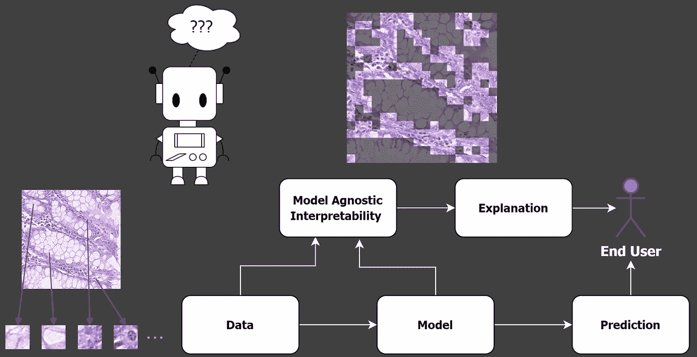
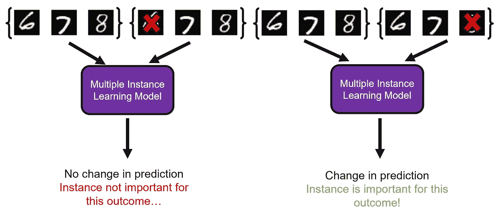

# 高分辨率图像的可解释人工智能

> 原文：<https://towardsdatascience.com/explaining-ai-for-high-resolution-images-fba0c743c76e>

## AI 可以用来根据高分辨率图像做出自动化决策，但我们能理解那些决策吗？在本文中，我将讨论如何使用可解释的多示例学习来解决这个问题。

卫星数据是高分辨率图像的一个例子。美国宇航局在 [Unsplash](https://unsplash.com/s/photos/satellite?utm_source=unsplash&utm_medium=referral&utm_content=creditCopyText) 拍摄的照片。

现代计算机视觉数据集可以包含**数百万张图像**。然而，这些图像通常尺寸很小。比如在 ImageNet [1]中，平均图像**只有 469 x 387 像素**。但是如果每个图像的大小超过 10，000 x 10，000 像素呢？**还是** **超过 10 万 x 10 万？**

在这篇文章中，我探索了**人工智能如何适应**高分辨率图像，然后讨论了**解释这些人工智能模型如何做出决策的方法**。

## 高分辨率数据

数字组织病理学数据是高分辨率影像的另一个例子。[国立癌症研究所](https://unsplash.com/@nci?utm_source=unsplash&utm_medium=referral&utm_content=creditCopyText)在 [Unsplash](https://unsplash.com/s/photos/histopathology?utm_source=unsplash&utm_medium=referral&utm_content=creditCopyText) 拍摄的照片。

在我深入研究机器学习如何应用于高分辨率图像之前，有必要讨论一下这个领域中实际存在的数据类型。我在上面的图片中给出了两个例子，并在下面进一步讨论:

**卫星数据—** 通过卫星观测地球，从太空收集到的数据**越来越多。收集的数据量是巨大的；每天超过 100 兆字节。这样收集的数据通常具有非常高的分辨率，并且还可以具有多个光谱带(例如，红外线以及可见光)。**

**医疗数据** —某些类型的**医疗数据是高分辨率的**。例如，身体的组织样本可以被染色，并在显微镜下进行检查。这些样本然后可以被数字化以产生**整个幻灯片图像** (WSIs)，这是非常高的分辨率( **100，000 x 100，000 像素！**)。

在这两个例子中，对于传统的计算机视觉 **方法**来说，处理高分辨率图像**是不可能的，因为:**

1.  如果图像被**保持在原始分辨率**，机器学习模型就会变得**太大而无法训练**。这是因为模型中参数的数量与输入图像的大小成比例。
2.  如果图像被**重新采样以变小**，重要的**信息通常会丢失**。例如，在 WSI 数据中，如果图像被下采样，则单个细胞将不可识别。或者在卫星数据中，**分辨特征，例如单个建筑物将是不可能的**。

那么，我们如何解决这个问题呢？在下一节中，我将讨论一种被称为**多实例学习**的流行方法。

## 高分辨率图像的多示例学习

**左**:一般 MIL 模型的解剖图(作者创作)。**右**:使用注意力的特定类型 MIL 模型(改编自【2】)。

在多实例学习(MIL)中，数据被**组织成实例包**。对于高分辨率图像，这采取的形式是**将原始高分辨率图像**分割成更小的图像块。然而，MIL 只要求在袋子标签上贴标签。这意味着**我们不必标记每一个实例**，这节省了大量的时间和金钱。下面是一个简短的动画，更详细地解释了这个过程。

MIL 管道的简短动画。作者创作的视频。

对高分辨率图像使用 MIL 的结果是它**处理了上面强调的两个问题**。首先，由于模型现在只处理更小的补丁，模型参数的**数量远远少于**。这使得实际训练模型成为可能。第二，提取的面片**保留了在原始高分辨率图像中捕获的精细细节**，因此没有信息丢失。

鉴于 MIL 是将机器学习应用于高分辨率图像的合适方法，我们如何理解经过训练的模型如何做出决策？

## 解读多示例学习

模型不可知的可解释性允许我们理解 MIL 模型如何做出决策。作者创造的形象。

理解 MIL 模型如何做出决策是我最近一直在研究的一个领域【3】，这导致了一种新的方法:多实例学习局部解释(MILLI)。我是从模型不可知的角度来处理这个问题的。这意味着没有对潜在的故障指示灯模型进行假设。因此，我的方法**适用于任何类型的 MIL 型号**；当前或未来。

一般来说，可解释故障指示灯的目的是理解两个目标:

1.  **包里哪些**是重要的实例？这些是用来做决定的例子。
2.  这些实例支持什么样的结果？不同的实例可以支持不同的结果，因此仅仅**确定关键实例并不能提供完整的解释**。

对于高分辨率图像，回答这两个问题可以通过**突出显示图像**中支持不同结果的重要补丁来实现。例如，数字组织病理学可以**识别指示癌症风险的不同类型细胞核**【4】。然后在模型预测的同时提供决策的解释。这可用于通知最终用户为什么会做出特定决策，**促进对模型的信任。**

从袋子中取出一个实例，观察模型的预测如何变化，这意味着我们可以理解一个实例有多重要。作者创造的形象。

MILLI 允许我们通过利用所有 MIL 模型的一个共同属性来理解 MIL 模型如何做出决策。由于 MIL 箱包的尺寸不必相同(即，每个箱包可以有不同数量的实例)，所有 MIL 型号在设计上都必须能够处理不同尺寸的箱包。这意味着我们能够**从袋子中移除实例，并仍然做出预测**，这是 MIL 独有的属性(在非 MIL 模型中，不可能简单地移除特征)。通过移除实例并观察预测中的变化，可以构建一幅图，显示哪些**实例驱动模型的决策，以及**这些实例支持哪些**结果。**

以这种方式接近可解释的 MIL 比现有的方法更有效。这些现有的方法包括某些类型的故障指示灯模型，这些模型是**固有的可解释的。**作为处理过程的一部分，这些模型会产生自己对决策的解释。例如，这可以包括进行**实例预测以及袋子预测** [5]或者分配值来指示模型对每个实例 [2】的关注程度**。不仅 MILLI 提供的解释比固有的可解释模型更加有效和准确， **MILLI 是模型不可知的**，这意味着它适用于任何类型的 MIL 模型。相反，固有的可解释方法**只适用于特定类型的模型**，限制了它们的适用性。**

## 摘要

高分辨率图像无法使用传统的机器学习技术进行处理。相反，可以使用一种称为**多实例学习**的特殊方法。新技术使我们能够理解经过训练的多实例学习模型如何使用数据来做出决策，并且**向最终用户提供决策的解释**。

## 参考

[1] J. Deng，W. Dong，R. Socher，L.-J. Li，K. Li，和 l .，“Imagenet:
大规模分层图像数据库，”2009 年*IEEE 计算机视觉和模式识别会议*，第 248–255 页，IEEE，2009。
【2】m . Ilse，J. Tomczak，M. Welling，“[基于注意力的深度多重 in-
姿态学习](https://arxiv.org/pdf/1802.04712.pdf)”，载于*国际机器学习会议*，第 2127-
2136 页，PMLR，2018。
【3】j . Early、C. Evers 和 S. Ramchurn，“用于
多示例学习的[模型不可知可解释性”，载于*国际学习表示会议*，2022 年。
【4】k . Sirinukunwattana，S. E. A. Raza，Y.-W. Tsang，D. R. Snead，I. A. Cree，
和 N. M. Rajpoot，](https://arxiv.org/abs/2201.11701)[用于常规结肠癌组织学图像中细胞核的检测和分类的位置敏感深度学习](https://ieeexplore.ieee.org/abstract/document/7399414)， *IEEE 医学成像汇刊*，第 35 卷，第 5 期，第 1196–1206 页，2016 年。
【5】x . Wang，Y. Yan，P. Tang，X. Bai，和 W. Liu，[重温多实例
神经网络](https://www.sciencedirect.com/science/article/pii/S0031320317303382)，*模式识别*，第 74 卷，第 15-24 页，2018