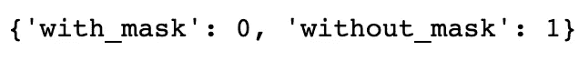
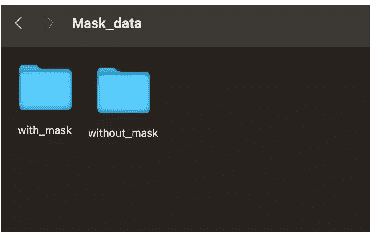
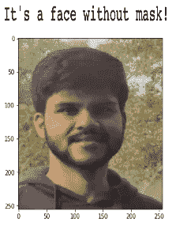
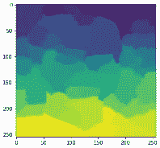
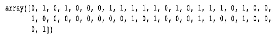
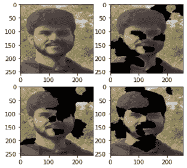
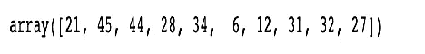
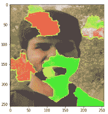

# 用石灰解释口罩图像分类模型

> 原文：<https://towardsdatascience.com/explaining-face-mask-image-classification-model-using-lime-8f423c601ff9>

## 用于解释影像分类模型的 LIME 的不同组件的概述

Rinke Dohmen 在 [Unsplash](https://unsplash.com/s/photos/facemask?utm_source=unsplash&utm_medium=referral&utm_content=creditCopyText) 上拍摄的照片

随着新冠肺炎的持续高涨和新变种的出现，不同的监管机构已经声明了佩戴口罩的重要性，尤其是在公共场所。已经开发了不同的面罩检测机器，并且正在被一些组织使用。所有这些机器都有某种图像分类和检测算法在后台工作。但是，可悲的是，这些算法大多是“黑箱”。这意味着模型正在后台做一些事情，因为它的行为方式对我们来说是模糊的。因此，在这些高度敏感的场景中，是否信任该模型是一个值得关注的问题。

为此，可以使用 LIME(局部可解释模型不可知解释)来解释图像分类模型的行为方式。它可以提供关于负责进行某种预测的超像素(或特征)的清晰想法。在这篇文章中，我将一步一步地分享如何使用`lime`来解释图像分类模型所做的预测。要了解不同可解释性工具的工作机制，请阅读本文

</explainable-ai-an-illuminator-in-the-field-of-black-box-machine-learning-62d805d54a7a>  

**数据描述**

数据收集自[*Prasoon Kottarathil*](https://www.kaggle.com/prasoonkottarathil)*的“面膜简装数据集”*，可在此处【4】。为了进行分析，我从数据集来源中随机选择了大约 10，000 张图像。该数据用于区分图像中的人是否戴着面具(类别 0)或是否戴着面具(类别 1)。图像分类模型的目的是检测那些人没有戴面罩的图像，因此类别“没有面罩”被认为是肯定类别。

图像分类模型的类别(按作者分类的图像)

本文的主要目的是解释图像分类模型所做的预测。因此，我不打算详细介绍我用于分类的 CNN 模型的架构。

**建立 CNN 模型**

数据存储在包含两个文件夹的目录中:一个包含带面具的图像，另一个包含不带面具的图像。

作者图片

使用`ImageDataGenerator()`从路径生成数据。它采用目录的路径并生成批量的扩充数据。由于用于分析的图像是 3d 图像，因此它们包含 3 个通道(`color_mode = ‘rgb'`)。图像被调整到(高度，宽度):`target_size = (256,256)`。`class_mode = ‘categorical'`被选中，这决定了类标签数组将作为二维热编码标签返回。图像从这两个文件夹中流出，其类别标签与它们来自的文件夹名称一致，batch_size 为 32。

*现在让我们创建 CNN 模型！！*

所使用的模型是一个普通的 CNN 模型，它采用 3-D 输入图像并将它们传递到第一个 *Conv2D* 层，该层具有 16 个大小为 3×3 的滤波器和激活函数 ReLU。它返回特征图，然后将这些特征图传递给最大 filer 大小为 2x2 的 *MaxPooling2D* 层，从而降低特征向量的维数。然后它移动到第二个 *Conv2D* 层(32 个滤镜)、 *MaxPooling2D* 层、第三个 *Conv2D* 层(64 个滤镜)和最后一个 *MaxPooling2D* 层。

最后，输出传递到展平层(展平输出)、具有 512 个单元的密集隐藏层和输出大小为 2 的向量(这是两个类的概率向量)的全连接层。

Adam 优化器用于优化二元交叉熵损失函数。

**检查 CNN 模型完成的预测**

现在，让我们看看这个模型是如何处理一个看不见的数据的。为此，我用自己的照片来看看这个模型是否能够正确地对图像进行分类。

作者图片

太神奇了！！该模型已经为该图像预测了合适的类别。

但是我们能相信我们的模型吗？哪些特征影响了我的模型以这种方式进行预测？？

根据模型的准确性来判断模型是不够的。理解“黑箱”模型的行为非常重要。为此，我们可以使用石灰。

# **用石灰解释**

在做任何事情之前，我们首先要知道图像的特征是什么。像素值可用作图像的特征，但在时间上[超像素](https://darshita1405.medium.com/superpixels-and-slic-6b2d8a6e4f08)用作特征。超像素是具有一些共同特征(例如像素强度)的一组像素。它们包含比像素更多的有用信息。有几种方法可以分割图像的像素，如 SLIC(简单线性迭代聚类)、Quickshift 等。

通过使用 Quickshift 算法，我们获得了 46 个超像素，它们作为图像的特征，输出如下所示:

图像的超像素(作者提供的图像)

**扰动样本的生成**

首先，通过随机打开和关闭一些超像素，在原始数据实例的邻域周围创建一些扰动样本。这里，在这个例子中，我们已经在邻域中生成了 1000 个扰动样本，并且已经通过使用已经拟合的 CNN 模型为这些扰动样本预测了类别。下图显示了这种扰动样本的一个示例。注意，每个扰动样本的长度是原始图像中超像素(或特征)的数量。

扰动样本示例(图片由作者提供)

在扰动的样本中，`1`表示超像素打开，`0`表示该位置的超像素关闭。

因此，现在我们已经看到哪些超像素(或特征)出现在扰动的样本中，但我们很想知道这些扰动的图像会是什么样子。不是吗？？

让我们看看。

对于所有关闭的超像素或特征，原始图像的像素被名为 fudged_image 的图像的像素替换。通过取平均像素值或取特定颜色(隐藏颜色)的超像素来创建伪造图像。在这个例子中，fudged_image 是通过使用颜色为 0 的超像素(`hide_color=0`)创建的。

原始图像和前 3 个最接近的扰动图像(作者提供的图像)

**计算原始图像和扰动图像之间的距离**

计算原始图像和扰动图像之间的余弦距离，上图显示了前 3 个最接近的扰动图像。

扰动图像的创建和距离计算

**计算扰动样本的权重**

在邻域中创建扰动样本后，权重(0 和 1 之间的值)被赋予这些样本。与远离原始图像的样本相比，离原始图像近的样本被给予更高的权重。内核宽度为 25 的指数内核用于给出这些权重。基于内核宽度，我们可以定义原始实例周围的“局部性”。

**重要特征或超像素的选择**

通过学习局部线性模型来选择重要的特征。加权线性模型是根据我们从前面的步骤中获得的数据(扰动的样本、它们来自 CNN 模型的预测和权重)拟合的。由于我们想要解释类‘无 _ 掩码’，所以从预测向量中，对应于‘无 _ 掩码’的列被用于局部线性模型中。有几种方法来选择顶部特征，如向前选择，向后消除，甚至我们可以使用正则化的线性模型，如 Lasso 和 Ridge regression。在这个例子中，我对数据拟合了一个岭回归模型。

我得到的前 10 个特征或超像素如下所示

前 10 个超像素(图片由作者提供)

**局部线性模型预测**

在选择了前 10 个特征之后，加权的局部线性模型被拟合以解释由“黑盒”模型在原始图像的局部邻域中所做的预测。

现在我们已经看到了 LIME 是如何一步一步地工作的，并且局部地解释了一个由黑盒模型完成的预测。那么，让我们看看 LIME 的最终输出是什么样子，以及如何解释它。

**石灰解释最终输出**

此示例中使用的图像的最终石灰输出如下所示。在这里，我们希望看到图像中前 10 个最重要的超像素。用绿色标记的超像素是对标签“无 _ 掩码”的预测有积极贡献的特征，用红色标记的超像素是对标签的预测有消极贡献的特征。

最终解释权归 LIME 所有(图片由作者提供)

从上面的解释中，我们可以看到鼻子和嘴附近的超像素对预测“无 _ 掩模”的类别有积极的贡献。因为鼻子和嘴附近的超像素在该图像中不包含遮罩，所以它们对“无遮罩”的预测有积极的贡献。这是有道理的。类似地，耳朵附近的一些超像素对“无 _ 掩码”类的预测有负面影响(模型认为可能是掩码的一些胡须片，如果这是我们需要在训练数据中添加更多变化以正确训练模型的原因)。因此，这是石灰优化拟合模型行为的一个好处。

这让我们走到了尽头。

要获得本文使用的完整 Jupyter 笔记本，请访问我的 [GitHub](https://github.com/kunduayan/LIME_image_classification/tree/main) 库。关于我未来的博客，请在 [LinkedIn](https://www.linkedin.com/in/ayan-kundu-a86293149/) 和 [Medium](https://medium.com/@ayan.kundu09) 关注我。

**结论**

在本文中，我试图解释图像数据的最终结果，以及整个解释过程是如何一步一步地进行的。对于表格和文本数据也可以进行类似的解释。

**参考文献**

1.  GitHub 石灰库:[https://github.com/marcotcr/lime](https://github.com/marcotcr/lime)
2.  超像素和 SLIC:[https://darshita 1405 . medium . com/super pixels-and-SLIC-6 B2 D8 a6 E4 f 08](https://darshita1405.medium.com/superpixels-and-slic-6b2d8a6e4f08)
3.  Scikit-image 图像分割:[https://scikit-image . org/docs/dev/API/skim age . segmentation . html # skim age . segmentation . quick shift](https://scikit-image.org/docs/dev/api/skimage.segmentation.html#skimage.segmentation.quickshift)
4.  数据集来源:[https://www . ka ggle . com/prasoonkottarathil/face-mask-lite-dataset](https://www.kaggle.com/prasoonkottarathil/face-mask-lite-dataset)(License:CC BY-SA 4.0)
5.  数据集许可链接(CC BY-SA 4.0):【https://creativecommons.org/licenses/by-sa/4.0 

***感谢阅读，快乐学习！***