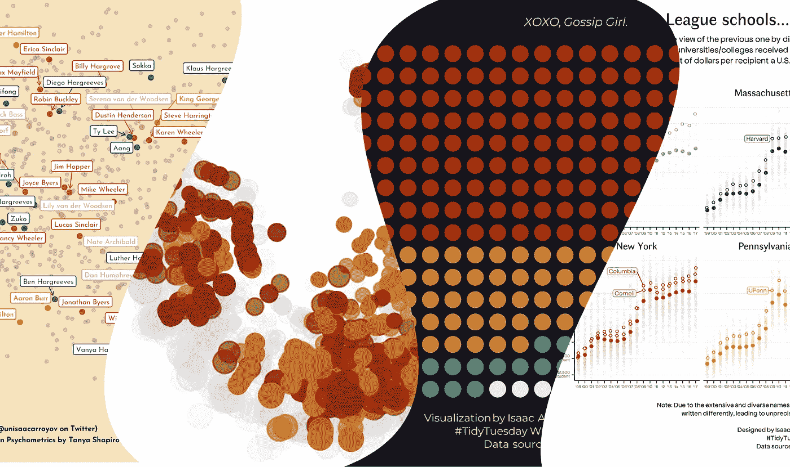
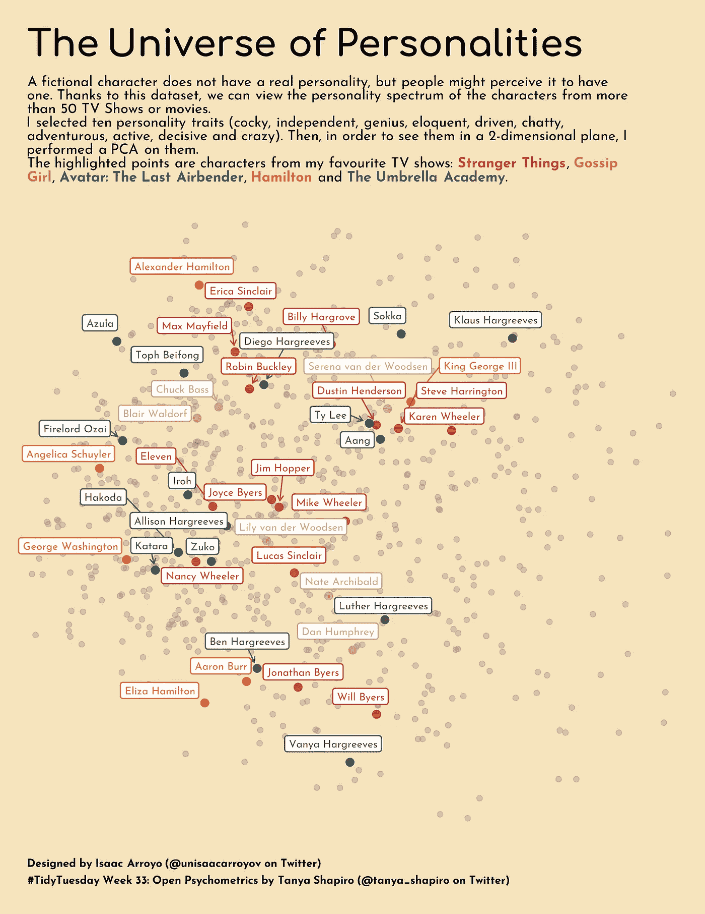
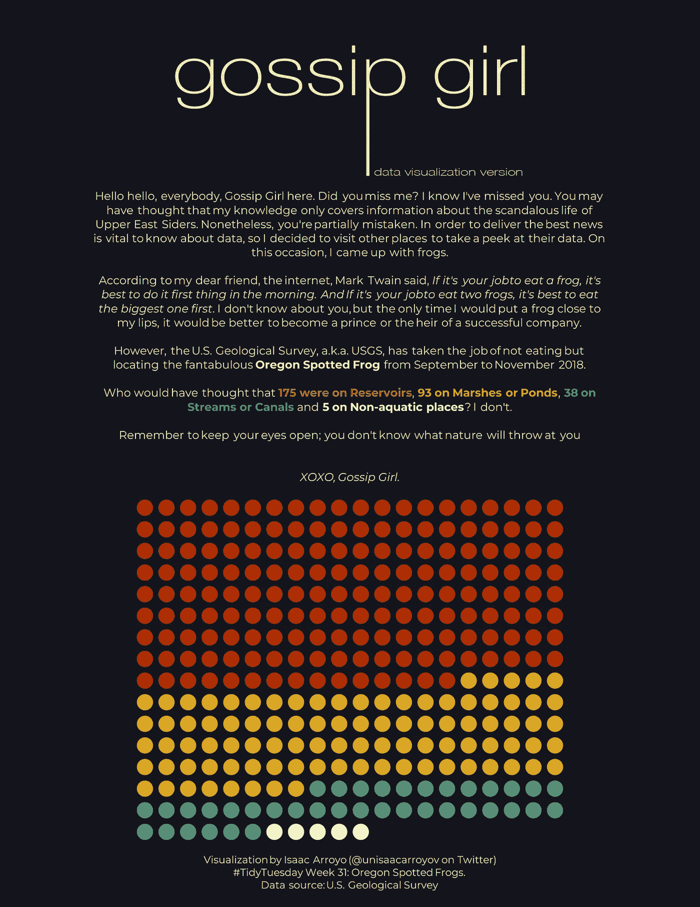
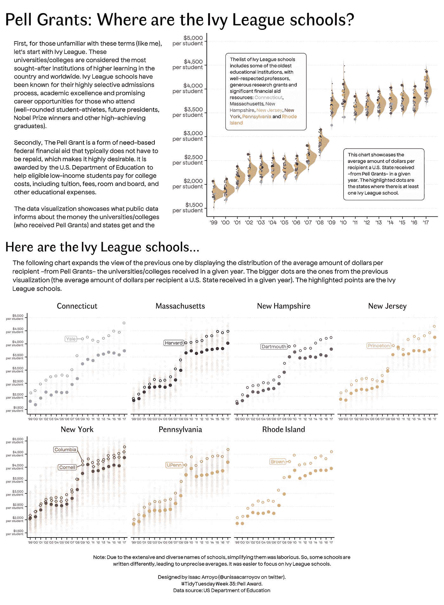

# 解释我最喜欢的#TidyTuesday 项目

> 原文：<https://towardsdatascience.com/explaining-my-favourite-tidytuesday-projects-e44bfe988813>

## 我最喜欢的一些数据可视化的幕后:解释我的想法或思维过程

我最喜欢的#TidyTuesday 数据可视化拼贴。所有的数据可视化和拼贴是由作者。

我喜欢数据可视化，所以当我看到人们每周从不同的数据集中分享他们的 DataViz 时，我感到害怕。然而，我想试一试，所以在过去的十周里，我一直在为#TidyTuesday“挑战赛” ******** 贡献 ******* 作为个人项目，就像许多其他#RStats 人一样。

> 我喜欢说我正在为#TidyTuesday 项目做贡献(尽管没有发送任何数据集)，因为我认为，通过分享我的代码，我正在帮助像我一样的其他人:那些想学习如何创建有吸引力和创造性的数据可视化的人。
> 
> **** Tidy Tuesday** 是 R for Data Science 在线学习社区( [@R4DScommunity](https://twitter.com/R4DScommunity) )针对 R 生态系统的项目。每周社区共享一个新的数据集，整个 R 社区被邀请练习他们的数据争论和数据可视化技能，主要使用 tivdyverse 包的集合。您可以通过使用标签#TidyTuesday 共享数据可视化来加入，还可以查看和参与其他用户的工作。

# 介绍

我写这篇文章是为了分享一些我最喜欢的贡献，并简要解释它们背后我的想法或思维过程，让人们知道我是如何进行设计的，或者为什么我会这样做。

事不宜迟，以下是我最喜欢的截至 2022 年 9 月(我写这篇文章的那个月)的#TidyTuesday 数据可视化(按升序排列，也就是从最不喜欢到最喜欢)。

## 这些数据可视化的例子有什么用？

创造力是一种永远受欢迎的技能，尤其是在与数据工作相关的领域。无论您是数据科学家、数据分析师还是数据记者，创造力都有助于我们讲述更好的故事，提供不同的体验，并从中脱颖而出。所以我也分享一下如何在现实案例中使用。

> **重要提示** 所有的可视化完全是用 R、ggplot2 和 ggplot2 扩展完成的。

# 第四名:人格的宇宙(第 33 周——开放式心理测验)

#第 33 周的每日数据可视化。由作者创作。

人是多维的，把他们封闭成一个单一的人格是复杂的。第 35 周的数据集汇集了人们对虚构人物可能具有的不同性格特征的看法。

我喜欢创建这种数据可视化，因为我有一个想法:看到我最喜欢的节目的角色，并找到谁更接近谁。因此，我进行了主成分分析，减少了十种性格特征，将数据投影在二维平面上；剩下的就是历史了(我说的历史是指你可以看到我的代码)。

## **现实世界案例中的例子:**显示给定一组特征(行为或身体属性)的群体之间的相似性。

记住，有了 PCA，通过交换可解释的变量，你得到了一个更简单的可视化数据的方法。您可以在人们熟悉变量(因此他们不介意查看“人工变量”)的场景中(以这种方式)表示数据，并且您希望突出特定的实例。此外，创建一些原始数据集的散点图来补充故事也无妨。

# 第三名:CPU 和 GPU 的非传统观点(第 34 周—芯片数据集)

#第 34 周的每日数据可视化。由作者创作。

由于我在大学期间(不久前)必须阅读的论文，我习惯于看到科学数据。所以，我把 CHIPS 数据集视为一个发挥创造力的机会。

众所周知，时间序列数据最好用直线表示(垂直或水平)。尽管如此，我还是决定采用一种非常规的方法，圆形环绕 x 轴。

结果呢？包裹在一个“更大”环中的圆(你会发现我最喜欢的几何图形是曲线)。

## **现实世界案例中的例子:**时间序列数据，比如在金融、经济和环境方面。

循环环绕 x 轴是一种从其他时间序列可视化中脱颖而出的创造性方式。然而，这是以牺牲图表的可读性为代价的；圆形布局很难估计和比较 y 轴精确显示的内容。所以，如果你采用这种方法，请记住这一点。

# 第二名:绯闻女孩——数据可视化版(第 31 周——俄勒冈斑点蛙)

#TidyTuesday 第 31 周的数据可视化。由作者创作。

还记得 2010 年代播出的著名电视剧《绯闻女孩》吗？是的，我喜欢。我最喜欢的短语之一是“发现”，每当一个角色在一个特定的但意想不到的地方。

因此，当我读到“第 31 周”是关于“俄勒冈斑点蛙”的时候，我的脑海里只能想到**斑点**这个词。所以，我试着模仿流言蜚女，好像她对数据可视化很感兴趣。

为了创作《绯闻女孩》的标志，我必须使用一些基本的 Adobe Illustrator 技巧；剩下的都是 r。

## **现实案例中的例子:**整体数据的一部分，比如特定人群中不同群体成员的数量(政党和性别认同)。

到这个时候，你可能已经凭直觉知道我最喜欢的几何图形是圆周和曲线；原因是通过使用点(我认为)，人们将数据视为个体而不仅仅是数字。所以，我推荐使用这种方法来突出数据的相关性；用它来代表人或任何其他生物。

# 第 1 名:佩尔·格兰特(Pell Grants):常春藤盟校在哪里？(第 35 周—佩尔奖)

#第 35 周的每日数据可视化。由作者创作。

如果我是一个对 R 和 ggplot2 一无所知的人，我会认为数据可视化是用设计软件(像 Illustrator 或 InDesign)做的。但是，完全是用 r 做的。

我对佩尔助学金、常春藤盟校和美国教育系统一无所知(现在我知道的少一点了)，所以我想创造一个像我这样的人可以理解的可视化。

这是迄今为止我最喜欢的数据可视化。原因？我在这个数据可视化上投入的精力(和代码行)是难以置信的。我不得不调整许多参数，以实现报告式的数据可视化，讲述一个故事(或者这是我对它的想法)，并突出我感兴趣的内容。

我很挣扎，但最后，我对结果很满意。

## **现实案例中的例子:**展示分布并突出它们的关键元素。

我喜欢在同一个地方用一个以上的图表来表示分布，因此是密度分布+点和高亮点。它可以讲述一组其他元素中的几个元素的故事。

我个人不建议只使用代码创建这样的布局；这需要大量的时间，并且不能用不同的数据再现；针对这一任务，存在其他软件，如用于仪表板的 BI 工具(Power BI 或 Tableau)或用于报告的设计软件(Adobe Illustrator 和 Adobe InDesign)。

但是，如果您想探索 ggplot2 及其扩展的范围，这是一个很好的练习。

# 结论

#TidyTuesday 允许我探索我的创造力，测试我的耐心，并学习 R(以及 ggplot2 及其扩展)可以做的新东西。

这并不是结束，我计划尽可能长时间地继续为#TidyTuesday 贡献我的数据可视化(包括代码)。也许在未来，我可以分享其他最喜欢的数据可视化。

*这是我的 GitHub 库，你可以在这里找到这些数据可视化的所有代码。*

<https://github.com/isaacarroyov/tidy_tuesday_R>  

# **关于我**

> 你好！我叫 Isaac，是一名(兼职)数据可视化设计师/专家。我对这个领域充满热情，我不断学习如何交付和设计更好的方法来可视化数据。我热爱协作，渴望在其他领域运用我的数据分析和可视化技能。例如，🧑‍社会科学和人权组织🤝‍🧑👬👭，艺术🎨，公共政策🏛️与环境🌱🍃。
> 我经常在**推特**([**@ unisaakaryov**](http://twitter.com/unisaacarroyov))和 [**Behance**](https://www.behance.net/unisaacarroyov) (也称为**unisaakaryov**)上分享我的项目和数据可视化。
> 可以通过 **Twitter** 或者 [**LinkedIn**](https://www.linkedin.com/in/isaacarroyov/) 联系我。