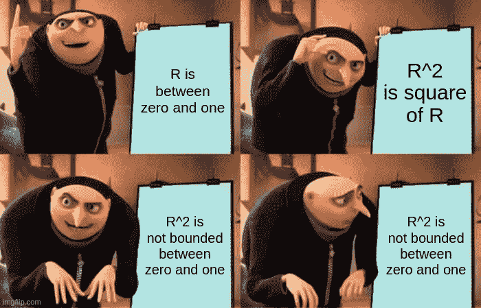
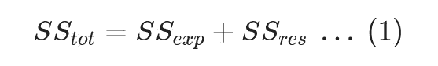
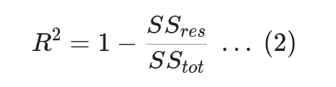

# 解释负 R 平方

> 原文：<https://towardsdatascience.com/explaining-negative-r-squared-17894ca26321>

当我第一次开始做机器学习时，我了解到:

*   r 是决定系数，是对拟合模型解释数据的程度的度量，
*   R 是相关系数的平方，
*   r 是一个范围从 0 到 1 的量

因此，R 也应该在 0 到 1 的范围内。

当 sklearn 中的“r2_score` [”实现返回负数时，我感到很惊讶。怎么回事？](https://scikit-learn.org/stable/modules/generated/sklearn.metrics.r2_score.html)



如果你本能地忽略了数学，这个迷因就是给你的。

> 本文改编自我的[原创博文这里](https://tnwei.github.io/posts/negative-r2/)

## 答案在于定义

r 的定义基于拟合模型的平方和等于解释的平方和加上残差平方和；



其中:

*   总平方和(SS_tot)表示数据的总变化，用预期值和实际值之差的平方和来衡量。
*   解释平方和(SS_exp)代表由拟合模型解释的数据变化，以及
*   残差平方和(SS_res)表示拟合模型无法解释的数据变化。

r 本身定义如下:



根据这些定义，请注意，只有当残差平方和(SS_res)超过总平方和(SS_tot)时，负 R 才是可能的。由于这在数学上是不可能的，这只能意味着所解释的平方和以及残差平方和不再等于总平方和。换句话说，等式 1 中的等式似乎[1]不成立。

怎么会这样呢？

## 因为我们在训练和测试数据上分别评估模型

根据上述定义，SS_tot 可以仅使用数据本身来计算，而 SS_res 取决于模型预测和数据。虽然我们可以使用任何任意模型来生成评分预测，但我们需要认识到，上述等式是为基于相同数据训练的*模型定义的。因此，当我们使用测试数据来评估基于列车数据构建的模型时，它不一定成立！不能保证外国模型的预测和数据之间的差异小于数据本身的变化。*

我们可以从经验上证明这一点。下面的代码对随机生成的数据拟合了几个线性回归模型:

```
from sklearn.model_selection import train_test_split
from sklearn.linear_model import LinearRegression
from sklearn.metrics import r2_score
import numpy as npfor _ in range(20):
    data = np.random.normal(size=(200, 10)) X_train = data[:160, :-1]
    X_test = data[160:, :-1]
    y_train = data[:160, -1]
    y_test = data[160:, -1] lr = LinearRegression()
    lr.fit(X_train, y_train) y_train_pred = lr.predict(X_train)
    y_test_pred = lr.predict(X_test) train_score = r2_score(y_train, y_train_pred)
    test_score = r2_score(y_test, y_test_pred)
    print(f"Train R2: {train_score:.3f}, Test R2: {test_score:.3f}")
```

尽管我们可能会尝试，但是当根据训练数据评估模型时，R 永远不会降到零以下。下面是我在 STDOUT 中得到的内容:

```
Train R2: 0.079, Test R2: -0.059
Train R2: 0.019, Test R2: -0.046
Train R2: 0.084, Test R2: -0.060
Train R2: 0.020, Test R2: -0.083
Train R2: 0.065, Test R2: -0.145
Train R2: 0.022, Test R2: 0.032
Train R2: 0.048, Test R2: 0.107
Train R2: 0.076, Test R2: -0.031
Train R2: 0.029, Test R2: 0.006
Train R2: 0.069, Test R2: -0.150
Train R2: 0.064, Test R2: -0.150
Train R2: 0.053, Test R2: 0.096
Train R2: 0.062, Test R2: 0.022
Train R2: 0.063, Test R2: 0.008
Train R2: 0.059, Test R2: -0.061
Train R2: 0.076, Test R2: -0.191
Train R2: 0.049, Test R2: 0.099
Train R2: 0.040, Test R2: -0.012
Train R2: 0.096, Test R2: -0.373
Train R2: 0.073, Test R2: 0.088
```

## 那么……R 是相关的平方呢？

似乎 R = R * R 只是在有限的情况下。引用下面来自维基百科相关页面的段落:

> R 有几种定义，只是有时是等价的。一类这样的情况包括简单线性回归，其中使用 R 而不是 R。当仅包括截距时，则 R 简单地是观察到的结果和观察到的预测值之间的样本相关系数(即 R)的平方。如果包括额外的回归量，R 是多重相关系数的平方。在这两种情况下，决定系数通常在 0 到 1 之间。

简而言之，如果我们碰巧(1)使用线性回归模型，并且(2)对它们所拟合的相同数据进行评估(如前面所建立的)，R 只是相关性的平方。

## 线性回归背景之外 R 的自由使用

引用的维基百科段落与我翻阅统计文本时的观察一致:R 几乎总是在线性回归的上下文中引入。也就是说，R 的公式使得它对于任何任意的预测模型都是通用定义的，而不考虑统计基础。数据科学家在回归任务中大量使用它，它甚至是 sklearn 中回归模型的默认度量。我们在 R 的原始语境之外如此自由地使用 R，对吗？

老实说，我不知道。一方面，它作为一种度量标准显然有很多用处，这首先导致了它被数据科学家广泛采用。另一方面，你可以在网上找到[讨论](https://stats.stackexchange.com/questions/547863/heres-why-you-can-hopefully-use-r2-for-non-linear-models-why-not) [像](https://blog.minitab.com/en/adventures-in-statistics-2/why-is-there-no-r-squared-for-nonlinear-regression) [这些](https://statisticsbyjim.com/regression/r-squared-invalid-nonlinear-regression/)告诫不要使用 R 进行非线性回归。在我看来，从统计学的角度来看，在正确的条件下计算 R 是很重要的，这样它的性质就可以用于进一步的分析。我观察到在数据科学圈子里相对缺乏关于 R 的讨论，这意味着从数据科学的角度来看，R 不仅仅是像 MSE 或 MAE 那样的性能指标。

就个人而言，我认为我们可以很好地使用 R，只要我们足够了解它，知道用它做什么。

## 包扎

总的来说，只有当线性回归模型是合适的，并且对拟合的相同数据进行评估时，我们才应该期望 R 在零和一之间有界。否则，R 的定义会导致负值。

[1]具体到我在这里选择的词语:)