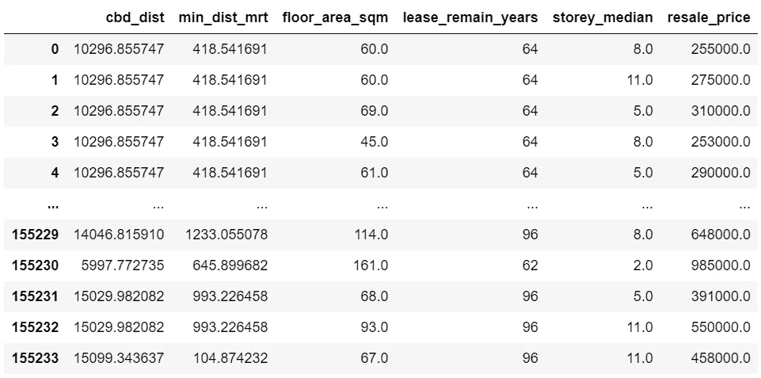
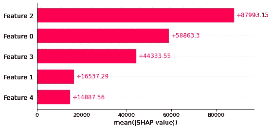
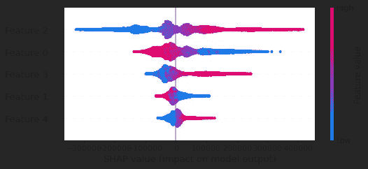
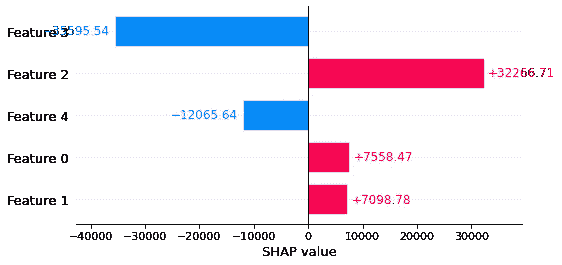
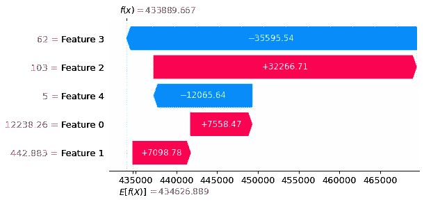
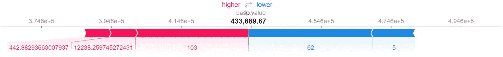

# 用 SHAP 解释 HDB 转售单位售价的回归方法

> 原文：<https://towardsdatascience.com/explaining-regression-methods-on-the-selling-price-of-hdb-resale-flats-using-shap-5b6d8ea9c77f>

## SHAP-帮助解释影响回归模型输出的主要特征的工具


由 [Unsplash](https://unsplash.com/s/photos/hdb?utm_source=unsplash&utm_medium=referral&utm_content=creditCopyText) 上的 [Muhd Asyraaf](https://unsplash.com/@minimxlist_?utm_source=unsplash&utm_medium=referral&utm_content=creditCopyText) 拍摄

# **简介**

机器学习模型被认为是黑盒，因为数据分析师或数据科学家很难解释和理解算法做什么。

在我的上一篇文章中，我使用线性回归预测了从 1990 年 1 月到 2021 年 4 月 HDB 转售公寓的销售价格。如果你还没有看完，请在继续这篇文章之前看完，因为他们是同一个宇宙的一部分(*抱歉释放了我内心的 MCU 粉丝灵魂*)。

[](/predict-the-selling-price-of-hdb-resale-flats-50530391a845) [## 预测 HDB 转售公寓的售价

### 进行线性回归以预测 1990 年 1 月至 2021 年 4 月 HDB 转售单位的售价

towardsdatascience.com](/predict-the-selling-price-of-hdb-resale-flats-50530391a845) 

这一次，我使用 SHAP 来测试和解释不同的回归模型——**虚拟回归变量**(基线回归模型)**线性回归**和**随机森林回归变量**——根据以下标准预测 1990 年 1 月至 2022 年 1 月 HDB 转售公寓的销售价格:

*   它到中央商务区(CBD)的距离
*   到最近的捷运站的距离
*   它扁平的尺寸
*   它的楼层，以及
*   剩余的租赁年数

SHAP 被称为**。*这是一种合作博弈论方法，用于增加透明度和增强对机器学习模型的解释。SHAP 还协助数据分析师和数据科学家对数据集进行全球和本地分析。*

*这个小练习的参考资料可以在 [my GitHub](https://github.com/jimmeng-kok-2017/shap_hdb_explain) 上找到，其中包括数据集和 Python 笔记本文件——数据预处理和数据处理(包括使用 SHAP 在回归模型上创建 explainer 对象)。*

# *使用的数据集*

*   *[Data.gov.sg HDB 转售平板价格](https://data.gov.sg/dataset/resale-flat-prices)(截至 2022 年 1 月 22 日)*
*   *[OneMap API](https://www.onemap.gov.sg/docs/#onemap-rest-apis)*

# *处理*

*数据预处理和数据争论是在上面的数据集上进行的，与我在前面的文章中嵌入的过程相同。*

*然而，去年八月底启用的新捷运站包含在数据预处理阶段。*

**

*数据预处理的地理编码中使用的新加坡捷运站(资料来源:陆路交通管理局)*

*完成这两个过程后，以下是数据框的输出，需要在我们的 SHAP 技术中使用该数据框来生成 SHAP 值以获得洞察力。*

**

*根据标准的数据框表，按作者分类的图像*

*此外，将上述数据帧分成训练和测试数据集如下:*

```
*from sklearn.model_selection import train_test_splitX = df.to_numpy()[:,:-1]
y = df.to_numpy()[:,-1]X_train, X_test, y_train, y_test = train_test_split(X,y,random_state=42,test_size=0.25)*
```

# *使用均方误差(MSE)评估回归模型*

## *1.虚拟回归变量*

*虚拟回归元是一种基线回归模型，它将输出值计算为定型集中所有输出的平均值。*

```
*from sklearn.dummy import DummyRegressordummy = DummyRegressor()
dummy.fit(X_train, y_train)*
```

*该模型还可用作基础，或根据其各项性能(即 MSE)与其他回归模型进行比较。因此，下面是如何计算模型的 MSE。*

```
*y_pred = dummy.predict(X_test)
print("Mean squared error: %.2f" % MSE(y_test, y_pred))*
```

*该模型的均方误差为 23844228796.64。*

## *2.线性回归*

*如前所述，线性回归是我上一篇文章中使用的模型。类似地，建立模型和计算模型的 MSE 已经完成。*

```
*from sklearn.linear_model import LinearRegressionline = LinearRegression()
line.fit(X_train, y_train)
y_pred = line.predict(X_test)print("Mean squared error: %.2f" % MSE(y_test, y_pred))*
```

*该模型的均方误差为 4858150211.68。至此，我们知道线性回归比虚拟模型好，因为线性回归的 MSE 低于虚拟回归的 MSE。*

## *3.随机森林回归量*

*随机森林回归器是集成学习方法(随机森林)的回归模型，它在训练期间构建几个决策树，并输出类的平均值作为所有树的预测。*

*像往常一样，建立模型和计算模型的均方误差。*

```
*from sklearn.ensemble import RandomForestRegressorrf = RandomForestRegressor()
rf.fit(X_train, y_train)
y_pred = rf.predict(X_test)print("Mean squared error: %.2f" % MSE(y_test, y_pred))*
```

*该模型的均方误差为 1428674768.91。因此，我们可以解释随机森林回归器是本练习中使用的回归模型中的最佳模型，因为它具有最低的 MSE。*

*因此，SHAP 值是为随机森林回归模型计算的。*

# *用 SHAP 值和图评估随机森林回归方程*

*生成一个 Explainer 对象，并用于评估测试集，以计算模型的 SHAP 值。**(警告:生成解释器对象和计算 SHAP 值大约需要 1.5 小时。)***

```
*explainer = shap.Explainer(rf.predict, X_test)
shap_values = explainer(X_test)*
```

*在生成 Explainer 对象和计算 SHAP 值之后，是时候为模型生成 SHAP 图了。*

## *整体分析*

*下面的图是用来分析模型特征的整体效应的。*

***酒吧剧情***

```
*shap.plots.bar(shap_values)*
```

**

*作者图片*

*由于要素与数据框的顺序相同，如本文顶部所示，因此有以下要素:*

*   ***特征 0** 是 HDB 转售公寓和中央商务区之间的距离*
*   ***特性 1** 是 HDB 转售公寓与其最近的捷运站之间的距离*
*   ***特征 2** 是平板尺寸*
*   ***特性 3** 是租赁的剩余年限，并且*
*   ***特征 4** 是 HDB 转售公寓的楼层*

*从柱状图中，我们可以推断出**影响最大的**因素是**公寓面积**，其次是从 HDB 转售公寓到 CBD 的距离，而**影响最小的**因素是 HDB 转售公寓的楼层。无论正面或负面影响，图表中显示的特征都不会影响预测。*

***蜂群图(汇总图)***

```
*shap.plots.beeswarm(shap_values)*
```

**

*作者图片*

*与条形图类似，蜂群图中的要素也是按照对预测的影响程度排序的。*

*从以上汇总图可以得出，转售户型**较大**对转售户型售价预测有**正面影响**，而转售户型**较小**有**负面影响**。另一个例子是**转售公寓到 CBD** 的距离越远，对转售公寓售价的预测会有**负面影响**，而****缩短转售公寓到 CBD** 的距离会有**正面影响**。***

## ***局部分析***

***构建以下图来分析影响单个观察预测的主要特征，我随机选择了数据帧的一行(即第 11 行)。***

*****柱状图*****

```
***shap.plots.bar(shap_values[10])***
```

******

***作者图片***

***该图向我们显示，转售公寓的**剩余租赁年数**对该转售公寓售价的预测做出了**高度负的**贡献，而其**公寓大小**对该转售公寓售价的预测做出了**高度正的**贡献。***

*****瀑布图*****

```
***shap.plots.waterfall(shap_values[10])***
```

******

***作者图片***

***瀑布图显示的信息与条形图相同，但表示方式不同。不同的是，我们可以推断所有 SHAP 值的总和如何等于这个转售公寓的**$ 433889.667**(*f(x)*)的预测价格和**$ 434626.889**(*E[f(x)】*的预期价格之间的差异。***

*****力图*****

```
***shap.initjs()
shap.plots.force(shap_values[10])***
```

******

***作者图片***

***与瀑布图类似，力图也显示了每个特征对模型预测的影响。不同之处在于，正 SHAP 值显示在图的左侧，而负 SHAP 值显示在图的右侧。此外，转售公寓的预测价格显示在图的中心。***

# ***结论***

***SHAP 值允许我们揭示机器学习模型如何在内部工作，而 SHAP 值则向我们展示了每个特征如何对模型的预测做出贡献。***

***此外，我们可以说，特征对机器学习模型对全局效应的预测的影响不同于每个单个观察的特征如何影响其模型的预测。***

***在我看来，我相信 SHAP 将是一个分析或数据科学图书馆，从 2022 年开始将更具趋势，因为它是一个非常有用的图书馆，数据分析师或数据科学家可以利用它来揭示机器学习模型，而不是黑盒。***

***希望你们喜欢这篇文章，并对 SHAP 有更多的了解！***

# ***参考***

***[1]Data.gov.sg。[转售统一价格](https://data.gov.sg/dataset/resale-flat-prices)。最后一次访问是在 2022 年 1 月 22 日。(新加坡开放数据许可证)***

***[2] OneMap 新加坡。 [OneMap REST API](https://www.onemap.gov.sg/docs/#onemap-rest-apis) 。最后一次访问是在 2022 年 1 月。(新加坡开放数据许可证)***