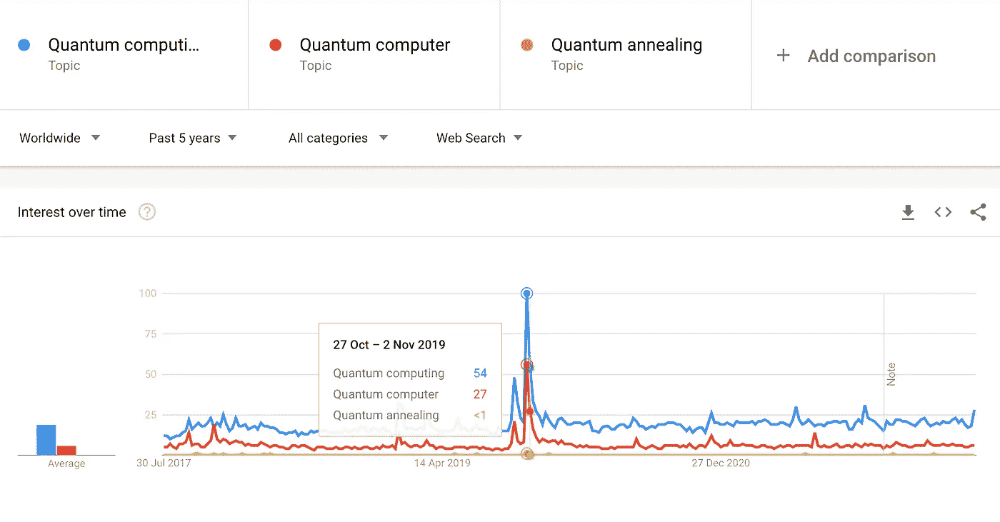
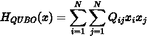
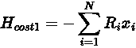
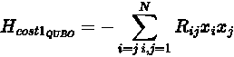
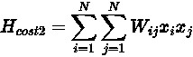
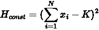
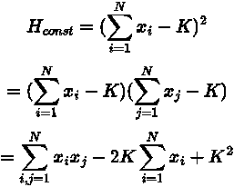

# 探索量子计算:使用量子退火程序解决优化问题

> 原文：<https://towardsdatascience.com/exploration-of-quantum-computing-solving-optimisation-problem-using-quantum-annealer-77c349671969>

## 赶上量子计算的当前状态，并通过 D-Wave 使用 quantum annealer 作为服务进行实验。


薛定谔为什么选择了一只猫？georgi benev 在 [Unsplash](https://unsplash.com?utm_source=medium&utm_medium=referral) 上拍摄的照片

本文旨在概述量子计算，并通过一个例子探索量子 annealer，一种用于解决组合优化问题的专用机器。

我们浏览量子计算背后的基本概念，了解两种不同类型的量子计算机。然后，我们通过一个使用 Python 编程和 quantum annealer 作为 D-Wave 提供的服务进行投资组合优化的例子来关注问题解决实践。

如果您想深入了解实现，请跳过部分，转到“使用 Quantum Annealer 实现”。

# 介绍

摩尔定律可能会在一二十年内过时。硅微芯片上晶体管尺寸的物理极限给我们带来了挑战。计算能力的进步可能会比我们在过去 50 年中目睹的要慢。在寻求突破这种障碍的过程中，有替代的解决方案。例如，图形处理单元(GPU)的使用和张量处理单元(TPU)的开发加快了深度学习的处理速度。量子计算(QC)是最令人兴奋的候选技术之一，它可能会引起范式的转变。

图 1 是从 2017 年 7 月开始，谷歌过去五年对“量子计算”的搜索趋势。有那么一瞬间，这个词突然出现了峰值。2019 年 10 月，谷歌宣布他们实现了量子至上[ [1](https://ai.googleblog.com/2019/10/quantum-supremacy-using-programmable.html) ]，即他们带有量子处理单元(QPU)的 QC 机器比最先进的“经典”超级计算机快 1.58 亿倍。



图 1:搜索术语“量子计算”和相关术语的 5 年趋势。谷歌趋势图片

虽然它吸引了人们的注意力，但普通大众的兴趣未能保持势头。人们常常认为 QC 是炒作，因为它缺乏对现实生活问题的应用。因开发囚禁离子量子计算机而闻名的美国物理学家克里斯托弗·门罗(Christopher Monroe)教授将量子计算描述为“一场马拉松，而不是短跑”[2](https://venturebeat.com/2019/04/21/quantum-computing-is-a-marathon-not-a-sprint/)这可能很好地解释了量子技术的现状，但今天的量子计算在哪里呢？

虽然我们在日常生活中看不到量子机器的存在，但量子计算比十年前离我们更近了。我们现在可以通过云服务轻松访问量子资源。在本文中，我们将体验由 D-Wave 提供的 QC 服务，其机器经常用于学术和商业研究。

首先，我们将了解 QC 的基础知识和两种类型的计算系统:门模型和量子退火。然后，我们从理论和实践的角度转移我们的焦点到量子退火。

# 量子计算机

量子计算机是利用量子力学的特性执行计算的机器，量子力学是基于微观世界的神秘性质。“我想我可以有把握地说，没有人理解量子力学，”诺贝尔奖物理学家理查德·费曼说。在量子尺度上发生的事情遵循不同于我们凭经验所知的物理定律。

一个奇迹是由一个量子位(qubit)实现的，它可以同时代表 0 和 1 的双重状态，而经典的二进制位一次只能接受 0 或 1。这种现象被称为叠加[ [4](https://www.quantum-inspire.com/kbase/superposition-and-entanglement/) ]。例如，要用经典计算机表达两个比特组合，我们需要 2 = 4 个组合，[00，01，10，11]，但两个量子比特可以同时代表所有四种可能的组合。然后，经典计算机依次检查每个组合，然后最多通过四次计算找到一个解决方案。另一方面，量子利用了它的波动性质，使得波动干涉增加了期望状态的概率，并降低了另一个达到正确解的概率。

量子位是由什么组成的？它们可以使用不同的材料和原理来开发。例如，IBM Quantum 利用硅基上的铌和铝[ [5](https://quantum-computing.ibm.com/composer/docs/iqx/guide/the-qubit) ]在接近绝对零度的温度下实现超导。美国的离子 Q 使用来自稀土金属镱的“俘获离子量子”[ [6](https://ionq.com/technology) ]。再比如加拿大的 Xanadu 在量子处理单元[ [7](https://www.xanadu.ai/) ]中应用光子学(光粒子)。离子和光的使用优于超导材料，因为它在室温下工作；超导量子位更具可扩展性，由谷歌[ [8](https://quantumai.google/hardware) ]和 D-Wave [ [9](https://arxiv.org/pdf/2108.02322.pdf) ]等其他公司实现。看到这一领域未来的创新是令人兴奋的。

# 两种量子计算机

QC 的概念可以追溯到 20 世纪 80 年代，但直到 21 世纪初，越来越多的人开始谈论它是下一件大事。然而，量子计算机能解决什么问题还不是众所周知的。我们可以把量子计算机分为“门模型”和“量子退火”。它们有不同的用例和架构。

## 闸门模型

量子门模型计算机是为通用目的设计的，通过应用门来构建复杂的算法。它们可以被认为是经典计算机的向上兼容机器，但如果使用适当的量子算法，如 Shor [ [10](https://en.wikipedia.org/wiki/Shor%27s_algorithm) ]和 Grover [ [11](https://en.wikipedia.org/wiki/Grover%27s_algorithm) ]，则速度会呈指数级增长。这些应用包括质因数分解，它对使用 RSA(Rivest–sha mir–ad leman)密钥的现有互联网安全数据传输方法构成了威胁，量子模拟有可能发现新药，以及机器学习。但是，gate 模型需要高质量的量子位处理器；量子位的数量限制为两位数(IBM 的探索性 127 量子位 Eagle 系统除外。)

## 量子退火

另一方面，量子退火器在用于从大量可能的组合中寻找最佳组合时大放异彩。这种挑战被称为组合优化问题。最近报道了量子退火的许多应用[ [12](https://www.dwavesys.com/learn/featured-applications/) ]。也有研究使用量子退火器开发新的机器学习算法。在[13]中，Amin 等人表明，通过利用其量子特性，有可能将量子退火硬件用作玻尔兹曼机的采样器。

在物理学中，最小能量原理表明内能减少并接近最小值[ [14](https://en.wikipedia.org/wiki/Principle_of_minimum_energy) ]。如果我们能以能量最小化方程的形式来表述我们的问题，量子退火器就能寻找到最好的答案。

与门模型相比，量子退火器具有相对较高的噪声容限[15]。在撰写本文时，D-Wave 的 Advantage solver [ [16](https://www.dwavesys.com/media/3xvdipcn/14-1058a-a_advantage_processor_overview.pdf) ]提供了一个量子处理单元(QPU)上最可观的量子位数量，至少有五千个。预计在未来几年里，这一数字还会增加。5000 量子位与门模型相比是一个很大的数字。但是，我们从 annealer 获得的数据有限，每次采样只有一组 5k 位的值。此外，并不是所有的量子位都是相连的。因此，经典计算和量子退火程序的混合系统正在开发中，以补充这两个系统的功能。

# 量子退火

退火是一种通过将材料加热到一定温度并缓慢冷却来制造优质铁产品的技术。铁的机械特性通过热处理被改变，这降低了硬度并增加了弹性。

模拟退火(SA)是一种概率技术，其名称和思想来源于材料科学中的退火。SA 是一种元启发式算法，其中算法近似给定函数的全局最小值或最大值。它使用一个名为*温度*的参数，该参数初始化为一个高值，并随着算法的进行而降低，就像物理退火一样。高温值促使算法寻找问题空间的各个部分，这有助于避免陷入局部最小值或最大值。当温度降到零度时，如果成功，状态达到最佳点。浏览 SA 算法超出了本文的范围，关于它如何工作的细节可以在例如[的 MathWorks 网站](https://uk.mathworks.com/help/gads/how-simulated-annealing-works.html)上找到。

量子退火是一种主要解决组合优化问题的算法。QA 不是用温度来探索问题空间，而是用量子力学的定律来衡量能量状态。从量子位的双重状态开始，所有可能的值的组合都同样可能发生，我们可以通过称为量子波动的过程来逐渐减少这种量子力学效应，以达到实现最低能量状态的最佳点。

在[18]中，Kadowaki 和 Nishimori 证明了在经典计算机上，QA 几乎在所有情况下都以比 SA 大得多的概率收敛到最优状态。实际的量子退火机器是由 D-Wave 开发的，并建立在它们的理论框架的基础上。

# 为质量保证制定问题

QA 机器是解决组合优化问题的专用硬件。这些问题在我们生活中的很多地方都能找到。例如，亚马逊送货人员需要找到最佳路线来运送当天给定的所有包裹。目标是找到一条访问所有交货地址的最短距离的路径。我们可以把距离当作 QA 上下文中的能量，找到到达基态的路径。我们还可以想到一个未来的例子，多辆自动驾驶汽车在交通拥堵的特定城市区域导航，以优化交通。目标是通过最小化同时走同一条路线的车辆重叠数量来减少交通流量，同时每辆车的目标是优化到达目的地的行程时间。大众集团和 D-Wave 的研究人员使用 quantum annealer 进行的交通优化挑战的一个突出例子可以在[ [19](https://www.frontiersin.org/articles/10.3389/fict.2017.00029/full) 中找到。

量子退火器需要在伊辛模型或二次无约束二元优化(曲波)中定义目标函数。伊辛模型是统计力学中的一种数学模型。曲波在数学上等同于伊辛模型，并且更容易表述问题。

曲波是一个最小化目标函数，表示如下:



情商。1 曲波二次函数

其中 x_i 和 x_j {i，j =0，1，…，N}取 0 或 1。Q_{ij}是一个大小为 n×n 的系数矩阵，我们需要为一个 QA 机准备。在搜索全局最大值的问题中，我们可以将符号翻转为减号，将问题转化为最小化问题。

实际上，一个问题必须满足一个或多个约束。例如，一个[背包问题](https://en.wikipedia.org/wiki/Knapsack_problem)有一个你可以在包里装多少东西的约束。这种约束乘以权重参数，并作为罚项添加到目标函数中。

# 使用量子退火程序实现

在本节中，我们将使用 Python 和 D-Wave 编写并解决一个简单的组合优化问题。

## 准备

在开始之前，我们需要注册一个云计算服务。D-wave 为 QA 解答者提供一个月 60 秒的计算时间。请前往 [D-Wave Leap](https://cloud.dwavesys.com/leap/) 了解更多。成功注册后，该 API 令牌在仪表板上可用。

## 问题设置

在这篇文章中，我们想挑战一个简化的投资组合优化问题。假设有 20 只来自富时 100 指数的候选股票可以投资。我们的目标是在最小风险下最大化预期回报率，同时在我们的投资组合中保持大约 10 只股票。

我们将采取以下六个步骤来解决问题:

```
1\. Import historical stock price data from the internet
2\. Prepare data by cleansing and feature engineering
3\. Formulate the cost functions and constraints to obtain a QUBO matrix
4\. Sample optimisation results from a D-Wave solver
5\. Sample optimisation results from a simulated quantum annealing solver
6\. Evaluate the outcomes
```

上述每个步骤都在 Colab 笔记本中进行了演示，可以在 Colab 笔记本中的 Python 编码一节中找到。

## 属国

关于 Python 要求的一些注意事项:

*   yfinance 用于从 Yahoo！金融。
*   [Prophet](https://facebook.github.io/prophet/docs/quick_start.html) 是一个 python 包，用来做时间序列预测。可以很容易地进行多元时间序列预测和添加假日效应。
*   需要安装 D-Wave Ocean SDK 。SDK 包括与 D-Wave 资源通信所必需的包。
*   [PyQUBO](https://pyqubo.readthedocs.io/en/latest/index.html) 是一个可以从成本和约束函数构建曲波的库。关于 PyQUBO 的更多信息可以在[21]中找到。
*   [OpenJIJ](https://www.openjij.org/) 是一个用于伊辛模型和曲波的开源元启发式库。它模拟量子退火器，可以用于没有 D-Wave 计算机的实验。它接受存储在 Python 字典类型中的 QUBOs。

## 成本和约束函数

在本例中，我们的目标是最小化两个成本函数和一个约束条件的总和，即:

1.回报率的最大化
2。通过降低投资组合方差使风险最小化
3。刑期的最小化

1.回报率的最大化可以公式化为最小化成本函数:



情商。2 成本函数 1

其中 R_i 为第 I 只股票 x_i 的收益率，由于 x_i 只取二进制值 0 或 1，所以 x_i 与二次项 x_i*x_i 等价，因此，H_{cost1}函数可等价于以下曲波:



情商。3 成本函数 1 为曲波

2.投资组合方差的最小化表示为:



情商。4 成本函数 2

其中 W 表示协方差矩阵。

3.惩罚的最小化可以用均方误差(MSE)来表示:



情商。5 约束条件

其中 K 是投资组合中要选择的股票数量。

H_{const}也可以通过扩展公式转换成等效的量子波:



Eq 6。为曲波公式扩展的约束项

-2K\sum_{i=1}^Nx_i 部分也可以等价于二次型，如上面的 H_{cost1}函数所示。k 是一个常数值，称为偏移，它不包括在曲波矩阵中。

为了简单起见，我们将使用 Python 代码中的 PyQUBO 库从函数中生成曲波矩阵。

因此，我们可以通过找到使函数 H(x)=(H _ cost 1+H _ cost 2+lambda * H _ const)最小的 x 来解决问题，其中 lambda 是约束的权重参数。

## Colab 笔记本中的 Python 代码

笔记本包括使用 D-Wave 量子退火程序解决问题的示例代码:Advantage_system4.1 和 hybrid _ binary _ quadratic _ model _ version 2。

**注意:**此示例仅用于演示使用量子计算的编程。作者并不打算推荐对 Colab 笔记本中使用的股票进行任何投资。

# 结论

在本文中，我们简要探讨了量子计算的现状，然后将我们的重点转移到量子退火。我们用 Python 编写了一个简化的投资组合优化问题，这只是量子退火程序可以解决的组合优化问题的一个例子。对于量子退火器的用户来说，最关键的任务之一是将问题公式化为数学方程，并将其转换为曲波，以便量子计算机可以搜索最优解。我们还看到了支持研究人员和开发人员构建由量子技术驱动的应用程序的有用资源。

量子计算技术可能不会立即改变世界。硬件和软件创新有更大的空间，但它们可能会改变我们生活的某些方面。如果这篇文章能激励一些读者了解更多的技术并开始量子退火之旅，那就太好了。

# 参考

[1] J. Martinis，“使用可编程超导处理器的量子优势”，谷歌人工智能博客，2019 年 10 月 23 日。[https://ai . Google blog . com/2019/10/Quantum-supreme-using-programmable . html](https://ai.googleblog.com/2019/10/quantum-supremacy-using-programmable.html)
【2】“量子计算是一场马拉松而不是短跑”，VentureBeat，2019 年 4 月 21 日。[https://venturebeat . com/2019/04/21/quantum-computing-is-a-marathon-not-a-sprint/](https://venturebeat.com/2019/04/21/quantum-computing-is-a-marathon-not-a-sprint/)
【3】《Wikiquote.org 的理查德·费曼》。[https://en.wikiquote.org/wiki/Richard_Feynman](https://en.wikiquote.org/wiki/Richard_Feynman)
【4】《叠加与纠缠》，量子激发，2021。[https://www . Quantum-inspire . com/kbase/迭加原理与纠缠/](https://www.quantum-inspire.com/kbase/superposition-and-entanglement/)
【5】《量子位》，IBM Quantum。[https://quantum-computing . IBM . com/composer/docs/iqx/guide/the-qubit](https://quantum-computing.ibm.com/composer/docs/iqx/guide/the-qubit)
【6】" IonQ，" IonQ。[https://ionq.com/technology](https://ionq.com/technology)
【7】“欢迎来到世外桃源”，世外桃源。[https://www.xanadu.ai/](https://www.xanadu.ai/)T20【8】“硬件”，谷歌量子 AI。【https://quantumai.google/hardware
【9】k . booth by 等，“第三代超导量子退火处理器设计中的架构考虑”访问时间:2022 年 7 月 22 日。【在线】。可用:[https://arxiv.org/pdf/2108.02322.pdf](https://arxiv.org/pdf/2108.02322.pdf)
【10】《肖尔算法》，维基百科，2019 年 4 月 30 日。[https://en.wikipedia.org/wiki/Shor%27s_algorithm](https://en.wikipedia.org/wiki/Shor%27s_algorithm)
【11】《格罗弗算法》，维基百科，2019 年 4 月 19 日。[https://en.wikipedia.org/wiki/Grover%27s_algorithm](https://en.wikipedia.org/wiki/Grover%27s_algorithm)
【12】“特色应用| D-Wave，”D-Wave Systems Inc .[https://www.dwavesys.com/learn/featured-applications/](https://www.dwavesys.com/learn/featured-applications/)
【13】m . h . Amin，E. Andriyash，J. Rolfe，B. Kulchytskyy，R. Melko，“量子玻尔兹曼机器”，《物理评论 X》，第 8 卷，第 2 期，2018 年 5 月，doi:10.1103/physrevx . 8 . 021050 .【T36【在线】。可用:[https://arxiv.org/abs/1710.11056](https://arxiv.org/abs/1710.11056)
【16】c . Mcgeoch 和 P. Farré，“优势处理器概述技术报告”访问时间:2022 年 7 月 22 日。【在线】。可用:[https://www . dwavesys . com/media/3 xvdipcn/14-1058 a-a _ advantage _ processor _ overview . pdf](https://www.dwavesys.com/media/3xvdipcn/14-1058a-a_advantage_processor_overview.pdf)
【17】《退火(材料科学)》，维基百科，[https://en . Wikipedia . org/wiki/Annealing _(材料科学)](https://en.wikipedia.org/wiki/Annealing_(materials_science))
【18】t . kado waki 和 H. Nishimori《横向伊辛模型中的量子退火》，物理评论 E，第 58 卷，第访问时间:2022 年 7 月 22 日。【在线】。可用:[https://www . dwavesys . com/media/bu0lh 5 ee/problem-formulation-guide-2022-01-10 . pdf](https://www.dwavesys.com/media/bu0lh5ee/problem-formulation-guide-2022-01-10.pdf)
【21】m . Zaman，K. Tanahashi，S. Tanaka，“PyQUBO:用于将组合优化问题映射到曲波形式的 Python 库”，《IEEE 计算机汇刊》，第 71 卷，第 4 期，第 838–850 页，2022 年 4 月，doi: 10.11

***注来自《走向数据科学》的编辑:*** *虽然我们允许独立作者根据我们的* [*规则和指导方针*](/questions-96667b06af5) *发表文章，但我们不认可每个作者的贡献。你不应该在没有寻求专业建议的情况下依赖一个作者的作品。详见我们的* [*读者术语*](/readers-terms-b5d780a700a4) *。*