# Python 中的探索性数据分析—一步一步的过程

> 原文：<https://towardsdatascience.com/exploratory-data-analysis-in-python-a-step-by-step-process-d0dfa6bf94ee>

## *什么是探索性分析，它是如何构造的，如何借助 Pandas 等数据分析和可视化库在 Python 中应用*


由[霍利·曼达里奇](https://unsplash.com/@hollymandarich?utm_source=unsplash&utm_medium=referral&utm_content=creditCopyText)在 [Unsplash](https://unsplash.com/s/photos/explore?utm_source=unsplash&utm_medium=referral&utm_content=creditCopyText) 上拍摄的照片

**探索性数据分析** ( *EDA* )是数据分析师或科学家日常工作中特别重要的活动。

它能够深入了解数据集，定义或放弃假设，并在坚实的基础上创建预测模型。

它使用数据操作技术和一些统计工具来描述和理解变量之间的关系以及这些变量如何影响业务。

事实上，**多亏了 EDA，我们可以问自己一些有意义的问题，这些问题可能会影响业务。**

在本文中，我将与您分享一个探索性分析的模板，这是我多年来一直使用的，并且已经被证明对许多项目和领域都是可靠的。这是通过使用 [Pandas](https://pandas.pydata.org/) 库实现的——这对任何使用 Python 的分析师来说都是一个必不可少的工具。

该过程由几个步骤组成:

1.  导入数据集
2.  了解全局
3.  准备
4.  对变量的理解
5.  研究变量之间的关系
6.  头脑风暴

这个模板是多次迭代的结果，它让我可以就面前的数据问自己一些有意义的问题。在流程的最后，**我们将能够合并业务报告或者继续数据建模阶段**。

下图显示了头脑风暴阶段如何与理解变量的阶段相联系，以及这又如何与头脑风暴阶段相联系。

这个过程描述了我们如何提出新的问题，直到我们满意为止。


探索性数据分析的过程。图片作者。

我们将看到熊猫的一些最常见和最重要的特征，以及一些处理数据的技术，以便彻底了解它。

# 探索性分析过程的动机

随着时间的推移和经验的积累，我发现很多公司都在寻找来自基本描述性活动的洞察力和价值。

这意味着公司通常愿意分配资源来获得对我们分析师将要研究的现象的必要认识。

对某事的了解。

> 如果我们能够调查数据并提出正确的问题，EDA 过程将变得非常强大。通过结合数据可视化技能，一个熟练的分析师只需利用这些技能就能建立自己的事业。你甚至不需要去做模特。

因此，一个好的 EDA 方法可以让我们为许多业务环境提供附加值，尤其是当我们的客户/老板在解释或访问数据时遇到困难时。

这是导致我放下这样一个模板的基本思路。

我写了一个 Twitter 帖子，把我对这件事的想法写在纸上

# EDA 所需的库

在开始之前，让我们看看实现 EDA 需要哪些基础库。有许多有用的库，但是这里我们将只看到这个模板利用的那些

```
# data manipulation
import pandas as pd
import numpy as np

# data viz
import matplotlib.pyplot as plt
from matplotlib import rcParams
import seaborn as sns

# apply some cool styling
plt.style.use("ggplot")
rcParams['figure.figsize'] = (12, 6)

# use sklearn to import a dataset
from sklearn.datasets import load_wine
```

# 1.导入工作数据集

数据分析管道从工作数据集的导入或[创建开始。](/building-your-own-dataset-benefits-approach-and-tools-6ab096e37f2)探索性分析阶段随即开始。

通过专用于读取数据的函数，使用 Pandas 导入数据集非常简单。如果我们的数据集是一个. csv 文件，我们可以只使用

`df = pd.read_csv("path/to/my/file.csv")`

*df* 代表 dataframe，是熊猫的对象，类似于 Excel 表格。这一术语经常在本领域中使用。 *read_csv* 函数将我们想要读取的文件的路径作为输入。我们还可以指定许多其他的论点。

的。csv 格式并不是我们可以导入的唯一格式，事实上还有很多其他格式，如 Excel、Parquet 和 Feather。

为方便起见，在本例中我们将使用 Sklearn 导入*葡萄酒数据集*。该数据集广泛用于教育目的，包含用于分类任务的葡萄酒化学成分信息。我们将不会使用. csv 文件，而是使用 Sklearn 中的数据集来创建数据帧

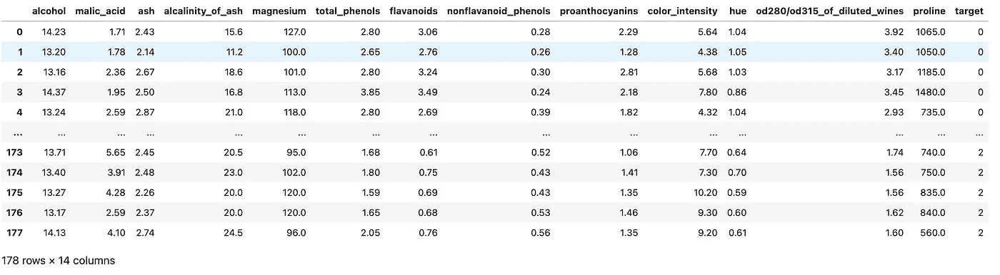

数据集的示例。图片作者。

现在我们已经导入了一个可用的数据集，让我们继续应用 ed a 管道。

# 2.了解全局

在第一阶段，我们的目标是理解我们在看什么，但不要深入细节。我们试图理解我们想要解决的问题，思考整个数据集和变量的意义。

这个阶段可能会很慢，有时甚至会很无聊，但它会给我们机会对我们的数据集发表意见。

## 让我们做些笔记

我通常打开 Excel 或在 VSCode 中创建一个文本文件来记下一些笔记，如下所示:

*   **变量**:变量的名称
*   **类型**:变量的类型或格式。这可以是分类的、数字的、布尔的等等
*   **上下文**:理解变量语义空间的有用信息。在我们的数据集的例子中，上下文总是化学物理的，所以很简单。在另一种情况下，例如房地产，一个变量可能属于一个特定的部分，如物质或社会的解剖(有多少邻居？)
*   **期望**:这个变量与我们的任务有多相关？我们可以使用“高、中、低”的音阶。
*   **注释**:我们是否对变量有任何注释

**在所有这些因素中，*期望*是最重要的因素之一，因为它帮助我们发展分析师的“第六感”**——随着我们在该领域积累经验，我们将能够在脑海中描绘出哪些变量是相关的，哪些是不相关的。

无论如何，开展这项活动的意义在于，它使我们能够对我们的数据进行一些初步的思考，这有助于我们开始分析过程。

## 熊猫的有用特性和功能

我们将利用几个熊猫的特征和属性来理解大局。让我们看看其中的一些。

`**.head()**` **和** `**.tail()**`

熊猫最常用的两个功能是。头()和。尾部()。这两个选项允许我们从数据集的开头或结尾查看任意数量的行(默认为 5 行)。对于快速访问数据帧的一小部分非常有用。

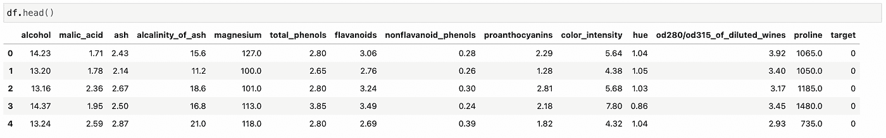

df.head()示例。图片作者。

`**.shape**`

如果我们申请的话。形状，Pandas 返回给我们一对代表数据集维度的数字。该属性对于理解数据集的列数和长度非常有用。

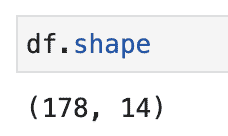

df.shape 示例。图片作者。

`**.describe()**`

*describe* 函数正是这样做的:它提供关于数据集的纯粹描述性信息。这些信息包括统计数据，这些统计数据总结了变量的集中趋势、它们的分散性、空值的存在及其形状。

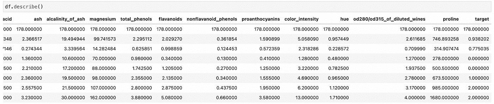

df.describe()示例。图片作者。

`**.info()**`

不像。形容()，*。info()* 为我们的数据集提供了一个简短的摘要。它返回关于数据类型、非空值和内存使用的信息。

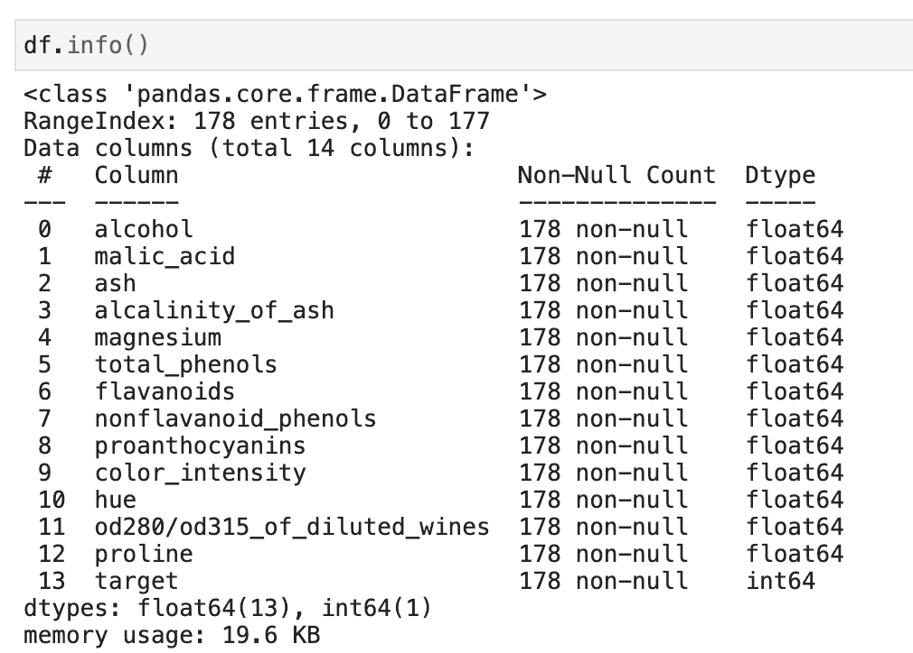

df.info()示例。图片作者。

也有。*d 型号*和*。isna()* 分别给出数据类型信息和值是否为空。然而，使用。info()允许我们用一个命令访问这些信息。

## 我们的目标是什么？

这是一个我们必须经常问自己的重要问题。在我们的例子中，我们看到目标是一个包含值 0、1 和 2 的数字分类变量。这些数字可以识别酒的种类。

如果我们查看关于这个数据集的 Sklearn 文档，我们会发现它是专门为分类任务而构建的。**如果我们想做建模，那么这个想法就是利用葡萄酒的特征来预测它的类型。**相反，在数据分析设置中，我们希望研究不同类型的葡萄酒如何具有不同的特征，以及这些特征是如何分布的。

# 3.准备

在这个阶段，我们希望开始清理数据集，以便继续分析。我们会问自己的一些问题是

*   是否存在无用或多余的变量？
*   有重复的列吗？
*   命名法有意义吗？
*   有没有我们想创造的新变量？

让我们看看如何将这些想法应用到我们的数据集。

*   所有的变量似乎都是物理化学测量。**这意味着它们都是有用的，有助于定义酒类的分类**。我们没有理由删除列
*   为了检查重复行，我们可以使用`.isduplicated().sum()`——这将打印出数据集中重复行的数量

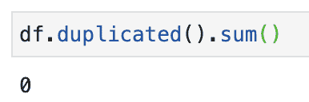

对行重复的简单检查。图片作者。

*   术语当然可以优化。例如*od 280/od 315 _ of _ dilled _ wines*很难理解。由于它表明了一种测量液体中蛋白质浓度的研究方法，我们将称之为*蛋白质浓度*

*   最常见的*特征工程*方法之一是创建新特征**现有特征**的线性/多项式组合。这对于向预测模型提供更多信息以提高其性能非常有用。但是在我们的例子中，我们不会这样做。

作为一个玩具数据集，它实际上已经为我们准备好了。但是，这些点对于处理更复杂的数据集仍然很有用。

# 4.对变量的理解

在前一点中，我们描述了完整的数据集，现在我们试图准确地描述我们感兴趣的所有变量。为此，这一步也可称为**单变量分析**。

## 分类变量

在这种情况下，`**.value_counts()**`是最重要的函数之一，用于了解给定变量在我们的数据集中有多少个值。我们以目标变量为例。

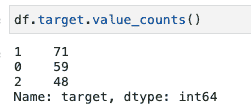

value_counts()示例。图片作者。

您也可以通过传递 *normalize = True* 将数据表示为百分比

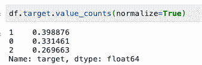

value_counts()中的百分比。图片作者。

我们也可以绘制数据

value_counts()的实现及其绘图。

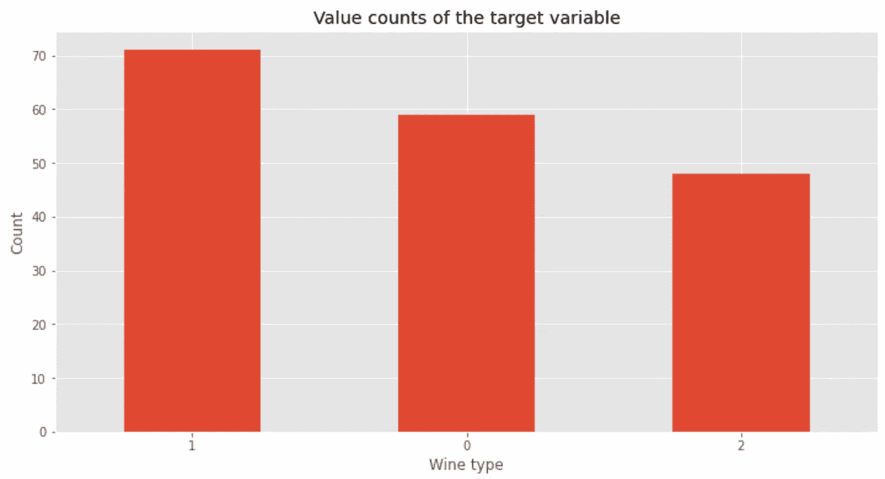

目标变量的计数值图。图片作者。

*value_counts()* 可用于任何变量，但最适合用于分类变量，如我们的目标。**这个函数还告诉我们数据集**中的类是如何平衡的。在这种情况下，类 2 比其他两个类更少出现——在建模阶段，也许我们可以实现数据平衡技术以不混淆我们的模型。

## 数字变量

相反，如果我们想要分析一个数值变量，我们可以用 *describe()* 描述它的分布，就像我们之前看到的那样，我们可以用*显示它。历史()。*

以变量*镁*为例

还是用*吧。*形容()第一

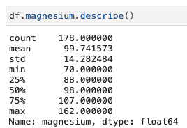

镁变量的描述。图片作者。

然后绘制直方图

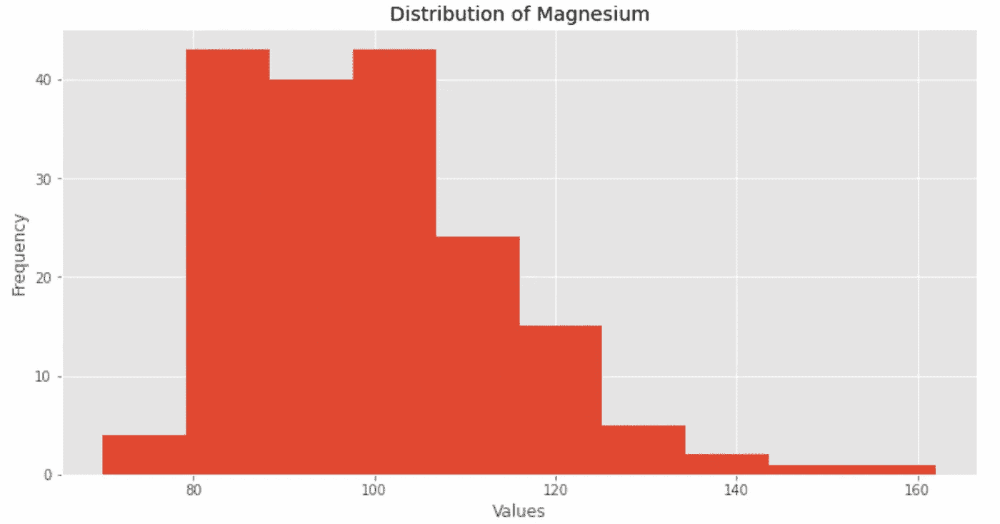

镁变量的直方图。图片作者。

我们还评估分布峰度和不对称性:

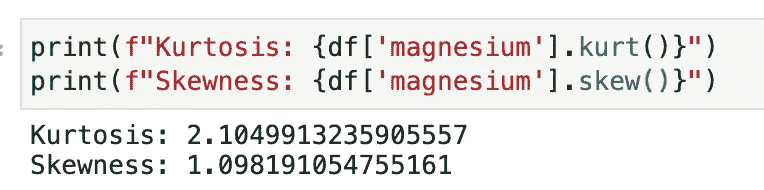

镁的峰度和偏斜度值。图片作者。

从这些信息中，我们可以看到:

*   不遵循正常曲线
*   显示峰值
*   峰度和不对称值大于 1

我们对每个变量都这样做，我们将有一个关于它们行为的伪完整描述图。

我们需要这项工作来充分理解每个变量，**并解开变量之间关系的研究。**

# 4.研究变量之间的关系

现在的想法是找到有趣的关系，显示一个变量对另一个变量的影响，最好是对目标的影响。

这项工作开启了第一个*智能*选项——在数字营销或在线广告等商业环境中，这些信息提供了价值和战略性行动的能力。

我们可以在 Seaborn 和 pairplot 的帮助下开始探索关系。

`**sns.pairplot(df)**`

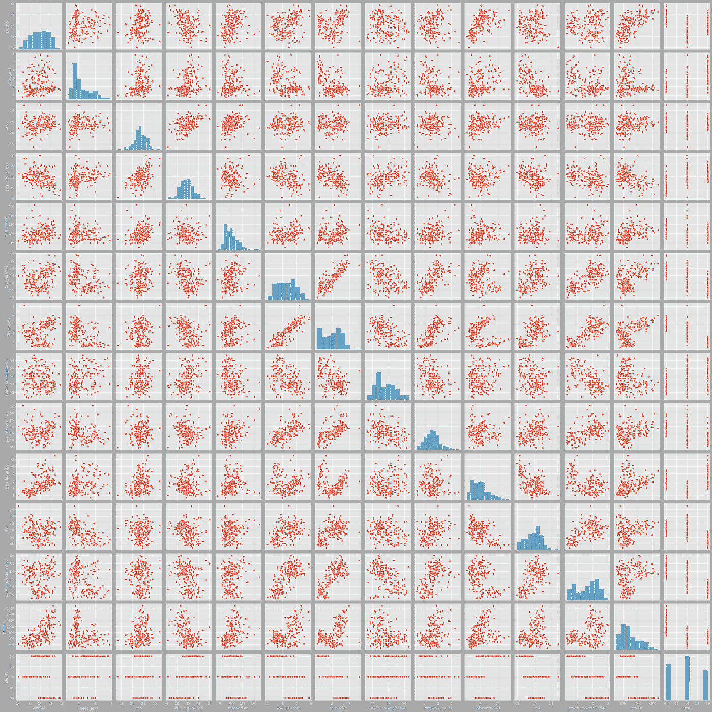

sns.pairplot 在数据帧上的应用。图片作者。

如您所见， *pairplot* 在散点图中显示了所有变量之间的相互关系。**这对于掌握最重要的关系非常有用，不必手动检查每个组合。但是需要注意的是，这种方法的计算成本很高，因此最适合像这样变量数量相对较少的数据集。**

让我们从目标开始分析配对图

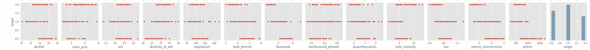

目标的配对图。图片作者。

理解数值变量和分类变量之间关系的最佳方式是通过箱线图。

让我们为*酒精*、*类黄酮*、*颜色 _ 强度*和*脯氨酸*创建一个箱线图。为什么会有这些变量？**因为从视觉上看，它们对给定的葡萄酒类型显示出稍微更明显的细分**。例如，让我们看看脯氨酸与目标

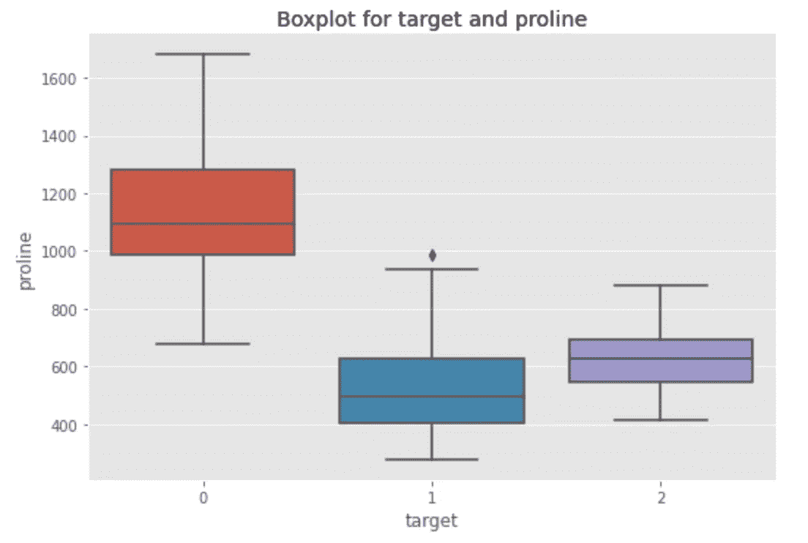

目标对脯氨酸的箱线图。图片作者。

事实上，我们看到 0 型葡萄酒的脯氨酸中位数比其他两种葡萄酒的脯氨酸中位数大。这可能是一个区别因素吗？现在说还为时过早。可能还有其他变量需要考虑。现在让我们来看看黄酮类化合物

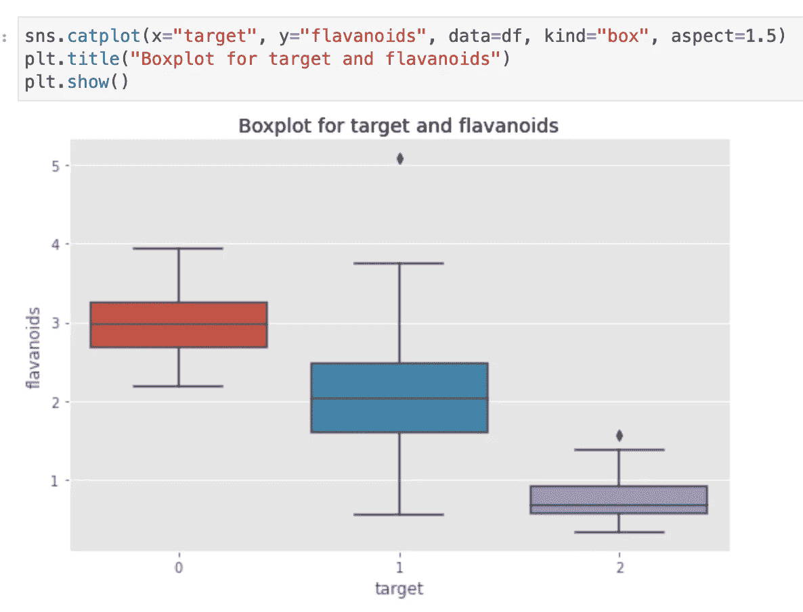

目标与黄酮类化合物的箱线图。图片作者。

在这里，0 型葡萄酒似乎也有更高的类黄酮值。有没有可能 0 型葡萄酒的脯氨酸和黄酮类化合物含量更高？使用 Seaborn，我们可以创建一个散点图，并直观地显示一个点属于哪个葡萄酒等级。只需指定*色相*参数

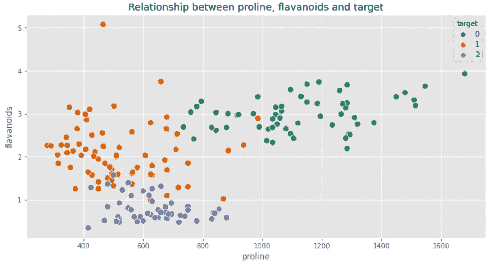

作者在 sns 散点图图像中对色调参数的应用。

我们的直觉是正确的！0 型葡萄酒显示出明显的类黄酮和脯氨酸的模式。特别是，脯氨酸水平要高得多，而类黄酮水平稳定在值 3 左右。

现在让我们看看 Seaborn 如何通过*热图*再次帮助我们扩展我们的探索。我们将创建一个与熊猫相关的矩阵，并分离出最相关的变量

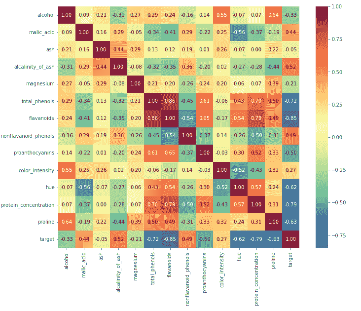

相关矩阵的热图。图片作者。

**热图很有用，因为它能让我们有效地掌握哪些变量彼此之间有很强的相关性。**

当目标变量减少时(必须解释为趋向于 0，因此趋向于 0 型葡萄酒)，类黄酮、总酚、脯氨酸和其他蛋白质趋向于增加。反之亦然。

我们还看到了除目标之外的其他变量之间的关系。例如，酒精和脯氨酸之间有很强的相关性。高水平的酒精对应着高水平的脯氨酸。

让我们用头脑风暴阶段来总结一下。

# 5.头脑风暴

我们收集了大量数据来支持 0 级葡萄酒具有特定化学成分的假设。现在剩下的是分离出区分 1 型和 2 型的条件。我将把这个练习留给读者。在分析的这一点上，我们有几件事可以做:

*   为利益相关者创建一份报告
*   做模特
*   继续探索，进一步澄清业务问题

## 问正确问题的重要性

无论我们在 EDA 之后选择什么样的道路，**提出正确的问题是区分优秀数据分析师和平庸数据分析师的关键**。我们可能是工具和技术方面的专家，但如果我们无法从数据中检索信息，这些技能就相对无用。

问正确的问题允许分析师与涉众“同步”，或者实现一个真正有效的预测模型。

我再次敦促感兴趣的读者打开他们最喜欢的文本编辑器，每当出现疑问或具体想法时，就用问题填充它。要执着——如果答案就在数据中，那么就要靠我们去发现它，并以最好的方式传达它。

# 结论

到目前为止描述的过程本质上是迭代的。事实上，**探索性分析一直持续到我们回答了所有的业务问题**。

*我不可能展示或示范所有可能的数据探索技术*—我们没有具体的业务需求或有效的真实数据集。然而，我可以向读者传达应用如下模板对提高分析效率的重要性。

# 推荐阅读

对于感兴趣的人来说，这里有一个我为每个与 ML 相关的主题推荐的书籍列表。在我看来，有一些必不可少的书籍对我的职业生涯产生了巨大影响。
*免责声明:这些是亚马逊会员链接。我会收到亚马逊为你推荐这些项目的一小笔佣金。你的体验不会改变，你也不会被收取更多费用，但它将帮助我扩大业务规模，围绕人工智能制作更多内容。*

*   **ML 简介** : [*自信的数据技能:掌握处理数据的基本原理，为你的职业生涯增压*](https://amzn.to/3WZ51cE) 作者:基里尔·叶列缅科
*   **sk Learn/tensor flow**:[*使用 Scikit-Learn、Keras 和 TensorFlow*](https://amzn.to/3jseVGb) 进行动手机器学习，作者 Aurelien Géron
*   **NLP** : [*文本即数据:机器学习和社会科学的新框架*](https://amzn.to/3l9FO22) 作者贾斯汀·格里默
*   **sk Learn/PyTorch**:[*用 py torch 和 Scikit 进行机器学习——Learn:用 Python 开发机器学习和深度学习模型*](https://amzn.to/3wYZf0e)Sebastian Raschka
*   **数据即** : [*用数据讲故事:商务人士数据可视化指南*](https://amzn.to/3HUtGtB) 作者:Cole Knaflic

# 有用的链接(我写的)

*   **学习如何用 Python 执行顶层探索性数据分析** : [*用 Python 执行探索性数据分析——一步一步的过程*](/exploratory-data-analysis-in-python-a-step-by-step-process-d0dfa6bf94ee)
*   **学习 TensorFlow 的基础知识**:[*tensor flow 2.0 入门—深度学习入门*](https://medium.com/towards-data-science/a-comprehensive-introduction-to-tensorflows-sequential-api-and-model-for-deep-learning-c5e31aee49fa)
*   **用 Python 中的 TF-IDF 进行文本聚类** : [*用 Python 中的 TF-IDF 进行文本聚类*](https://medium.com/mlearning-ai/text-clustering-with-tf-idf-in-python-c94cd26a31e7)

**如果你想支持我的内容创作活动，欢迎点击我下面的推荐链接，加入 Medium 的会员计划**。我将收到你投资的一部分，你将能够以无缝的方式访问 Medium 的大量数据科学文章。

[](https://medium.com/@theDrewDag/membership) [## 通过我的推荐链接加入 Medium-Andrew D # data science

### 阅读 Andrew D #datascience(以及媒体上成千上万的其他作者)的每一个故事。您的会员费直接…

medium.com](https://medium.com/@theDrewDag/membership) 

你探索性分析的方法论是什么？你觉得这个怎么样？用评论分享你的想法👇

感谢您的关注，很快再见！👋