# Python 中的探索性传感器数据分析

> 原文：<https://towardsdatascience.com/exploratory-sensor-data-analysis-in-python-3a26d6931e67>

# Python 中的探索性传感器数据分析

克里斯·利维拉尼在 [Unsplash](https://unsplash.com?utm_source=medium&utm_medium=referral) 上的照片

探索性数据分析(EDA)旨在通过统计和可视化工具揭示数据集的主要特征。通常，这是解决问题的第一步，当它被充分利用时，可以极大地有助于设计一个合适的解决方案。EDA 这个术语是数学家和统计学家 Jon Wilder Turkey 在 77 年写的同名著作[1]中创造的。他推动并鼓励数据分析，随着时间的推移，他的遗产变得越来越受欢迎。

虽然有很多关于传统 EDA 技术的文章发表，但时间序列数据在分析过程中面临特殊的挑战。更具体地说，传感器数据也是时间序列数据，但是具有一些特殊的特征，这些特征可以概括为:

数据是多维的，要么传感器有一个以上的通道，要么有几个传感器同时记录，有时两者都有。

时间序列很长，数据是以一定的周期和频率记录下来的，决定了数据点的数量。

几个时间序列(文件)形成一个数据集，例如运动传感器就是这种情况。在这个领域中，时间序列的数量取决于记录的数量，通常与运动的数量和进行运动的人有关。

> 在所描述的场景中，EDA 不再是一个简单的过程，而**这篇文章的目标是提供一些探索传感器数据集的实用步骤。**为了说明所提出的方法，我使用了一个数据集[2]，该数据集也可从 UCI 知识库[3]中获得。本文使用的所有相关代码和数据都存储在这个 [Github 库](https://github.com/mabelc/EDA_medium)(Jupyter 笔记本文件的快捷方式)。

## 目录:

1.  [基本可视化](#351d)
2.  [相关性](#2bdf)
3.  [分布分析](#0ac3)
4.  [结束语](#a6f9)
5.  [参考文献](#7de8)

# 1.基本视觉化

我们将使用的数据集包含 14 名年龄在 66 岁至 86 岁之间的人的运动数据，他们使用衣服上的无电池可穿戴传感器进行广泛的脚本活动。数据收集在两个临床室设置(S1 和 S2)。S1 的环境在房间周围使用 4 个 RFID 阅读器天线来收集数据，而 S2 的房间环境使用 3 个 RFID 阅读器天线(两个在天花板上，一个在墙壁上)来收集运动数据。

数据分布在分别来自房间 1 和房间 2 的 60 和 27 个记录中。在这种情况下，建议将所有数据保存在一个数据结构中。我使用原始文件名作为键创建了一个包含所有文件内容的字典。通常，文件名包含问题的相关信息，在这个特定的应用中，文件名包含房间号和志愿者的性别。时间列被设置为每个数据帧的索引。

现在，是时候创建数据的第一个可视化了。我首先计算数据集中包含的每个文件中的观察次数。

> 关键见解—条形图(图 1):

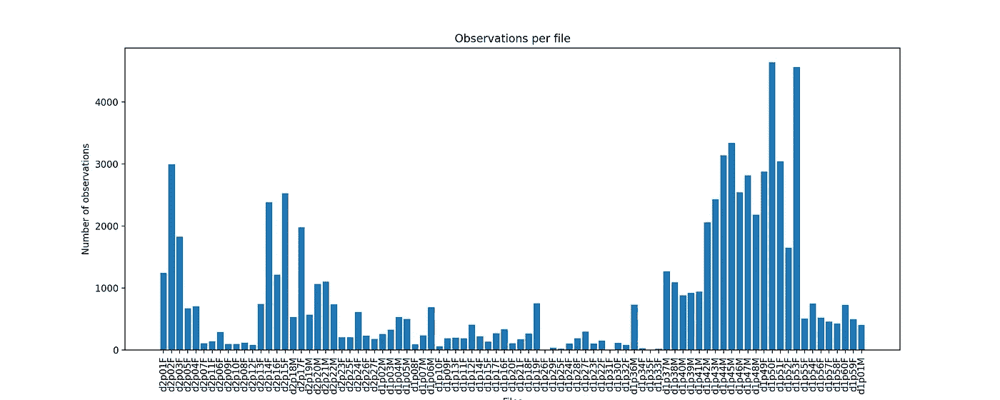

图一。每个传感器文件中包含的观察结果—由作者创建的图像

*   条形代表每个文件中记录的观察次数。
*   记录持续时间从几个到几千个观察值不等。
*   似乎志愿者在实验中没有遵循严格的时间表。

现在，让我们以一个文件为例(“d **2** p01 **F** ”，由一名女性志愿者在 2 号房间收集)，重现上面记录的活动以及持续时间。活动图用于理解录制过程中遵循的脚本。

> 关键见解—活动图(图 2):

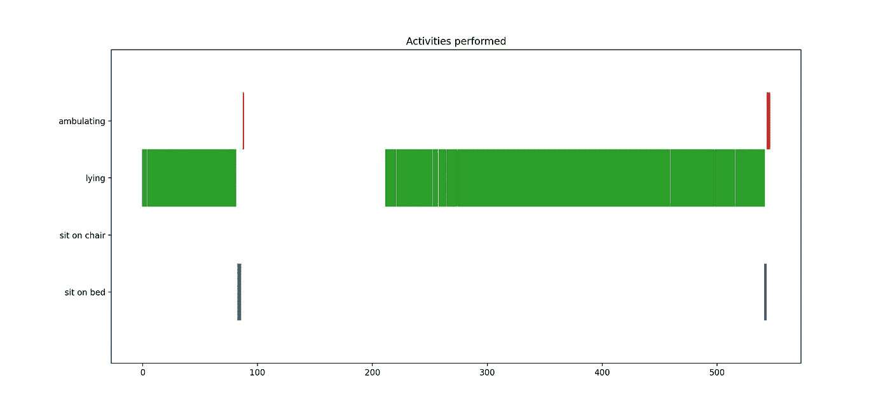

图二。在一次记录过程中执行的活动，文件“d2p01F”-由作者创建的图像

*   志愿者大部分时间都躺在床上。
*   卧姿变为坐卧两用(躺->坐床上->下床)。
*   该序列在记录过程中执行两次。
*   坐着和走动的活动只持续几秒钟。

为了了解这些活动是如何被传感器反映出来的，我们来关注一下加速度计和传统的时间序列图。该图显示了在记录时间内加速度计在三个轴上的值。增加了垂直线来标记活动发生变化的时刻。

> 关键见解—时间序列图(图 3):

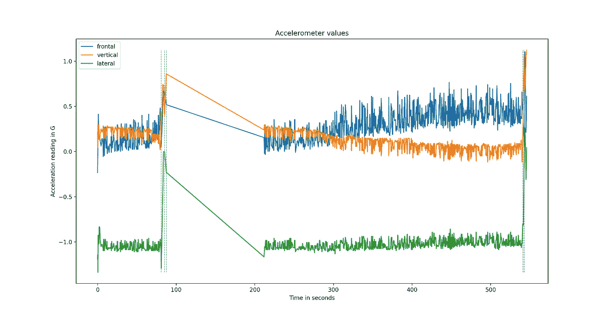

图 3。文件“d2p01F”的正面、垂直和横向加速度值—图片由作者创建

*   加速度计的值似乎对三个轴的变化非常敏感。
*   大约在 100 到 200 秒之间，加速计传感器没有记录任何值。
*   额轴在卧位期的变化比其他各期多。

在这个记录中观察到的延迟似乎与起床时的突然运动有关。为了意识到这种情况，分析采样率是很重要的。一种简单的方法是分析连续记录之间的差异。通常情况下，大多数差异都在相同的值附近，但有时异常值可能表示记录过程中的异常。

> 关键见解—箱线图(图 4):

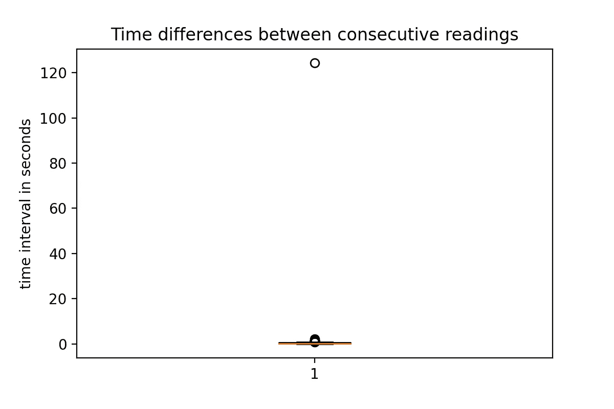

图 4。每对连续观测值之间的时间差，文件“d2p01F”——图片由作者创建

*   该框几乎是一条线，这意味着大多数值都集中在中位数(0.25)附近。
*   有一些异常值(圆圈)接近这个值，除了一个相隔超过 120 秒。

这种极端的异常值可以被认为是记录的严重异常。这种分析扩展到整个数据集。

> 关键见解—多箱线图(图 5):

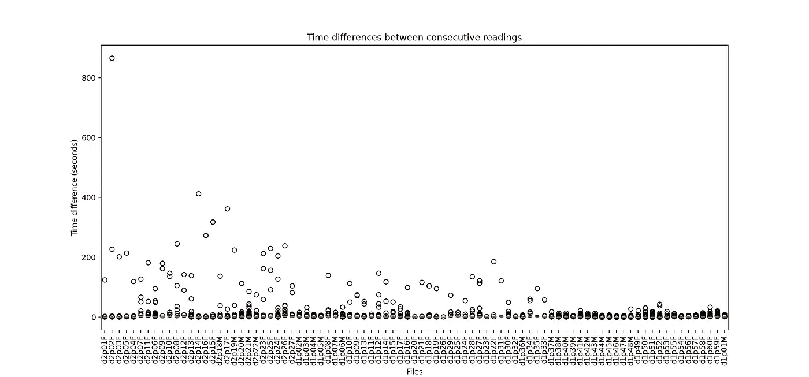

图 5。数据集中所有文件的时差柱状图-由作者创建的图像

*   所有文件中的采样率都是一致的。
*   极端异常值出现在大多数情况下。
*   最高差异集中在房间 2 的样本中。

# 2.相关

相关性分析是 EDA 过程中需要研究的一个常见主题，在探索传感器数据时非常有用。在这个领域中，发现特征之间的一些强相关性是很常见的。关于这个问题的结果可以指导未来关于降维技术适用性的一些决策。

我们可以测量不同层次的相关性。文件级是指通过分析记录在文件上的多元时间序列来研究文件内部的特征关系。另一方面，时间窗口级别或滚动相关性通过滚动窗口计算来探索两个时间序列之间的关系。本节讨论这两个级别。

## 2.1 文件级别

我继续分析文件“d2p01F**”**并计算所有特征之间成对的皮尔逊相关性，除了像( *id_antenna* 和*标签)*这样的标称特征。使用热图显示结果。相关值也包含在每个像元中。

> 关键见解—热图图(图 6):

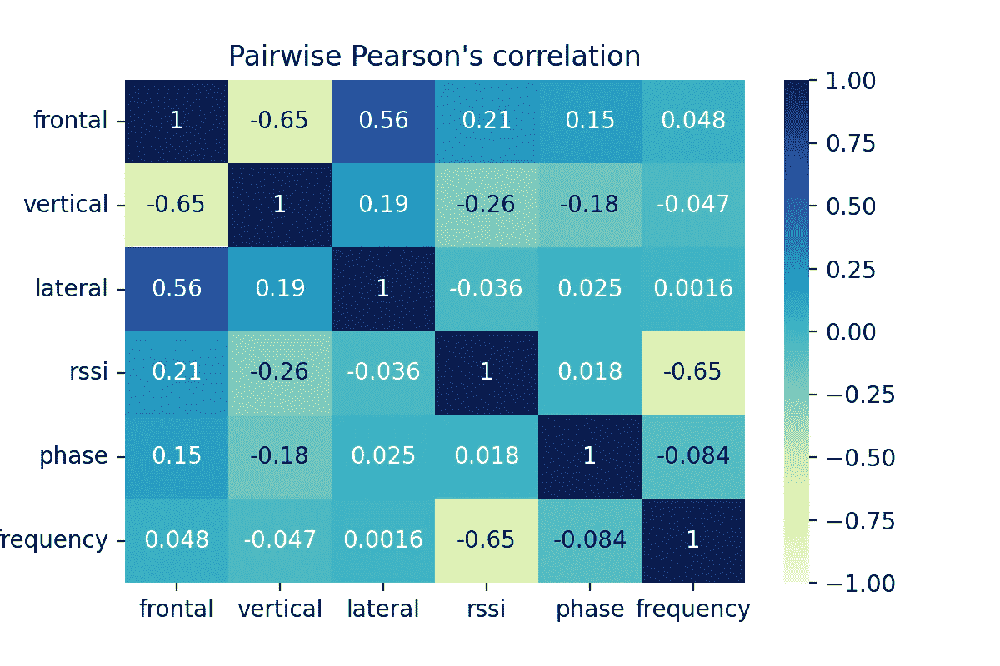

图 6。所有数字特征之间的成对关联，文件“d2p01F”-由作者创建的图像

*   在这个例子中没有很强的相关性，无论是负相关还是正相关。
*   对*正面-垂直*和*RSSI-频率*显示一些负相关。

为了对这个数据集中的相关性有一个大致的了解，我们需要将分析扩展到其余的文件。多个热图用于显示结果。

> 关键见解—多个热图(图 7):

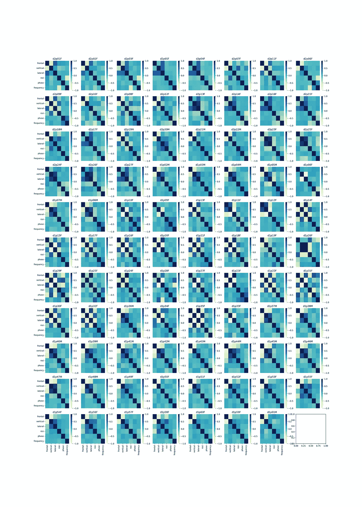

图 7。为所有文件计算成对相关性—图像由作者创建

*   大多数对是不相关的(值在 0 左右)。
*   文件之间的相关性各不相同。例如，对*正面垂直*是不相关的(“d2p05F”)、负相关的(“d2p06F”)和正相关的(“d1p12F”)，具体取决于文件。
*   这些变化似乎是由志愿者做出的特定手势产生的。

## 2.2 滚动时间窗口

为了计算滚动相关性，我使用 pandas 库中的内置方法`corr`，指定滚动窗口为 50。文件“d2p01F**”**中*正面*和*垂直*的关联结果使用单行热图显示。

> 关键见解—单行热图(图 8):

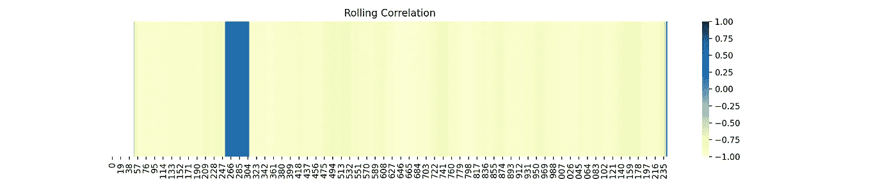

图 8。在文件“d2p01F**”**—作者创建的图像中，滚动正面和垂直特征的相关窗口

*   前 49 个观察值(白色)没有任何有效数字，因为窗口大小是 50。
*   大多数观察显示负相关(黄色)。
*   从 250 到 300 之间的观察值来看，由于人的运动，相关性很强并且是正的(蓝色)。

这是一个很好的例子，说明传感器数据域中的相关性是如何变化的。滚动关联揭示了与文件级关联相比，关联可能会发生显著变化的特定时间段。

# 3.分布分析

为了更深入地了解传感器数据集，了解我们正在处理的分布是很重要的。此外，许多机器学习模型是在特定分布的假设下设计的。为了确定更符合数据的分布，我们使用了`distfit`包【4】。它尝试了许多众所周知的分布，并返回一个更好地匹配数据。还提供了一个`plot`函数来可视化结果。该方法应用于实例文件中的特征*侧面*。

> 关键见解—分布图(图 9):

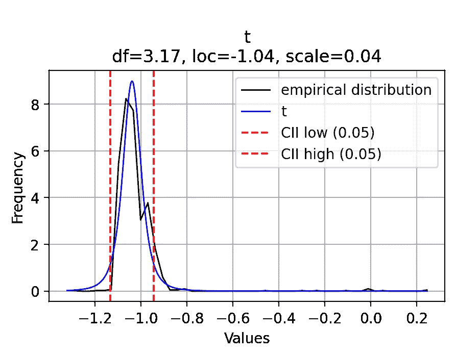

图 9。用 t 分布拟合横向特征，文件“d2p01F**”**—作者创建的图像

*   特征*横向*与 *t* 分布非常匹配。
*   数值大多集中在-1.2 和-0.9 之间。

我们将这一过程应用于所有文件和数字属性，获得选择最多的分布类型的摘要。多个条形图用于显示每个特征的紧凑视图。条形表示在所有文件中选择每个发行版的次数。

> 关键见解—多个条形图(图 10):

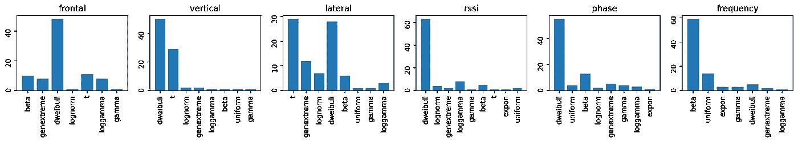

图 10。按特征分类的分布摘要-由作者创建的图像

*   *Dweibull*-分布是最受欢迎的属性选择:*正面*，*垂直*， *rssi* 和*相位，*分别是十几个文件的最佳匹配*。*
*   特征*垂直*和*横向*之间的其他流行分布是 *t* 分布。
*   *Beta*-分配是*频率*特性的最常用选项。

为了更好地理解为什么如此多的数据符合 *dweibull* 分布，我们需要更详细地分析具体的例子。让我们从属性*正面*中选取一个，并绘制拟合的分布。

> 关键见解—分布图(图 11):

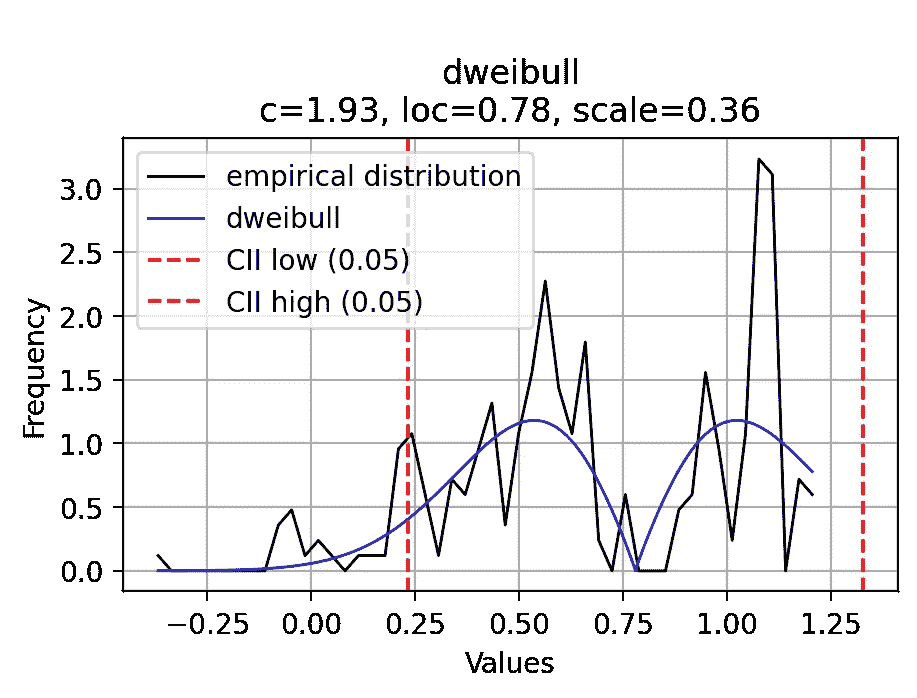

图 11。用 t 分布拟合正面特征，文件“d1p02M**”**—图片由作者创建

*   该分布不是单峰的，在经验分布中几个峰值清晰可见。
*   *Dweibull*-分布被选为最佳匹配，但是我们可以看到相对于经验分布有很大的差异。

为了更好地理解是什么造成了这种形状，我使用了核密度估计方法来拟合数据，但这次是按类来划分分布。

> 关键见解—内核密度估计图(图 12):

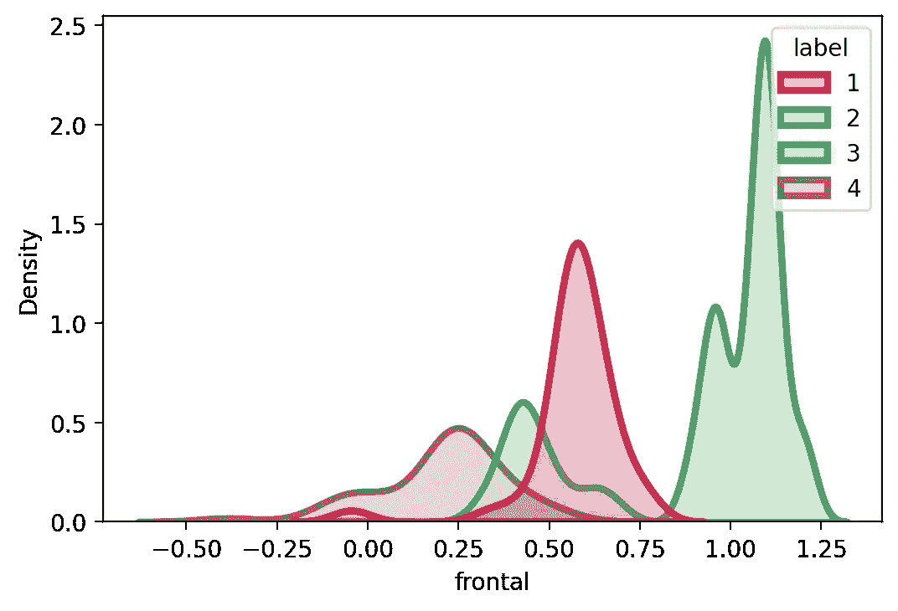

图 12。正面特征的核密度估计图，文件“d1p02M**”**—图片由作者创建

*   峰值对应于不同的类别，这解释了仅用一种分布来拟合它的困难。
*   与暗示运动的其他 3 个类别相比，说谎类别(3)具有非常不同的值，类别之间的分离更加明显。
*   这种行为表明属性*frontier*似乎能够很好地将躺着的类别*与其他类别区分开来。*

另一方面，如果目标是比较不同的文件，但考虑到所有的数字变量，需要一个更先进的绘图。我们根据[5]中提出的图讨论了一个解决方案。基本上，这里的主要优势是来自不同系列的分布部分地相互覆盖。这种设置允许多个时间序列，这对高维时间序列非常方便。原始代码可在[这里](https://github.com/rougier/scientific-visualization-book/blob/master/code/anatomy/zorder-plots.py)找到。下图显示了三个文件的分布:“d2p01F”、“d2p02F”和“d2p03F”。所有时间序列都经过 z 归一化，将数据集中在 0 左右。每个 pdf 右边的数字表示 x 值的概率最高。它有助于比较不同的发行版的共同特点。

> 关键见解-佐德分布图(图 13):

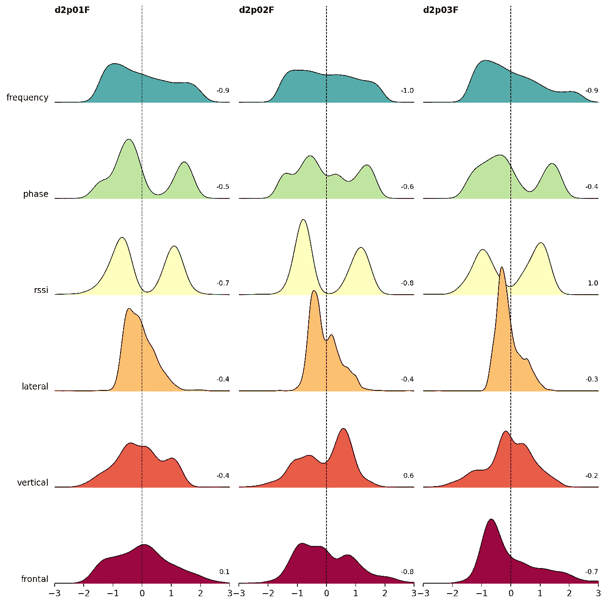

图 13。“d2p01F”、“d2p02F”和“d2p03F”三个文件的数字特征的分布——由作者创建的图像

*   特征*频率*在不同的文件中看起来相似，数字[-0.9，-1.0，-0.9]也很接近。
*   特征 *rssi* 明显是双峰的，但是在第三个文件(“d2p03F”)的情况下，峰值变化的位置最高。
*   特征*垂直*显示:-0.4，0.6 和-0.2 的值，这些值不同，因此我们可以通过视觉确认这些形状的不同。
*   相反，侧面的特征*显示:-0.4、-0.4 和-0.3。这些都很接近，分布形状也没有太大的不同。*

# *总结发言*

*传感器数据分析不是一件小事。希望你已经找到了一些关于如何处理这项任务的灵感和想法。需要记住的几点:*

*   *不要急于混合所有的文件，而是首先尝试理解你得到了什么。*
*   *尝试将每个文件作为一个小型数据集，在这个层次上理解数据将有助于以后理解整个情况。*
*   *不要忘记分析相关性。即使您对数据应该如何表现有信心，您也可能会遇到一些意外。*
*   *在分析中包括数据分布。这是找出文件之间差异的最好方法之一，即使在您并不期望它们发生的情况下。*

# *参考*

*[1] Tukey，John W .，探索性数据分析(1977)，Pearson .ISBN 978-0201076165。*

*[2] Shinmoto Torres，R. L .，Ranasinghe，D. C .，Shi，q .，Sample，A. P .，[传感器使能的可穿戴 RFID 技术，用于减轻床附近跌倒的风险](https://ieeexplore.ieee.org/document/6548154) (2013)，载于 2013 年 IEEE 国际 RFID 会议(第 191-198 页)。IEEE。*

*[3] Dua，d .和 Graff，c .， [UCI 机器学习资源库](http://archive.ics.uci.edu/ml) (2019)，Irvine，CA:加利福尼亚大学信息和计算机科学学院。*

*[4] Taskesen。e .，[Distfit](https://github.com/erdogant/distfit)*(2019)【https://github.com/erdogant/distfit】。**

**[5]罗杰尔，N. P .，[科学可视化:Python+Matplotlib](https://hal.inria.fr/hal-03427242/document)*(2021)，978–2-9579901–0–8。***