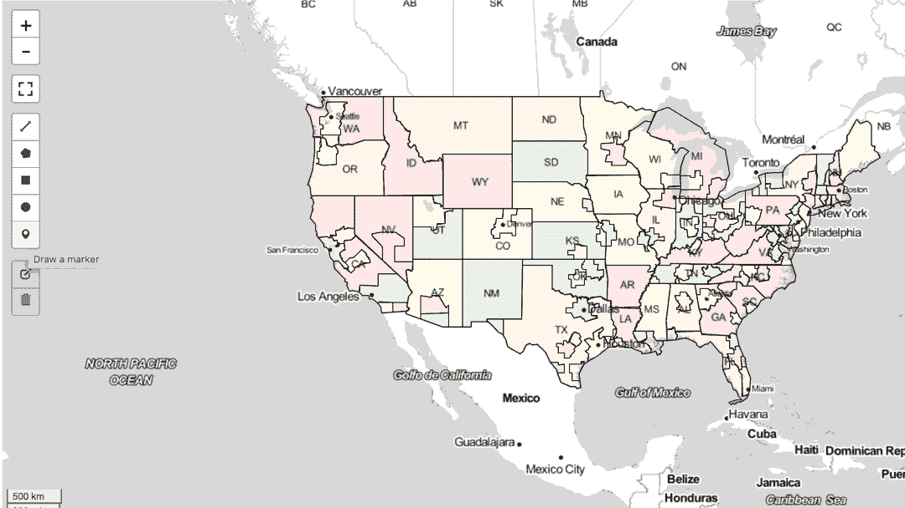
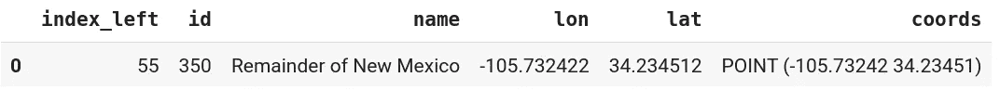
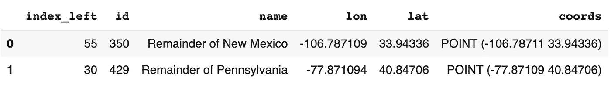
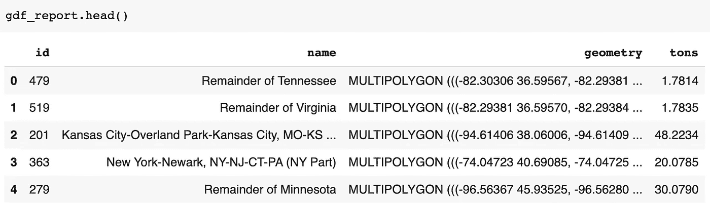
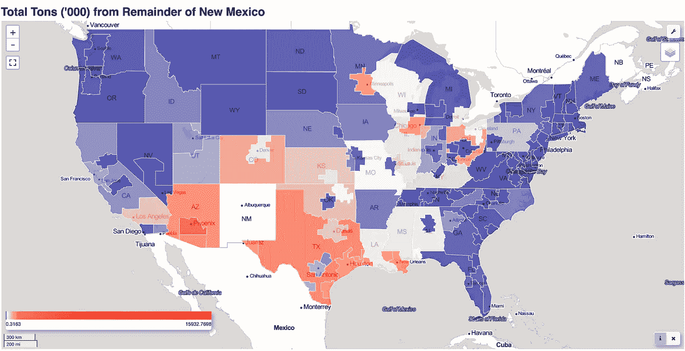
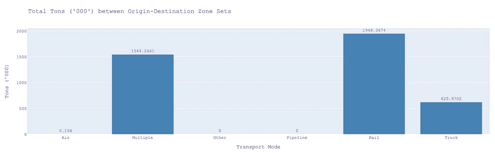

# 使用 Leafmap Python 包浏览和可视化地理空间数据

> 原文：<https://towardsdatascience.com/explore-and-visualize-geospatial-data-using-leafmap-python-package-5bb8aafba83a>

## 只需几行 Python 代码即可创建交互式地图


[菲利普·邦肯斯](https://unsplash.com/@thebeardbe?utm_source=medium&utm_medium=referral)在 [Unsplash](https://unsplash.com?utm_source=medium&utm_medium=referral) 上的照片

直到最近，用 Python 创建交互式地理空间数据可视化还不是一件容易的事情。一个挑战是将大型面图层加载到地图的速度。另一个挑战是用户使用地图前端和后端之间的双向通信直接与地图交互。

Python ***leafmap*** 包是一个相对较新的包，它面向动态显示地理空间数据，最重要的是，它提供了方便的功能，使用户能够从地图中提取数据或将数据加载到地图中。

最近， *Google Colab* 开始支持 *ipyleaflet，*使得在 *Google Colab* 中使用 ***leafmap*** 包成为可能。这真的很令人兴奋，因为现在交互式地图可以很容易地与那些没有在计算机上安装 Jupyter 笔记本或 JupyterLab 的人共享。

***叶图*** 提供了这么多很棒的功能，其中之一就是**绘图工具。**我们将展示绘图工具不仅可用于在地图上绘制形状并将绘制的特征保存到文件中(例如`GeoJSON`、`Shapefile`和`GeoPackage`)，还可用作查询工具。

在本帖中，我们将演示如何使用 ***leafmap*** 包创建交互式地图，以及如何使用**绘图工具**通过直接从交互式地图中选择位置(如起点和终点)来方便地**查询地理空间数据**。

1.  介绍 leafmap Python 包

2.使用 leafmap 包创建交互式地图

3.使用绘图工具从地图中查询地理空间数据

4.基于查询结果创建 choropleth 图和地块

*注:这篇文章的代码和数据可以在*[*this GitHub repo*](https://github.com/shi093/Leafmap-FAF)*找到。*

# 1.介绍 leafmap Python 包

> **Leafmap** 是一个开源的 Python 包，用于在 Jupyter 环境中使用最少的代码进行交互式制图和地理空间分析。它建立在其他几个开源包的基础上，如[flour](https://github.com/python-visualization/folium)和 [ipyleaflet](https://github.com/jupyter-widgets/ipyleaflet) (用于创建交互式地图) [WhiteboxTools](https://github.com/jblindsay/whitebox-tools) 和 [whiteboxgui](https://github.com/giswqs/whiteboxgui) (用于分析地理空间数据)，以及 [ipywidgets](https://github.com/jupyter-widgets/ipywidgets) (用于设计交互式图形用户界面【gui】)。
> 
> **Leafmap** 是一个非常强大的地理空间数据科学工具，具有许多用于加载、分析和可视化地理空间数据集的方便功能，这使得它特别适合编程技能有限的新手用户。([参考](https://leafmap.org/))。

# 2.使用 leafmap 包创建交互式地图

## 安装和加载软件包

在我们开始之前，我们需要确保 ***叶图*** 和 ***地理盘和*** 包安装正确。leafmap 包有一些可选的依赖项，在某些计算机上安装这些依赖项会很困难。"在安装过程中遵循这些说明。

要在 Google Colab 中运行这段代码，以下命令( [REF](https://github.com/shakasom/GDS) )应该可以在 Google Colab 中安装 ***Leafmap*** 和 ***Geopandas*** 包。如果我们简单地使用`!pip install geopandas`命令在 Google Colab 中安装 ***Geopandas*** 包，那么`Geopandas` `GeoDataFrame`的空间连接功能可能无法正常工作。

[参考](https://github.com/shakasom/GDS)

现在让我们导入本演示所需的库:

`geopandas`是`pandas`的扩展，支持使用地理空间数据，特别是使用*矢量层*。`geopandas`是建立在其他几个 Python 库之上的，比如`numpy`、`pandas`和`shapely` ( [REF](https://geobgu.xyz/py/geopandas1.html) )。

`shapely`是[几何引擎开源(GEOS)](https://trac.osgeo.org/geos) 软件(如 QGIS)和许多编程语言的 Python 接口。`shapely`仅处理单个几何图形([参考](https://geobgu.xyz/py/shapely.html))。在本演示中，它用于根据坐标创建几何图形。

## 输入数据

我们选择使用 [**运费分析框架**](https://ops.fhwa.dot.gov/freight/freight_analysis/faf/) (FAF)数据进行本次论证。FAF 是一个公共数据源，提供各州和主要大都市地区之间所有运输方式的货运流量估计。

如果您使用 **R** 并希望在 **R and R 闪亮中探索这些数据，**请参考[本文](/create-interactive-map-applications-in-r-and-r-shiny-for-exploring-geospatial-data-96b0f9692f0f?sk=481138ff99507245f15683bd58b73def)了解更多信息。

[](/create-interactive-map-applications-in-r-and-r-shiny-for-exploring-geospatial-data-96b0f9692f0f)  

我们使用一个`pandas` `DataFrame`将 CSV 数据文件存储到`df_data`中。并用一个`geopandas` `GeoDataFrame`将多多边形区域文件存入`faf_zone`。

`od_mode_vol_45.csv` 包含每个始发地-目的地区域对按运输方式(如卡车、铁路、水路、航空等)以重量(吨)和价值(美元)表示的货运数据。

`faf_zone`中的每一行用区域 ID、区域名称和几何图形定义了一个多多边形特征(即区域)。

文件`od_mode_vol_45.csv`中的起点 ID 和终点 ID 对应于`faf4_zone2.json`中的区域 ID。


数据样本来自 faf4.zone2.json(图片由作者提供)

## 启用绘图工具创建交互式地图

首先使用`map_select=leafmap.Map()`创建一个地图对象，并指定各种参数来初始化地图，例如`center`、`zoom`、`height`和`width`。

`OpenStreetMap`是`leafmap`中的默认底图，可使用`clear_layers()`移除，并可使用`add_basemap()`加载替代底图。

`leafmap`可以带各种类型的矢量数据集，包括`shapefiles`、`GeoJSON`、`CSV`带坐标等格式。直接从本地计算机通过`leafmap`图形用户界面(GUI)向地图添加数据也是可能的。

`leafmap`功能`add_gdf()`用于加载 FAF 区域多边形图层。交互式地图通过左侧显示的绘图工具进行渲染。`draw_control`的可见性默认设置为`True`。

现在，让我们使用绘图工具在地图上放置几个标记、矩形(或多边形)来指示始发地和目的地所在的位置。



使用绘图工具确定始发地和目的地区域(由作者制作动画)

# 3.使用绘图工具从地图中查询地理空间数据

## 使用交互式地图作为区域选择工具

我们将使用所选的始发地/目的地区域来过滤货运数据`df_data`，并获得一个子集作为查询结果。

让我们假设第一个标记代表起点，第二个标记代表终点。与第一个矩形重叠的区域在原始区域集中，与第二个矩形重叠的区域在目标区域集中。

地图上绘制的标记和形状可以保存到文件中以备将来使用。`leafmap`让矢量数据保存成各种地理空间数据格式变得超级简单，包括如下所示的`geojson`:

```
map_select**.**save_draw_features("selected_location.geojson")
```

你可以通过点击回收站并选择`Clear All`来清除这些标记和形状。

要查看使用绘图工具创建的特征，使用`map_select.draw_features`。如果我们在地图上放置两个标记，后面跟着两个矩形，我们将得到以下按创建顺序排列的`list`个几何图形:

```
[{'geometry': {'coordinates': [-105.732422, 34.234512], 'type': 'Point'},
  'properties': {},
  'type': 'Feature'},
 {'geometry': {'coordinates': [-77.519531, 40.380028], 'type': 'Point'},
  'properties': {},
  'type': 'Feature'},
 {'geometry': {'coordinates': [[[-105.820313, 41.574361],
     [-105.820313, 46.012224],
     [-102.128906, 46.012224],
     [-102.128906, 41.574361],
     [-105.820313, 41.574361]]],
   'type': 'Polygon'},
  'properties': {},
  'type': 'Feature'},
 {'geometry': {'coordinates': [[[-80.566403, 34.861895],
     [-80.566403, 37.46323],
     [-78.164061, 37.46323],
     [-78.164061, 34.861895],
     [-80.566403, 34.861895]]],
   'type': 'Polygon'},
  'properties': {},
  'type': 'Feature'}]
```

**这里的目的是获取包含起点/终点标记或与矩形(或多边形)重叠的 FAF 区域的信息(如 ID 和名称)。**

要用 Python 来做这件事，我们需要在原点/目的地点(或多边形)和 FAF 区域之间执行一个**空间连接**。但是首先我们需要将`geojson`坐标从`draw_features`转换成`shapely`点或多边形。

## 将坐标转换为几何形状，并执行空间连接以找到匹配的 FAF 区域

我们记得，原点由我们放在地图上的第一个标记表示，因此它由`map_select.draw_features[0]`指定。类似地，目的地点由`map_select.draw_features[1]`指定。

首先我们从`map_select.draw_features[0]`的坐标制作一个`shapely`点几何体(`df_origin`)。为了执行一个**空间连接**，我们需要为原点创建一个`GeoDataFrame`。我们通过使用`gpd.GeoDataFrame()`函数将`df_origin`转换为`points_origin`来实现这一点。

`gpd.GeoDataFrame()`功能的第二个参数是`crs`，它指定了坐标参考系统(CRS)。在这种情况下，我们将`crs`设置为与`faf_zone` `crs`相同，即带有 EPSG 代码`4326`的 WGS84 地理 CRS。

现在，我们准备好使用`gpd.sjoin()`函数基于两个图层的空间关系执行它们之间的空间连接。多边形层`faf_zone`的属性与点层`points_origin`的属性相结合，其中多边形层`contains`为点。

有三种可能的连接类型可应用于由`op`-参数指定的空间连接，即`intersects`、`within`和`contains`。([参考](https://automating-gis-processes.github.io/CSC18/lessons/L4/spatial-join.html))

现在我们在`zone_origin`T5 得到六列，分别是来自匹配多边形层`faf_zone`的`index_left`、`id`和`name`以及来自原点层`points_origin`的`lon`、`lat`和`coords`。



源自原点标记的原点区域信息(图片由作者提供)

厉害！**我们刚刚匹配了** `**points_origin**` **和** `**faf_zone**` **，得到了原产地信息** `**zone_origin**` **。**

类似地，我们可以匹配两个点，即具有 FAF 区域层的始发地-目的地对。

`zone_od` `GeoDataFrame`有两行。第一行包含原始区域的信息，第二行包含目标区域的信息:



我们还可以通过在两个多边形层之间执行**空间连接来获得起点/终点区域集的 id 和名称。**

使用绘图工具创建的两个矩形被指定为`map_select.draw_features[2]`和`map_select.draw_features[3]`。

`shapely` `Polygon()`功能用于将坐标的`list`转换成多边形(`poly`)，然后再转换成`GeoDataFrame` `origin_poly`。使用`inner`方法在空间上连接`origin_poly`(或`dest_poly` )和`faf_zone`两个多边形层，以识别重叠区域。

# 4.基于查询结果创建 choropleth 图和地块

在获得与始发地和目的地相关联的区域信息(即 id 和名称)后，我们的下一步是过滤货运数据`df_data`以得出从始发地到目的地或始发地和目的地对之间的货运流量(以吨为单位),然后创建一个 choropleth 图来显示货运流量分布。

以*“新墨西哥的剩余部分”*作为始发地查询或过滤`df_data`，以导出包含目的地*“id”*和在*“新墨西哥的剩余部分”*和相应目的地之间移动的*“吨”*的数量的`df_dest`。

为了根据`df_dest[‘tons']`值指示地图中特征(即区域多边形)的颜色，我们需要使用基于`id`字段的`faf_zone.merge()`函数将`df_dest`与`faf_zone` `GeoDataFrame`连接起来。



作者图片

现在我们准备好基于`gdf_report[‘tons’]`的值创建 choropleth 图。

`colormap`是使用`branca.colormap`库中的`LinearColormap()`函数创建的。它根据来自`"tons”`列的值指定一系列均匀分布和线性插值的颜色。

如果`"tons”`列的值是倾斜的，您可以设置`index`来创建不对称的*色标，*这非常有助于使 choropleth 图更有意义和信息量更大。

可使用`leafmap`功能`add_colorbar()`将色标添加到地图中。

**要使用** `**leaflet**` **成功渲染一张 choropleth 贴图，将** `**add_gdf()**` **函数中的** `**style_callback**` **参数设置为** `**style_callback=fill_color**` **是很重要的。** `**fill_color**` **是根据** `**colormap**` **设置** `**selected_gdf**` **中各特征颜色的功能。**



我们还可以使用`origin_poly_zones`和`dest_poly_zones`查询`df_data`来选择一个行子集，其中`dms_orig`值等于`origin_poly_zones.id`中的一个区域，而`dms_dest`值等于`dest_poly_zones.id`中的一个区域。

让我们根据在始发地和目的地区域集合之间移动的吨数，使用`plotly`库绘制结果。将`x`设置为`df_od.transport_mode`，将`y`设置为`df_od.tons`。条形图显示了按运输方式从始发地运输到目的地运输的总吨数。



按模式设置的始发地/目的地区域之间的吨数(图片由作者提供)

我希望你喜欢阅读这篇文章。随意留下评论和掌声😊*。*

[](https://huajing-shi.medium.com/membership)  

Python 代码和输入数据可从 [my GitHub repo](https://github.com/shi093/Leafmap-FAF) 获得。

## 参考

吴(2021)。Leafmap:一个 Python 包，用于在 Jupyter 环境中使用最少的代码进行交互式制图和地理空间分析。*开源软件杂志*，6 期(63)，3414 页。[https://doi.org/10.21105/joss.03414](https://doi.org/10.21105/joss.03414)

[用 Python 进行空间数据编程](https://geobgu.xyz/py/shapely.html)

[Python GIS 内部-空间连接](https://automating-gis-processes.github.io/CSC18/lessons/L4/spatial-join.html)

[如何用 Python 运行快速多边形内点测试](https://www.matecdev.com/posts/point-in-polygon.html)

[几何坐标序列到地理数据框架](https://gis.stackexchange.com/questions/395315/shapely-coordinate-sequence-to-geodataframe)

[如何将 geojson 转换为 shapely 多边形](https://stackoverflow.com/questions/68820085/how-to-convert-geojson-to-shapely-polygon)

[Python 地理数据科学教程](https://github.com/shakasom/GDS)