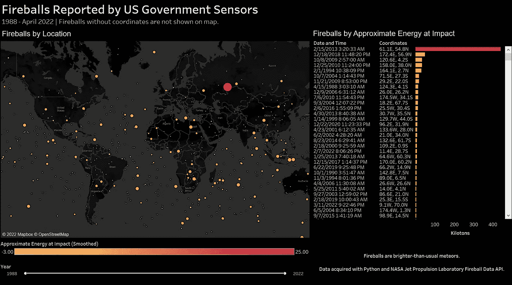
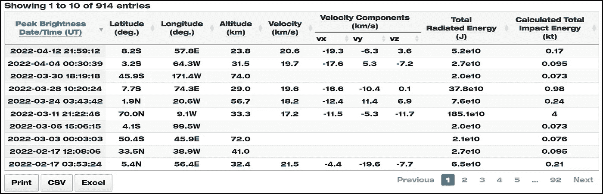
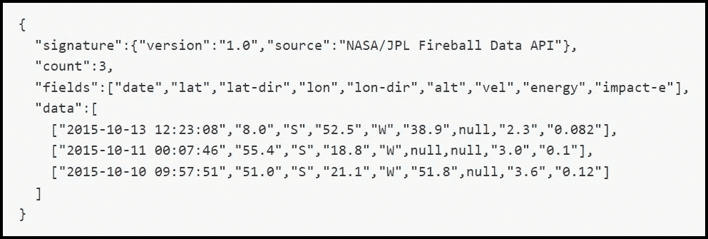
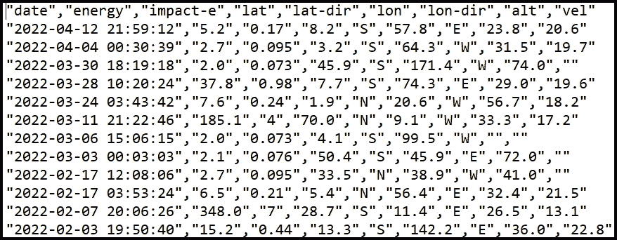
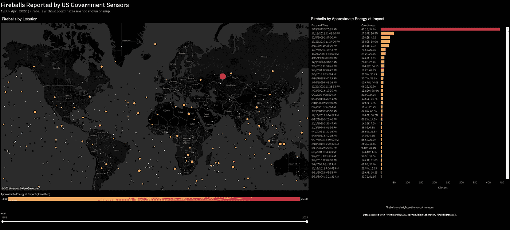

# 使用 NASA 火球数据 API、Python 和 Tableau 探索火球

> 原文：<https://towardsdatascience.com/explore-fireballs-with-the-nasa-fireball-data-api-python-and-tableau-3be04c2d548d>

## 天文学、数据科学、Python 和 Tableau

## 火球是比平常更亮的流星，在海拔 100 公里处可见

流星(又称流星或流星)。尼尔·拉萨尔的照片:[https://www . pexels . com/photo/silhouette-of-trees-in-night-631477/](https://www.pexels.com/photo/silhouette-of-trees-during-nighttime-631477/)。

> “我宁愿做一颗华丽的流星，让我的每一个原子都发出壮丽的光芒，也不愿做一颗沉睡而永恒的行星。”——**杰克·伦敦**

流星体、小行星或彗星从外层空间进入地球大气层后，空气动力加热使它们发光。它们变成了流星，也被称为流星或流星，划过夜空。火球是比平常更亮的流星，在海平面 100 公里内可见。

美国流星协会估计每天有几千个火球穿过大气层。根据美国国家航空航天局(NASA)的数据，自 1988 年以来，美国政府的传感器已经捕获了少量火球的数据。这些数据可以免费下载，也可以通过美国宇航局喷气推进实验室(JPL)火球数据 API 获得。

本文将演示如何编写一个 Python 程序，用火球数据 API 检索 JSON 格式的火球数据。然后，它将 JSON 结构转换为逗号分隔值(CSV)记录，并将其写入文件。最后，它在一个 Tableau 公共数据可视化仪表板中显示火球数据。

作者在 Tableau Public 中用 NASA 火球数据 API 检索的数据构建了这个火球仪表盘。2022 年兰迪·朗奇。

# 火球数据

火球数据由 JPL 近地天体研究中心管理。在我们开始使用火球数据 API 检索数据之前，让我们先熟悉一下 NASA 网站上可用的火球数据。以下是火球数据元素:

*   峰值亮度的日期和时间
*   纬度(度)
*   经度(度)
*   海拔高度(千米)
*   速度(四种度量)以千米每秒为单位
*   总辐射能量(焦耳)
*   以千吨为单位计算的总冲击能量

截至 2022 年 4 月 12 日，CNEOS 已经记录了 914 次火球记录。除了用 fireball 数据 API 检索之外，还可以打印记录，保存到 CSV 文件，或者从 Fireball 网页保存到 Excel 文件，如下所示。

火球记录样本。请注意[打印]、[CSV]和[保存]按钮。Randy Runtsch 截图。

# 火球数据 API

火球数据 API 由三个查询组成。为了简单起见，并且因为数据集只包含 914 条记录，所以本教程使用第一个查询来检索所有记录。其他查询检索特定数量的最新记录和基于日期范围和高度的记录:下面是返回所有记录的查询:

> https://ssd-api.jpl.nasa.gov/fireball.api

调用这个 API 查询以 JSON 格式的数据结构返回数据。下面显示了一个包含三个样本记录的示例。

使用火球数据 API 返回的 JSON 格式的火球记录示例。Randy Runtsch 截图。

下一节描述的 Python 程序将以 Python 列表的形式从 JSON 结构中检索“字段”和“数据”。然后，它会将它们逐个记录地写入一个 CSV 文件。

# 运行程序调用火球数据 API 的先决条件

要运行下一节中显示的代码，您需要以下内容:

1.  你电脑上最新版本的 Python。我用 Python 3.10 做了这个教程，[，这里有](https://www.python.org/downloads/)。
2.  代码编辑器或集成开发环境(IDE)。我使用免费的微软 Visual Studio Community 2022 for Windows。你可以在这里[下载](https://visualstudio.microsoft.com/vs/community/)。如果您选择使用它，一定要安装它的 Python 应用程序项目工具。如果需要，可以稍后通过 Visual Studio 的内置安装程序添加特定于语言的工具。

在我编写并测试了通过 API 检索火球数据的程序之后，我使用 Tableau Public 构建了一个简单的仪表板来可视化数据。如果你想尝试 Tableau Public，它是免费的，这里有。请注意，您发布到 Tableau 公共服务器网站的任何内容，世界上的任何人都可以看到。

# Python 程序

下一节将展示 Python 程序，该程序使用火球数据 API 来检索火球数据并将其写入 CSV 文件。它由这两个模块组成:

*   **c _ NASA _ fireball _ data . py**—该文件封装了所有代码，以 JSON 格式检索 fireball 数据，并将其记录写入 CSV 文件。这是通过 Python 类 c_nasa_fireball_data 实现的。
*   **get _ NASA _ fireball _ data . py**—该文件是程序入口点。它只是创建了一个 c_nasa_fireball_data 类的实例，用一个参数调用它，这个参数就是输出 CSV 文件的文件夹和文件名。

## 伪代码

下面的伪代码描述了程序是如何工作的。

1.  用文件夹和文件名创建一个 c_nasa_fireball_data 的实例，程序应该将 fireball 数据作为 CSV 记录写入其中。*(注意:随意调用文件夹和文件，一定要在运行程序前创建文件夹。)*
2.  在构造函数(__init__())中，设置输出文件名变量并初始化 JSON 头。
3.  调用 get_data()函数，该函数向 NASA 服务器提交 API 查询的 POST 调用。返回检索到的包含数据负载的 JSON 结构。
4.  调用 write_data_to_csv()函数。
5.  打开指定的 CSV 文件，作为 CSV 编写器输出。
6.  初始化 CSV 编写器。
7.  将字段名(标题或列名)写入 CSV 文件。
8.  循环浏览数据记录。将每个都写入 CSV 文件。

## 示例代码

Python 代码如下所示。您可以随意复制、运行和修改它。

Python 程序调用 NASA 火球数据 API，并将返回的记录写入 CSV 文件。由 Randy Runtsch 编写的代码。

## 运行程序

以 get_nasa_fireball_data.py 为入口或起点运行程序。如果一切顺利，它会将火球数据记录写入指定文件，如下图截图所示。

样本火球记录，CSV 格式，写入 c:/nasa_data/fireball.csv。

# Tableau 公共仪表板示例

我使用 Tableau Public 创建了一个[简单的仪表盘来可视化火球数据](https://public.tableau.com/shared/BP82FDMNS?:display_count=n&:origin=viz_share_link)。虽然构建仪表板超出了本教程的范围，但您可以随意下载它，看看它是如何工作的，并根据自己的需要进行修改。

火球仪表盘。由 Randy Runtsch 用 Tableau Public 创建的仪表板。

# 结论

本教程描述了 NASA 火球数据 API，以及如何编写 Python 程序来检索火球数据并将其写入 CSV 文件。它为探索其他 [NASA 数据 API](https://api.nasa.gov/)提供了一个起点，这些 API 检索各种主题的数据，如小行星、天文照片和地球图像。

> 记者:难道[卡尔]萨根不想相信吗？他不愿相信。他想知道。”
> 
> —安·德鲁扬

## 参考

*   [美国流星协会——火球常见问题解答](https://www.amsmeteors.org/fireballs/faqf/#2)
*   [美国宇航局 API](https://api.nasa.gov/)