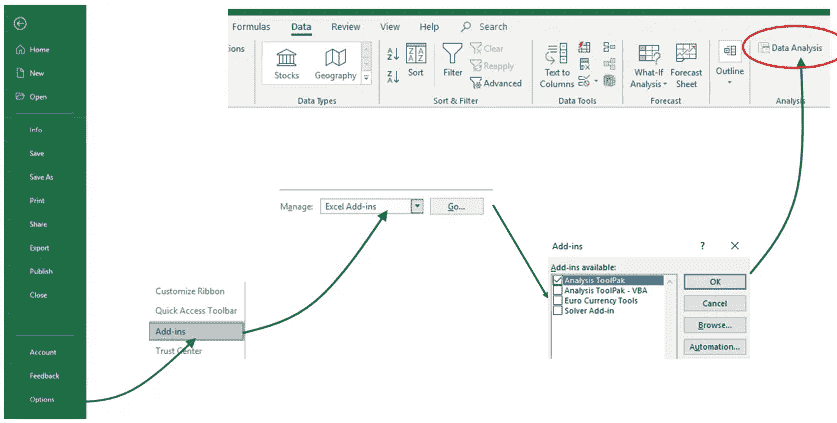
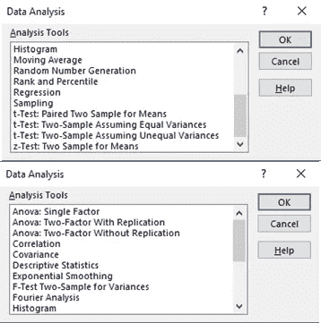
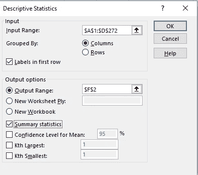
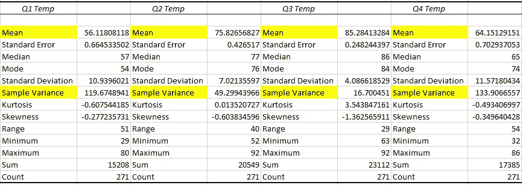
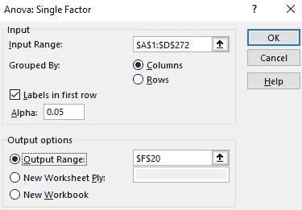
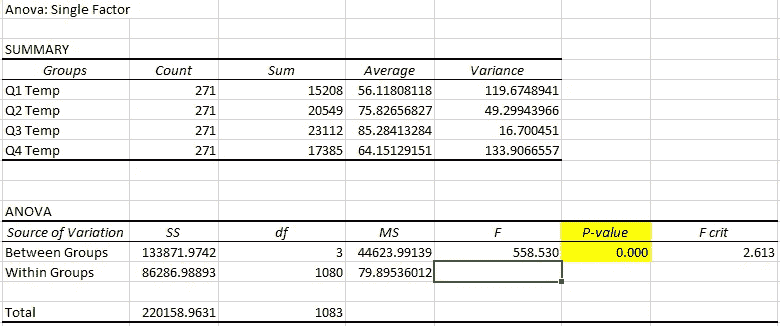
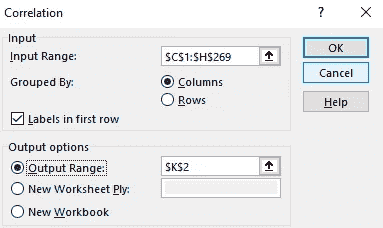
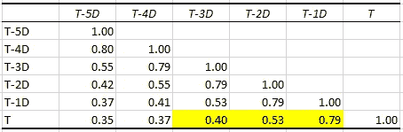
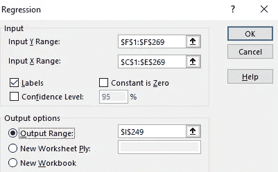
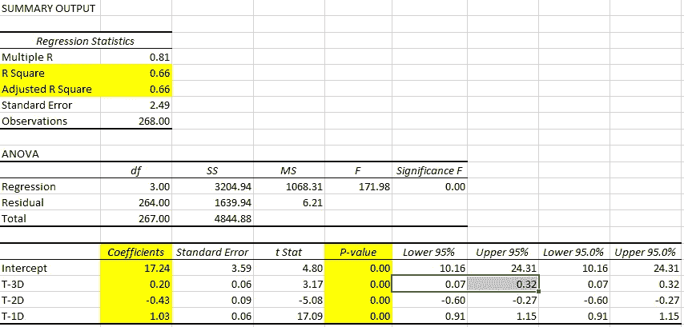

# 了解有关 Excel 的更多信息:分析工具库

> 原文：<https://towardsdatascience.com/explore-more-about-excel-analysis-toolpak-e6f8de2826>

## 使用 Excel 进行更复杂的统计分析、回归、模拟和优化

你以为 Excel 是微软的老软件，只能用来做很简单的分析吗？实际上，不是的，Excel 中还有很多大多数人不知道的更高级的特性。在本文中，我想向您介绍 Excel 中一个非常简单却非常强大的“插件”——分析工具库。

有时，当我想对一小组数据及其结构进行 ANOVA 测试或简单的线性回归时，我想知道是否还需要使用 Python/R 并编写代码来进行分析。借助 Excel 中的“分析工具库”,我们可以方便快捷地实现大多数统计模型。

## 介绍

这是一个非常简单的工具:1。它是完全免费的，内置在每个 Excel 中，所以你不需要下载或安装任何东西。2.它非常用户友好:使用这个特性，一些需要 Python/R 代码行的统计模型只需要简单的 3、4 次鼠标点击。3.它只需要非常基本的统计学知识，来自不同背景和领域的人可以很容易地使用它。

同时，它非常强大:它有大约 20 个统计模型，包括假设检验、方差分析和回归。每次运行只需要不到 2 秒钟，它可以处理最多 100 万行数据。

## 逐步添加

打开一个 Excel >“文件”>“选项”>“加载项”>在“管理”框中，找到“Excel 加载项”并单击它

弹出一个对话框>选择“分析工具库”并点击“确定”

在顶部的“数据”选项卡中，最右侧的“数据分析”功能

加载项步骤(图片由作者提供)

我们可以在此功能中预览模型:

(图片由作者提供)

## 个案研究

现在让我们做一个小的案例研究，以便更好地理解如何使用“分析工具库”进行统计分析。

我将使用[2014–2017 年美国奥斯汀的天气数据](https://www.kaggle.com/grubenm/austin-weather)来建立一个预测模型——使用前 5 天的温度来预测明天的天气。研究中使用的统计模型:描述性统计、方差分析、相关性和线性回归。你可以在我的 Github 上找到[准备的数据集](https://github.com/brantgithub/TowardsDataScience/blob/master/ExcelAnalysisToolpak_weather_forecasting_trainingdata.xlsx)和[解决方案](https://github.com/brantgithub/TowardsDataScience/blob/master/ExcelAnalysisToolpak_weather_forecasting_solutions.xlsx)。

***工作表“01 _ 按季度”***

在建立预测模型之前，我们需要了解不同时期的天气是否不同。一个常识是四个季节有不同的天气表现，所以首先让我们确定我们的数据是否在不同的季节有显著的不同。

首先，让我们对我们的数据进行探索性数据分析。

点击“数据分析”>找到“**描述性统计**”，点击>填写“输入范围”、“第一行标签”、“输出范围”和“汇总统计”>点击“确定”

(图片由作者提供)

从输出中，我们可以看到 4 个季节的平均温度和温度方差相差不大，所以我们感觉不同季节的天气差别不大。

描述性分析(图片由作者提供)

但是，这个 EDA 只能给我们一种“感觉”。如果我们想知道是否有统计学上的显著差异，我们应该使用 Anova 检验进一步分析。

点击“数据分析”>查找“**方差分析:单因素**”并点击>填写“输入范围”、“第一行标签”、“输出范围”>点击“确定”

(图片由作者提供)

从输出中，我们可以看到 p 值< alpha 0.05, which means there is statistically significant difference of temperature across different seasons.

(Image by Author)

Now, we know that 4 quarters have different weather, so we should build different prediction models for different seasons. In this article, we will only focus on building a model for Q3.

***工作表【02 _ 相关性】***

建立预测模型最常见、最简单的方法是回归。回归有预测值和输出变量。在回归之前，让我们首先确定哪些变量可能与我们的输出变量——明天的天气——潜在相关。

点击“数据分析”>查找“**相关性**”，点击>填写“输入范围”、“第一行标签”、“输出范围”>点击“确定”

(图片由作者提供)

从输出-相关矩阵中，我们可以看到 T-3D、T-2D 和 T-D 与 T 具有中到高的相关性。我们可以使用前 3 天的天气来预测明天的天气。

相关矩阵(图片由作者提供)

***工作表【03 _ 回归】***

我们从相关性中知道，前三天的天气与明天的天气高度相关，所以让我们使用前三天作为预测因子来建立回归。

点击“数据分析”>找到“回归”并点击它>填充“输入 Y 范围”、“输入 Y 范围”、“标签”、“输出范围”>点击“确定”

(图片由作者提供)

回归输出(图片由作者提供)

从回归输出中，我们可以看到 1)。截距和所有 3 个预测因子的 p 值都小于α0.05，这意味着我们的截距和预测因子都是显著的。2).预测变量的截距值和系数。3).R 和调整后的 R 都是 0.66，这意味着预测值解释了我们输出变量中 66%的方差→一个好模型！

使用这个回归模型，我们可以用前三天的天气来预测明天的天气。

## 关键要点

在这篇文章中，我首先介绍了 Excel 中“分析工具库”的增强-----------------------------------------------------简单而又强大，然后我带您了解如何获得这一特性的步骤。最后我们做了一个案例研究，利用前三天的天气预报(描述性统计、方差分析、相关和回归)。

通过本文，您不仅可以发现该功能的魅力，还可以探索 Excel 隐藏的美丽。Excel 是一个经典的软件，但它绝对不会过时，它还有更多不为人知的强大功能等待我们去探索。是的，Python 或 R 或其他编程比 Excel 先进得多，但如果我们能以更简单、更快的方式实现同样的目标，为什么不呢？

如果您对本文有任何疑问，请随时联系我！期待和大家一起聊聊用 Excel 做数据分析！🙋‍♂️