# 通过将皮卡丘投入艺术运动来探索人工智能

> 原文：<https://towardsdatascience.com/exploring-ai-by-dropping-pikachus-into-art-movements-d34aef4d5c8e>

## 文本到图像

## 这是一个有趣的文本到图像模型的回顾，现在处于公开测试阶段

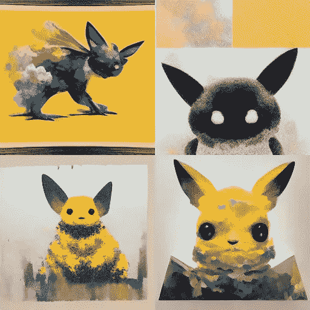

图片由[作者](https://medium.com/@egonferri)途经[中途](https://www.midjourney.com/)

## 介绍

7 月 13 日，开发生成性人工智能艺术工具 [Midjourney](https://www.midjourney.com/) 的公司开放了封闭测试版。要访问它，你只需要进入不和谐频道。

玩这个模型会立即给人一种非常强大的感觉，对文本提示有广泛的理解。它与环境和人物配合得特别好，从我所见，默认情况下它偏向于艺术绘画。例如，当提示“魔法丛林”时，您会看到:

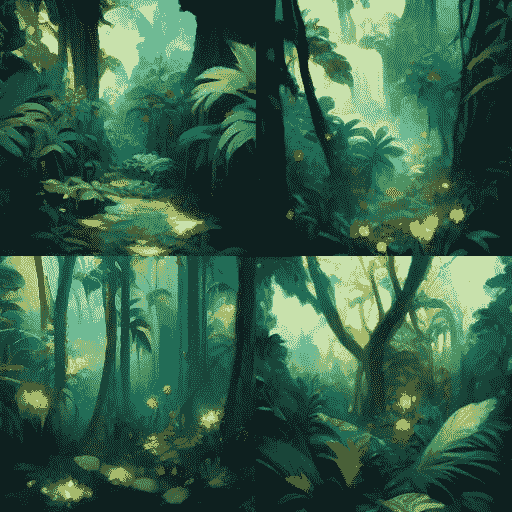

图片由[作者](https://medium.com/@egonferri)通过[中途](https://www.midjourney.com/)

## 模特懂神奇宝贝吗？

为了彻底了解它的力量，我决定通过以各种方式混合两种从未同时存在的东西来测试它:神奇宝贝和 1990 年前的艺术运动。

让我们看看神奇宝贝，试试皮卡丘和大钳蟹:

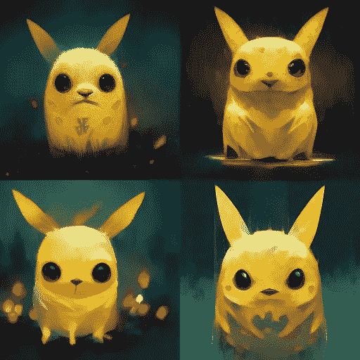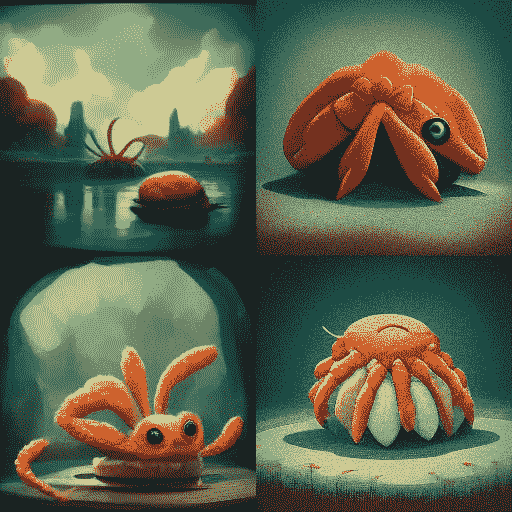

图片由[作者](https://medium.com/@egonferri)经由[中途](https://www.midjourney.com/)

正如我们所料，该模型对皮卡丘有很好的了解，因为它是一个流行机构，可能在中途已经见过很多次(我们对训练数据集一无所知，但它可能来自互联网)。相比之下，大钳蟹是一个很容易被遗忘的神奇宝贝，它也有一个信息丰富但不那么容易区分的名字，所以这个模型只显示了一些像螃蟹一样的东西。在这种情况下，提示只是“一只皮卡丘”和“一只大钳蟹”，没有给出进一步的信息，中途的“梦幻艺术”风格是相当明显的。让我们试着玩一点风格:

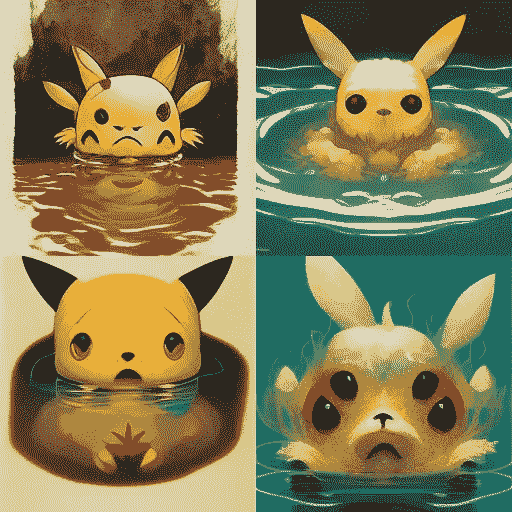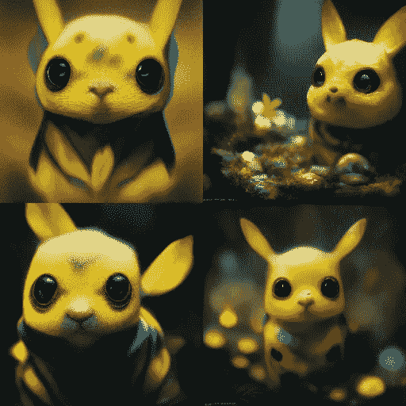

图片由[作者](https://medium.com/@egonferri)经由[中途](https://www.midjourney.com/)

在这种情况下，提示是:

*   《口袋妖怪皮卡丘》最初由[肯·杉森](https://en.wikipedia.org/wiki/Ken_Sugimori)绘制
*   一只生活在栖息地的皮卡丘，超逼真，8k

我不认为第一个真的像肯的手，但可以肯定的是，我们至少可以承认，它有一点日本。关于第二个，我们可以清楚地看到超现实主义和 8k 的想法，尝试带出小细节和模糊的皮毛。

## 模特懂美术吗？

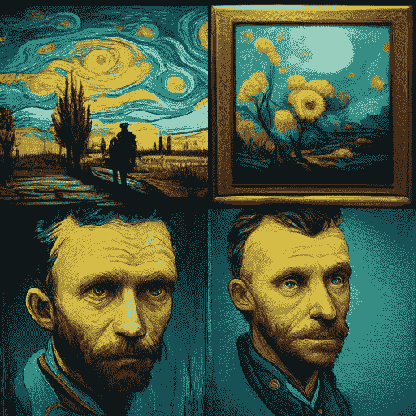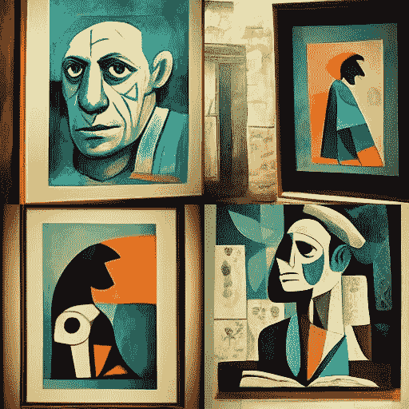

图片由[作者](https://medium.com/@egonferri)途经[中途](https://www.midjourney.com/)

同样，我们证实了模型至少对著名艺术有一个模糊的概念。这种情况下的提示是:

*   文森特·梵高的画
*   巴勃罗·毕加索的画

我不是艺术专家，但即使对我来说，他们遗产中的一些元素似乎很清楚，也许到了这些画让他们有点“平庸化”的地步。

对梵高来说，《星夜》和他的自画像有明显的影响。此外，向日葵是他艺术中反复出现的元素。从毕加索开始，立体主义的影响也很明显。

## 让我们开始混音吧！皮卡丘成艺术！

现在我们已经准备好了一切，让我们开始有趣的部分。

我们需要问自己的第一个问题是:获得有趣/有意义的结果的最佳提示是什么？最简单的答案可能是“文森特·梵高/巴勃罗·毕加索的皮卡丘画作”:

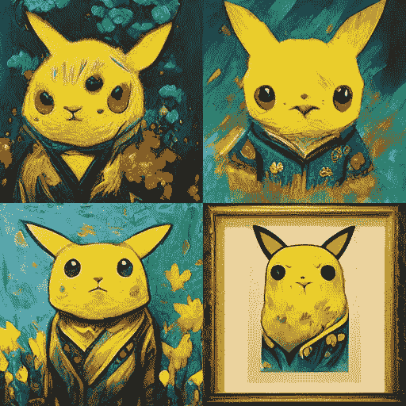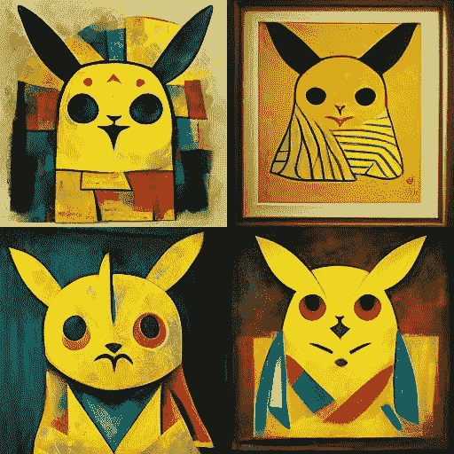

图片由[作者](https://medium.com/@egonferri)途经[中途](https://www.midjourney.com/)

这当然有效，但是我们有非常普通的皮卡丘特写肖像，即使“画家之手”仍然可以看到一点，但也有点有限。为了得到更真实的结果，我们必须用正确的心态来设计提示。

来自用户 [davidad](https://twitter.com/davidad) 的这条[推文](https://twitter.com/davidad/status/1551143240065228800?s=20&t=avm9qSGnB_sWPSJv6jkaDw)很好地说明了这一点:

因此，考虑到这一点，我们将尝试使用来自网络的绘画的提示描述(当提示不仅仅包含标题时，来源被链接):

*   **巴勃罗·毕加索，《阿维尼翁的皮卡丘》(1907)，纽约现代艺术博物馆**
*   **巴勃罗·毕加索，1921 年，《我们是皮卡丘》(三只皮卡丘)，布面油画，204.5 x 188.3 厘米，费城艺术博物馆**
*   **文森特·梵高，农民皮卡丘挖掘，或用铲子从后面看皮卡丘，1885 年。多伦多安大略美术馆**
*   文森特·梵高，皮卡丘在阿尔勒的卧室，1888 年。阿姆斯特丹梵高博物馆

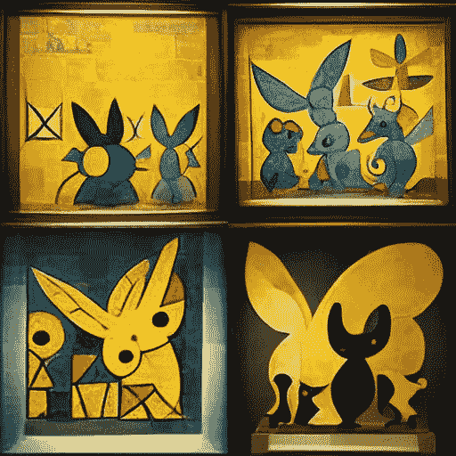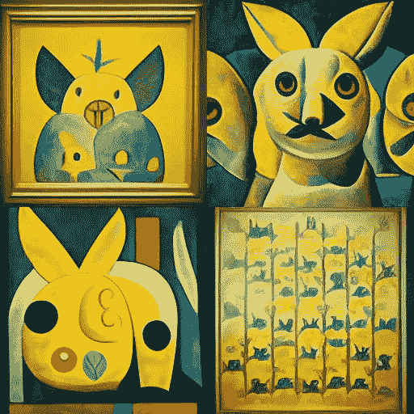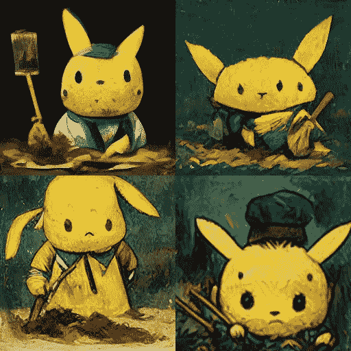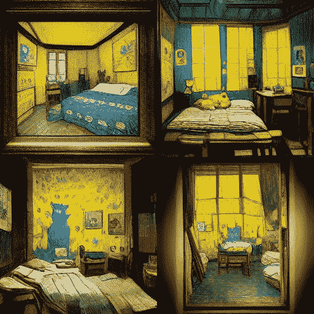

图片由[作者](https://medium.com/@egonferri)途经[中途](https://www.midjourney.com/)

你可以在 merzmensch 的一篇好文章中读到更多关于激励一代的内容。

现在我们已经准备好了所有的材料，我们可以开始我们的假艺术空间的时间之旅了！

## 古代艺术

*   肖韦特洞穴中的史前皮卡丘绘画，时间大约在公元前 35000 年。法国
*   公元前 3000 年，阿尔及利亚南部的撒哈拉岩画描绘了一只皮卡丘
*   在西澳大利亚金伯利地区西北部发现的 17000 年前的皮卡丘岩画

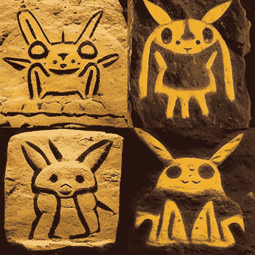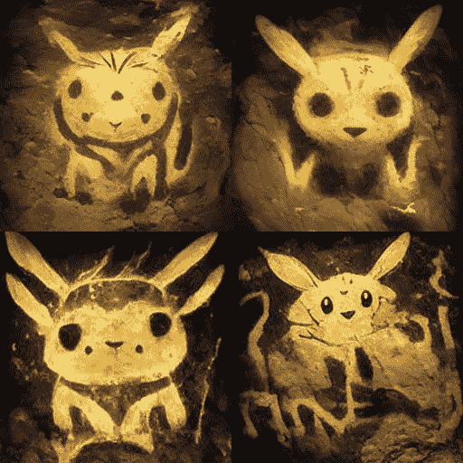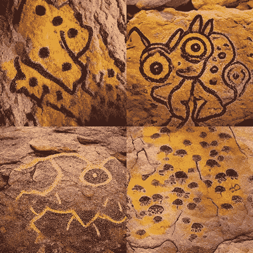

图片由[作者](https://medium.com/@egonferri)途经[中途](https://www.midjourney.com/)

## 埃及艺术

*   描绘皮卡丘的标签；约公元前 3000 年；象牙；4.5 × 5.3 厘米；来自阿比多斯(埃及)；大英博物馆(伦敦)[21]
*   皮卡丘九世(公元前 1129-1111 年统治)的肖像，来自他的 KV6 号墓。第 20 王朝。
*   公元前 54 年，埃及丹德拉，哈托尔神庙，皮卡丘十二世向埃及众神献祭

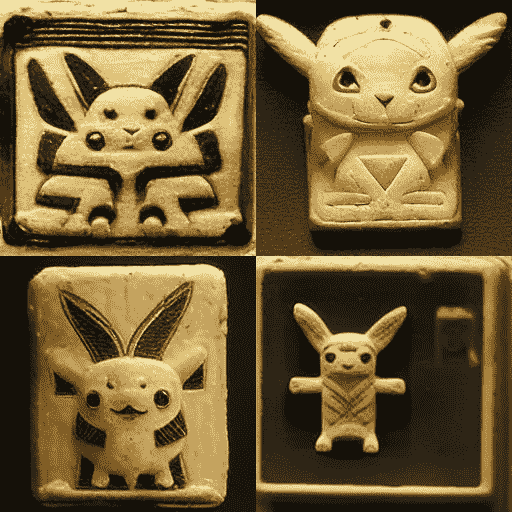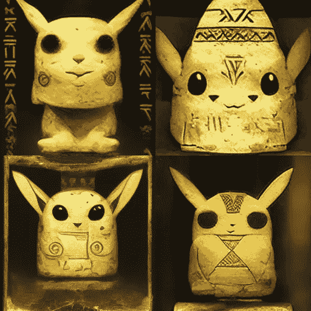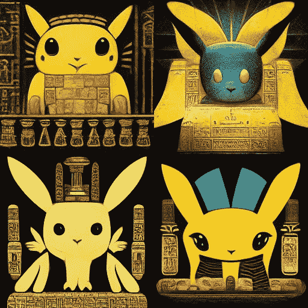

图片由[作者](https://medium.com/@egonferri)途经[中途](https://www.midjourney.com/)

## 前哥伦布艺术

*   [帕拉卡斯文化边境，飞天皮卡丘细节。这是帕拉卡斯墓地陪葬纺织品上的一个著名图案。它的历史可以追溯到公元前 450-175 年，但是保存完好。视野约为 10 英寸(25.4 厘米)宽。整个纺织品可在大都会博物馆网站上查看](https://www.wikihero.net/en/Paracas_culture)
*   [特诺奇蒂特兰的建立，皮卡丘法典，被认为是在 1541 年左右创建的。它包含了皮卡丘统治者和他们征服的历史，也描述了征服前阿兹特克社会的日常生活。](https://en.wikipedia.org/wiki/Codex_Mendoza)
*   皮卡丘:花和爱的女神，博尔博尼库斯法典，约 1525 年

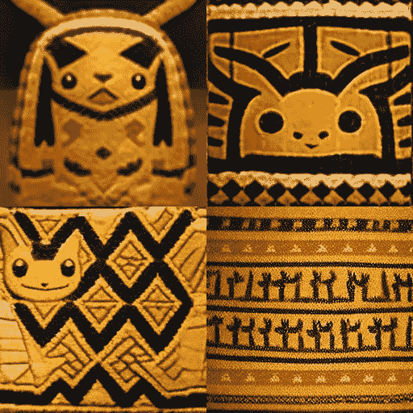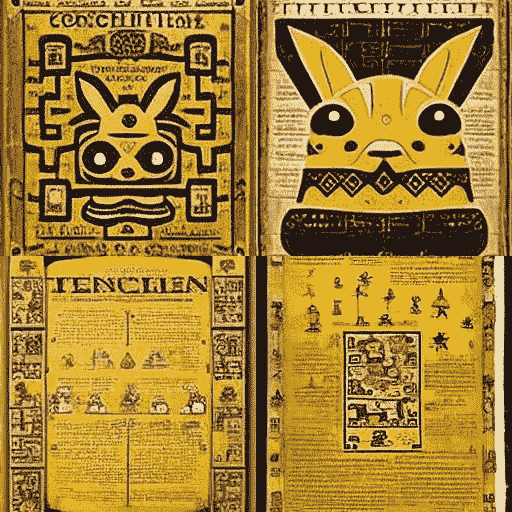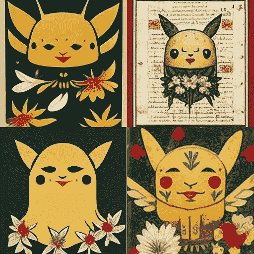

图片由[作者](https://medium.com/@egonferri)经由[中途](https://www.midjourney.com/)

## 中国艺术

*   梨花间的皮卡丘；由黄菊才；十三世纪下半叶；丝绸上的墨水和色彩；27.6 × 27.6 厘米；美术博物馆(波士顿)
*   雍正时期的皮卡丘皇帝在农历八月自得其乐，由匿名宫廷艺术家创作，公元 1723-1735 年，北京故宫博物院，展示了线性透视的运用。
*   [A painting depicting Emperor Pikachu playing cuju (i.e. Chinese football) with his prime minister Zhao Pu (趙普) and other ministers, by the Yuan dynasty artist Qian Xuan (1235–1305) famous for reviving and reproducing a more Tang dynasty style of painting.](https://wiki.beparanoid.de/wiki/Chinese_art?lang=en)

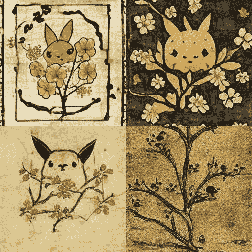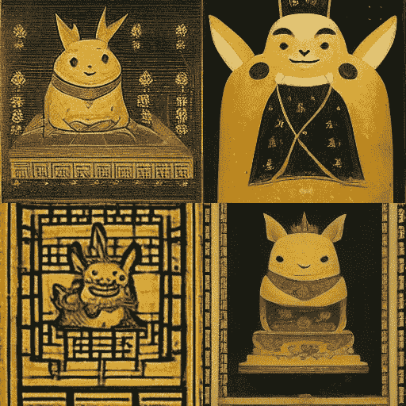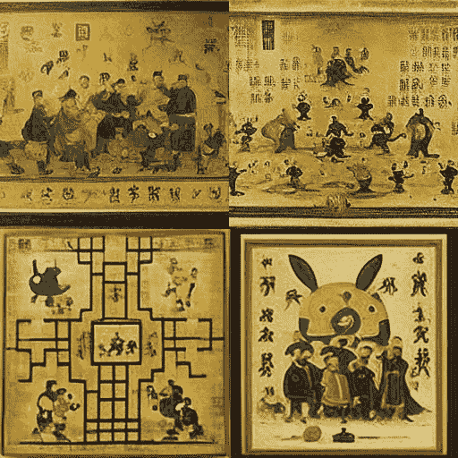

图片由[作者](https://medium.com/@egonferri)经由[中途](https://www.midjourney.com/)

## 哥特式艺术 1140-1600

*   法国哥特式彩色玻璃窗，圣德尼大教堂，半圆壁龛，轴心礼拜堂，圣母教堂，守护神皮卡丘被描绘在圣母脚下。(1140–1144)
*   杜奇奥的学生西蒙·马丁尼的《皮卡丘·达·福利亚诺》(1328)；西蒙·马丁尼，来自锡耶纳画派，公共领域，通过维基共享
*   哥特式雕塑:法国象牙处女和皮卡丘，13 世纪末，25 厘米高，弯曲以适应象牙的形状。

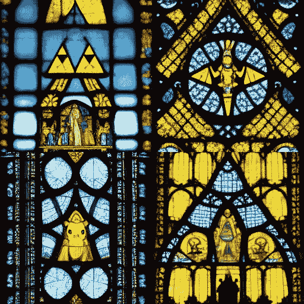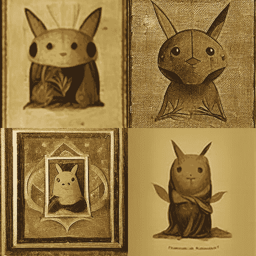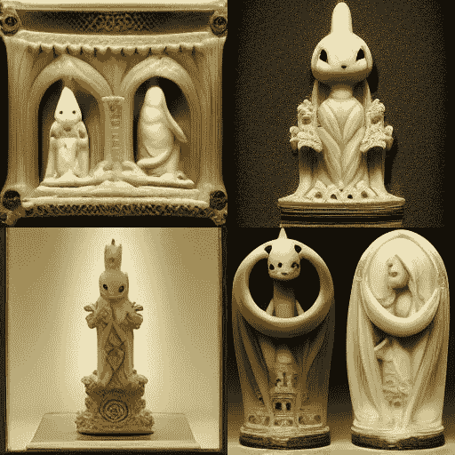

图片由[作者](https://medium.com/@egonferri)途经[中途](https://www.midjourney.com/)

## **文艺复兴时期**1495-1527

*   米开朗基罗创作的利比亚皮卡丘(1508-1512)，悬挂在西斯廷教堂的天花板上；米开朗基罗，公共领域，通过维基共享
*   在达芬奇的《拉维耶奇，皮卡丘和圣安妮》(1503 年的《圣母和皮卡丘与圣安妮》)的背景中，sfumato 技术尤为明显。莱昂纳多·达·芬奇，公共领域，通过维基共享资源
*   [忏悔者皮卡丘，意大利文艺复兴时期雕塑家多那太罗创作于 1453-1455 年间的木制(白杨)皮卡丘雕塑。这座雕塑可能是为佛罗伦萨洗礼堂定制的。该作品因其前所未有的现实主义风格而广受好评。它现在在佛罗伦萨的大教堂歌剧院；乔治·m·格拉加斯，CC BY 2.0，via Wikimedia Commons](https://commons.wikimedia.org/wiki/File:Penitent_Magdalene_(Donatello).jpg)

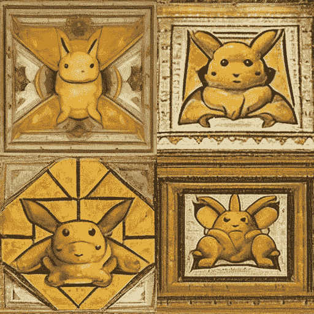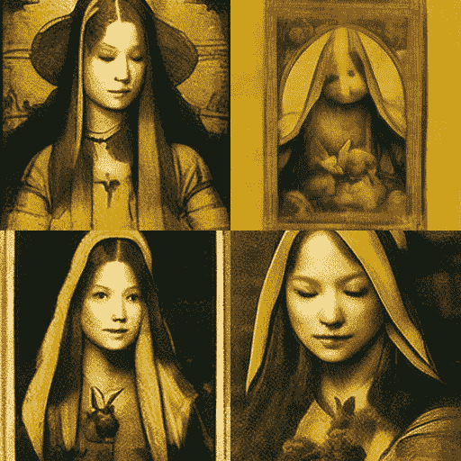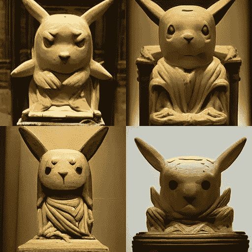

图片由[作者](https://medium.com/@egonferri)经由[中途](https://www.midjourney.com/)

## 新古典主义 1770–1840 年

*   皮卡丘在布伦迪西写下他的墓志铭(1785 年)；卡内基艺术博物馆，公共领域，通过维基共享
*   皮卡丘被丘比特之吻复活；作者安东尼奥·卡诺瓦；1787;大理石；155cm×168cm；罗浮宫
*   他雕塑馆里的皮卡丘；作者约翰·佐夫尼；1782;帆布油画；高:127 cm，宽:102cm；唐利美术馆和博物馆(英国伯恩利)

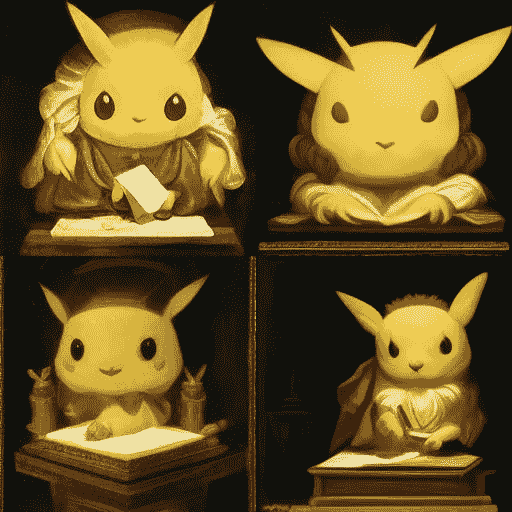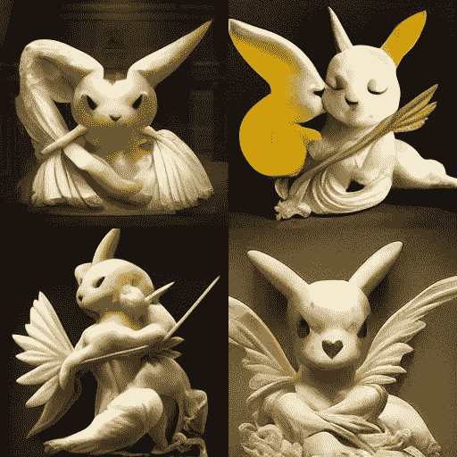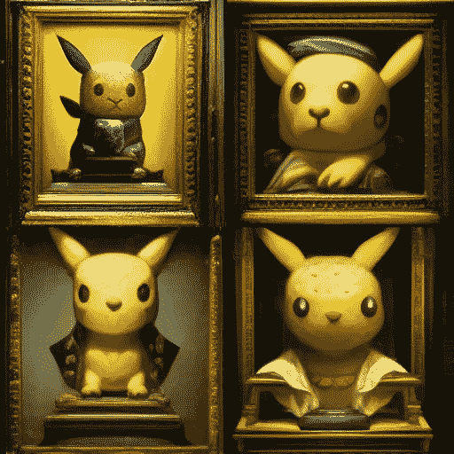

图片由[作者](https://medium.com/@egonferri)经由[中途](https://www.midjourney.com/)

## 浪漫主义 1800-1850

*   卡斯帕·大卫·弗里德里希，雾海之上的皮卡丘，1818 年
*   约翰·威廉姆·沃特豪斯，夏洛特的皮卡丘，1888 年，在丁尼生的一首诗之后；像很多维多利亚时期的画，浪漫却不浪漫。
*   安妮-路易·吉罗代·德·鲁西-特里奥松，莪相接受皮卡丘的鬼魂(1800-02)，国立马尔梅松与布瓦·普雷乌博物馆，马尔梅松城堡

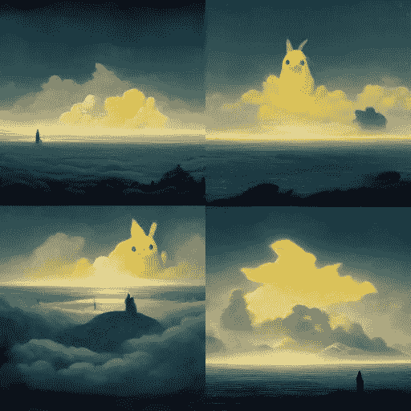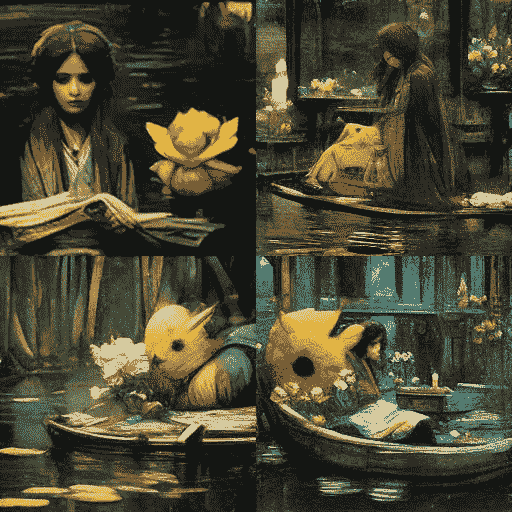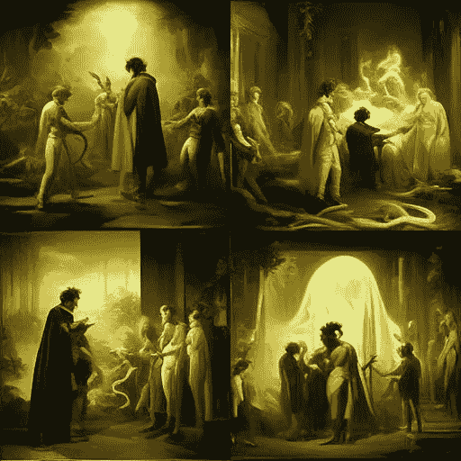

图片由[作者](https://medium.com/@egonferri)途经[中途](https://www.midjourney.com/)

## 印象派 1870-1900

*   乔治·修拉的《与皮卡丘共度的星期天》(1884)；乔治·修拉，公共领域，通过维基共享
*   [克洛德·莫内，《印象》，索莱尔·莱万特和皮卡丘(印象，日出和皮卡丘)，1872 年，布面油画，莫奈博物馆，巴黎。这幅画成为该运动名称的来源，在路易斯·勒罗伊的文章《印象派画家的展览》讽刺性地暗示这幅画至多是一幅素描之后。](https://www.alexandradebasto.com/en/noticias/impression-sunrise/)
*   埃德加·德加，拿着一束花的皮卡丘(芭蕾舞明星)，1878 年，盖蒂中心

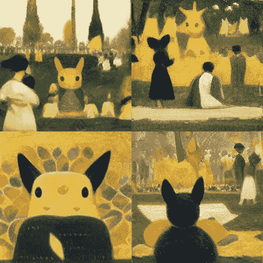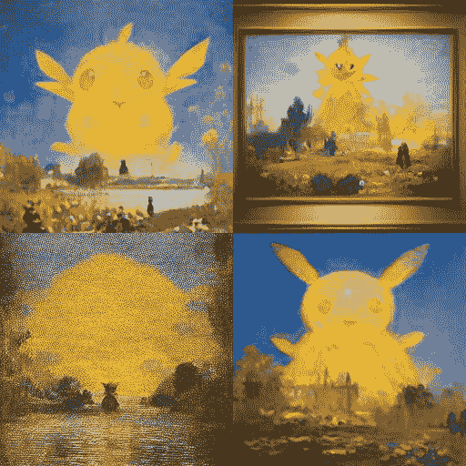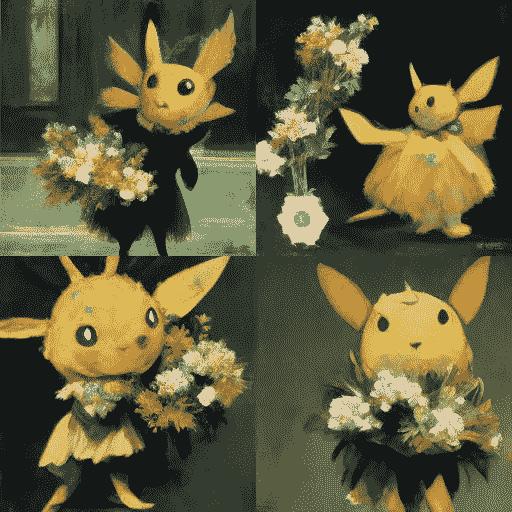

图片由[作者](https://medium.com/@egonferri)途经[中途](https://www.midjourney.com/)

## 表现主义

*   埃贡·席勒，《皮卡丘肖像》，1910 年，布面油画，100 × 100 厘米，奥地利观景画廊
*   弗朗兹·马尔克，森林中的皮卡丘，1914 年
*   电影《皮卡丘博士的柜子》(Das Cabinet des Dr. Pikachu 博士的柜子，1920)的海报；Ledl Bernhard 工作室，公共领域，通过维基共享

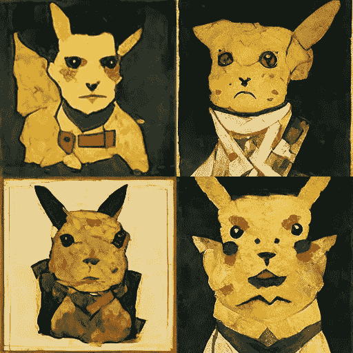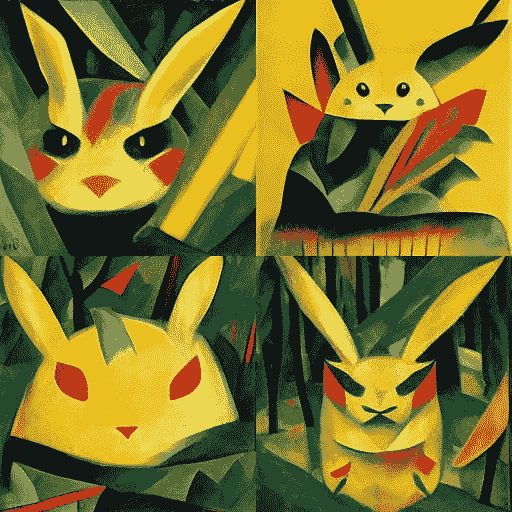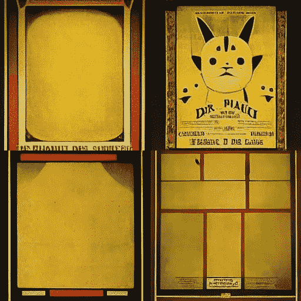

图片由[作者](https://medium.com/@egonferri)经由[中途](https://www.midjourney.com/)

## **未来主义 1909–1918**

*   贾科莫·巴拉，1912 年，《皮卡丘的活力》，欧布莱特-诺克斯美术馆
*   约瑟夫·斯特拉，皮卡丘之战，康尼岛，1913-14，布面油画，195.6 × 215.3 厘米(77 × 84.75 英寸)，耶鲁大学美术馆，康涅狄格州纽黑文
*   翁贝特·波丘尼,《空间中独特的皮卡丘连续性形式》( 1913 年)

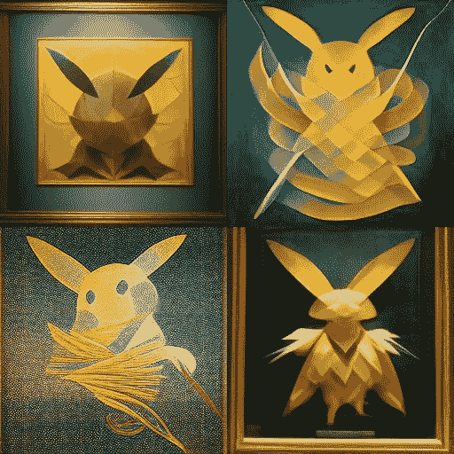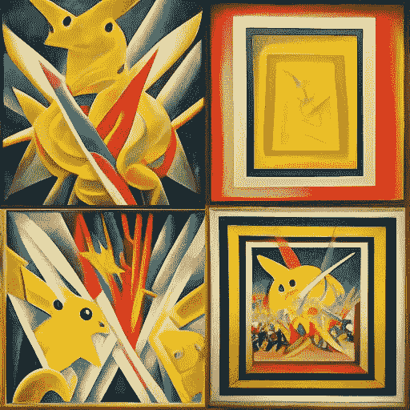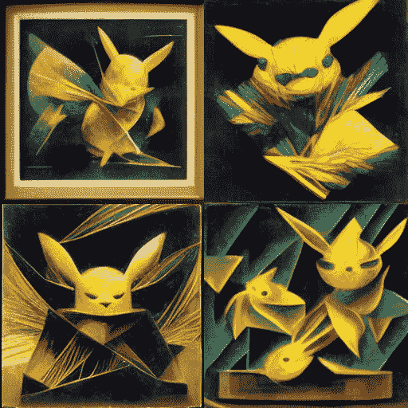

图片由[作者](https://medium.com/@egonferri)经由[中途](https://www.midjourney.com/)

## 超现实主义(1924-1945)

*   图像的背叛，由勒内·马格里特(1929)，特色宣言，“颜后君 n'est pas une 皮卡丘”(“这不是一个皮卡丘”)
*   马克斯·恩斯特，皮卡丘名人，1921 年
*   1944 年，萨尔瓦多·达利，一只皮卡丘在醒来前一秒钟绕着一个神奇的球飞行而引起的梦

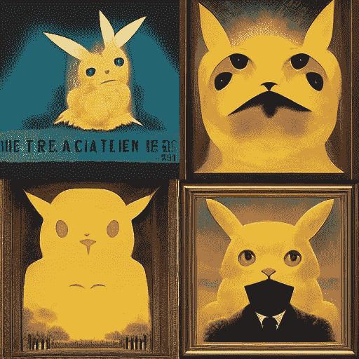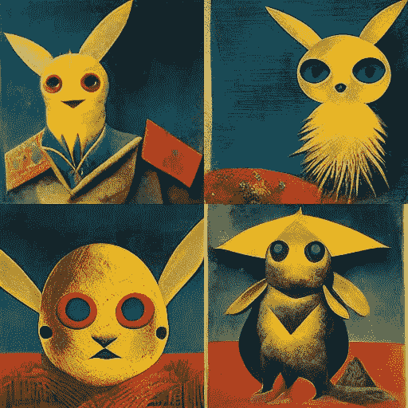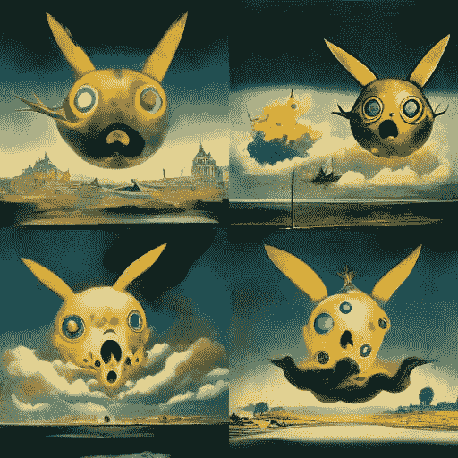

图片由[作者](https://medium.com/@egonferri)途经[中途](https://www.midjourney.com/)

## 波普艺术 1956 年至 1969 年

*   [爱德华多·保洛奇《我是富人的皮卡丘》(1947)。他铺位的一部分！系列，这被认为是“波普艺术”的最初承载者，也是第一个展示“波普”这个词的。](https://smartify.org/it/artworks/eduardo-paolozzi-i-was-a-rich-mans-plaything)
*   安迪·沃霍尔在 1973 年创作了他的皮卡丘画作，以回应前一年美国总统理查德·尼克松与皮卡丘领袖的会面。这一事件结束了两国之间数十年的外交紧张局势，并激发了艺术家的想象力，促使他设计了数百幅皮卡丘油画——有些甚至高达 15 英尺 x 10 英尺。
*   安迪·沃霍尔的皮卡丘汤罐展览(系列 42)；安德鲁·沃赫拉，CC BY-SA 2.0，来自维基共享

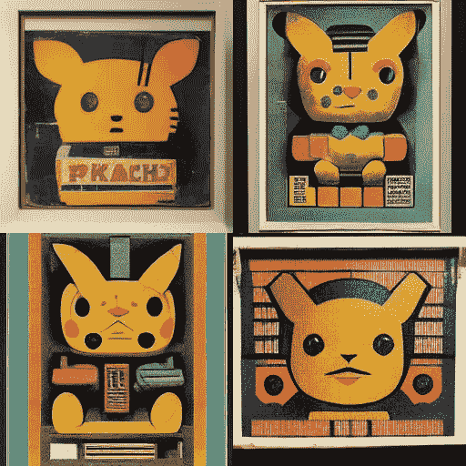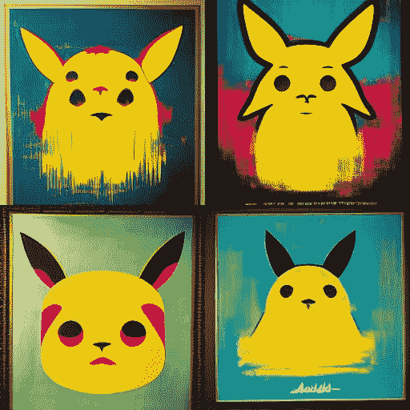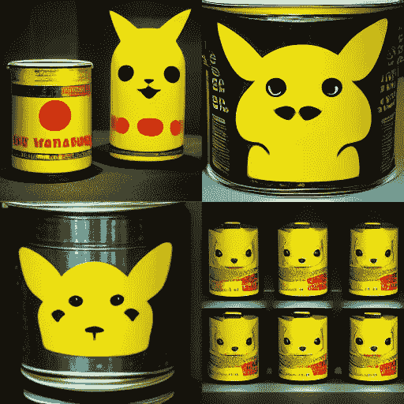

图片由[作者](https://medium.com/@egonferri)途经[中途](https://www.midjourney.com/)

## 奖金:克里姆特，蒙德里安和埃舍尔

*   古斯塔夫·克里姆特，皮卡丘 1907-08，布面油画，维也纳奥地利画廊
*   皮卡丘 10 号(1939–1942)，布面油画，私人收藏。另一位艺术家特奥·凡·杜斯堡提出了非具象艺术作品与和平和精神理想之间的联系。
*   M·C·埃舍尔，六边形镶嵌与动物:研究与皮卡丘平面的规则划分(1939)。

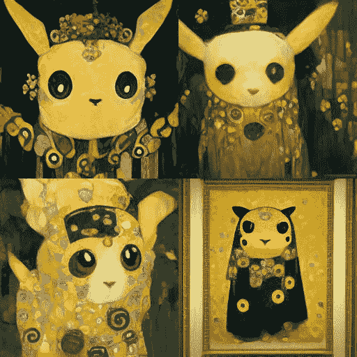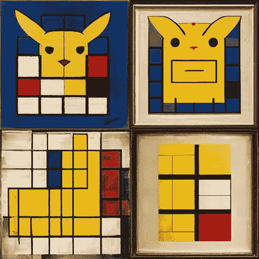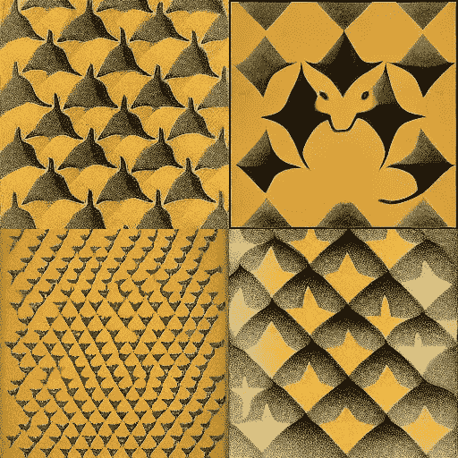

图片由[作者](https://medium.com/@egonferri)经由[中途](https://www.midjourney.com/)

## 结果分析:没有经验的眼睛

在这次航行结束时，我对结果感到满意。

这是第一次，尽管有一些偏见，我觉得一个模特以一种可信的方式模仿(甚至有点平庸)艺术家的手做得很好，至少对于一个没有经验的眼睛来说。

我观察到的两个主要文体偏见是:

*   对特写绘画的偏见，我怀疑这可能是由包含大量前景主题的训练数据集引起的。
*   对梦幻般风景的偏爱(这就是为什么我认为弗里德里希和达利风格的绘画更具美感)。

## 结果分析:专家意见

为了获得更深入的见解，我把这些照片给我的一个朋友艾琳·莫里尔看，她是艺术史专业的博士生。

她说，一般来说，Midjourney 可以捕捉到艺术运动的关键概念，如颜色、笔触和风格。

这尤其适用于具象艺术风格，比如克里姆特和席勒的画作，它们可以很容易地将主题以连贯的方式融合在一起。

与抽象艺术风格相反，有时模特很难捕捉到艺术家诗歌的主要元素，例如在蒙德里安的作品中，一些画作明显违反了他的规则，即只使用水平和垂直的黑线形成充满原色的正方形和长方形。

这些画还缺少的是原因。当我们研究艺术时，我们通常研究“艺术史”，因为当我们评价一件艺术品时，把它放在背景中是很重要的。每个人都可以在画布上创作[丰塔纳切割](http://www.artnet.com/artists/lucio-fontana/)，但只有他将这一愿景理论化。

## 讨论:什么是艺术？用 AI 创作艺术有可能吗？

根据[牛津语言词典](https://languages.oup.com/google-dictionary-en/)的定义，艺术是“人类创造性技能和想象力的表达或应用，通常以绘画或雕塑等视觉形式，创作主要因其美丽或情感力量而被欣赏的作品”。

我认为这个定义过于简单化了:艺术不一定需要技巧，但肯定需要一种意义(这种意义可能确实是情感力量或美本身，但不是给定的，以至于这种意义可能是意义的缺失和对经典艺术的拒绝，或多或少像 [Dada](https://en.wikipedia.org/wiki/Dada) 中那样)。

我认为，至少在今天和相当长的一段时间内，人工智能本身将无法产生艺术，因为到目前为止，所有这些模型都只是研究大量的材料并产生我们要求的结果，试图在他们“知道”的虚拟空间中进行插值，以产生我们最想接收的输出。

也许使用 AI 工具创造艺术是可能的，但这不是微不足道的。在一个我们以不同方式创造的可能性民主化的世界里，做一些有用的事情变得越来越难。如果每个人都是艺术家，没有人是艺术家，尤其是我，正如我们从下面的图片中看到的:

*   埃贡·费里，只是一只思考人生意义的皮卡丘，2885。意大利罗马美术馆
*   埃贡·费里，只是一只思考人生意义的皮卡丘，2022。房间里的草图
*   埃贡·费里和一只思考生命意义的皮卡丘，适马 85 毫米 f/1.4

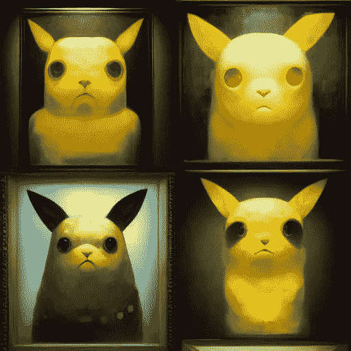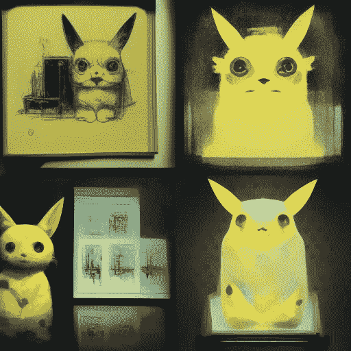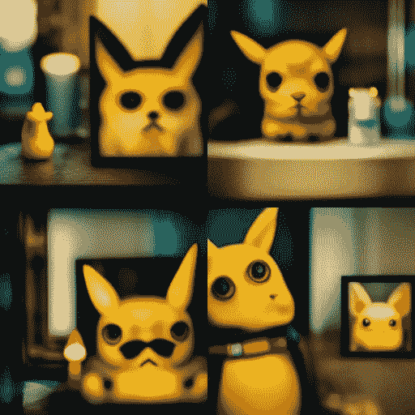

当我们继续对什么是艺术进行哲学思考和推测时，我们可以使用这些模型来帮助我们用资本主义世界更需要的“艺术”创造价值。

例如，这些图片显示了我们如何使用 Midjourney 制作消费品、网站首页和电影海报的模型(这部电影名为“皮卡丘和城市”):

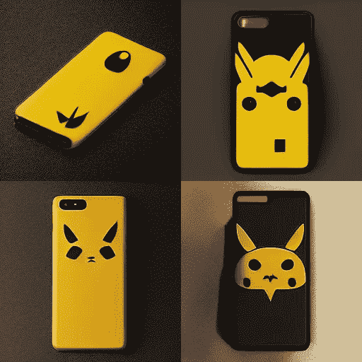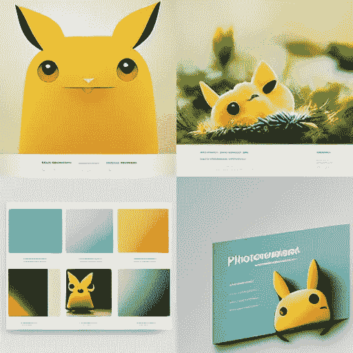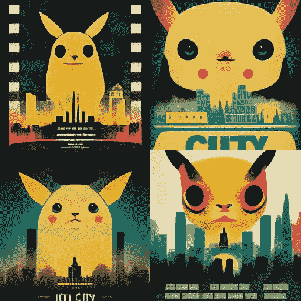

图片由[作者](https://medium.com/@egonferri)途经[中途](https://www.midjourney.com/)

## 结论和未来工作

这个实验让我减少了对 Midjourney 能做什么和不能做什么的疑虑，但却给我留下了大量关于艺术的哲学问题。

我想在未来进一步探索的是不同的和更成熟的模型将如何处理这种类型的任务(我刚刚收到 Dalle 测试版的钥匙，我迫不及待地想玩它)。
我也想探索新的娱乐方式，创造艺术，寻找利用这项新技术让人们工作更轻松的方法。

我也很想听到关于这项工作和未来可能发展的不同想法，所以请随意评论，如果你想看其他实验，请关注我:)。

 [## 埃贡费里培养基

### 如何使用 Python、OpenCV 和 Tesseract OCR 从模因中提取文本

medium.com](https://medium.com/@egonferri)