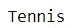
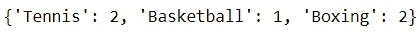
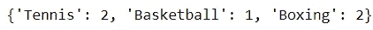
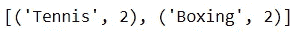
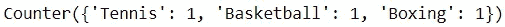

# 探索 Python 内置数据结构的替代方案

> 原文：<https://towardsdatascience.com/exploring-alternatives-to-pythons-built-in-data-structures-e3b20d933c0c>

## 使用强大但被低估的模块来利用数据容器

照片由 pix abay:[https://www . pexels . com/photo/blue-white-orange-and-brown-container-van-163726/](https://www.pexels.com/photo/blue-white-orange-and-brown-container-van-163726/)

Python 的内置数据结构是许多操作的基础。也就是说，利用这些数据结构的用户很快就不得不接受它们的局限性。

幸运的是，Python 提供了`collections`包，该包提供了替代的数据容器，对于某些任务来说可能更好。该包包含各种数据结构，可以用来替代传统的列表、元组或字典。

在这里，我简要介绍了这个模块中的一些容器数据类型，它们应该在您的编程库中。

## 1.默认字典

在处理键值对时，字典是首选的数据结构。也就是说，他们有一个警告:访问一个不存在的键将会返回一个 KeyError。

例如，假设您有以下元组列表。

您可以将这些值存储在字典中，如下所示:

这是一种可行的方法，但是预测不存在的键需要包含 if 语句。否则，当你搜索一项不在字典中的运动时，你会得到一个错误。

例如，访问字典中的“Rugby”键会引发一个 KeyError，因为这个键不存在。

默认字典为这一困境提供了一个解决方案。它为尚未创建的键分配一个默认的数据类型。

让我们用默认字典重复前面的任务。

当默认的 dict 对象被创建时，任何没有被创建的键在被访问时将被分配一个空列表。因此，搜索不存在的键不会引发任何错误。

这一次，搜索“Rugby”键将返回一个空列表，而不是一个 KeyError。

由于这个特性，不需要执行初始检查来在字典中搜索键。因此，可以用更少的代码行来执行该操作。

## 2.命名元组

集合模块的命名元组是 Python 内置元组的变体。就内存效率而言，它是平等的，但由于其独特的功能而脱颖而出，该功能允许用户命名元组的索引。

假设您有一个存储运动员及其各自运动的元组。

如果希望获得元组中的运动项目，可以通过调用索引来访问包含该信息的元素。

代码输出(由作者创建)

有一个完全有效的方法。然而，在读者看来，这一行代码可能很难理解。毕竟，元组中的索引号可以是任意的，所以代码的功能可能很难一眼看出(特别是当您处理大量索引时)。

为了避免妨碍代码的可读性，命名元组可能是更好的选择。

使用命名元组需要创建一个命名元组对象，它包含元组的名称以及每个索引的标签。

之后，您可以用命名的元组定义运动员。

这种方法的好处是用户现在可以通过标签而不是索引号来调用某些元素。下面是如何从命名元组中获取 sport 元素的方法。

代码输出(由作者创建)

这种方法消除了所有的歧义，使读者能够准确地理解提取的是什么信息。

## 3.计数器

收集模块的计数器是为给定的数据收集导出计数的理想工具。

它将元素及其对应的频率存储为键值对。

假设您有以下运动列表:

手动获取每项运动的计数可以通过字典来完成:

代码输出(由作者创建)

虽然这是一个可以接受的解决方案，但计数器允许用户使用简单的一行程序获得相同的结果。

代码输出(由作者创建)

此外，计数器拥有许多方法，可以方便后续任务。

使用`most_common`方法可以找到给定数据中 N 个最频繁出现的元素。

代码输出(由作者创建)

人们也可以使用计数器来比较不同的数据集合。在下面的例子中，我们找到了在第一个列表中但不在第二个列表中的元素的计数。

代码输出(由作者创建)

## 结论

在 [Unsplash](https://unsplash.com?utm_source=medium&utm_medium=referral) 上 [Prateek Katyal](https://unsplash.com/@prateekkatyal?utm_source=medium&utm_medium=referral) 拍摄的照片

最终，Python 内置数据结构的替代方案值得考虑。我鼓励尝试这样的工具，因为它们可以为某些用例提供更合适的解决方案。

`collections`模块中的许多容器数据类型功能强大，但没有得到充分利用。理解和实现它们应该很容易，因为它们是 Python 内置数据结构的变体。

也就是说，这并不是对`collections`模块效用的全面概括。如果你对这个模块中的其他容器数据类型感兴趣，可以在模块的[文档](https://docs.python.org/3/library/collections.html)中了解它们。

编码快乐！