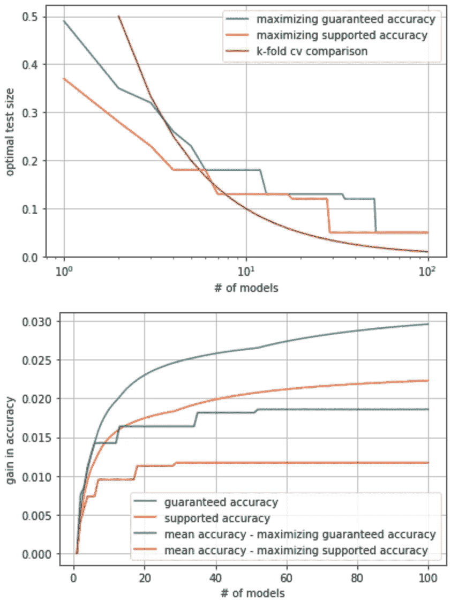
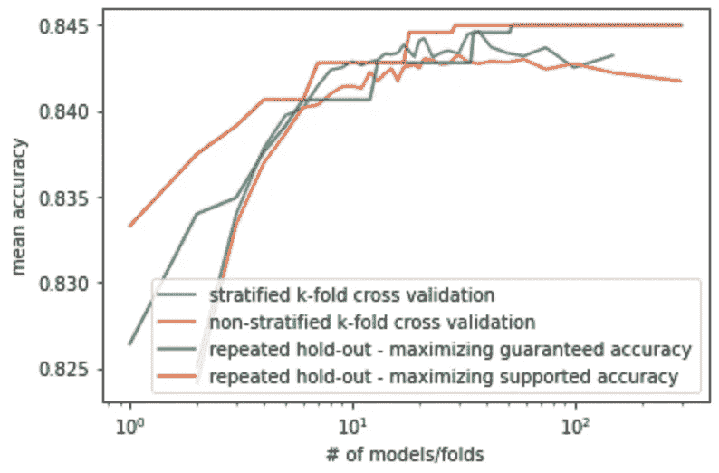
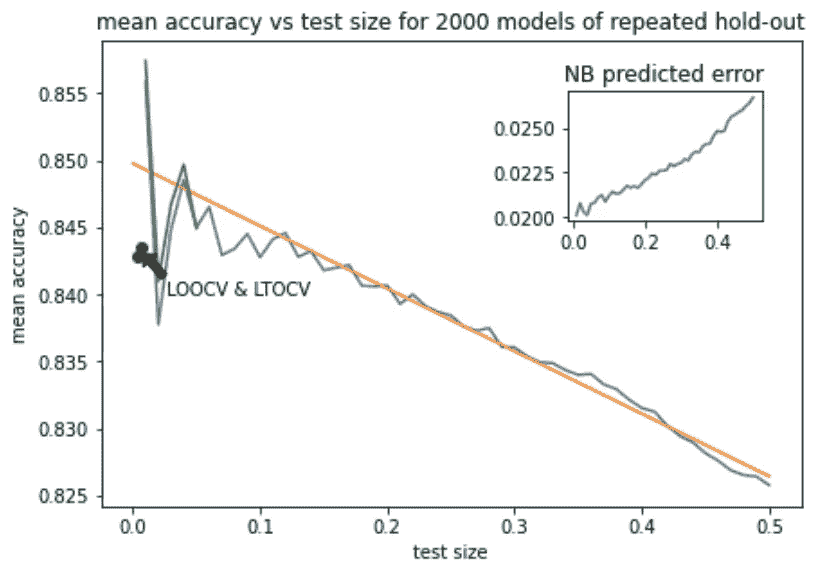

# 探索最佳测试尺寸、折叠次数和重复坚持时间

> 原文：<https://towardsdatascience.com/exploring-best-test-size-number-of-folds-and-repeated-hold-out-bbf773f370b6>

## 研究保证、支持和平均准确性的收益；发现偏见

Elena Mozhvilo 在 [Unsplash](https://unsplash.com?utm_source=medium&utm_medium=referral) 上的照片

虽然人们说 10%到 30%是一个好的测试规模，但这是非常依赖于问题的。一个好的起点是我所说的*保证精度*——精度减去两个标准偏差。使用一个代表性的，但不是微调的虚拟模型，可以模拟许多不同测试规模的随机种子。取你尝试的每个测试尺寸的平均值和标准偏差，然后选择一个最大化保证精度的尺寸。你甚至可以不看实际精度就做。当使用来自 sklearn 的默认 PCA 逻辑回归对来自 [UCI 心脏病数据集](https://archive.ics.uci.edu/ml/datasets/heart+disease)的处理过的 Cleveland 数据进行此操作时，我发现最佳测试大小为 49%。对于那些内心强大的人，也可以使用*支持的精度*，即平均值减去一个标准差。这给出了 38%。

出现的下一个问题是交叉验证(cv)使用多少折叠。为了简单起见，让我们讨论一下交叉验证，以优化最终的准确性。毕竟，超参数的影响可能是特定于模型的，而精度是一个更通用的度量。

同样的保证准确性的想法也可以用于计算使用多少折叠——但它需要更多的步骤。首先，我们将不得不放弃 k-fold 交叉验证的想法，并与反复坚持合作。原因是从统计学上来说，构建 J 个相同采样的随机模型比 k 倍交叉验证更容易建模。仍然有两种情况，其中 k-fold 交叉验证很容易理解，我们基本上可以从精心选择的图中读取我们需要的所有信息——但要达到这一点，我们首先必须理解重复坚持。

当您使用相同的数据构建多个模型并对其中一些数据进行测试时，相关性就会成为一个问题，因此模型的单个精度的标准偏差不再等于总精度的误差。事实上，修正可以超过 4 倍！看看下面代码中的实现，或者你可以查看我的博客文章中的细节。

B ut，当该说的都说了，该做的都做了，你又得到一个保证精度的图，它是模型数量 J 和测试规模的函数。对每个 J 的后者进行最大化，我们获得了 UCI 心脏病数据集的如下图(参见文章末尾的 Github 链接):

与仅运行一个模型相比，重复维持的最佳测试规模是模型数量的函数，并具有预期的精度增益。虽然当测试规模改变时，平均精度不连续地改变，但是保证/支持的精度是连续的。图片作者。

以下是保证和支持精度的定义:

means_2000、stds_2000 和 test_size _ 2000 是使用 test _ size _ 2000 中指定的 test _ size 对 train_test_split 的 2000 个随机种子进行默认逻辑回归的平均值和标准偏差列表。

Nadeau 和 Bengio (NB)在 2003 年[使用简化假设(我们只需对 J < 5 做一个小的改变)发现了重复坚持的 J 模型的方差与总精度的方差之间的这种关系。我们发现他们的假设被违反了，但仍然很有意义。](https://link.springer.com/content/pdf/10.1023/A:1024068626366.pdf)

N ow，回 k 倍互相关。我们不知道这里的保证精度，除了一个简单的情况:2 倍 cv。2-fold cv 在其训练集或测试集之间没有相关性，因此模型精度的标准偏差与总精度的标准偏差相同。事实证明，2 倍 cv 的保证精度比最优(测试规模选定)2 倍重复保持高 0.2%。在 2 倍 cv 之后，我们能做的最好的事情是绘制不同选择策略的平均准确度:

该图显示了四种不同选择类型的平均准确度。对于 k 倍 cv，我们平均 10*(测试集大小)个随机种子，而对于保留，我们使用上面的关系找到最佳测试大小。图片作者。

比较绿色和蓝色曲线，我们可以看到，对于 2 倍，重复保持更好，因为它的测试规模更小(见上图)，在中间区域，分层 k 倍 cv 略好，因为它可以承受更大的训练集。对于超过 50 个模型/折叠，重复保持也是更好的，因为它能够保持更大的测试规模:事实上，我们确实预计一些测试集偏差会出现在 300 个折叠中——留一个 cv (LOOCV)。原因是它是 N=300 次单次观察的简单平均值。因此，我们预计模型的真实精确度会有一个平均值误差，在这种情况下是 2.1%，比观察到的误差大四倍。因此，我们可以说，k-fold 交叉验证在大量折叠的测试集中易受偏倚的影响，而重复排除能够用任意数量的模型将测试规模保持在 5%,因此受偏倚的影响较小。这种偏差预计会随着测试规模的增加而迅速减少，因为随着测试规模的增加，可能的模型数量以及测试数据点的数量都会增加。事实上，它一直持续到 6 个测试数据点——或 50 倍——是强相关性的一个指标。现在让我们转向反复的坚持，这一切将变得更加清楚:

重复保持的平均准确度，最佳拟合线显示了低测试规模的偏差和方差。插图显示了预测的 NB 误差。对于小于 5%的测试规模，我们尝试使用 20，000 个模型而不是 2，000 个模型(绿色)，只对图形进行了微小的更改。图片作者。

该图显示了重复保持的平均准确度。好的一面是，我们可以清楚地看到偏差是最佳拟合线的残余。在 LOOCV 和 LTOCV(留二法 CV)中存在偏差，我们看到它持续到大约 10%的测试规模。在偏倚之上，我们看到方差从 1%的测试规模(三个测试点)开始出现，直到大约 10%的测试规模(30 个测试点)，在与偏倚相同的点消失。当你建立更多的模型时，这些振荡似乎不会以明显的速率衰减，如绿色所示。NB 算法不包括这些特征，所以我们使用滚动窗口并排除测试大小< 5%。我们还看到，LOOCV 在 10%的测试规模上没有产生任何改进，这与[之前的分析](https://stats.stackexchange.com/questions/61783/bias-and-variance-in-leave-one-out-vs-k-fold-cross-validation)很好地吻合，该分析发现 10 次折叠已经产生了最佳结果。然而，我们确实看到了一个小的改进，测试规模约为 5%，这是我们在前面的图中利用的。

如果您想知道，当所有点都在线时，NB 误差为 2%的原因是这是预期的训练集偏差，因此它不会在模型中显示为方差。它量化了我们在所有数据中异常幸运或不幸的机会。除此之外，我们还试图用许多随机种子来估计任何一个模型的较少训练数据的影响。当你对更少的模型取平均值时，线周围的方差确实增加了很多。

L 看第二个图，我们看到重复的保持(绿色)是 k 倍 cv(蓝色)在 3 到 35 倍之间的良好指标(下限)。因此，从第一幅图可以看出，如果我们想要保持在最佳保证精度增益(3.34%)的 1%以内，我们需要 20 倍。如果我们希望保持在 0.5%以内，我们需要使用测试规模为 5%和 70 个模型的重复坚持。对于支持的精度，我们希望使用 6 到 16 倍之间的 k 倍 cv，因此如果我们希望保持在最佳可能精度增益的 1%以内(2.39%)，我们需要使用 9 倍，如果我们希望保持在 0.5%以内，我们需要使用测试大小为 5%和 31 个模型的重复保持。

推广到其他数据集，我们展示了如何使用重复保持作为代理来研究通过增加折叠次数可实现的准确性增益，以及在哪个点切换到重复保持以及为什么。LOOCV 的测试集偏差可以通过寻找其平均值的误差来估计。这将是真实偏差的一个数量级估计(在这种情况下，相差 75%)。

这里是我的 Github 上的[代码的链接。](https://github.com/alexlewisroberts/test_size_study)

**【1】**:Dua，d .和 Graff，C. (2019) *。*http://archive.ics.uci.edu/ml[UCI 机器学习知识库](http://archive.ics.uci.edu/ml)。加州欧文:加州大学信息与计算机科学学院。