# 探索图细胞自动机

> 原文：<https://towardsdatascience.com/exploring-graph-cellular-automata-c9d22b4abe42>

## 我们如何找到产生特定全球行为的本地规则

# 1)元胞自动机基础

介绍细胞自动机的最好方法是通过例子。图 1 显示了一个简单细胞自动机的典型例子。它被称为规则 110，因为它的规则集可以由二进制序列 01101110 (1 表示任何黑色更新单元)指定。规则 110 从第一行单元格开始，其中包含一个黑色单元格。随后的每一行都是一个时间步长，通过将规则应用于每个像元并根据其当前状态及其相邻像元的状态更新其状态来获得。例如，图 1 中最左边的规则将一个黑色单元格更新为白色，如果它的两个邻居都是黑色的。

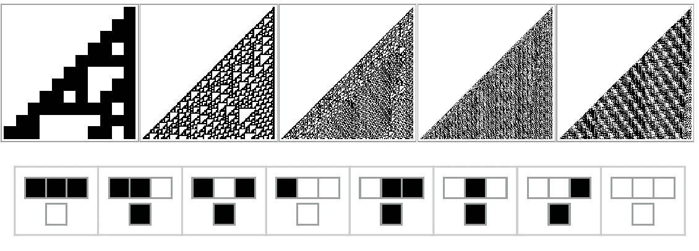

图 1:规则 110，初始状态为单个黑色单元，分别运行 10、100、250、1000 和 10000 个时间步长。使用 Mathematica 13 [10]生成。

从图 1 中可以明显看出，出现了一些重要的模式；尽管它的初始状态和规则都很简单，但规则 110 表现出复杂的全局行为[8]。

然而，并不是所有这样的细胞自动机都有类似的复杂度。以下是规则 111。除了一个更新规则:三个白色单元产生一个黑色单元而不是一个白色单元之外，它在每个方面都与规则 110 相同。然而，它表现出明显规则的水平线模式；比 110 号规则中随机散布的三角形要无趣得多。这种非常不直观的复杂性差异是由于转换函数的微小变化而产生的。

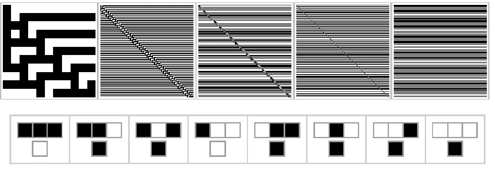

图 2:规则 111，初始状态为单个黑色单元，分别运行 10、100、250、1000 和 10000 个时间步长。使用 Mathematica 13 [10]生成。

# 为什么你会想读这个

我们已经迈出了创造能够自我修复的数字系统的第一步。对于人工智能领域的人们来说，这是重要的一步，因为它开辟了一个我们以前无法实现的可编程行为的前沿。现在让我们解释一下我们是如何做到这一点的。

首先，我们形式化经典的细胞自动机，如规则 110，将其概括为*图细胞自动机*。我们将使用这种形式来应用图形神经网络；这使我们能够学习产生图形细胞自动机的期望状态的转移函数。顺便说一下，这使我们能够创建一个自我修复的兔子图。

这篇文章大致沿用了“学习图细胞自动机”一文，但是对读者的知识做了更少的假设[1]。

# 2)图细胞自动机

## 2.1)细胞自动机形式主义

细胞自动机的各种实例之间有很强的相似性。每一种都使用某种结构来表示状态，并对其应用简单的规则，从这些规则的重复应用中，产生了复杂的行为。然而，这种相似性不仅仅是描述而已；它可以被形式化为一个通用的数学框架。使用这个框架，诸如图细胞自动机的新型细胞自动机可以直接描述为熟悉的规则 110 的扩展。这个框架如下。

元胞自动机是一个 4 元组: *(D，*∑*，N，τ)* [1]，其中:

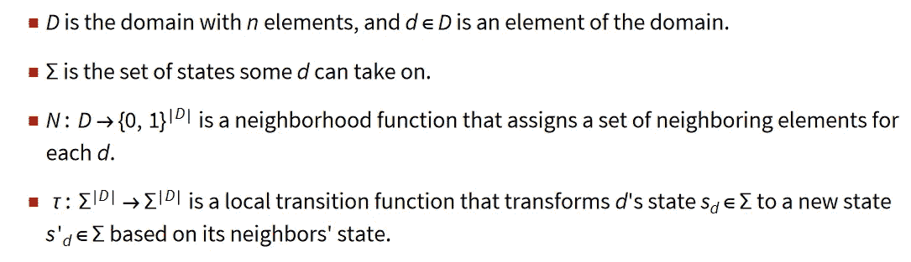

细胞自动机的组成部分。这个数学看起来可能有点吓人，但它指向了一个明确的图景；示例见表 1。

转移函数 *τ* 决定了元胞自动机的具体实例化，如规则 110 或规则 111，定义域 D、状态集σ、邻域函数 N 决定了元胞自动机的各类别，如表 1 所示。表 1 还显示了图形细胞自动机是经典和网格细胞自动机的推广；当细胞被表示为节点时，相邻细胞在空间上邻近的限制被放松，结果是一个图形细胞自动机。

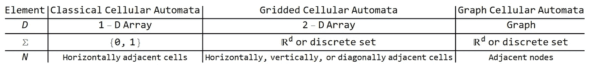

表 1。经典(如规则 110)、网格(如康威的生命游戏)和图形细胞自动机的比较。

## 过渡规则

正是转移函数 *τ* 负责细胞自动机中的复杂行为(我们在这里互换使用“转移规则”和“转移函数”)。改变规则 110 中的一个比特，它已经被证明像图灵机[7]一样复杂，产生规则 111，它表现出重复的行为。因此，演化图中全局行为的任务本质上是寻找一个有趣的转移函数 *τ* 。

转移函数 *τ* 聚集每个单元及其邻居的状态，以产生更新的状态。要在各向异性行为中烘焙(即不同的邻居权重不同)，过渡函数也必须作用于边权重。形式上， *τ* 变成了

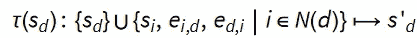

转换规则的形式定义 *τ。*

当研究细胞自动机时，我们通常只对引起复杂行为的转移函数感兴趣。因此，在运行细胞自动机之前，能够提前知道转移函数产生的行为将是有用的。然而，这种能力并不总是可能的。

Steven Wolfram 在观察简单的细胞自动机(如规则 110 和规则 111)时构思了他的计算等价原理[9]。根据这一理论，自然界中任何表现出一定复杂性的系统“都可以执行最高(‘通用’)计算能力水平的计算”[7]。换句话说，为了在时间步长 t 预测状态规则 110，必须使用至少 t 步计算；复杂的系统没有捷径或捷径，即使像规则 110 一样简单。

# 3)图形神经网络

## 3.1)近似转换函数

计算等价的原则规定我们不能立即说出一个转换函数产生的行为；我们不能跳过细胞自动机的计算。但是尽管如此，反向映射是容易处理的:给定一个期望的行为，就有可能学习一个导致它的转换函数。我们使用深度学习的方法来做到这一点。

我们使用深度学习来近似一些域(例如，细胞自动机的初始状态)和一些共域(例如，细胞自动机在某个时间步长 t 的状态)之间的任意映射。这是可能的，因为神经网络——本质上是具有可学习参数的仿射变换和非线性变换的交错组合——可以通过将参数调整到某种配置来任意接近任何函数[1]。为了寻找这样的参数配置，我们使用一种称为梯度下降的贪婪优化算法。

因此，我们使用神经网络来学习细胞自动机从初始状态到期望行为的映射。然而，这样做，我们将不会明确地学习映射，而是学习转换函数 *τ* 。为了计算期望的行为，我们将重复地将 *τ* 的近似应用于细胞自动机的初始状态。

为了这个探索，我们将近似图细胞自动机的 *τ* 。由于域 D 是图，因此我们使用图神经网络。图形神经网络构成了将图形映射到实值矩阵的函数类，

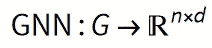

GNN 定义，其中 G 是一个图， *n 是顶点的个数，d 是每个顶点嵌入使得 d<n .*的维数

## 3.2)消息传递

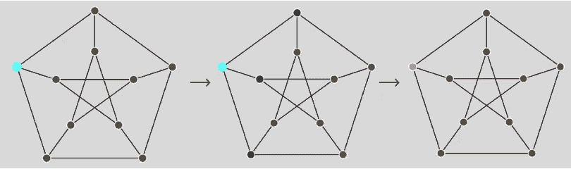

图 3:在消息传递中，每个顶点的状态通过在每次迭代中聚集它和它的邻居的状态来更新。蓝色顶点延伸到它的邻居，它的黑色顶点，并且它的状态基于它们的每个状态被更新。

最初，每个顶点 *i* 被分配一个任意初始化的维数为 *d* 的向量，这些向量被收集到一个实值的 shape (n，d)矩阵中。h 由消息传递管道更新，如下所示。

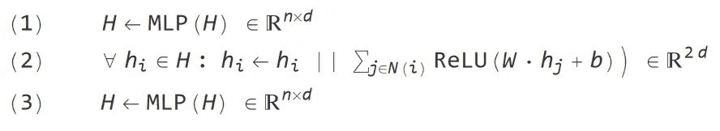

消息传递，GNNs 的主干。

消息传递管道包括三个步骤:

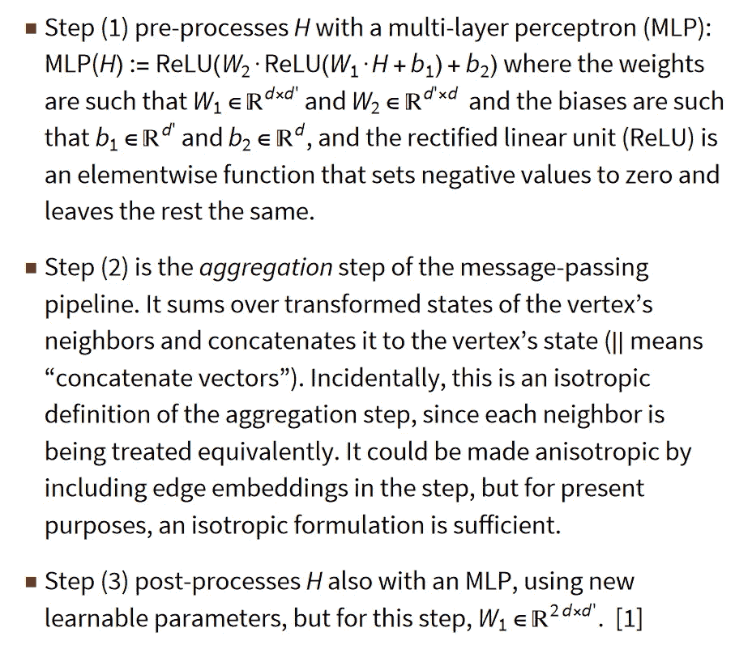

消息传递管道的说明。

通过迭代地应用这个本地消息传递管道，图的全局信息传播到顶点:由于每一步看到所有顶点从它们的邻居接收信息，如果消息传递被应用 t 次迭代，所有顶点从距离它们至多 t 的那些顶点接收信息。因此，消息传递是一种局部作用的功能，它根据相邻顶点的状态更新顶点的状态，在重复应用时，它会产生全局行为。这样，消息传递类似于局部转移函数 *τ* ，它在元胞自动机中演化出复杂的全局模式。事实上，我们将把转移函数(忽略边权重)近似为一个消息传递神经网络，并且我们将通过优化这个神经网络来学习某些任务的 *τ* 。

# 4)实验

## 4.1)任务

我们的目标是学习一个转移函数，它将一个图形细胞自动机演化到一个特定的最终状态。让我们用一种形式主义来解决这个问题，因为这将使优化问题变得简单明了。

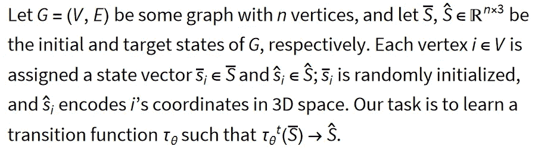

我们任务的定义。

在这里，我们将使用 3.2 节中为τ_θ定义的图形神经网络。对于 *G* ，我们将使用斯坦福几何兔子，这是一个从兔子的点云构建的图形，将每个点视为一个顶点，并将每个点连接到 3D 空间中其附近的顶点[1]。状态向量(s_i-bar)因此对点云中每个顶点的坐标进行编码，τ_θ将向 3D 空间中的兔子演化出任意结构的图形。

## 4.2)培训

我们现在将优化参数τ_θ，使 L2 损耗最小:

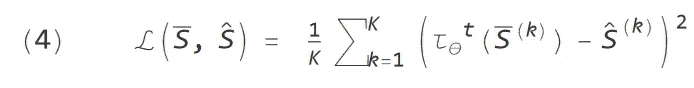

损失函数最小化。

在(4)中，最终时间步长 t 和小批(即顶点的划分)k=1，…，k。

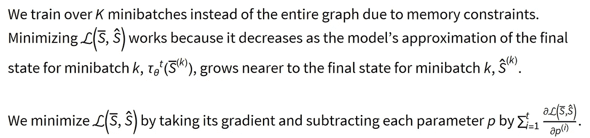

方程(4)的解释，我们任务的 GNN 的损失函数。

现在 *p^(i)* 是 *p* ，因为它在时间步长 *i* 被应用于每个小批 k 和每个时期(即，我们已经看到小批 k 的次数)。这个过程被称为时间反向传播。利用它，我们可以学习我们的神经网络τ_θ的参数配置，使得它近似目标转换规则的映射:

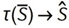

目标转换规则将初始状态映射到最终状态。我们将用 GNN 来近似这种映射。

人们发现还有一些技巧可以帮助训练。一种是从不同初始状态池中提取，而不是从单个初始状态 S-bar 中优化，替换每个样本。这有助于在图形细胞自动机中创建持久结构，因为模型将学习将各种状态映射到目标状态。然而，也许最重要的是，我们可以调整最终的时间步长 t。我们将从不同的以秒为单位的 t 定义中看到有趣的结果。4.3.[1, 5]

## 4.3)结果

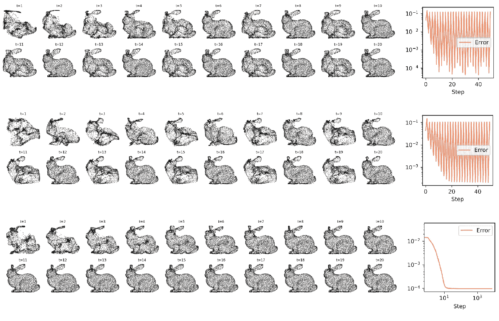

图 4:针对几个最大时间步长 t*训练的模型的结果；t*=10(第一行)，t*=20(第二行)，10 ≤ t ≤ 20 在训练期间为每个步骤随机选择(第三行)。误差由 L2 损耗测量:K=1 时的等式(4)。改编自[2]，Grattarola 等人的增补。

该模型针对不同的时间步长 t 进行训练，其固定初始状态的输出如图 4 所示。

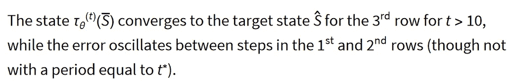

对图 4 的讨论。

因此，在 t=20 时，当用作图形细胞自动机中的转移规则时，每个模型成功地产生兔子，但是只有其结果显示在第三行中的模型产生持续的兔子。

然而，这个实验的重要意义不在于我们可以创建一个兔子形状的图表。它的意义在于，这只兔子能够自我组织，自我修复。这些是协调的全局行为，但它们不是自上而下设计的结果，而是局部作用函数的迭代应用，这是自然界复杂系统共有的自下而上机制。

我们从基本的细胞自动机开始探索，惊叹于简单的更新规则应用于简单的初始状态所产生的复杂性。但是由于计算的不可约性，这种细胞自动机可能产生的复杂性是无法预测的。然而，我们通过用图形神经网络代替简单的更新规则，在图形细胞自动机中强制特定的全局行为。因此，我们已经表明，这些图形神经细胞自动机是一种工具，工程基本的自组织系统。

# 引文

[1] Grattarola、Daniele、Lorenzo Livi 和 Cesare Alippi。"学习图形细胞自动机."神经信息处理系统进展 34 (2021)。

[2] Grattarola、Daniele、Lorenzo Livi 和 Cesare Alippi。"学习图形细胞自动机，补充材料."神经信息处理系统进展 34 (2021)。

[3]汉密尔顿，林子幸《图形表征学习》人工智能和机器学习综合讲座 14.3 (2020)。

[4]霍华德、杰里米和西尔万·古格。利用 fastai 和 PyTorch 为编码人员提供深度学习。奥莱利媒体，2020。

[5] Mordvintsev，Alexander 等，“生长神经细胞自动机”蒸馏 5.2 (2020): e23。

[6] Perraudin，Nathanaë等人，“GSPBOX:图形信号处理工具箱”arXiv 预印本 arXiv:1408.5781 (2014)。

[7]埃里克·w·魏斯泰因，《计算的不可约性》mathworld.wolfram.com/(2002 年)。

[8]埃里克·魏斯泰因，《第 110 条规则》mathworld.wolfram.com/(2002 年)。

[9]沃尔夫拉姆，斯蒂芬。一种新的科学。第五卷。香槟:沃尔夫拉姆媒体，2002 年。

[10] Wolfram Research，Inc .，Mathematica，版本 13.0，伊利诺伊州香槟市(2021 年)。