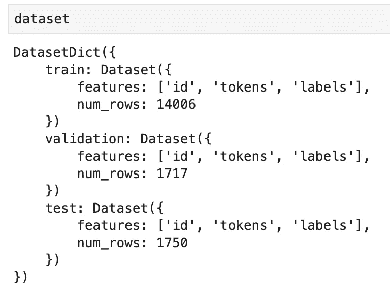
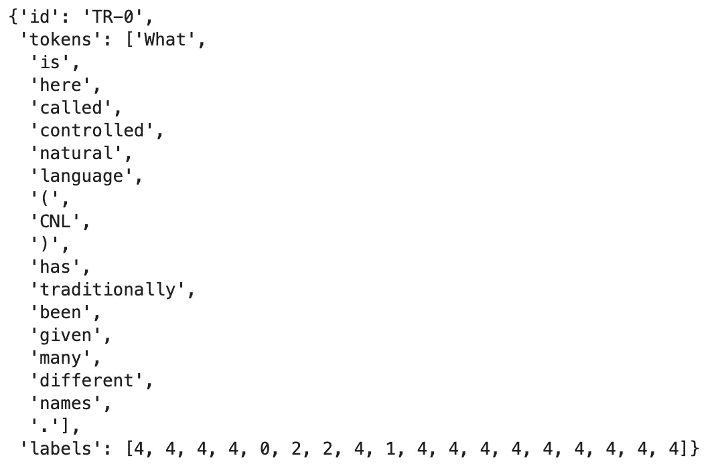
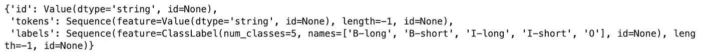
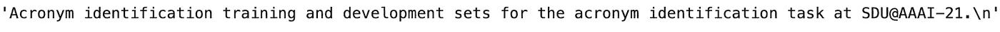
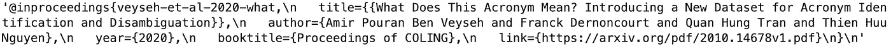

# 探索拥抱脸数据集

> 原文：<https://towardsdatascience.com/exploring-hugging-face-datasets-ac5d68d43d0e>

## 为您的下一个 NLP 项目访问大型现成数据集

图片来自[亚历山大·德比弗](https://unsplash.com/@alexkixa)的 [Unsplash](https://unsplash.com/photos/FO7JIlwjOtU)

任何机器学习项目最重要的部分就是你正在处理的数据。不管你处理的是什么算法或模型，真正的准确性来自数据的数量**和质量**。

我喜欢在空闲时间从事 NLP 项目，但有时很难访问大型数据集。收集、积累这些数据，然后以适当的方式清理这些数据可能会花费大量时间。对 NLP 爱好者来说幸运的是， [HuggingFace](https://huggingface.co/) 配备了一个随时可用的[数据集](https://github.com/huggingface/datasets)中心。在本文中，我们将快速探索如何使用这个数据集模块为您的项目挑选和准备合适的数据集。

## 装置

这一步非常简单，我们将使用两个开源库。

## 数据集方法

浏览数据集存储库的文档，我们看到有几个主要的方法。第一种方法是我们可以用来探索可用数据集列表的方法。近 **3500 个可用数据集**应该作为选项出现，供您使用。

列出所有数据集

现在，为了实际使用数据集，我们希望利用 **load_dataset** 方法。

加载数据集

如果您加载这个数据集，您现在应该有一个[数据集对象](https://huggingface.co/docs/datasets/access)。

## 使用数据集对象

我们使用的不是传统的 csv 或 excel 格式，而是一个**数据集对象**，它以某种结构存储数据集的**元数据。我们可以在打印数据集时观察到这一点。**

数据集(作者截图)

我们加载的数据集被分成三个后续数据集，您可以使用。features 和 num_rows 键说明了列及其观测值的数量。

查询和处理 Dataset 对象在语法上与处理 Pandas 数据框架非常相似。这里有一些方法可以用来获得更多关于你的对象的信息。

## 选择一行

从数据集对象中选择行

选中的行(作者截图)

## 特征抽出

数据集功能

特色(作者截图)

## 数据集描述

如果你需要更多关于数据集的来源或如何创建的信息，你可以获得背景信息和引用。

数据集的描述

作者截图

数据集引用

作者截图

## 自定义数据集加载

在某些情况下，您可能不想处理其中一个 HuggingFace 数据集。您仍然可以将本地 CSV 文件和其他文件类型加载到这个数据集对象中。比方说，您有一个想要处理的 CSV 文件，您可以简单地将它传递给 load_dataset 方法，并附上您的本地文件路径。

加载一个 CSV 文件

这同样适用于处理多个 CSV 文件的情况。

加载多个 CSV 文件

当你想用 HuggingFace 提供的一个预先训练好的模型来**微调**你自己的数据集时，这个功能尤其有用。

## 其他资源和结论

我希望这篇文章对拥抱脸提供的大量资源是一个很好的介绍。拥抱脸使得端到端地处理大型 NLP 和 ML 工作负载变得容易。我附加了一些对本文有帮助的资源。

[数据集文档](https://huggingface.co/docs/datasets/index)

[微调预训练模型](https://huggingface.co/docs/transformers/training)

[数据集 Github](https://github.com/huggingface/datasets)

*如果你喜欢这篇文章，请在*[*LinkedIn*](https://www.linkedin.com/in/ram-vegiraju-81272b162/)*上与我联系，并订阅我的媒体* [*简讯*](https://ram-vegiraju.medium.com/subscribe) *。如果你是新手，使用我的* [*会员推荐*](https://ram-vegiraju.medium.com/membership) *报名。*