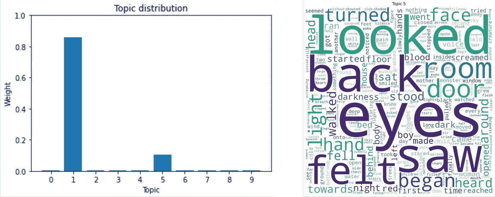
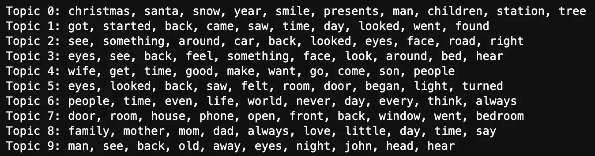
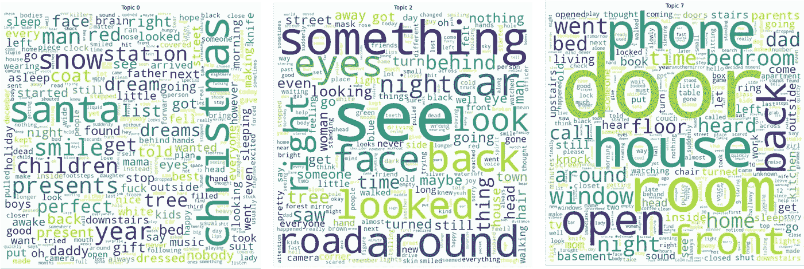
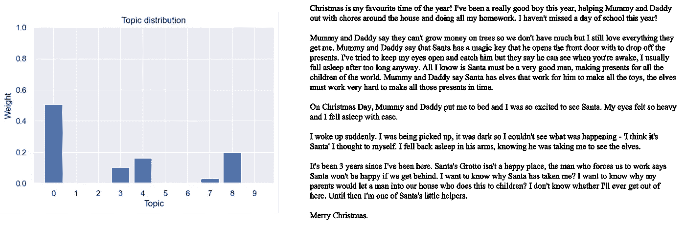
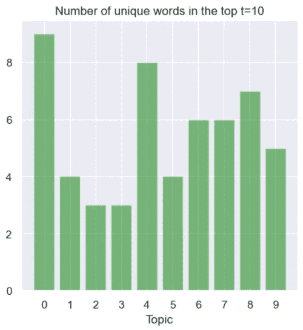
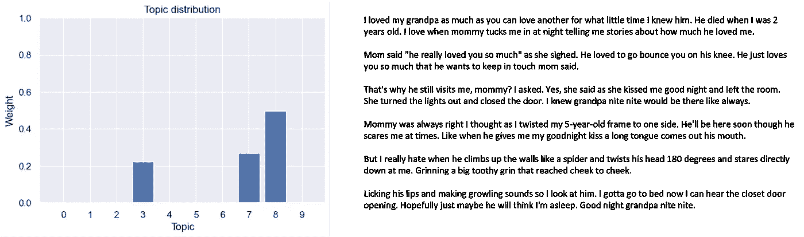
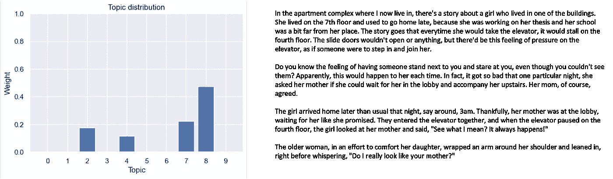

# 利用无监督主题建模探索大型文档集—第 1/4 部分

> 原文：<https://towardsdatascience.com/exploring-large-collections-of-documents-with-unsupervised-topic-modelling-part-1-4-404f4931dab7>

# 利用无监督主题建模探索大型文档集—第 1/4 部分

## 借助话题模块性解读提取的话题

图片作者。

在这一系列的文章中，我们将重点探索基于主题建模的大量未标记文档。我们假设除了语料库的上下文之外，我们对语料库的内容一无所知。我们的目标是用一些新的、量化的知识来完成对语料库中所讨论内容的探索。

这是 4 部分系列的第一部分。让我们开始吧。

# 介绍

## 主题建模 101

在整个系列中，主题建模是我们分析的基础。对于给定的语料库，主题模型估计其每个文档的主题分布(即，一组主题上的权重分布)，其中主题本身是语料库的词汇上的权重分布。在给定文档集合的情况下，每个主题的权重最大的单词在句法和/或语义上是相关的。这意味着两个不同的主题共享完全相同的词汇，但具有不同的权重分布。

左边是一个大集合中给定文档的主题分布示例，考虑了 10 个主题(范围从 0 到 9)。右边是主题 5 在语料库词汇中的权重分布的提示性描述。图片作者。

## 问题是

从上图可以看出，尽管主题建模的想法听起来很吸引人，但通常很难对这种模型的结果做出一致的解释——记住，我们对语料库的内容一无所知！

这一系列的文章将呈现实验性的设置设计，引导我们走向理性的解释，并以他们的结果为依据。

## 拟议解决方案

在第一部分中，我们将利用两个工具在解释主题模型的结果方面向前迈进了一步:(1)主题解释，和(2)主题模块化。

# 履行

## 文集

我们收集的文档由 1904 个短篇恐怖故事组成，摘自[r/shortcarystorys subreddit](https://www.reddit.com/r/shortscarystories/)。如果你想学习如何自己提取这些和其他的，请阅读[我的帖子，详细介绍了整个过程](/how-to-collect-a-reddit-dataset-c369de539114)。根据 Reddit 的[使用条款](https://www.reddit.com/wiki/api-terms)，这些数据是使用 Reddit 的 API ( [PRAW](https://praw.readthedocs.io/en/stable/) 和 [PSAW](https://pypi.org/project/psaw/) 收集的。

让我们假设文本已经过充分的预处理，文档中的单词由一个空格分隔。

## 估计分布

我们分析的基础将是 LDA 主题建模的结果，在这个具体的例子中，有 10 个主题(目前是任意确定的)。我们将使用 [Sci-Kit 学习实现](https://scikit-learn.org/stable/modules/generated/sklearn.decomposition.LatentDirichletAllocation.html):

在上面的代码中，变量 **tf** (代表词频)是一个 shape (D，V)的 numpy 矩阵，其中 D 是语料库中文档的数量，V 是词汇量的大小。每个条目 **tf{d，v}** 是文档 **d** 中术语 **v** 的频率。这必须是 LDA 模型的输入。

输出变量 **doc_topic** 的形状为(D，K)，其中 K 是主题的数量。根据 LDA， **doc_topic** 的每一行加起来都是 1。

属性 **model.components_** 的形状为(K，V)，表示词汇上的主题权重分布。同样，每一行的总和为 1。

## 话题解读

这些是前一节中估计的 10 个主题中每个主题的前 10 个最重要的词:

10 个主题中的前 10 个最重要的单词。运行上述代码的结果。图片作者。

如前所述，主题只是相同词汇的权重分布，因此，将我们自己限制在每个主题的前 10 个权重最大的单词将允许我们专注于核心概念。然而，在这个描述中，我们不能掌握词与词之间的相对权重，这可能是所传达的概念的指示。

这些是主题 0、2 和 7 的词汇云:

主题 0、2 和 7 的文字云。在 wordcloud 中，单词越大，它在主题中的权重就越大。图片作者。

花几分钟时间阅读 10 个主题中的每一个，并尝试解释它们可能代表的概念。解释所有这些容易吗？还是有些人比其他人更难？

你觉得哪一个最容易诠释？没有错误的答案(或正确的答案，就此而言)，但我敢打赌它是主题 0，概念将是与“圣诞节”有关的东西。我个人也将话题 2 标注为“可疑观察”，话题 7 标注为“感兴趣的物体/位置”，话题 8 标注为“家庭成员”，话题 9 标注为“可疑对象”。剩下的话题让我很难解释它们。

很明显，话题口译是一项非常艰巨的任务。如果现在我要写一份报告，这个和那个主题很容易解释，上面的标签可以分配，而这些和那些主题不能，这听起来就不太科学了。我需要用一些可以量化的东西来支持这些说法。这就是主题模块化发挥作用的地方。

## 主题模块化

一个话题可能传达某种概念。但是，在观察那个题目的前 N 个单词时，潜在的概念可能并不具体，也不全面。然而，一个不与其余主题共享一个单词(从前 N 个开始)的主题可以定义一个具体的、模块化的概念。达成这一概念，反过来，允许在这一方面对计划的文件进行独立评估。

例如，因为主题 0 很容易解释为“圣诞节”，所以可以假设它具体代表一年中的那个时间。这允许我们进一步假设，所有在主题 0 上有很大权重的文档必须与圣诞节有一些关联。更重要的是，因为我们知道语料库的上下文，我们可以声明这些文档是以圣诞节为背景的恐怖故事。

这里有一个例子支持我们的假设:

在左边，文档的主题分布在右边。该文档是从[r/shortcarystorys 子编辑](https://www.reddit.com/r/shortscarystories/)中自动提取的，并非作者所写。该文档可在引用的网站上公开获得。

这似乎是朝着更好地理解我们的语料库的正确方向迈出的有希望的一步！我们只需要将相同的技术应用于每个“具体”的主题。抛开主观性，主题模块化允许我们陈述哪些主题比其他主题更具体。

我们通过确定由一个模型提取的所有主题之间共享的字数来评估主题模块性(给定每个主题的前 N 个最有权重的单词)。因此，我们对具有最多独特单词的主题最感兴趣，然而考虑到从词汇表中选择 K 组 N 个独特单词的概率不是零。因此，围绕这些结果的讨论不能独立于每个主题的实际热门词。

代码如下:

结果如下:

每个主题前 10 个单词中独特单词的数量。图片作者。

不那么巧合的是，话题 0 在话题模块化上得分最高。这一指标证实了它确实是最容易解释的(或最容易给它贴上标签的)。

让我们来看看第二高的分数，题目 4。尽管它有很高的主题模块化分数，但仍然很难(至少对我来说)理解它。我不能给它一个具体的标签。这表明，就其本身而言，主题模块性还不足以作为一种评价——它必须总是伴随着主题的实际用词。

接下来是主题 7 和 8，我分别给它们分配了标签“感兴趣的对象/位置”和“家庭成员”。让我们来看几个关于这些主题的重要文档来支持这些陈述:

在左边，文档的主题分布在右边。该文档是从[r/shortcarystorys subreddit](https://www.reddit.com/r/shortscarystories/)中自动提取的，并非作者所写。该文档可在引用的网站上公开获得。

同样，主题模块化给了我们信心和正确的直觉。事实上，在主题 7 和 8 上具有高权重的两个示例文档都提到了“感兴趣的对象/位置”和“家庭成员”。更进一步，他们都没有提到圣诞节，这是令人放心的，因为他们在主题 0 中都没有权重。

# 结论

在第一部分中，我们利用两个工具在解释未标记语料库上的主题模型的结果方面向前迈进了一步:(1)主题解释，和(2)主题模块化。

我们看到，在我们的例子中，解读 LDA 的主题是非常主观的。在非常初始的步骤中，借助于主题模块性的度量，我们能够客观地陈述哪些主题更具体，并给它们分配一个标签。

从一个完全未知的短篇恐怖小说集开始，我们现在可以得出以下结论:

1.  一些恐怖故事发生在圣诞节期间，或者以某种方式与一年中的那个时候有关。
2.  一些恐怖故事涉及家庭成员。
3.  一些恐怖故事涉及有趣的物体或地点。
4.  我们知道哪些恐怖故事有这些特征，并精确量化它们有多少这些特征:
    → 0.5%的所有故事在话题 0 —圣诞节中的权重超过 0.5；
    → 2.3%的所有故事在主题 7—感兴趣的物体/位置中的权重超过 0.5；
    → 4.7%的故事在话题 8——家庭成员中的权重超过 0.5。
5.  通过同样的量化，我们可以确定一个给定的故事是否比任何其他故事与这些特征更相关。

这是理解我们语料库的第一步。尽管我们已经获得了很多信息，但还需要更多的步骤来达到一些明显的东西。

# 下一部分

在本系列的下一部分中，我们将通过了解文档在主题空间中是如何聚集的来更深入地研究文档的主题分布。这将允许我们陈述有多少组不同的恐怖故事，以及它们在谈论什么。