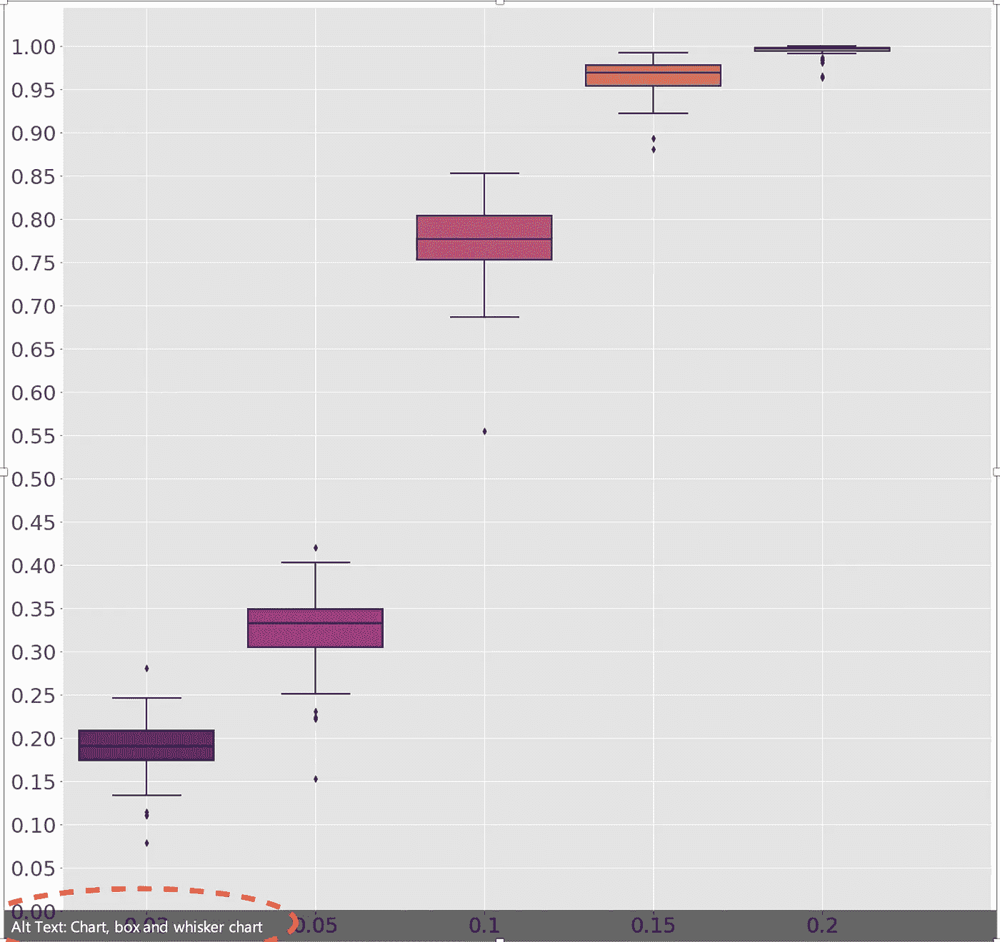
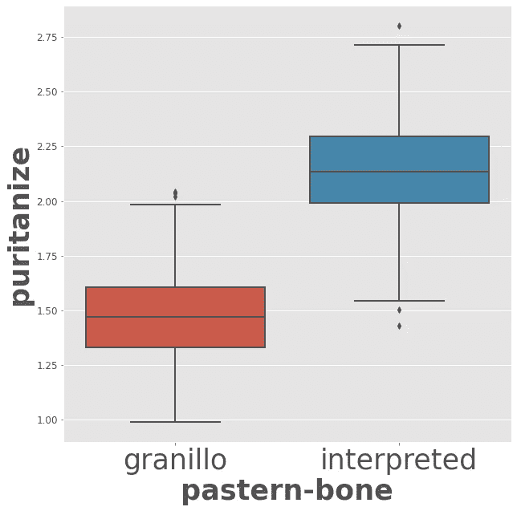

# 使用 Python 探索 Microsoft PowerPoint AI

> 原文：<https://towardsdatascience.com/exploring-powerpoint-ai-using-python-75f94d55f8f4>

塔达斯·萨尔在 [Unsplash](https://unsplash.com/s/photos/microsoft?utm_source=unsplash&utm_medium=referral&utm_content=creditCopyText) 上拍摄的照片

# 使用 Python 探索 Microsoft PowerPoint AI

## 以下是如何使用机器学习和 Python 复制 PowerPoint 人工智能

几天前，我在为我的博士研究做一个 PowerPoint 演示时，发生了这样的事情:

我做的截图。**见 ALT 文字！**

这不是完全相同的图像，它实际上更加明确，有 x 标签，y 标签，标题和所有这些，但它现在并不真正重要。

非常有意思的是 **Alt 文本**。PowerPoint 的人工智能系统不仅能够检测到我们实际上有一个 2d 绘图(或图表)，而且它还能识别出我们正在谈论一个**箱线图！**

当然，我并不确切知道他们是如何做到这一点的，但由于我一生都在与机器学习和数据科学打交道，我可以试着猜测一下。读者可能知道，广泛用于图像分类的技术被称为**卷积神经网络(CNN)。**

他们可能使用 CNN 作为多类分类器。这里是一个 Butterly 图像分类器的[例子](kaggle.com/gpiosenka/butterfly-images40-species)(超过 70 个种类/类)。他们可能做过的一件更复杂的事情是[**图像字幕**](https://arxiv.org/abs/1905.08110) 。尽管如此，**细胞神经网络肯定会用在他们的深度学习算法中，**至少是作为更大更复杂的东西的基本砖块。

在这个非常小的例子中，我将展示如何建立一个机器学习模型，帮助您区分**箱线图**和其他类型的图，例如**线图。**

我们开始吧。

# 0.图书馆

这些是我用于此笔记本的库:

简而言之，我使用了 **keras、matplotlib** 和一个被称为 **RandomWords** 的奇怪的库来生成随机的英语单词。我用它来组成 x 轴和 y 轴。

# 1.数据生成

这款笔记本最有趣的部分其实是**数据生成。**我试图尽可能以最通用的方式构建线图和箱线图，组成 **x 和 y 标签**，创建**不同的线图**和**箱线图**，同样，尽可能以最通用的方式。

通过这种设置，你可以虚拟地创建无限数量和种类的地块。我创建了两个数据类并执行了二进制分类，但是您可以稍微修改代码并创建多个类。

让我们开始吧:

## 1.1 线形图

我用来创建**线**图的代码如下:

它有不同程度的随机性:

*   **x 轴标签和 y 轴标签**有随机名称
*   **x 轴极限**是随机的
*   y 轴显示具有随机数**度**和随机值**系数**的多项式
*   **行数**也是随机的

这里有一个例子:

## 1.2 箱线图

我用来创建**框**图的代码如下:

这里也有不同程度的随机:

*   **x 轴标签和 y 轴标签**具有随机名称
*   **x 轴限位**是随机的
*   **x 轴数量名称**是随机的
*   y 轴显示来自高斯分布的样本，随机值为**标准差**
*   箱线图的**数量也是随机的**

## **1.2 训练集和测试集**

实际上，我用来构建训练集和测试集的代码与上面的代码略有不同，上面的代码是我用来展示结果的。以下是你需要的:

**在这里你可以创建情节:**

在这里你创建 k 个并存储它们。首先创建一个训练集和测试集文件夹，否则它将不起作用！

**在这里你可以阅读它们，并给它们贴上标签**

定义此函数后，您将通过以下操作获得数据集:

以下是训练集的一些**示例**:

必须对测试集进行完全相同的处理，并且必须将字符串转换成对 ML 模型更可读的东西( **sklearn** 将通过所谓的 LabelEncoder 特性为您完成这项工作):

## 2.机器学习模型

我们要使用的机器学习模型基本上是不同的**卷积层**和一些**最大池**操作的应用，然后它会以 **softmax** 结束，它会告诉你图像属于第一类的概率。

我使用的模型与我发表的这篇 [**文章**](/convolutional-neural-networks-for-binary-classification-of-solar-flares-b97de0852037) 中的模型相同，你可以找到关于这个结构实际上如何工作的更多细节。

以下是你如何训练和测试你的模型:

正如我们所见，**的最终结果是完美的**。即使这听起来令人兴奋，我不得不说**这个实验非常简单**(我们都能够区分方框图和线条图)**这个模型非常强大**(这里有点矫枉过正)。

## 3.决赛成绩

作为对模型正确地区分**箱线图**和**线图**的最后证明，下面是一些例子:

**以下是情节:**

## 4.结论

当我还是个孩子的时候，我就开始使用 PowerPoint，并且在高中的时候做了我的第一次演示。我真的可以看到这个产品在这些年中的改进，我发现他们的**人工智能识别模型**真的令人印象深刻。

这个笔记本只是一个非常简单的实验，关于深度学习算法如何帮助你检测图片中的内容，并使用一些(在这种情况下，非常基本的)图像分类技术。

如果你喜欢这篇文章，你想知道更多关于机器学习的知识，或者你只是想问我一些你可以问的问题:

A.在 [**Linkedin**](https://www.linkedin.com/in/pieropaialunga/) 上关注我，在那里我发布我所有的故事
B .订阅我的 [**简讯**](https://piero-paialunga.medium.com/subscribe) 。这会让你了解新的故事，并给你机会发短信给我，让我收到你所有的更正或疑问。
C .成为 [**推荐会员**](https://piero-paialunga.medium.com/membership) ，这样你就不会有任何“本月最大故事数”，你可以阅读我(以及数千名其他机器学习和数据科学顶级作家)写的任何关于最新可用技术的文章。再见:)