# 探索 SageMaker 画布

> 原文：<https://towardsdatascience.com/exploring-sagemaker-canvas-8df0a90b977e>

## 无代码机器学习

图片来自[桑迪·克拉克](https://unsplash.com/@honeypoppet)拍摄的 [Unsplash](https://unsplash.com/photos/0JPMHlHKos0)

构建机器学习模型需要知识、经验和大量时间。有时，不同的角色，比如业务分析师或其他没有 ML 经验的技术专家，可能有他们想要解决的 ML 用例，但是缺乏这样做的专业知识。即使是有 ML 经验的 ML 工程师和数据科学家也可能希望快速建立一个模型。

这就把我们带到了[汽车](https://www.automl.org/automl/)的领域。如今，我们看到了大量的 AutoML 解决方案，从开源 API 到面向自动化 ML 空间的个人服务/平台。 [SageMaker Canvas](https://aws.amazon.com/sagemaker/canvas/) 完全**从 ML** 中移除了代码方面，您将在本文中看到。一切都是从**可视界面**完成的，我们将在本文中探索一个如何使用 Canvas 的基本示例。

## 画布支持什么？

目前，Canvas 支持以下**数据类型** : **分类、数值、文本**和**日期时间**。这意味着您可以主要在**表格**和**时间序列**域内工作，对于您的 ML 用例，目前不支持计算机视觉/图像数据。

这里的另一个要点是，唯一支持的文件格式是 **csv** 。您的 csv 文件必须来自以下**外部数据源** : **S3 桶**、**红移数据库**和**雪花**。您还可以允许您的用户将本地文件[直接上传到 Canvas。对于这个例子，我们将使用我们已经上传到](https://docs.aws.amazon.com/sagemaker/latest/dg/canvas-set-up-local-upload.html) [S3 桶](https://docs.aws.amazon.com/AmazonS3/latest/userguide/UsingBucket.html)的数据集。

## SageMaker 画布示例

要设置 SageMaker Canvas，您需要创建一个 [SageMaker 域](https://docs.aws.amazon.com/sagemaker/latest/dg/gs-studio-onboard.html)。这和与 [SageMaker 工作室](https://aws.amazon.com/sagemaker/studio/)合作的过程是一样的。最简单的入职方式是使用快速设置，您可以在下面的[文档](https://docs.aws.amazon.com/sagemaker/latest/dg/onboard-quick-start.html)中找到。

设置完成后，您应该会看到刚刚创建的用户。点击“启动应用程序”,将会打开一个画布选项。

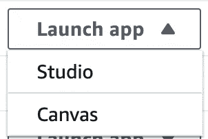

画布选项(作者截图)

这个应用程序应该在几分钟内启动，您将能够看到用户界面。

画布 UI(作者截图)

现在我们可以开始我们的示例画布工作了。对于这个例子，我们将采用流行的[虹膜数据集](https://archive.ics.uci.edu/ml/datasets/iris)。请注意，您可能需要一个**大版本的** this **dataset** ，因为使用 Canvas 的标准构建需要 **500 行**和至少**2 列**。

单击数据集图标，您可以访问 S3，在那里您已将数据集上传到一个桶中。

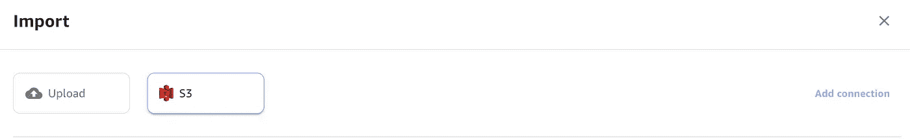

上传数据集(作者截图)

上传数据集后，您应该能够在数据集选项卡中看到它。Canvas 的一个很大的特点就是你可以**上传多个数据集**进行建模。Canvas 支持不同的 SQL [join 语句](https://docs.aws.amazon.com/sagemaker/latest/dg/canvas-joining-data.html)，无需编写任何实际的 SQL 代码。如果您有该场景的相关用例，请查看文档[这里](https://docs.aws.amazon.com/sagemaker/latest/dg/canvas-joining-data.html)。

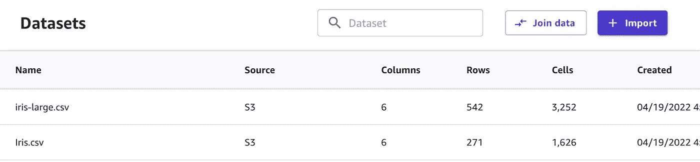

上传的数据集(作者截图)

我们现在将着手建立一个模型。第一步，我将选择我的目标数据集。

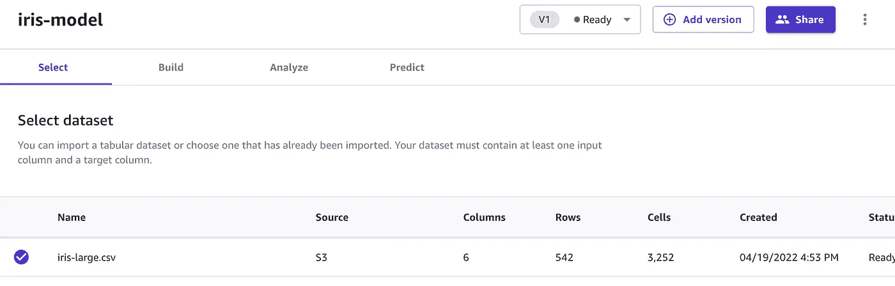

选择数据集(作者截图)

使用这个目标数据集，我们可以转到 Build 选项卡。在这里，我们可以查看不同的自动化可视化/EDA。我们可以看到不同的统计数据，如**缺失数据**、**唯一值**和**特性重要性**，这些通常需要 pandas、sklearn 或不同的包代码来分析。

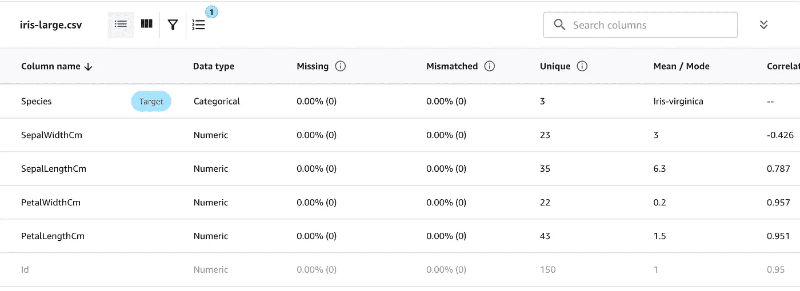

自动化分析(作者截图)

在这里，我们还可以**删除与我们的模型不一定相关的列**，比如 ID 列。这反映在将用于烘焙模型的模型配方中。

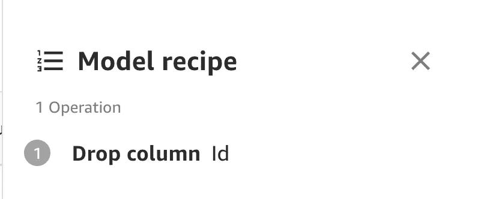

降栏(作者截图)

我们还可以得到特征值分布的图形表示。

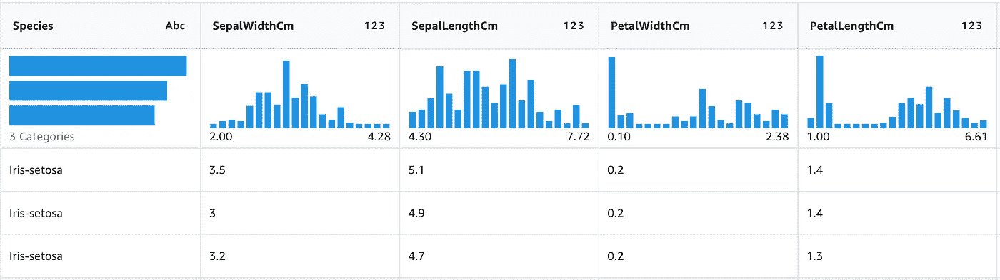

数据分布(作者截图)

最后，我们还可以过滤数据集。假设我们想要查看特定列中高于某个阈值的所有值。我们可以通过在 filter 选项卡中输入我们的值来进行调整。

过滤值(作者截图)

现在，我们已经花时间了解了我们的数据，我们可以单击“模型构建”。这里有两个选项:**快速建造**和**标准建造**。快速构建需要**2-15 分钟**，这将尽可能快地迭代给你一个现成的模型。标准构建将花费几个小时，但是范围要大得多。它还为您提供了不同型号、度量分数和培训工作等信息。因为我们想要更大的可见性，我们将继续进行标准构建，一旦完成，您的屏幕应该如下所示。

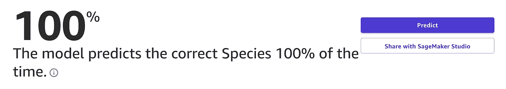

标准构建完成(作者截图)

如果我们点击“与 SageMaker Studio 共享”,我们应该能够创建一个 **SageMaker Studio 链接**,我们可以复制并粘贴该链接以获得有关我们画布作业的更多信息。

在这里，我们可以看到我们使用的最佳模型和输入数据集。

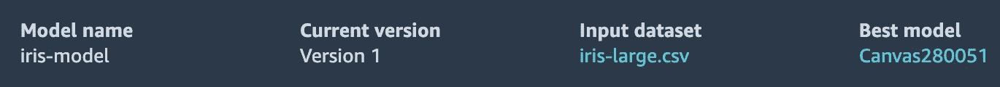

工作室链接(作者截图)

如果我们单击输入数据集旁边的 AutoML Job，我们可以看到 Canvas 在幕后使用的所有**模型**的**列表。**

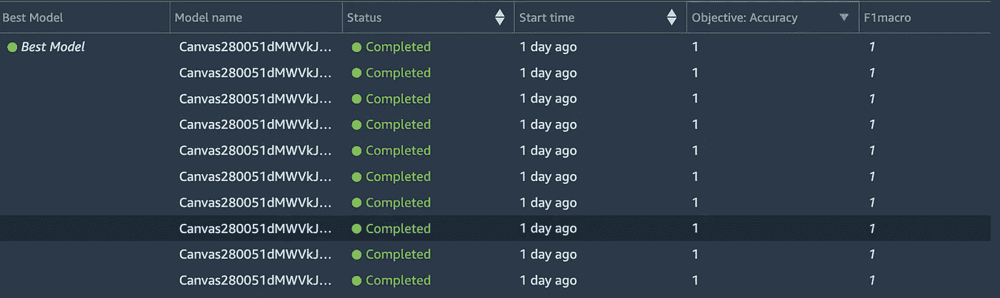

模型画布训练(作者截图)

如果我们单击我们的最佳模型，我们可以看到不同的参数，如使用的算法/模型。

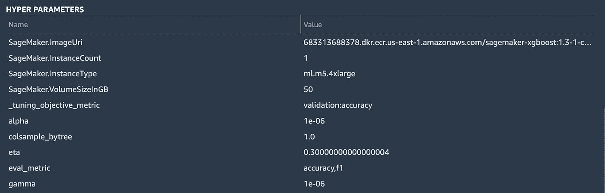

用于最佳模型的算法(作者截图)

我们可以看到，数据集的最佳算法是 [SageMaker XGBoost 算法](https://aws.plainenglish.io/end-to-end-example-of-sagemaker-xgboost-eb9eae8a5207)。我们还可以进一步了解模型最适用的不同超参数。

我们还得到了一个 Performance 选项卡，其中包含我们的分类问题的度量和混淆矩阵。

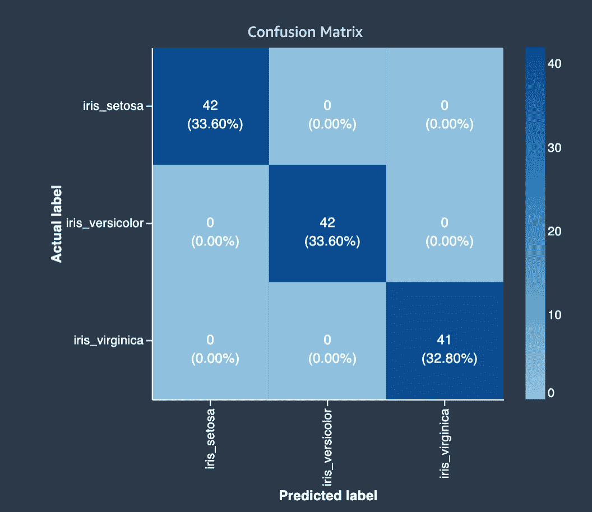

困惑矩阵(作者截图)

如果我们想要完全的可见性，我们可以看看 Studio 链接中的**工件**选项卡。这提供了诸如**特征工程脚本**和**模型数据文件**的资源，如果你感兴趣的话，你可以自己打开并使用它们。

如果我们返回到 SageMaker Canvas UI，我们可以使用**批量推断**或**单个数据点**来执行**预测**。

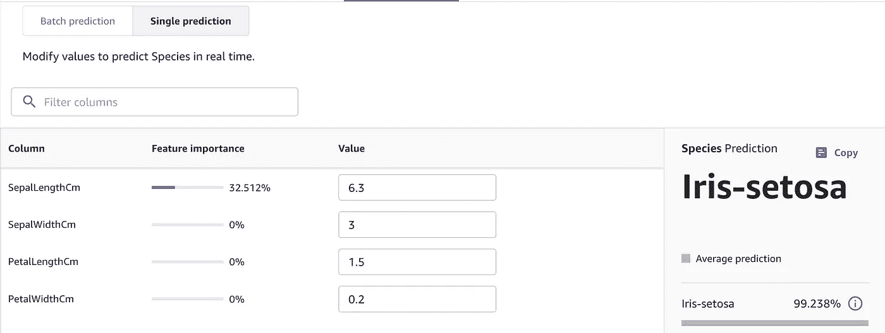

单项预测(作者截图)

## 其他资源和结论

如果你想在 ML 中完全删除图片中的代码，SageMaker Canvas 是一个很好的起点。我很高兴看到这项服务带来的未来功能，因为它将作为一个新的发布继续扩展。同时，查看画布上的官方 AWS 博客了解更多信息。如果您对 SageMaker 更灵活的 AutoML 选项感兴趣，请查看 [SageMaker JumpStart](https://awstip.com/automl-beyond-with-sagemaker-jumpstart-9962ffc4bcd1) 。

我希望这篇文章是 SageMaker Canvas 的良好入门。请随意留下任何反馈，并查看我在以下[列表](https://ram-vegiraju.medium.com/list/aws-42b81fcfe143)中的其他 SageMaker/AWS 文章。

*如果你喜欢这篇文章，请在*[*LinkedIn*](https://www.linkedin.com/in/ram-vegiraju-81272b162/)*上与我联系，并订阅我的媒体* [*简讯*](https://ram-vegiraju.medium.com/subscribe) *。如果你是新手，使用我的* [*会员推荐*](https://ram-vegiraju.medium.com/membership) *报名。*