# 使用 DAX 函数探索过滤器上下文

> 原文：<https://towardsdatascience.com/exploring-the-filter-context-with-dax-functions-422211c1118e>

## 在查看当前过滤器上下文时，您可以在 DAX 中找到几个有用的函数。以下是这些功能的一些例子


照片由[冉贝尔科维奇](https://unsplash.com/@berko?utm_source=medium&utm_medium=referral)在 [Unsplash](https://unsplash.com?utm_source=medium&utm_medium=referral)

# 我们将研究哪些 DAX 函数？

有几个 DAX 函数可以查看当前的过滤器上下文。

在本文中，我们将研究以下函数(按字母顺序排列):

*   全部选定
*   过滤
*   HASONEFILTER
*   HASONEVALUE
*   ISCROSSFILTERED
*   被过滤
*   ISINSCOPE
*   选定值

我将提供一个链接，链接到 DAX Guide 上的相应文章，以及关于如何使用它们以及它们如何相互比较的每个函数的例子。

# 什么是过滤器上下文？

如果你已经知道过滤器的内容，请跳到下一章。

一句话:

*过滤器上下文是影响计算结果的所有过滤器的总和*

在下图中，您可以看到标记单元格上的筛选器上下文由以下值组成:

*   制造商= Contoso 有限公司和 Fabrikam 公司
*   国家=美国
*   年份= 2008 年
*   类别=计算机
*   月份=六月

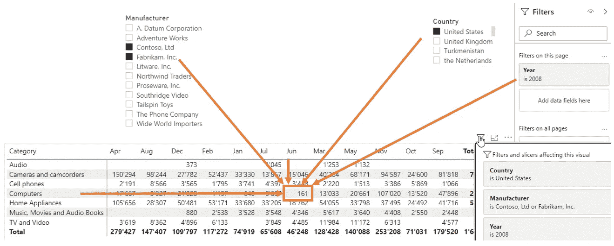

图 1 —过滤上下文(作者提供的图片)

在浏览过滤器上下文时，您希望检查过滤器是否存在，以及过滤器在一列上的内容是什么。

这就是这里提到的函数的用途。

# 基本查询

对于本文，我将在 Contoso 数据模型上使用以下 DAX-Query:

```
DEFINE
 VAR FilterTable = 
      TREATAS({2008}, ‘Date’[Year])

EVALUATE
  CALCULATETABLE(
    FILTER(
      ADDCOLUMNS(
         SUMMARIZECOLUMNS(‘Geography’[Region Country]
                          ,’Geography’[City]
                          ,’Store’[Store])
                          ,”Online Sales (By Order Date)”
                                ,[Online Sales (By Order Date)]
                  )
              ,NOT ISBLANK([Online Sales (By Order Date)])
            )
            ,FilterTable
          )

ORDER BY
 ‘Geography’[Region Country],
 ‘Geography’[City],
 ‘Store’[Store]
```

下图显示了 DAX Studio 中该查询的结果:

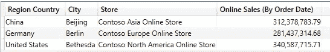

图 2 —基本查询的结果(作者提供的图)

# 全部选定

[ALLSELECTED()](https://dax.guide/allselected/) 用于获取列中所有值的列表，同时考虑所有外部过滤器，但不考虑查询中现有的过滤器。

现在，我向基本查询添加两个度量:

```
[CountOfCountries] = COUNTROWS(
                          ALLSELECTED(
                                ‘Geography’[Region Country]
                                )
                             )
```

和

```
[CountOfYears] = COUNTROWS(ALLSELECTED(‘Date’[Year]))
```

通过这两个度量，我可以计算 ALLSELECTED()为每一列返回多少行。

请记住:

*   结果中的每一行都有一个国家
*   使用 FilterTable 变量过滤年份

下面是修改后的查询(ORDER BY 被省略):

```
DEFINE
 MEASURE ‘All Measures’[CountOfCountries] =
                        COUNTROWS(
                            ALLSELECTED(
                                  ‘Geography’[Region Country]
                                  )
                                )

 MEASURE ‘All Measures’[CountOfYears] =
                       COUNTROWS(ALLSELECTED(‘Date’[Year]))

 VAR FilterTable = 
    TREATAS({2008}, ‘Date’[Year])

EVALUATE
  CALCULATETABLE(
    FILTER(
      ADDCOLUMNS(
         SUMMARIZECOLUMNS(‘Geography’[Region Country]
                          ,’Geography’[City]
                          ,’Store’[Store]
                      )
                      ,”Online Sales (By Order Date)”
                          ,[Online Sales (By Order Date)]
                      ,”CountOfCountries”
                          ,[CountOfCountries]
                      ,”CountOfYears”
                          ,[CountOfYears]
                    )
               ,NOT ISBLANK([Online Sales (By Order Date)]
               )
           )
           ,FilterTable
)
```

该查询返回以下结果:

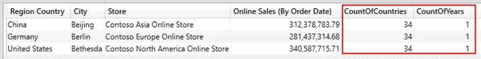

图 ALLSELECTED()的查询结果(作者提供的图)

为什么我们会看到这样的结果？

该查询选择一年，每行只有一个国家。

这个问题的关键是在线[文档](docs.microsoft.com/en-us/dax/allselected-function-dax)中的这句话:

ALLSELECTED()从当前查询的列和行中删除上下文过滤器，同时保留所有其他上下文过滤器或显式过滤器。

因此，ALLSELECTED()返回 34 个国家，认为 Region Country 列上的实际筛选上下文是内部的。但是查询只返回一年，因为这一年的筛选器被视为“外部”筛选器。

让我们尝试一些不同的东西。

请看下面的查询:

```
DEFINE
 MEASURE ‘All Measures’[CountOfCountries] =
                        COUNTROWS(
                           ALLSELECTED(‘Geography’[Region Country]
                           )
                         )

 MEASURE ‘All Measures’[CountOfYears] =
                        COUNTROWS(ALLSELECTED(‘Date’[Year]))

 VAR FilterTable =
          TREATAS({2008}, ‘Date’[Year])

EVALUATE
  FILTER(
    ADDCOLUMNS(
       CALCULATETABLE(
                  SUMMARIZECOLUMNS(‘Geography’[Region Country]
                                   ,’Geography’[City]
                                   ,’Store’[Store]
                                   )
                       ,FilterTable
                   )
                   ,”Online Sales (By Order Date)”
                         ,[Online Sales (By Order Date)]
                   ,”CountOfCountries”
                         ,[CountOfCountries]
                   ,”CountOfYears”
                         ,[CountOfYears]
                  )
        ,NOT ISBLANK([Online Sales (By Order Date)])
        )
```

现在，我更改了将年份过滤器添加到 [CALCULATETABLE()](https://dax.guide/calculatetable/) 中的过滤器上下文的顺序，用 [FILTER()](https://dax.guide/filter/) 括起来。

现在看看结果:

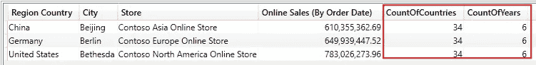

图 4 —用 ALLSELECTED()进行第二次查询的结果(图由作者提供)

为什么我们现在看到的是六年而不是一年？

我们必须看这两个度量在哪里被评估。

两者都在 CALCULATETABLE()函数中进行计算。

因此，ALLSELECTED()将由 CALCULATETABLE()注入的筛选器视为内部筛选器并将其移除。因此，CountOfYears 度量值返回 6。

当使用 ALLSELECTED()时，我们必须了解这个函数是如何工作的，以及它是如何操作过滤器上下文来返回结果的。

# 过滤

[FILTERS()](https://dax.guide/filters/) 函数返回一个表，其中包含当前过滤器上下文中指定列的过滤值。

我在基本查询中添加了一个新的度量[过滤的国家]:

```
DEFINE
 MEASURE ‘All Measures’[Filtered Country] =
                      FILTERS(‘Geography’[Region Country])— Parts omitted —EVALUATE
 CALCULATETABLE(
     FILTER(
         ADDCOLUMNS(
             SUMMARIZECOLUMNS(‘Geography’[Region Country]
                              ,’Geography’[City]
                              ,’Store’[Store])
                              ,”Online Sales (By Order Date)”
                                    ,[Online Sales (By Order Date)]
                              ,”Filtered Country”
                                    ,[Filtered Country]
                              )
                      ,NOT ISBLANK([Online Sales (By Order Date)]
                     )
             )
             ,FilterTable
             )
```

以下是查询的结果:

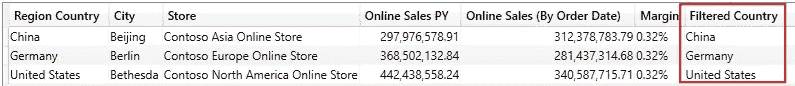

图 5 —使用过滤器()的查询结果(由作者提供)

现在，让我们看看在查询中添加以下度量时会发生什么:

```
[Filtered Months] = FILTERS(‘Date’[EnglishMonthName])
```

在这种情况下，我们会收到一条错误消息，指出在需要单个值的地方提供了一个包含多个值的表。

为什么？

因为我们只从日期表中筛选年，所以筛选器检测 12 个月，按年筛选。出于这个原因，我们从 FILTERS()中得到一个有 12 行的表。

当我们将测量值更改为以下值时:

```
MEASURE ‘All Measures’[Filtered Months] =
   CONCATENATEX(
          FILTERS(‘Date’[EnglishMonthName])
          , ‘Date’[EnglishMonthName]
          , ”, “
          )
```

我们得到所有过滤月份的列表:

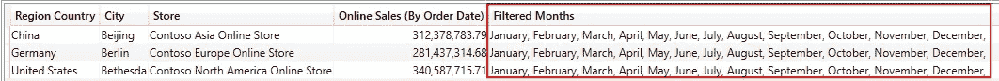

图 6 —使用过滤器()的第二个查询的结果(由作者提供)

FILTERS()函数比 ALLSELECTED()简单得多，因为它使用当前的过滤器上下文，我们不必考虑内部和外部过滤器。

# HASONEFILTER

[HASONEFILTER()](https://dax.guide/hasonefilter/) 函数只返回 TRUE 或 FALSE。

只要当前筛选器上下文只为一列返回一个筛选器，该函数就返回 TRUE。

让我们更改带有过滤器()的示例中的度量，以检查它是如何工作的:

```
MEASURE ‘All Measures’[Filtered Country] =
   HASONEFILTER(‘Geography’[Region Country])

MEASURE ‘All Measures’[Filtered Months] =
   HASONEFILTER(‘Date’[EnglishMonthName])
```

您可以在下图中看到这两种测量的结果:

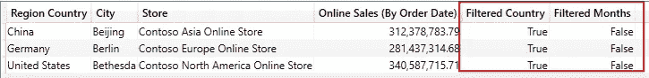

图 7 —使用 HASONEFILTER()查询的结果(作者提供的图)

虽然列“Geography”[Region Country]在实际的筛选器上下文中只有一个筛选器，但 HASONEFILTER()返回 TRUE。但是，由于列“Date”[EnglishMonthName]在查询时不包含过滤器，因此结果为 FALSE。

让我们看另一个例子:

我将该年的筛选器更改为以下内容:

```
VAR FilterTable = 
 TREATAS({2007, 2008}, ‘Date’[Year])
```

并在 Year 列上添加一个带有 HASONEFILTER()的度量值。

结果看起来像这样:

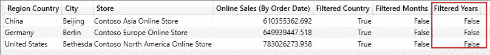

图 8 —使用 HASONEFILTER 进行第二次查询的结果(作者提供的图)

由于我们在 year 列上引入了第二个过滤器，HASONEFILTER()返回 FALSE。

# HASONEVALUE

当我们用 HASONEVALUE()替换 HASONEFILTER()时，会得到相同的结果。但是功能不同。

当 HASONEFILTER()检查过滤器是否存在时，HASONEVALUE()计算当前过滤器上下文中某一列的可用值。

我写过一篇关于如何使用 HASONEVALUE()的真实场景的文章:

[](/dynamic-time-intelligence-in-dax-made-easy-640b4e531ca8)  

# ISCROSSFILTERED

对我来说， [ISCROSSFILTERED()](https://dax.guide/iscrossfiltered/) 是所有 DAX 函数中不太直观的一个。

如果指定的列或表是直接筛选的、由同一表中的另一列筛选的或由应用于相关表的筛选器筛选的，则 ISCROSSFILTERED()返回 TRUE。

当我们用 ISCROSSFILTERED()替换前面查询中的 HASONEVALUE()时，我们得到以下结果:

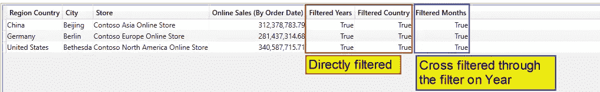

图 9 —用 ISCROSSFILTERED()查询的结果(作者提供的图)

这三个度量值都返回 TRUE。

原因是在查询中直接筛选了“年份”和“地区国家”列。但是“月”列是通过“年”列上的筛选器交叉筛选的。

阿尔贝托·法拉利在 [https://dax.guide](https://dax.guide) 的视频中做了很好的解释。

推荐看视频了解 ISCROSSFILTERED()的工作原理。

# 被过滤

[ISFILTERED()](https://dax.guide/isfiltered/) 函数类似于 ISCROSSFILTERED()函数，但它仅在直接筛选列或表时返回 TRUE。

当我们用 ISFILTERED()替换 ISCROSSFILTERED()时，结果如下:

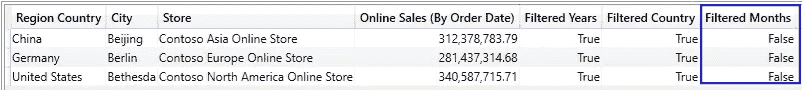

图 10 —使用 ISFILTERED()的查询结果(作者提供的图)

ISCROSSFILTERED()与 ISFILTERED()的区别在于，仅当给定的列或表被直接筛选时，is filtered()才返回 true。

由于 Month 列上没有显式筛选器，ISFILTERED()返回 FALSE。

# ISINSCOPE

您可以使用 [ISINSCOPE()](https://dax.guide/isinscope/) 函数来检查和导航 DAX 中的层次结构，即使 DAX 没有层次结构的概念。

该函数使用一个技巧来确定层次结构在当前过滤器上下文中是否是活动的:

1.该函数检查指定列是否只有一个值

2.然后，它检查另一列中是否存在过滤器

ISINSCOPE()主要与[summary zecolumns()](dax.guide/summarizecolumns/)函数一起工作。

例如，当给定的列由 SUMMARIZECOLUMNS()汇总时，ISINSCOPE()返回 true。

我将基本查询更改为以下查询:

```
DEFINE
 MEASURE ‘All Measures’[ISINSCOPE Country] =
                             ISINSCOPE(‘Geography’[Region Country])

 MEASURE ‘All Measures’[ISINSCOPE City] = 
                             ISINSCOPE(‘Geography’[City])

 MEASURE ‘All Measures’[ISINSCOPE Months] =
                             ISINSCOPE(‘Date’[EnglishMonthName])

 MEASURE ‘All Measures’[ISINSCOPE Years] =
                             ISINSCOPE(‘Date’[Year])

 VAR FilterTable = 
 TREATAS({2008}, ‘Date’[Year])

 EVALUATE
 CALCULATETABLE(
   FILTER(
     ADDCOLUMNS(
       SUMMARIZECOLUMNS(‘Geography’[Region Country]
                        ,’Geography’[City]
                        ,’Store’[Store])
                        ,”Online Sales (By Order Date)”
                                 ,[Online Sales (By Order Date)]
                        ,”ISINSCOPE Years”, [ISINSCOPE Years]
                        ,”ISINSCOPE Months”, [ISINSCOPE Months]
                        ,”ISINSCOPE Country”, [ISINSCOPE Country]
                        ,”ISINSCOPE City”, [ISINSCOPE City]
                        )
                 ,NOT ISBLANK([Online Sales (By Order Date)])
            )
           ,FilterTable
      )
```

该查询的结果如下:

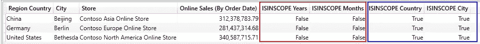

图 11 —用 ISINSCOPE()查询的结果(由作者提供)

因为年份和月份不是按 SUMMARIZECOLUMNS()分组的，所以 ISINSCOPE 返回 FALSE，

而且，由于 Region Country 和 City 是按 SUMMARIZCOLUMN()分组的，因此 ISINSCOPE 对这两列返回 TRUE。

至于 ISCROSSFILTERED()，我推荐看一下 [https://dax.guide](https://dax.guide) 上对 ISINSCOPE()的描述，里面有一个视频，完整的描述了 ISINSCOPE()的工作原理。

# 选定值

我们可以使用 [SELECTEDVALUE()](https://dax.guide/selectedvalue/) 来检查一个列在当前过滤器上下文中是否正好包含一个值，以及我们拥有哪个值。

此外，如果没有值或多个值可见，我们可以传递一个替换值。

SELECTEDVALUE()类似于 HASONEVALUE()。但是 SELECTEDVALUE()返回实际值，而 HASONEVALUE()仅在当前筛选器上下文中只有一个值可见时返回 TRUE。

我复制了用于解释 HASONEVALUE()的查询，并将度量值更改为 SELECTEDVALUE()。我添加文本“_Multiple Values_”作为替换值的第二个参数。

你可以在下图中看到结果:

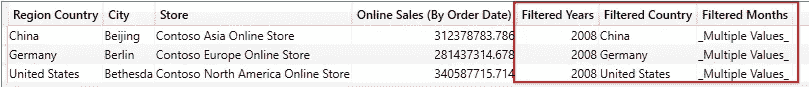

图 12 —带有 SELECTEDVALUE()的查询结果(作者提供的图)

如您所见，Years 和 Region Country 只有一个值，SELECTEDVALUE()返回这个值。

由于我们在当前筛选器上下文中有 12 个月(见上文)，因此该月的 SELECTEDVALUE()返回替换值。

SELECTEDVALUE()非常强大，因为我们可以使用它从切片器甚至从实际查询中获取选定的值，并更改查询的行为。

# 结论

这里显示的所有函数对于导航过滤器上下文和确定其内容都是必不可少的。

如果没有这个函数，我们作为 DAX 开发人员的工作将会更加困难，因为我们将无法对查询中的过滤值做出反应。

在写这篇文章的时候，我学到了很多，因为我没有意识到这些函数的复杂性。

但是我希望这些描述可以帮助你更好地使用 DAX。

感谢阅读。


照片由[龙之介·菊野](https://unsplash.com/@ryunosuke_kikuno?utm_source=medium&utm_medium=referral)在 [Unsplash](https://unsplash.com?utm_source=medium&utm_medium=referral) 上拍摄

# 参考

我使用 Contoso 样本数据集，就像我以前的文章一样。你可以从微软[这里](https://www.microsoft.com/en-us/download/details.aspx?id=18279)免费下载 ContosoRetailDW 数据集。

Contoso 数据可以在 MIT 许可下自由使用，如这里的[所述](https://github.com/microsoft/Power-BI-Embedded-Contoso-Sales-Demo)。

[](https://medium.com/@salvatorecagliari/membership) 