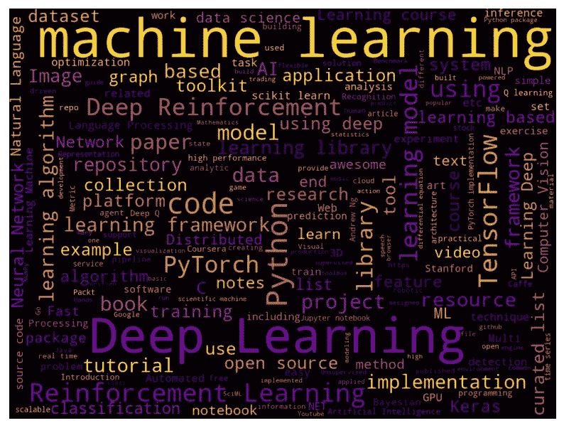
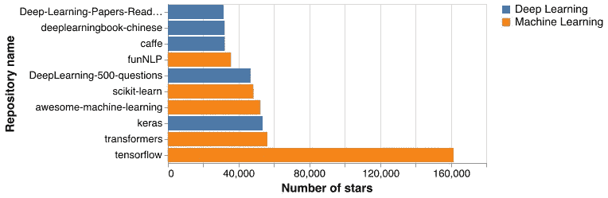
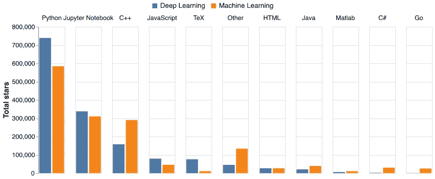
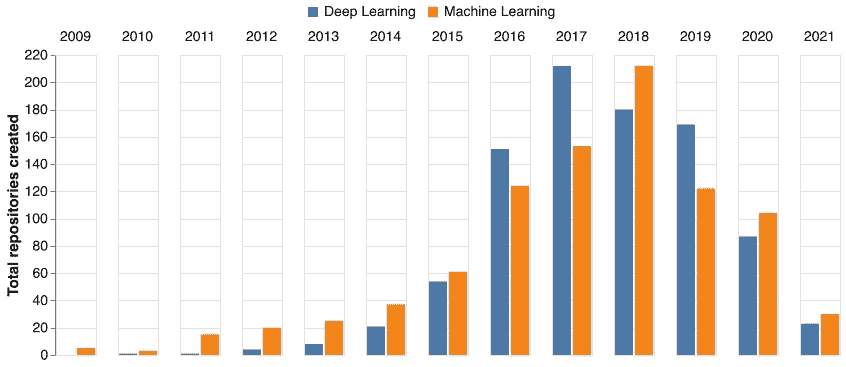
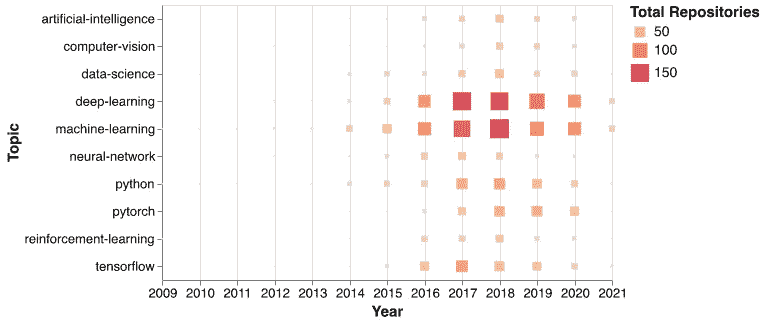
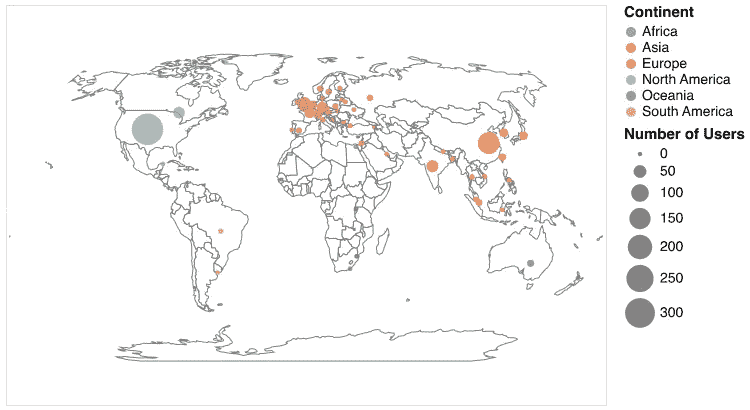
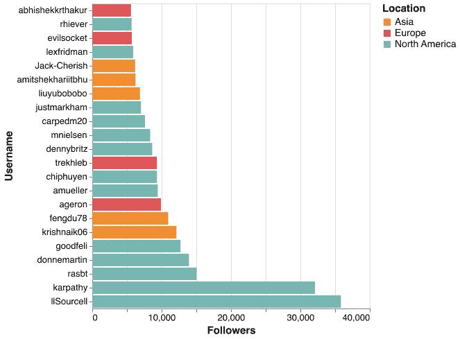
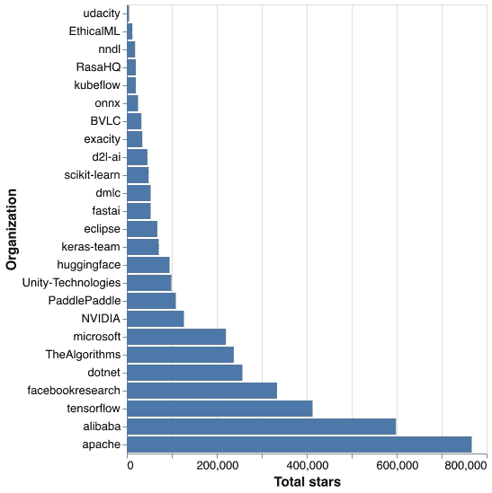
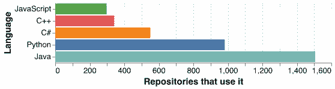
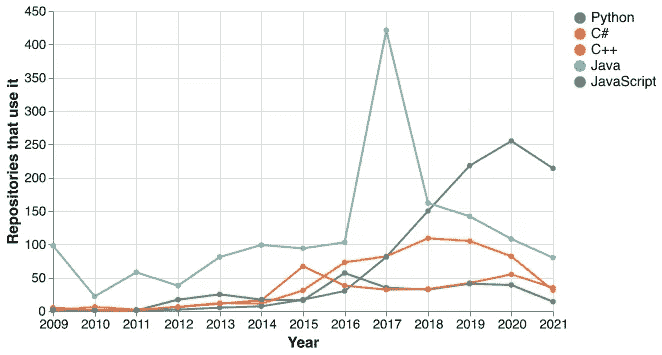

# 探索最流行的机器学习和深度学习 GitHub 库

> 原文：<https://towardsdatascience.com/exploring-the-most-popular-machine-learning-and-deep-learning-github-repositories-90b9ecf12be7>

## [实践教程](https://towardsdatascience.com/tagged/hands-on-tutorials)

# 探索最流行的机器学习和深度学习 GitHub 库

## 收集、分析和可视化数千个与机器学习和深度学习相关的流行 GitHub 存储库的数据

**图 1** :基于最流行的机器学习和深度学习 GitHub 知识库的描述生成的词云。图片作者。

目前，机器学习和深度学习是学术界和工业界广泛关注的两个主题。鉴于 GitHub 非常受欢迎，已经有成千上万的 GitHub 存储库，其中包含源代码、文档和其他与任何一个主题相关的大量项目的有用信息。在这篇文章中，我解释了我如何收集、清理和可视化一些最流行的机器学习和深度学习 GitHub 存储库的数据的过程。我还讨论了与我创建的每个可视化相关的趋势、模式和关键发现。

你可以在我自己的 GitHub 库[这里](https://github.com/nicovandenhooff/top-repo-analysis)找到支持本文的所有源代码。

# 什么是 GitHub？

首先，我将为不熟悉 [GitHub](https://github.com/) 的读者提供一个简要的概述。如果您已经了解 GitHub 和 GitHub 库是如何工作的，请随意跳到本文的下一节。

GitHub 是一个免费的流行工具，许多个人和组织使用它来创建和开发软件。它主要用于在软件开发过程中执行版本控制和问题跟踪。GitHub 还支持开源软件的开发，这是一种带有源代码的软件，任何人都可以检查、修改和增强。

## GitHub 仓库

GitHub 的核心概念是一个 GitHub **库**(有时缩写为“repo”)。可以将存储库视为一个在线文件夹，其中包含与单个项目相关的所有文件。从技术上讲，在存储库中存储任何类型的文件都是可能的，但是您会发现存储在其中的两种最常见的文件类型是:

1.  源代码文件，比如 Python(。py)或者 Java(。java)。
2.  文本文件，如纯文本(。txt)或 Markdown(。md)。

存储库可以是公共的，也可以是私有的。一个*公共存储库*及其内容可以被互联网上的任何人查看，而一个*私有存储库*及其内容只能被拥有它的个人或组织查看。个人或组织都可以拥有存储库。

公共库是强大的，因为它们促进和支持开源软件的开发。具体来说，查看公共存储库的任何人都能够对其中包含的任何文件提出编辑、修复、改进和/或新功能的建议。

GitHub 跟踪每个存储库的元数据和统计数据，例如:

*   从其他 GitHub 用户处收到的**颗星**的数量。当有人“星”一个存储库，他们基本上是把它添加到他们的“收藏夹”列表。
*   存储库被**分叉**的次数。当另一个 GitHub 用户获取原始存储库本身的完整可编辑副本时，就会发生分叉。这个概念类似于复制粘贴存储库中的所有内容供您自己使用。
*   源代码文件中使用的**编程语言**列表。
*   与存储库中的工作相关的**主题**的列表。一些例子是“机器学习”、“神经网络”和“区块链”。
*   由所有者提供的存储库的**描述**。

现在我们知道了 GitHub 是什么，让我们看看我是如何从 GitHub 收集数据的，以及我收集的不同类型的数据。

# 从 GitHub 收集数据

为了从 GitHub 收集数据，我用 Python 创建了一个[编程脚本](https://github.com/nicovandenhooff/top-repo-analysis/blob/main/src/github_scraper.py)。我使用了一个名为 [PyGitHub](https://github.com/PyGithub/PyGithub) 的库来简化我的脚本中的大部分数据收集功能。PyGitHub 是一个通过 [GitHub REST API](https://docs.github.com/en/rest) 提供高效数据访问的包装器。我在下面详细描述了我收集的数据集。

## **1。流行的机器学习和深度学习知识库数据**

我收集的第一类数据是最受欢迎的 GitHub 知识库上的数据，当你在 GitHub 上搜索“机器学习”和“深度学习”时，可以找到这些数据。为了识别最受欢迎的星星，我使用了存储库中的星星数量。换句话说，如果你在 GitHub 上搜索“机器学习”,那么在我的分析中，返回的星级数最高的存储库将被认为是最受欢迎的。

我为每个存储库收集的数据点的一些例子是:存储库名称、描述、创建日期、使用的编程语言、星号数、分叉数和主题。总的来说，我为每个搜索查询收集了前 1，000 个存储库的数据，这样总共收集了 2，000 个存储库的数据。

## 2.存储库所有者数据

我收集的第二类数据是拥有上述 2000 个存储库的个人和组织的数据。我为每个存储库所有者收集的数据点的几个例子是:用户名、简历、用户类型、公司、电子邮件、位置、关注者数量和公共存储库数量。在删除重复之后，我收集数据的唯一存储库所有者的总数是 1，492。

## 3.前 25 名个人和前 25 名组织

接下来，使用我在上面第 2 部分中收集的*用户* *类型*数据点，我将存储库所有者数据分成两部分，由*个人*拥有的存储库和由*组织拥有的存储库。*我随后确定了:

*   前 25 名个人，根据个人拥有的关注者数量。
*   前 25 个组织，就拥有获得最高星级数的前 25 个机器学习或深度学习存储库的组织而言。

然后，对于每一个小组，我收集了他们在 GitHub 上所有公共存储库的可用数据。在这个部分中，我总共收集了大约 8000 个存储库的数据。

我已经创建了一个简短的 [Jupyter 笔记本](https://github.com/nicovandenhooff/top-repo-analysis/blob/main/results/data_summary.ipynb)，它包括一个完整的列表和我为上面的每个数据集收集的数据点的总数。

# 清理数据

我收集的数据是现实生活中的数据，因此远非完美。不完美的几个例子是:

*   缺少或不完整的数据点，例如，只有一些存储库所有者提供了他们的存储库的描述；
*   包含非英语字符和/或不必要的空白的文本数据；和
*   我收集的每个数据集都有重复的元数据。

如果你有兴趣，可以在这里找到我的数据清理脚本[。](https://github.com/nicovandenhooff/top-repo-analysis/blob/main/src/data_cleaning.py)

此外，在我收集的存储库所有者数据集中，包含的数据点之一是*位置。*这个包含一个由所有者输入的值，该值描述了他们在世界上的位置。我使用一个名为 [GeoPy](https://geopy.readthedocs.io/en/stable/) 的 Python 库将这些位置数据进一步解析成详细的地理位置数据(纬度、经度和国家)。

# 分析和可视化数据

清理完数据后，我使用 Python 中的一个名为 [Altair](https://altair-viz.github.io/) 的库创建了几个可视化效果。我将在本文接下来的三个部分中讨论这些可视化。前两个部分着重于比较和对比我在 GitHub 上的搜索查询“机器学习”和“深度学习”中收集的存储库数据。第三部分深入研究了我收集的关于存储库所有者以及前 25 名个人和前 25 名组织的数据。

## 总体上最流行的存储库和编程语言

在这里，我们来看看与机器学习或深度学习相关的 10 大最流行的 GitHub 库，以及用于这些主题的 10 大最流行的编程语言。

**图二。**总体排名前 10 的最受欢迎的存储库，按总星级排序。图片作者。

在图 2 中，我们看到最受欢迎的存储库的明显赢家是拥有超过 160，000 颗恒星的 [tensorflow](https://github.com/tensorflow/tensorflow) 。这个存储库包含机器学习平台 TensorFlow 的源代码，这是一个端到端的系统，包含一个完整的工具生态系统，通常用于构建机器学习应用程序。

此外，我们看到图 2 中包括 5 个机器学习和 5 个深度学习知识库。这表明这两个主题都有在 GitHub 上获得高星级的存储库。

图 2 中其他一些值得注意的存储库是:

*   [scikit-learn](https://github.com/scikit-learn/scikit-learn) :最流行的 Python 机器学习包。
*   [keras](https://github.com/keras-team/keras) :构建在 TensorFlow 之上的 Python 深度学习包。
*   awesome-machine-learning :一个包含有用的机器学习框架、库和软件列表的存储库。

**图 3** :总体排名前十的最受欢迎的编程语言，按总星级排序。图片作者。

每个 GitHub 存储库都包含一个在它所包含的源代码文件中使用的编程语言列表。上面的图 3 展示了我收集数据的存储库中使用的最流行的编程语言，按照与每种语言相关的存储库获得的星级总数。

毫不奇怪，Python 是与存储库相关联的编程语言，在这两个主题上都赢得了最多的关注。Jupyter 笔记本位居第二。值得注意的是，Jupyter Notebook 在技术上并不是一种编程语言本身，而是一种基于 web 的交互式计算平台，最常用于数据科学家。然而，GitHub 将其标记为编程语言，因此包含在上面的图中。

## 随着时间的推移，查看最流行的存储库

接下来，让我们看看前 1000 个机器学习存储库和前 1000 个深度学习存储库的一些趋势。具体来说，我创建了图表来显示最受欢迎的存储库是何时创建的，以及它们关注的最受欢迎的主题是如何随着时间的推移而变化的。

**图 4** :根据创建日期总结的流行存储库的分布。图片作者。

在上面的图 4 中，我们看到大多数最受欢迎的机器学习和深度学习知识库都是在 2016 年至 2020 年之间创建的。这两个主题的普遍受欢迎程度的增加在图中也非常明显，并由 2009 年至 2017 年创建的存储库数量的急剧增加所证明，在此之前，随着数据接近 2021 年，存储库的数量略有减少。

**图 5** :历年来机器学习和深度学习知识库标签化的热门话题。图片作者。

接下来，GitHub 存储库的所有者可以选择用相关主题标记他们的存储库。例如，本文最后一节讨论的 [keras](https://github.com/keras-team/keras) 存储库的所有者将主题“python”、“数据科学”、“机器学习”、“深度学习”、“tensorflow”和“神经网络”标记到他们的存储库中。

我收集数据的机器学习和深度学习存储库包含数百个不同的主题，它们的所有者给它们贴上了标签。为了总结这些数据，我将重点放在了根据它们被添加到存储库中的总次数排名的前 10 个最受欢迎的主题上。图 5 展示了标记有这些主题的存储库的数量是如何随时间变化的。图中每个方块的大小显示了当年有多少存储库提到了这个主题。我们在图 4 中看到了类似的趋势，从 2009 年到 2013 年创建的少量存储库解释了该图左侧几乎空白的部分。

## 分析流行的机器学习和深度学习知识库的所有者

正如本文前面所讨论的，GitHub 存储库可以归个人或组织所有。在这里，我将深入探讨最流行的机器学习和深度学习库的所有者。

首先，我们将看看拥有顶级机器学习或深度学习知识库的个人位于何处，然后我们将看看最受关注的前 25 名用户。之后，我们将查看拥有最高星级的库和他们使用的最流行的编程语言的前 25 个组织。

**图 6** :拥有流行的机器学习或深度学习知识库，并提供有效位置信息的个人的位置。图片作者。

GitHub 为个人提供了在个人资料中包含位置信息的选项。一些用户选择包含这些信息，而另一些用户选择不包含这些信息。在我从 GitHub 收集的仓库所有者数据中，大约 50%拥有流行的机器学习或深度学习仓库的个人包括有效的位置值(总共大约 1000 个人)。

图 6 显示了所有提供有效位置信息的个人的平均纬度和经度值，按国家分类。我们可以看到有大量的个体位于美国和中国，并且有几个个体分散在欧洲各国。有趣的是，在加拿大，看起来大多数用户来自东海岸，特别是多伦多附近。

**图 7** :关注人数最多的人。图片作者。

接下来，我们来看看关注最多的前 25 名用户以及他们所在的位置。图 7 展示了这些数据。由于前 25 个最受关注的用户中只有 22 个在其个人资料中提供了有效的位置，因此图中只有 22 个数据点。我们可以看到这些人中的大多数来自北美。

图 7 中包括的一些著名人士是:

*   [卡帕西](https://github.com/karpathy):这是安德烈·卡帕西，现任特斯拉人工智能高级总监。
*   [古德费里](https://github.com/goodfeli):这是伊恩·古德费勒，生成对抗网络(GANS)的创始人，现任苹果公司机器学习总监。
*   [ageron](https://github.com/ageron/handson-ml2) :我是 Aurélien Geron，是《用 Scikit-Learn 和 TensorFlow 进行机器学习 [*的作者(如果你想学习应用机器学习和/或应用深度学习，我强烈推荐这本书)。*](https://www.oreilly.com/library/view/hands-on-machine-learning/9781492032632/)
*   [莱克斯弗里德曼](https://github.com/lexfridman):这是莱克斯弗里德曼，流行(也是我最喜欢的)播客[莱克斯弗里德曼播客](https://lexfridman.com/podcast/)的创作者。

**图 8** :从事机器学习或深度学习的最受欢迎的组织，按其所有公共存储库收到的总星级排名。图片作者。

现在，我们将更详细地查看拥有流行的机器学习或深度学习存储库的前 25 家组织。图 8 展示了这些组织在 GitHub 上的所有公共存储库中获得的总星级。正如预期的那样，许多顶级技术公司都包括在这个数字中，如阿帕奇，阿里巴巴，脸书研究，微软和英伟达。图 8 中的许多组织也从事机器学习或深度学习以外的主题，因此他们在所有公共存储库中获得的一些星星将与其他主题相关。

**图 9** :排名前 25 的组织使用的前 5 种编程语言。图片作者。

**图 10** :从 2009 年到 2021 年，排名前 25 位的组织如何使用排名前 5 的编程语言。图片作者。

让我们继续关注这 25 个组织，更详细地了解一下他们使用的编程语言。图 9 展示了他们使用的前 5 种编程语言，按照实现它们的存储库总数的顺序，依次是 Java、Python、C#、C++和 JavaScript。

此外，图 10 展示了这些语言的流行程度是如何随着时间的推移而变化的。我们可以看到从 2015 年到 2020 年 Python 的受欢迎程度急剧增加，这与我们之前在图 4 中观察到的机器学习和深度学习知识库的数量增加直接对应。这是有意义的，因为 Python 已经成为用于机器学习和深度学习任务的最流行的编程语言。

# 总结和最终想法

使用在最流行的机器学习和深度学习 GitHub 仓库及其各自所有者上收集的数据，我们看到:

*   总的前 10 个最受欢迎的存储库包含 5 个与机器学习相关的存储库，以及 5 个与深度学习相关的存储库。
*   这些存储库中使用的最流行的编程语言是 Python。
*   大多数流行的机器学习和深度学习知识库都是在 2016 年至 2020 年之间创建的。
*   个人存储库的大多数所有者位于北美、亚洲或欧洲。
*   从事机器学习或深度学习的最受关注的个人包括技术领域的一些知名人士。
*   从 2009 年到 2021 年，从事机器学习或深度学习的组织越来越多地使用 Python，而其他语言的受欢迎程度略有下降。

分析来自 GitHub 的这些数据是一个有趣的项目，它让我能够使用我的数据收集、数据清理和数据可视化技能。我还喜欢检查几个 GitHub 库，在我完成这个项目时，我收集了关于这些库的更详细的数据。这让我能够为我计划从事的未来机器学习和深度学习项目汲取灵感。

感谢您花时间阅读我的文章。如果你想讨论我的分析，或者任何与机器学习或深度学习有关的事情，请随时联系我。还有，你可以在 LinkedIn 上找到我 [*这里*](https://www.linkedin.com/in/nicovandenhooff/) *。*

# 奖励部分:用几个简单的步骤重新创建这个分析！

在创建支持本文的编程脚本时，我将它们与 GNU Make 脚本相结合，这样任何人只需点击几下鼠标，就可以轻松地重新创建整个数据收集、数据清理和数据可视化过程。如果您想这样做，请遵循我的 [GitHub 存储库](https://github.com/nicovandenhooff/top-repo-analysis)中的自述文件“复制该分析”一节中的说明。

## 参考

[1]维基百科贡献者， [GitHub (2021)](https://en.wikipedia.org/wiki/GitHub) ，维基百科

[2]opensource.com 贡献者，[什么是开源？](https://opensource.com/resources/what-open-source) (2021)，opensource.com