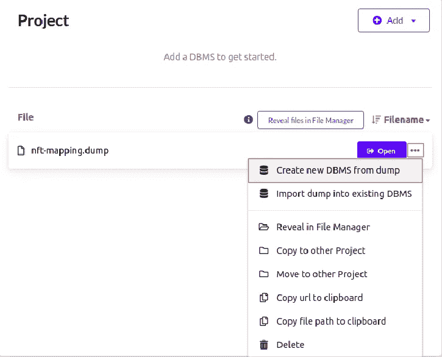
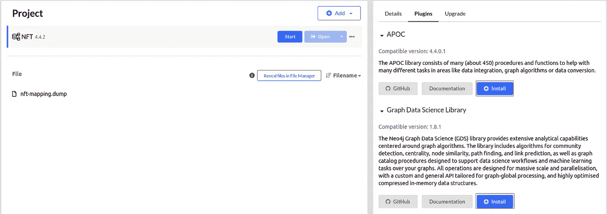
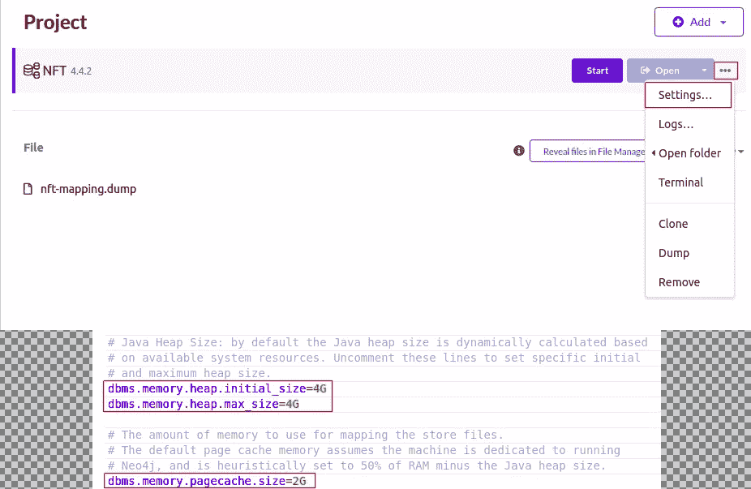
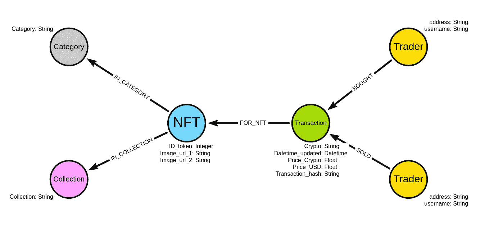
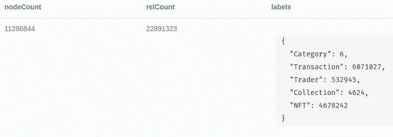
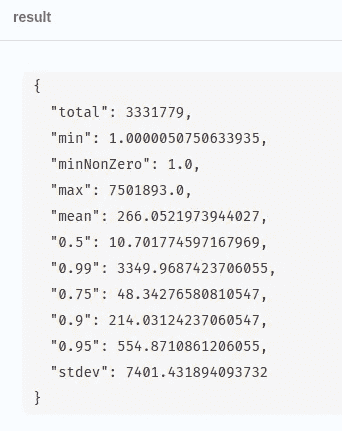
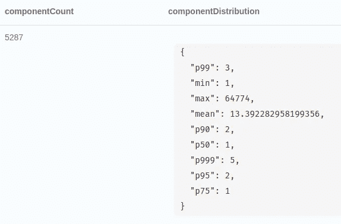
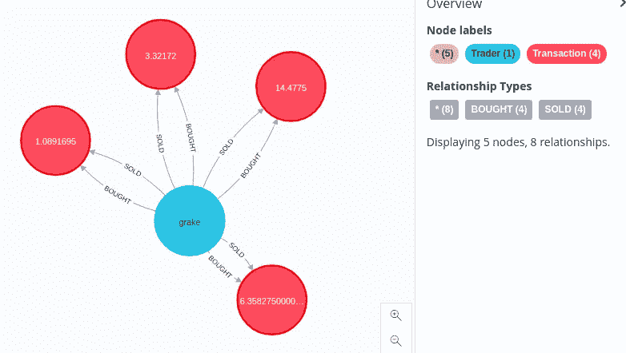
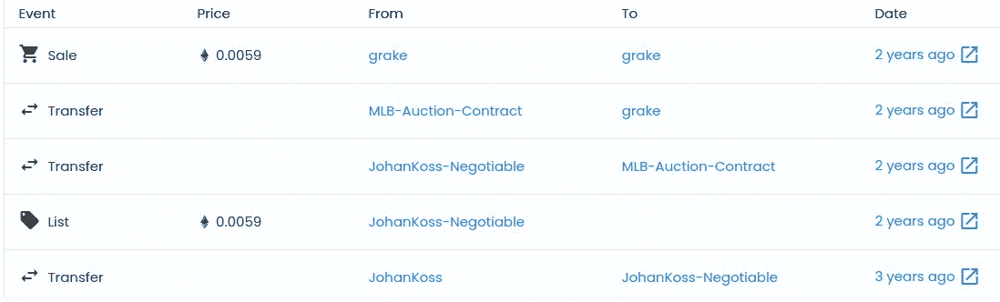

# 用 Neo4j 探索 NFT 交易

> 原文：<https://towardsdatascience.com/exploring-the-nft-transaction-with-neo4j-cba80ead7e0b>

# 用 Neo4j 探索 NFT 交易

## 600 万次 NFT 交易的探索性图形分析

几个月前，《自然》杂志发表了一篇[文章](https://www.nature.com/articles/s41598-021-00053-8#MOESM1)，绘制了 2017 年 6 月至 2021 年 4 月间主要从以太坊和区块链蜡像馆获得的 610 万笔交易。这是一篇激动人心的文章，分析了市场的统计属性以及一些网络特征。作者还在 CC-BY 4.0 许可下提供了底层 NFT 事务数据集的[。](https://osf.io/wsnzr/?view_only=319a53cf1bf542bbbe538aba37916537)

交易可以被描述为交易者之间的联系，那么还有什么比图形更好的方式来表示数据呢？首先，[迈克尔·亨格](https://medium.com/u/3865848842f9?source=post_page-----cba80ead7e0b--------------------------------)和我将数据集导入到 [Neo4j](https://neo4j.com/) ，一个本地图形数据库。然后，我执行了一个简单的探索性图形分析，以更好地理解底层数据集，我将在这篇博文中演示。

## 设置环境

首先你需要下载并安装 [Neo4j 桌面应用](https://neo4j.com/download/)。数据集以数据库转储的形式提供，您可以通过[点击此链接](https://drive.google.com/file/d/1IYhD9zjM46LIVsYNU_Fo3_a6sVr3_pXH/view?usp=sharing)下载。您需要将文件复制到 Neo4j 桌面文件文件夹，然后选择**从转储创建新的 DBMS**。



从转储创建新 DMBS。图片由作者提供。

建议选择最新版本的 Neo4j 数据库。接下来，你还需要安装 **APOC** 和 **GDS** 库。



安装 GDS 和 APOC 库。图片由作者提供。

由于这是一个稍大的数据集，因此还建议增加堆和页面缓存内存分配。我选择 4GB 内存用于堆分配，2GB 用于页面缓存。



增加内存分配。图片由作者提供。

恭喜你，你已经成功准备好了 Neo4j 环境。

## 图形模式模型



NFT 事务的图形模式模型。图片由作者提供。

该数据集围绕着交易者之间的交易。每笔交易都有一个日期和价格加密和美元。由于这是一个 NFT 交易的数据集，所以每笔交易都描述了出售了哪个 NFT。有趣的是，大多数 NFT 都有一个图片 URL，这样你就可以检查互联网上出售的图片。一些 NFT 有多达四个图像 URL 用于冗余。我们还知道一幅 NFT 作品是否属于某个系列，以及它属于哪个类别。

## 探索性图形分析

现在我们可以从探索性的图形分析开始。和往常一样，我准备了一个 [Jupyter 笔记本](https://github.com/tomasonjo/blogs/blob/master/nft/NFT%20analysis.ipynb)，里面包含了本帖中的所有问题。

首先，我们将使用`apoc.meta.stats`过程评估节点的数量和关系。

```
CALL apoc.meta.stats
YIELD nodeCount, relCount, labels
```

*结果*



apoc.meta.stats 程序的结果。图片由作者提供。

图中大约有 1100 万个节点和 2300 万个关系。数据集包含大约 460 万个 NFT 的 600 万个事务。NFT 是 4600 个集合和 6 个类别的一部分。

现在，我们将更深入地挖掘，并开始检查每年的交易计数、总交易量和非金融资产的平均价格。

```
MATCH (t:Transaction)
RETURN t.Datetime_updated.year AS year, 
       count(*) AS transactions, 
       sum(t.Price_USD) AS totalVolume, 
       avg(t.Price_USD) AS averagePrice
ORDER BY year
```

*结果*

2018 年，只有 45 万笔交易，而在 2021 年，截至 4 月份，有近 350 万笔交易。多年来，平均价格和总量在 2021 年的前四个月已经上升到近 7.5 亿美元。NFT 世界确实出现了繁荣。

接下来，我们将评估有多少交易的价格低于或高于一美元。

```
MATCH (t:Transaction)
WHERE exists(t.Price_USD)
RETURN CASE WHEN t.Price_USD > 1 THEN true ELSE false END AS moreThanDollar, count(*) AS count
```

大约 55%的交易价格超过 1 美元。还剩下大约 270 万笔低于 1 美元的交易。似乎大额交易并不频繁，所以当一些交易发生时，就会成为新闻。让我们用`apoc.agg.statistics`过程来检查超过一美元的交易的分布。

```
MATCH (t:Transaction)
WHERE exists(t.Price_USD) AND t.Price_USD > 1
RETURN apoc.agg.statistics(t.Price_USD) AS result
```

*结果*



一元以上 NFT 交易的价格分布。图片由作者提供。

超过一美元的交易平均价格是 266 美元。另一方面，99%的交易低于 3349 美元。这意味着只有极小比例的交易非常昂贵，最高交易价值为 750 万美元。

我们可以用下面的 Cypher 语句来检查哪些 NFT 以最高价格出售。

```
MATCH (n:NFT)<-[:FOR_NFT]-(t:Transaction)
WHERE exists(t.Price_USD)
WITH n, t.Price_USD as price
ORDER BY price DESC LIMIT 5
RETURN n.ID_token as token_id, n.Image_url_1 as image_url, price
```

*结果*

作为一名数据分析师，我非常怀疑两个 NFT 被估价为相同的价格，最重要的是，它们都是 750 万美元。因为我们有图片网址，你可以查看哪些图片的价值超过了 100 万美元。看起来加密朋克的收藏品价值很高。

我们可以深入挖掘，检查 750 万美元交易中涉及哪些账户。

```
MATCH (n:NFT)<-[:FOR_NFT]-(t:Transaction),
      (t)<-[:BOUGHT]-(buyer),
      (t)<-[:SOLD]-(seller)
WHERE t.Price_USD = 7501893.0
RETURN buyer.address AS buyer, 
       seller.address AS seller, 
       t.Datetime_updated_seconds AS date, 
       t.Price_USD AS price
```

*结果*

多么奇怪的巧合，两笔交易在同一天执行，中间只隔了大约 19 个小时。买家和卖家似乎没有关系，尽管全是零的地址引起了我的注意。经过一些调查，我了解到当有人在 OpenSea 平台上创建 NFT 时，[空地址总是显示为创建者](https://ethereum.stackexchange.com/questions/98354/why-are-all-nfts-created-from-null-address-on-opensea)。另一方面，您也可以向空地址发送一个 NFT 来有效地删除 NFT。至少网上的一些帖子是这么说的。在我戴上夏洛克·福尔摩斯的帽子后，我在 OpenSea 上找到了[的空地址简介](https://opensea.io/NullAddress)，在那里你可以从他们那里买到 NFT。这让我更加困惑，因为我会假设向空地址出售 NFT 会有效地烧掉 NFT 令牌，但谁会送价值 750 万美元的 NFT 去烧它。也许我完全误解了，因为这是我对 NFT 生态系统的第一次分析，而我对此一无所知。无论如何，这一切似乎有点可疑。这两笔交易具有相同的价格，并在同一天执行。我已经检查了这三个地址之间是否有任何交易，但是数据集不包含这样的交易。

接下来，我们将评估 NFT 系列及其平均成本。

```
MATCH (collection)<-[:IN_COLLECTION]-(n:NFT)<-[:FOR_NFT]-(t:Transaction)
WHERE exists (t.Price_USD)
RETURN collection.Collection AS collection, 
       avg(t.Price_USD) AS averagePrice, 
       count(distinct n) AS numberOfNfts
ORDER BY averagePrice DESC
LIMIT 5
```

*结果*

大多数最高价值的集合在我们的数据集中只有一个 NFT。有趣的是，尽管他们周围有数百万美元的交易，但加密朋克甚至没有进入前五名。

接下来，我们将探究哪些交易者执行了最多的交易。

```
MATCH (t:Trader)
RETURN coalesce(t.username, t.address) AS username,
       size((t)-[:BOUGHT]->()) AS bought,
       size((t)-[:SOLD]->()) AS sold
ORDER BY bought + sold desc LIMIT 5;
```

*结果*

排名前五的交易商已经买入或卖出了超过 4 万笔 NFT。由于所有的数据都可以在互联网上找到，我们可以看看[的顶级简介](https://etherscan.io/address/0x76481caa104b5f6bccb540dae4cefaf1c398ebea)。似乎自 2020 年 4 月以来，他们一笔交易也没有达成。另一方面，[strong OpenSea 上的 Hands 个人资料](https://opensea.io/StrongHands)有 17000 个可供购买的 NFT。

我们已经查看了交易数量最多的交易商，现在我们将查看以美元计算的交易量最多的交易商。

```
MATCH (t:Trader)
OPTIONAL MATCH (t)-[:BOUGHT]->(bt)
WITH t, sum(bt.Price_USD) AS boughtVolume
OPTIONAL MATCH (t)-[:SOLD]->(st)
WITH t, boughtVolume, sum(st.Price_USD) AS soldVolume
RETURN t.username AS username, 
       t.address AS address,
       boughtVolume, 
       soldVolume
ORDER BY boughtVolume + soldVolume
DESC LIMIT 5
```

*结果*

最大的卷具有 NullAddress 帐户。我不知道为什么它有超过 5000 万美元的购买。甚至在此之前，我们有一个例子，有人发送了一个 NFT 到 4200 ETH 的 NullAddress。也许你可以选择任意一个数字的交易金额当你烧 NFT 的时候。也许一些专家可以帮我解决这个问题。

另一方面，第二个地址只对出售感兴趣，这也是奇特的。我检查了数据集中地址的[最高交易，似乎这是](https://etherscan.io/tx/0x39719e398face7b276fca3984da0e9e158193f3e181cdf3e88d98f867f1aea6f) [Sorare 项目](https://sorare.com/)的钱包，看起来像是带有 NFT 代币的梦幻足球。我猜他们自己铸造代币，只卖给他们的平台用户。

接下来，我们将探究哪些用户转售了利润最高的 NFT。

```
MATCH (t:Trader)-[:SOLD]->(st:Transaction)-[:FOR_NFT]->(nft)
WHERE st.Price_USD > 100000
MATCH (t)-[:BOUGHT]->(bt:Transaction)-[:FOR_NFT]->(nft)
WHERE st.Datetime_updated_seconds > bt.Datetime_updated_seconds
RETURN coalesce(t.username, t.address) as trader, 
       nft.Image_url_1 as nft, 
       nft.ID_token AS tokenID,
       st.Datetime_updated_seconds AS soldTime,
       st.Price_USD AS soldAmount,
       bt.Datetime_updated_seconds as boughtTime,
       bt.Price_USD AS boughtAmount,
       st.Price_USD - bt.Price_USD AS difference
ORDER BY difference DESC LIMIT 5
```

*结果*

看来隐朋克是(是？)最赚钱的代币。例如，一名用户在 2021 年 3 月 12 日以 70 万美元的价格购买了 Cyptopunk 3011 NFT，然后在一个月后以 170 万美元的价格转售。对于一个抽烟斗的家伙的像素图像来说，这是一笔不错的交易。现在，你可能会说，为什么有人会以 70 万英镑的价格出售一幅 NFT 作品，而他们可以得到 100 万英镑，但问题就在这里。那个人在 2020 年 10 月以 1.6 万美元买入，2021 年 3 月以 70 万美元卖出。实际上，从 2020 年 10 月到 2021 年 3 月，NFT 的价格上涨了 100 倍。

## 图形算法

最后，我们将在数据集上运行一些图形算法。我们将在交易者之间构建一个推断的有向加权交易网络。关系的方向将表示资金的流向，而权重将表示数量。我们将使用 Cypher 投影来投影一个虚拟网络，它是底层存储图的转换版本。

```
CALL gds.graph.create.cypher("nft", 
"MATCH (t:Trader) WHERE NOT t.username = 'NullAddress' RETURN id(t) as id",
"MATCH (t1:Trader)-[:BOUGHT]->(t)<-[:SOLD]-(t2:Trader)
 RETURN id(t1) AS source, id(t2) as target, coalesce(sum(t.Price_USD),1) as weight")
```

我们将执行的第一个算法是弱连通分量算法。它用于查找网络中断开的部分或孤岛。

```
CALL gds.wcc.stats("nft")
YIELD componentCount, componentDistribution
```

*结果*



WCC 结果。图片由作者提供。

NFT 的交易网络相当混乱。有 5287 个独立的部分，最大的部分只包含了 12%的交易者。这意味着有几个小组件，其中交易者只在一小组用户之间进行交易。更奇怪的是，超过 75%的组件由单个用户组成。这意味着发送者和接收者都是同一用户。

让我们来看看一个有自循环的样本交易者。

```
MATCH p=(t:Trader)-[:BOUGHT]->()<-[:SOLD]-(t)
WHERE t.username = "grake"
RETURN p LIMIT 10
```

*结果*



在交易中作为卖方和买方的用户的样本子图。图片由作者提供。

起初，我认为这是底层数据集中的一个错误。然而，我在 OpenSea 平台上检查了一个[单个交易，看起来用户可以向自己出售一个 NFT。然而，我认为这个平台有一些机制，这使得日志很混乱。](https://opensea.io/assets/0x8c9b261faef3b3c2e64ab5e58e04615f8c788099/30240)



NFT 代币历史截图。图片由作者提供。

最后。我们将执行 ArticleRank 算法，这是 PageRank 算法的一种变体，用于查找网络影响者。

```
CALL gds.articleRank.stream("nft")
YIELD nodeId, score
WITH gds.util.asNode(nodeId) AS node, score
ORDER BY score DESC
LIMIT 5
RETURN node.username as username,
      score,
      size((node)-[:BOUGHT]->()) as boughtCount,
      size((node)-[:SOLD]->()) as soldCount,
      apoc.coll.sum([(node)-[:BOUGHT]->(t) | coalesce(t.Price_USD,0) ]) as boughtVolume,
      apoc.coll.sum([(node)-[:SOLD]->(t) | coalesce(t.Price_USD,0) ]) as soldVolume
```

*结果*

## 结论

我们只是触及了这个数据集的可能分析的表面。我鼓励您在您的 Neo4j 实例上设置[数据集](https://drive.google.com/file/d/1IYhD9zjM46LIVsYNU_Fo3_a6sVr3_pXH/view?usp=sharing)，并尝试找到一些有趣的见解。你也可以看看原始文章，了解如何进行这项研究的一些想法。如果你发现有趣的东西，让我知道。

和往常一样，代码可以在 [GitHub](https://github.com/tomasonjo/blogs/blob/master/nft/NFT%20analysis.ipynb) 上获得。

## 参考

*   纳迪尼，m .，亚历山德罗蒂，l .，迪贾辛托，F. *等*绘制 NFT 革命:市场趋势，贸易网络和视觉特征。 *Sci Rep* **11、** 20902 (2021)。[https://doi.org/10.1038/s41598-021-00053-8](https://doi.org/10.1038/s41598-021-00053-8)