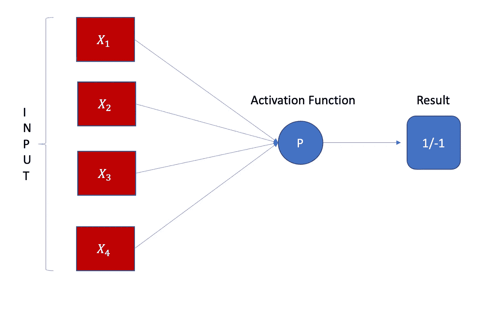
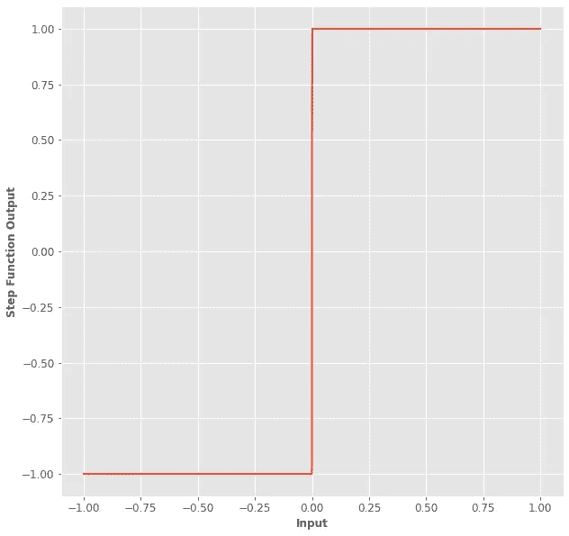
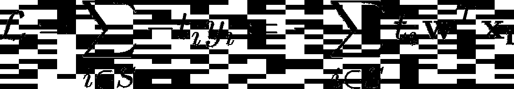
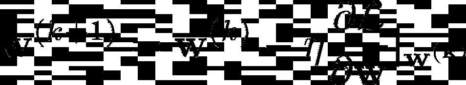

# 使用 Python 探索感知器算法

> 原文：<https://towardsdatascience.com/exploring-the-perceptron-algorithm-using-python-c1d3af53a7c7>

## 从理论到实践，这里是你需要知道的关于这个简单而有趣又强大的方法的一切。

弗拉季斯拉夫·巴比延科在 [Unsplash](https://unsplash.com/s/photos/choice?utm_source=unsplash&utm_medium=referral&utm_content=creditCopyText) 上的照片

好了，经典的机器学习情况。你有一个表格数据集，你必须对它进行分类。你是怎么做到的？

首先，你需要非常了解你可能会用到的工具。你可以尝试使用的一个非常著名的算法是**感知器。**

从理论到实践，我们将从一个简短的理论介绍开始，然后展示一个实际的实现来检验这种机器学习方法。

在这篇博文的最后，你将能够理解何时以及如何使用这种机器学习算法，对其所有的利弊有一个清晰的想法。

# 1.该理论

## 1.1 简介

感知机有生物学上的理由存在。我们的神经元不断从其他神经元接收能量，但只有当它们接收的能量大于或等于一定量时，它们才决定被“激活”并发出自己的信号。

先说最终产品。最后，给定一个四维输入，这个输入用 4 个不同的权重处理，总和进入激活函数，你得到结果。没有比这更复杂的了。:)

作者图片

让我们说得更清楚些。假设您有这个特性表(列)X1、X2、X3 和 X4。这些特征是表征数据集的单个实例(行)的 4 个不同值。

这个实例需要进行二进制**分类，**这样你将有一个额外的值 t，这是**目标，**可以是-1 或 1。

感知器算法**将** X1、X2、X3 和 X4 乘以一组 4 个权重。出于这个原因，我们认为感知器是一个**线性**算法(稍后会详细介绍)。

然后，一个**激活函数**将被应用于该乘法的结果(同样，稍后将详细介绍激活函数)。

下面是一个等式中的整个过程:

其中 **a** 是所谓的激活功能。

当然，输入可以是 N 维的(N 不必是 4)，因此您也可以使用 N 个权重+ 1 个偏差。尽管如此，纯感知器算法意味着用于**二进制**分类(后面会有更多)。

当然，y=a(w_1x_1+…+w_4x_4)的结果需要在-1 和 1 之间。换句话说，在一天结束时，所谓的激活函数需要能够给你一个**分类。**

那么这个经常被讨论的**激活功能**是什么呢？嗯，无非是一个**步进函数。**什么意思？

你的 N 维输入与 N 维权重的乘积会给你一个数字。那么如果这个数是**大于 0** 你的算法会说**“1”**，否则会说**-1”**。

作者图片

这是最终产品。这就是它的工作方式，这就是它做决定的方式。这里没什么真正神秘的:)。

我们继续吧。

## 1.2 损失函数

我们都知道机器学习算法带有一个**损失函数**。在这种情况下，损失函数不过是错误分类点的加权和。

让我们把它变得简单些。假设你有一个没有很好分类的观点。这意味着，例如，将你的参数和你的输入相乘，你将得到-0.87 的最终结果。

作者图片

好吧，但重点还是那句，**分类错误，**还记得吗？所以这意味着对于那个点(t=1)，目标确实是“1”。这意味着如果你做这个乘法:

作者图片

你实际上得到了一个量，这个量告诉你**你错了多少**，你应该改变你的权重和偏差来做更好的分类工作。

通常，损失函数是所有错误分类点的负和:

作者图片

其中 S 是错误分类点的集合。
我们的想法是开始优化这个损失函数，当然我们希望最小化。

作者图片

你在上面看到的等式被称为**梯度下降。**这意味着我们沿着损耗达到最小值的方向，并沿着这个方向更新参数。

由于损失函数取决于错误分类点的数量，这意味着我们将慢慢开始校正实例，直到这样一个点，如果数据集是线性可分的(稍后将详细介绍)，将不再有“校正”的目标，并且我们的分类任务将是完美的。:)

# 2.实施

当然， [SkLearn 感知器](https://scikit-learn.org/stable/modules/generated/sklearn.linear_model.Perceptron.html#sklearn.linear_model.Perceptron)是一个众所周知的现成实现。尽管如此，为了更好地理解它，让我们从头开始创建这个感知机。

让我们从图书馆开始:

让我们定义决策函数:

## 2.1 线性可分离数据集

让我们使用 [SkLearn](https://scikit-learn.org/stable/datasets/toy_dataset.html) 创建一个线性可分的数据集。

## 2.2 感知器功能

使用此功能，之前解释过的所有想法都可以实际实现:

然后，我们可以使用以下代码绘制决策边界:

让我们看看玩具数据集中发生了什么:

可以看到，所有的点都被很好地分类了(甚至是红色的小三角形)。

让我们看看损失函数图:

这意味着数据集现在已经完全分类了。

## 2.2 非线性可分离数据集

让我们考虑一个更难被认为是“线性可分”的数据集。

让我们运行算法:

好的，现在我们可能需要一点工作来得到我们最好的分类。

让我们运行不同数量的时期和不同的学习速率(所谓的超参数调整)来获得最佳版本的感知器:

这些是最佳的时期数和学习率:

# 3.更多考虑

以下是一些需要考虑的事项:

*   **感知器算法很快**。其实无非就是线性乘法+阶跃函数应用。它超级简单易用。
*   **当数据集不是线性可分时，算法不会根据损失函数收敛。这意味着这个感知器只能(完美地)在线性可分离数据集上工作**。尽管如此，我们可以对数据集应用转换，并对转换后的数据集应用感知器算法
*   一个**超参数调整部分**可以显著提高算法的性能。

# 4.结论

如果你喜欢这篇文章，你想知道更多关于机器学习的知识，或者你只是想问我一些你可以问的问题:

A.在 [**Linkedin**](https://www.linkedin.com/in/pieropaialunga/) 上关注我，我在那里发布我所有的故事
B .订阅我的 [**简讯**](https://piero-paialunga.medium.com/subscribe) 。这会让你了解新的故事，并给你机会发短信给我，让我收到你所有的更正或疑问。
C .成为 [**推荐会员**](https://piero-paialunga.medium.com/membership) ，这样你就不会有任何“本月最大数量的故事”，你可以阅读我(以及成千上万其他机器学习和数据科学顶级作家)写的任何关于现有最新技术的文章。