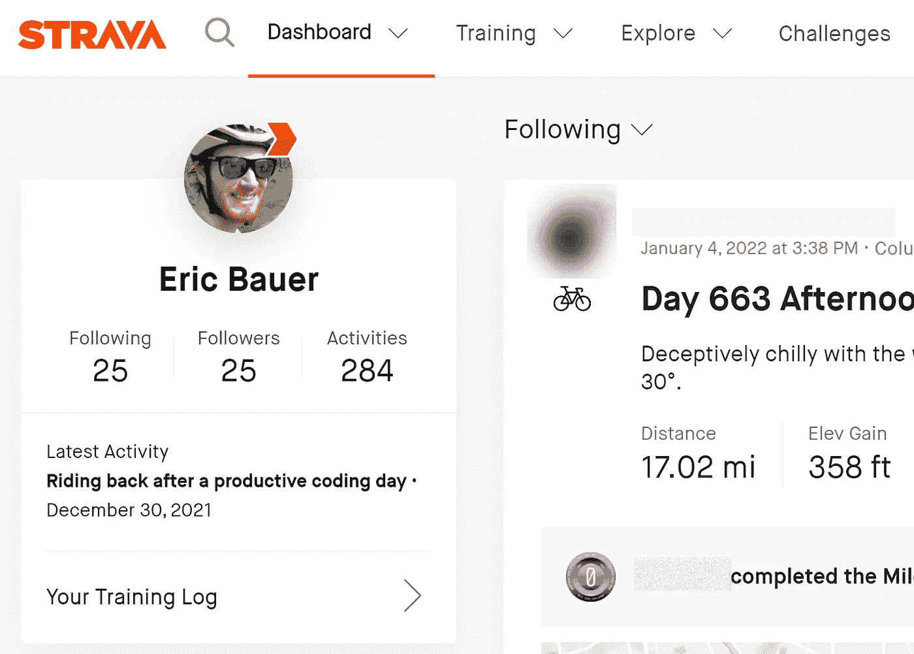
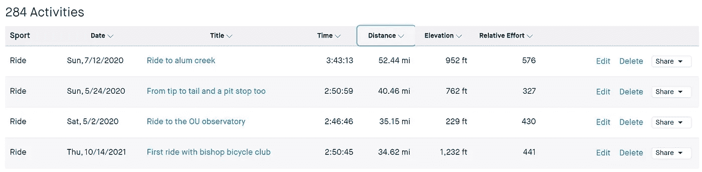
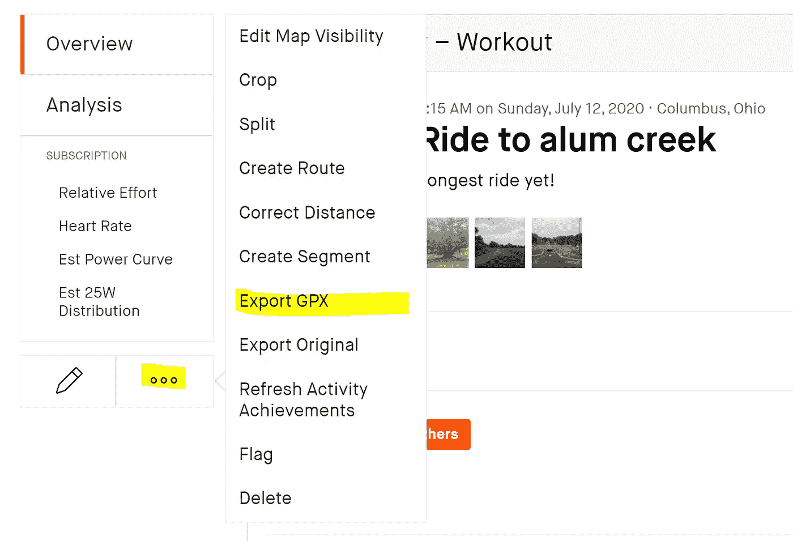
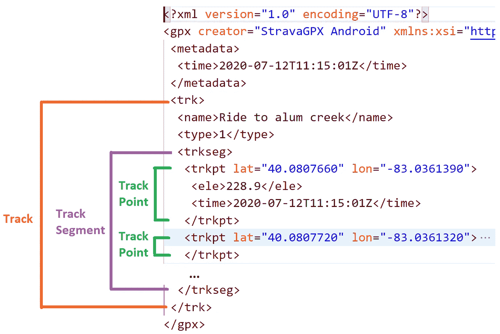
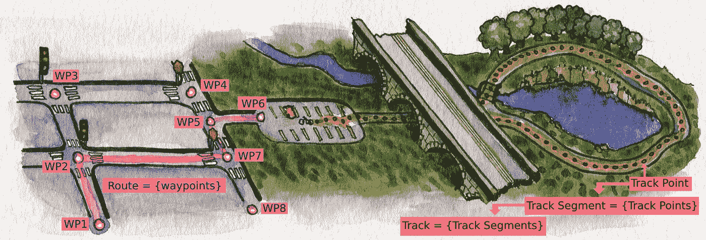
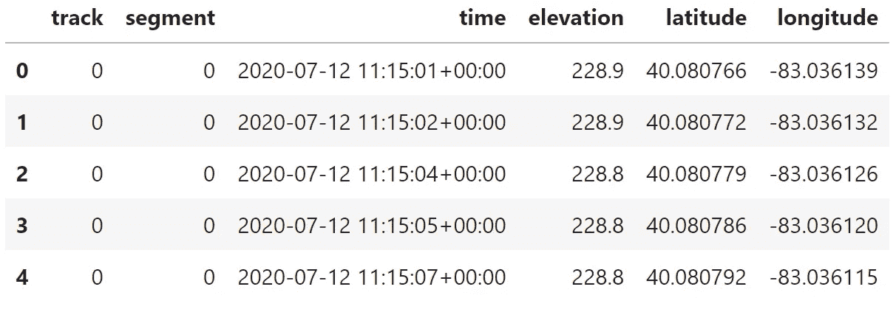

# 通过 Strava 数据探索您的健康状况

> 原文：<https://towardsdatascience.com/exploring-your-fitness-through-strava-data-90bffe391521>

# **通过 Strava 数据探索您的健康状况**

## **如何开始锻炼数据冒险(EDA)**

图片作者。

如果你像我一样是一个数据迷，并且想把锻炼从琐事变成数据冒险，那么你来对地方了。这篇文章将向您展示制作自己的练习数据集是多么容易，以及如何使用 Python 访问和打开它。

从小到大，我从来都不是一个“健康”的孩子。我有点超重，从来没有给锻炼足够的机会，让它被认为是一种乐趣，而不是一件苦差事。像许多事情一样，当 2020 年 3 月疫情来袭时，这种情况发生了变化。到了四月底，我在家里呆得太久了，需要换换环境。我不想冒险接触任何人，但我需要出去。我选择了骑自行车。

从一次短暂的跑步经历中——一件让我膝盖受伤的琐事——我知道并重新安装了 Strava 健身应用。这个应用程序能够记录你在哪里跑步或骑车，以及其他有趣的数据，如总距离、平均速度等等。我想，如果我开始骑自行车，我也可能有数字来证明这一点。我的骑行开始是在人行道上 30 分钟的旅行，慢慢探索我公寓的周围区域。过了一会儿，我变得好奇起来，探索偏僻的小路和交通不畅的道路，发现了下一个城镇。在斯特拉瓦，我达到了我的第一个里程碑:一次骑行 10 英里。从这一点上说，骑自行车不是锻炼，而是一种冒险。我在 Strava 上不断探索和追踪我的里程碑。我跑了 20 英里，然后是 30 英里、40 英里，最后是 50 英里。

到 2020 年 7 月，我已经骑了 1000 英里，骑了 76 次不同的车。我不仅感觉更好，而且我现在已经把我自己的健身之旅记录成了一个数据集。在本文中，我将展示如何为探索性数据分析(EDA)收集这些数据，并解释用于解析的 GPX 格式。通过以后的几个帖子，我会通过数据分享我的健身之旅，告诉你如何分析自己的。如果你还没有自己的健身数据，创建一些吧！无论是跑步，骑行还是其他，这篇文章将告诉你如何开始自己的运动数据冒险。

**免责声明**:现在有很多健身应用，所以试试你最感兴趣的吧。Strava 很早就给我留下了深刻的印象，我发现很容易与之共事。主要目标是把数据探索和锻炼结合起来！此外，我已经支付了 Strava 的订阅费，因为我很喜欢它，但是你不需要订阅来访问你的数据！

# **访问 Strava 上的游乐设备**数据

在 Strava 上查找您的乘车数据其实很容易。假设你至少有一次乘车分析——如果你没有，出去做一次！—第一步是在 [Strava 的网站](https://www.strava.com/)上登录您的账户。一旦你这样做，你会看到你的仪表板。如果你关注其他人的活动，你会默认在中心看到他们。我们关心的是你在左上方的个人资料摘要。

作者在 Strava.com 的图片。

单击您的个人资料摘要框中的“活动编号”,转到您的活动列表。然后按距离降序排列，这样你就可以从你最长的活动开始探索。对我来说，这个旅程也不是从我的家庭地址开始，所以很容易分享，没有任何隐私问题。我们将在以后的博客中探讨如何给你的数据添加隐私气泡。

斯特拉发活动清单。作者在 Strava.com 的图片。

点击列表中的蓝色标题，就可以进入某个游乐项目的详细信息页面。我选择了“骑到明矾溪”活动。一旦详细信息加载完毕，点击省略号(…)按钮并点击“导出 GPX”来下载您的骑行数据。

如何导出活动的 GPX 文件。作者在 Strava.com 的图片。

毫无疑问，还有其他方法可以从 Strava 下载数据——包括它的 API——但是这种方法对于我们目前的目的来说已经足够好了。

# **GPX 格式讲解**

太好了，我们刚刚下载了一个. gpx 文件，但它到底是什么？GPX 是 GPS 交换格式的简称[1]。让我们看一下. gpx 文件的内部，以获得一些直觉。下面显示了该文件的缩略版本，带有一些分层注释:

*在. gpx 文件中查看。图片作者。*

该文件被分解成一个 XML 树结构，其中一个<gpx>节点是所有其他节点的父节点。除了贯穿始终的一些元数据(旅行开始时间、旅行名称等。)，文件由一个**轨道**节点组成。一个**轨迹**包含至少一个**轨迹段**，该轨迹段又包含多个**轨迹点**。每个**轨迹点**都包含按时间顺序排列的骑行“故事”。它也给出了 GPS 坐标(纬度和经度)以及你当时所处的高度和时间戳。</gpx>

游乐设备数据在 XML 树中建模，但是它在物理上代表什么呢？下图描述了一项潜在的身体活动:

*作者图片。*

一般来说，一个. gpx 文件可以包含*路线*和*轨迹*。路线是一组无序的*路点*——至少是一对 GPS 坐标——代表从起点到终点的粗粒度路径。一个路线示例是由谷歌地图绘制的 GPS 路线，用于将您的汽车导航到某个路线终点。通常有多个航点序列可以作为您到达目的地的路线，但通常您的导航应用程序会为您选择最佳(即最短)路线。如果你错过了一个转弯，计划的路线会更新以处理这个变化[1]。

轨迹是一组按时间顺序排列的轨迹点。与包含可能的路点的路线不同，轨迹代表了你所在的时空点的精确历史。这是一条记录你如何旅行的精细路径。在上面的漫画中，你到达了一个小道的尽头，打开你的自行车，在骑上环路之前打开了 Strava。如果你在立交桥下骑车时丢失了 GPS 信号，你的轨迹会继续，但会被记录为至少两个不同的*轨迹段*。一个轨道至少有一个轨道段，每个轨道段包含一组连续记录的轨道点[1]。

## **Strava 如何为 GPX 数据服务**

值得注意的是 Strava。gpx 文件似乎只包含一个音轨片段。Strava 有一个自动暂停功能，当你不动的时候它会停止记录数据[2]。这不仅有助于节省手机电池，而且最终可以更准确地显示骑自行车的移动时间和平均速度。根据*轨道段*的定义，无论何时在行程中发生这种情况，我们都会期望有多个轨道段。或许，Strava 在上传后，将这些多个片段组合成仅仅 1 个。

# **用 Python 将 GPX 转换成 CSV**🐍

虽然下载乘车数据很方便。gpx 格式则不然。为了便于使用，我们将把。gpx 结构变成了普通的。csv 格式。为此，我们需要解析。gpx 并将其放入一个表格熊猫数据框架中。

自从。gpx 格式本质上是 XML，我们可以使用 Python XML 库来解析节点，但幸运的是，有一个简单的、专门构建的替代方法叫做`gpxpy`。要安装软件包，请使用`pip install gpxpy`或您环境的相关软件包管理器。此处可找到包装的参考资料[。](https://github.com/tkrajina/gpxpy)

下面是将. gpx 文件读入 Pandas 数据帧的代码:

数据提取代码位于一个`with`块中，作为上下文管理器来打开和关闭。gpx 文件。在这个块中，`gpxpy`包将 XML 树解析成一个 Python 对象。提取数据归结为遍历对象中存储的所有轨迹、轨迹段和轨迹点。在初始化 Pandas 数据帧之前，将每一行的数据存储在字典列表中。

加载的 GPX 文件的熊猫视图。图片作者。

将数据保存为. csv 格式现在非常简单:`df.to_csv(file_path['out'], index=False)`。

# **结论**

开始锻炼并不总是容易的。动机时好时坏，但作为一名数据科学家，我的好奇心总是旺盛的。有了 Strava 应用程序，我把锻炼的方式从苦役变成了刺激的冒险。其基础是能够创建和探索我自己的健身数据集。希望这篇文章能激发你用你的数据去尝试，并向你展示如何收集你自己的数据。

我看了一下如何在 Strava 上找到并下载你的锻炼数据。它采用. gpx 格式，但是我也介绍了这种格式的模型以及它的结构。最后，我分享了一个代码片段来轻松地将格式转换成。使用 Python 中的`gpxpy`和 pandas 包的 csv。

除了`track`和`segment`列之外，乘车数据实际上只有另外 4 列。虽然这看起来没什么可做的，但我的下一篇文章将讨论如何为这些数据创建 EDA 策略。有比你想象的更多的东西需要探索！

[1] hikearizona， [GPS 文件——GPX 解释](https://www.youtube.com/watch?app=desktop&v=9i2fViC6PLk) (2015)，YouTube

[2] Jojo，[自动暂停](https://support.strava.com/hc/en-us/articles/216917437-Auto-Pause) (2021)，Strava.com