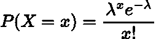
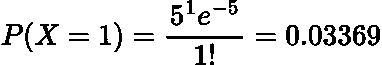
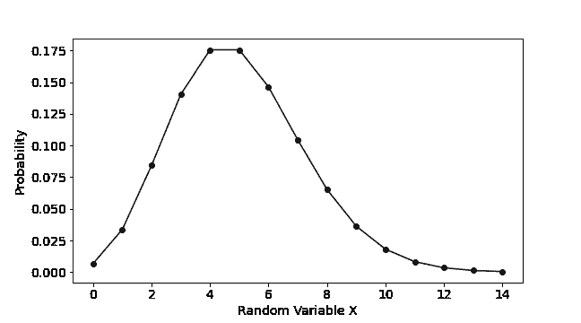
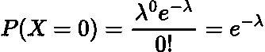
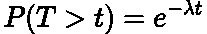
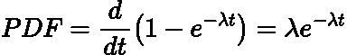
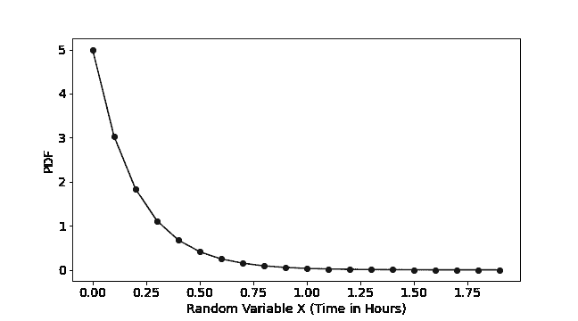
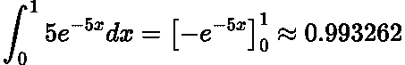

# 简单解释了指数分布

> 原文：<https://towardsdatascience.com/exponential-distribution-simply-explained-349d05b1bdb8>

## 指数分布及其起源的简明解释。


在 [Unsplash](https://unsplash.com?utm_source=medium&utm_medium=referral) 上由 [olieman.eth](https://unsplash.com/@moneyphotos?utm_source=medium&utm_medium=referral) 拍摄的照片

# 介绍

在本文中，我们将探索每个数据科学家都应该知道的基本统计分布之一:指数分布。

简而言之，指数分布推断事件之间的**等待时间的概率。例如，直到有人提出保险索赔的等待时间。**

# 起源

为了真正理解指数分布，我们需要从 [**泊松过程**](https://en.wikipedia.org/wiki/Poisson_point_process) **开始。**泊松过程用于描述一个**计数过程**，其中事件**随机**发生，但以**给定的速率**发生。例如，回到保险索赔场景，我们知道每小时有 5 起索赔，但这些索赔在该时间段内随机发生。它们可以是均匀间隔的，或者全部在最后一分钟。

泊松过程以**泊松分布**为特征，泊松分布具有 [**概率质量函数(PMF)**](https://en.wikipedia.org/wiki/Probability_mass_function) **:**



由作者在 LaTeX 中生成的图像。

其中 ***X*** 是一个随机变量，它是某个时间段内发生的**个事件， ***λ*** 是该时间段内**个事件的预期数量。****

回到我们的索赔类比，我们有一个 1 小时的时间段，在此时间段内预计会发生大约 5 起索赔。有 1 个索赔的概率是多少？



由作者在 LaTeX 中生成的图像。

非常小。

如果我们用 Python 绘制泊松分布的 PMF:

```
# import packages
from scipy.stats import poisson
import numpy as np
import matplotlib.pyplot as plt

# random variable
x = np.arange(0, 15)

# poisson distribution
y = poisson.pmf(x, mu=5)

# plotting
plt.figure(figsize=(9,5))
plt.plot(x, y, marker='o', color='black')
plt.xlabel('Random Variable X', fontsize=14)
plt.ylabel('Probability', fontsize=14)
plt.xticks(fontsize=14)
plt.yticks(fontsize=14)
plt.show()
```



作者用 Python 生成的图。

我们看到最高的概率是在 ***x = 5*** ，这很直观，因为这是预期的数字！

> 注意:你可以从二项式分布推导出泊松分布。我在这里链接了一篇很棒的文章，带你完成这个推导。

这和指数分布有什么关系？指数分布描述了泊松分布事件之间等待时间的概率。

# 衍生物

指数分布告诉我们泊松过程中事件之间等待时间的概率。从字里行间来看，这意味着在**给定时间段内没有事件发生:**



由作者在 LaTeX 中生成的图像。

现在这只是一个时间段，然而我们将此概括为*时间段。因此，我们必须等待 ***T*** 个时间段才能得到第一个事件:*

**

*由作者在 LaTeX 中生成的图像。*

*这有道理吗？我们说我们必须等待 ***t*** 时间段(在我们的索赔类比中这是 ***t*** 小时)直到第一个事件(索赔)发生。*

*另一方面，事件发生的概率是:*

**

*由作者在 LaTeX 中生成的图像。*

*这也是 [**累积分布函数(CDF)的定义。**](https://en.wikipedia.org/wiki/Cumulative_distribution_function)*

*CDF 的导数是 [**概率密度函数(PDF)**](https://en.wikipedia.org/wiki/Probability_density_function) **:***

**

*由作者在 LaTeX 中生成的图像。*

> *注: **PDF 用于连续随机变量**，而 **PMF 用于离散随机变量。***

*因此，我们得到了指数分布！*

# *例子*

*让我们为保险索赔示例绘制一个指数分布图。我们平均每小时受理 5 起索赔，这相当于索赔之间的平均等待时间为 12 分钟:*

> *这也是指数分布的期望值或平均值 E[X],即 **1/λ。**这可以用我在[上一篇文章中提到的力矩生成函数来展示！](/moments-and-moment-generating-functions-of-statistical-distributions-e216cb11a079)*

```
*# generate data
x = np.arange(0, 2, 0.1)
y = 5 * np.exp(-5*x)# plot
plt.figure(figsize=(9,5))
plt.plot(x, y, marker='o', color='black')
plt.xlabel('Random Variable X (Time in Hours)', fontsize=14)
plt.ylabel('PDF', fontsize=14)
plt.xticks(fontsize=14)
plt.yticks(fontsize=14)
plt.savefig('plot1.png')
plt.show()*
```

**

*作者用 Python 生成的图。*

*第一个索赔发生在第一个小时内的概率是多少？为了计算这个，我们简单地在 0 和 1 的边界之间积分 PDF:*

**

*由作者在 LaTeX 中生成的图像。*

*因此，这种可能性相当高，这是有道理的，因为我们预计索赔之间的平均等待时间为 12 分钟。*

# *结论*

*在本文中，我们描述了指数分布以及它是如何得出的。简而言之，它测量泊松过程中事件之间等待时间的概率。*

*在我的下一篇文章中，我们将扩展这个来描述伽玛分布！*

# *和我联系！*

*   *要在媒体上阅读无限的故事，请务必在此注册！T3*💜**
*   *[*当我在这里发布注册邮件通知时，可以获得更新！*](/subscribe/@egorhowell) 😀*
*   *[*领英*](https://www.linkedin.com/in/egor-howell-092a721b3/) 👔*
*   *[*推特*](https://twitter.com/EgorHowell) 🖊*
*   *[*github*](https://github.com/egorhowell)*🖥**
*   **<https://www.kaggle.com/egorphysics>**🏅****

> ***(所有表情符号由 [OpenMoji](https://openmoji.org/) 设计——开源表情符号和图标项目。许可证: [CC BY-SA 4.0](https://creativecommons.org/licenses/by-sa/4.0/#)***