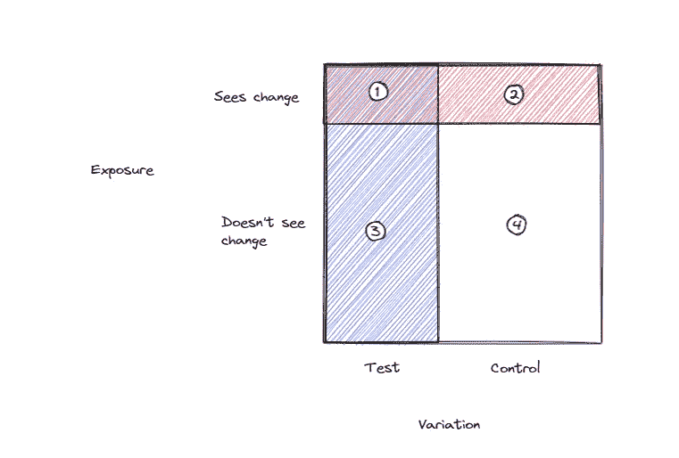

# 暴露稀释——是什么？还有什么时候可以无视？

> 原文：<https://towardsdatascience.com/exposure-dilution-what-is-it-and-when-can-you-ignore-it-65d1cf5a06d8>

## 曝光稀释重要性快速指南

由 Fulvio Ciccolo 在 [Unsplash](https://unsplash.com/photos/8xDbAn8JcWY) 上拍摄的图像。

暴露稀释是设置实验时经常出现的概念，但具体是什么，什么时候可以忽略？在本文中，我们快速定义了暴露稀释，讨论了一个 web 案例研究，然后解释了可以忽略暴露稀释的关键案例。

# 了解暴露稀释

当在一个网站上运行 AB 测试时，你必须选择一个点来决定用户将看到什么版本(控制或测试)，这通常被称为**暴露点**。通常，您会使曝光点尽可能接近您正在进行的实际更改。例如，如果您要在结账漏斗中添加一个步骤，您应该在用户看到新屏幕之前进行曝光。

这样做是因为如果你不曝光，你可能会有**曝光稀释**。暴露稀释背后的概念是，你为你关心的指标(如转化或销售)测量的结果不会告诉你实验的全部情况。

# 酒店预订网站示例

作为一个例子，我们可以使用网站上的消息打开量，比如[booking.com](http://booking.com)(酒店预订)。用户在预订酒店后可能会收到一条消息并打开它。当他们继续与酒店经营者互动时，他们也可能会打开多个信息。任何一天的消息数量并不完全取决于预订的数量，因为用户可能会继续发送几周前预订的消息。

如果我们考虑结账流程实验的指标，如果我们不小心引入了一个破坏结账流程的错误，我们将开始看到消息打开的小幅下降，因为新用户不能预订任何东西和接收消息，但所有老用户仍然可以发送消息，因此指标不会有太大变化。

这显然是有问题的，因为在现实中我们已经做了一个可怕的改变，我们应该立即停止测试，但我们的数据需要很长时间才能反映出来，因为我们没有得到正确的暴露点。

# 当它不适用时

这一切听起来很棒，并且是一个很好的理由来确保你的曝光点尽可能接近你正在做出的实际改变，但实际上，有几个条件必须保持真实的曝光稀释实际发生，在许多情况下他们不会。

1.  **与新用户相比，旧用户(现有/回归用户)的数量必须很大**。如果他们不是，那么实际上没有多少用户来冲淡这种效果。以我们的例子为例，如果用户预订了酒店，然后查看了当天的信息，但再也没有回到网站，那么我们实际上不会看到任何暴露稀释，不管我们的暴露点。**在下面的图 1 中，3 + 4 比 1 + 2 少得多。**
2.  **指标不能完全依赖于所做的改变。**如果我们关心的指标是预订数量，而不是消息打开，那么用户将无法在没有实际看到变化的情况下影响指标。在许多实验中，情况会是这样，因为您倾向于想要改变将影响许多用户的事情，以对度量产生最大的影响，但是对于具有从单个团队向上的目标的大型团队，这可能更常见。**在图 1 中，这意味着 3 + 4 =0**

因此，如果这些条件无效，那么实际上可以简单地将所有用户暴露给变更。根据你如何进行实验，以及所做的改变的类型，这有时会更容易，也更容易设置。

***图 1*** *:把 square 看成是实验的一部分，可以影响你关心的指标的所有用户。然后，我们可以定义两个轴，首先是用户是否真正看到了变化，其次是他们是否在测试或控制中。当我们的用户看不到测试和控制中的变化时，即当我们的 3 和 4 远大于 0 时，就会发生暴露稀释。(作家创造的形象)*

# 结论

最后，值得一提的是，即使存在暴露稀释，你从实验中得到的结果仍然是有效的，事实上，是有用的。在消息打开的情况下，我们可能想直接知道实验的效果(看到变化的用户的消息打开增加了多少%)，但是我们也想知道对所有用户的影响，想知道我们对顶线目标有多少贡献。这正是暴露稀释的结果告诉我们的，尽管我们需要更大的样本量才能得到结果。在我们将暴露点设置在变更附近的情况下，我们需要手动计算整体影响。

总的来说，如果(a)你没有很多回头客，并且(b)你的指标完全依赖于你引入的变化，你就不需要担心暴露稀释。当然，调整曝光稀释永远不会有坏处，所以如果你有资源，那么将曝光点设置为尽可能接近变化是安全的。