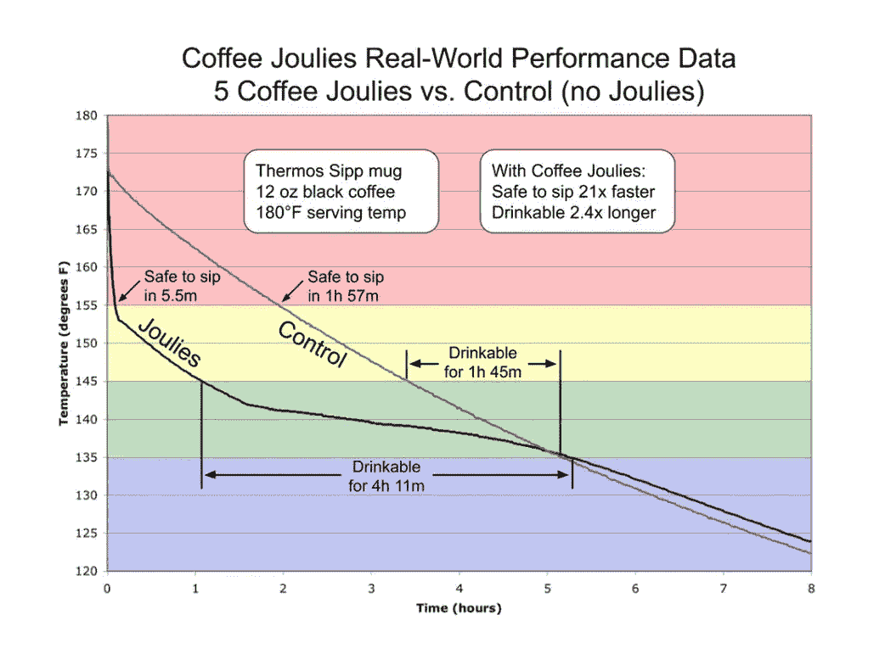
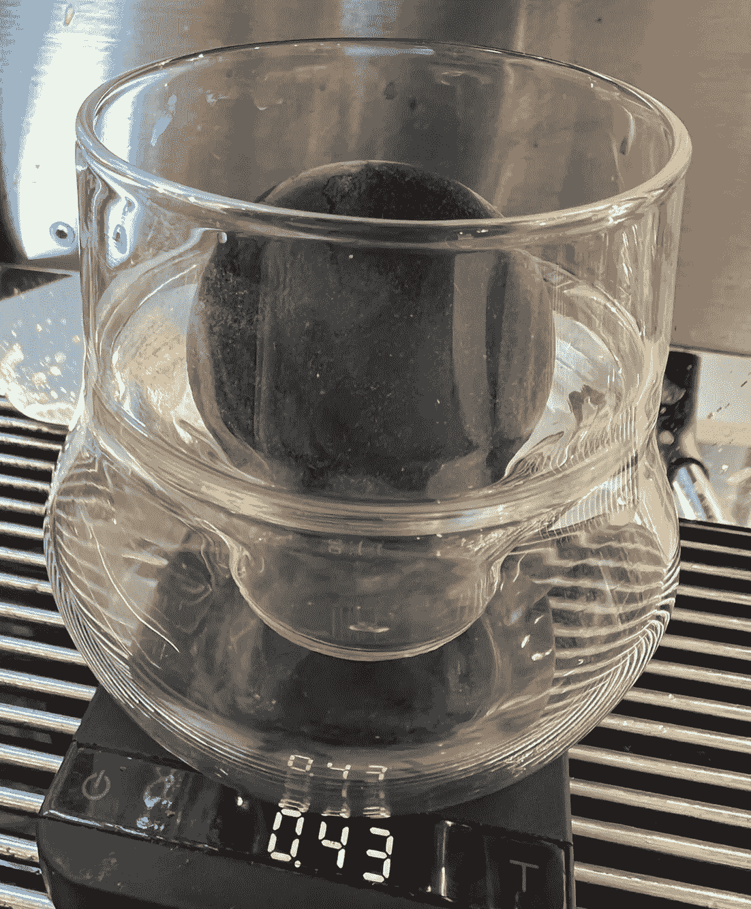
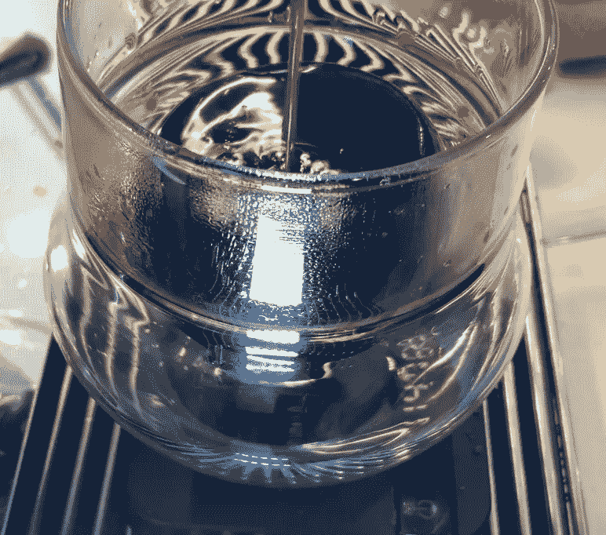
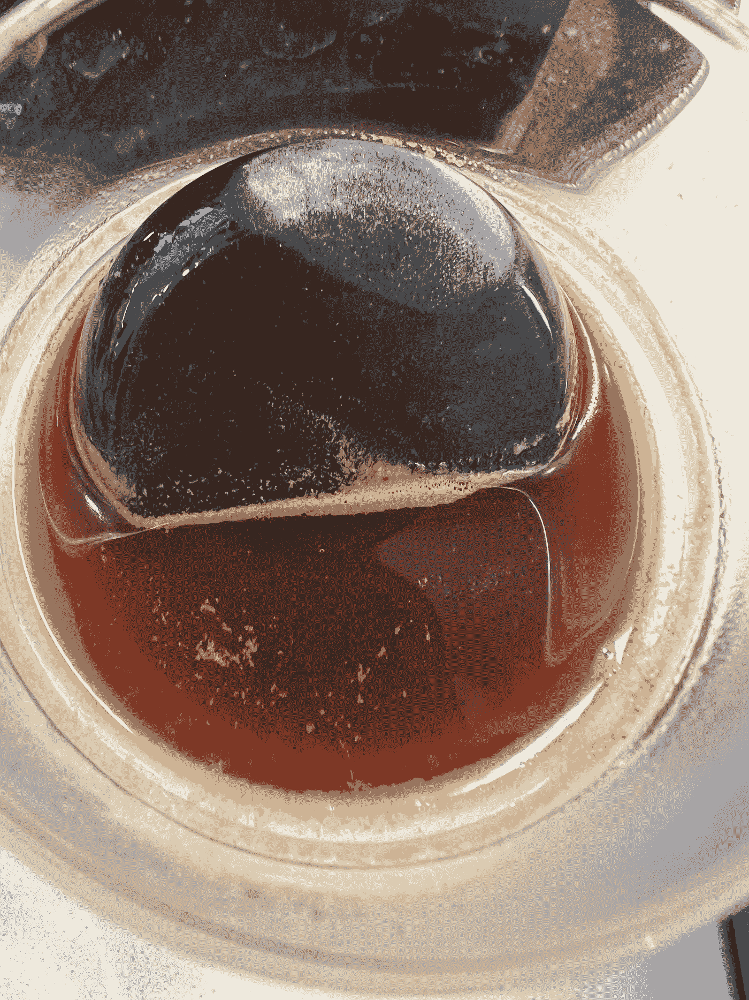
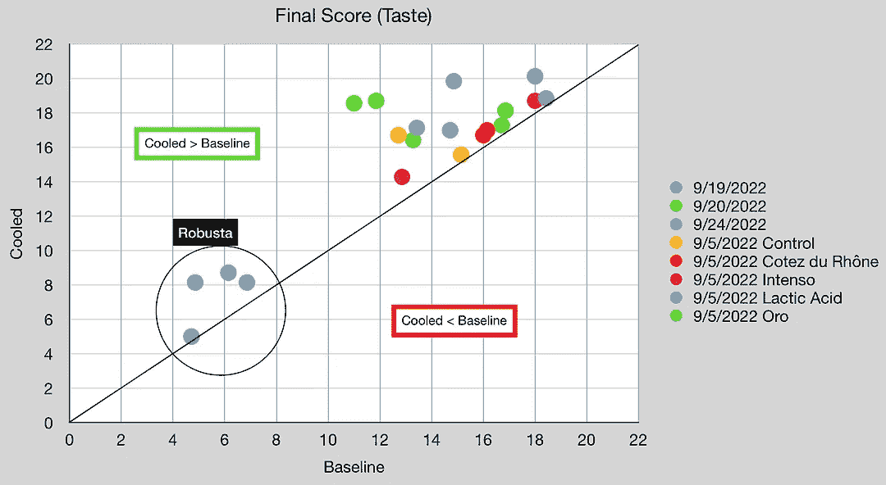
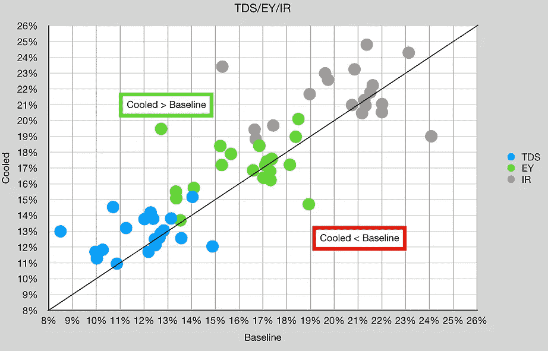
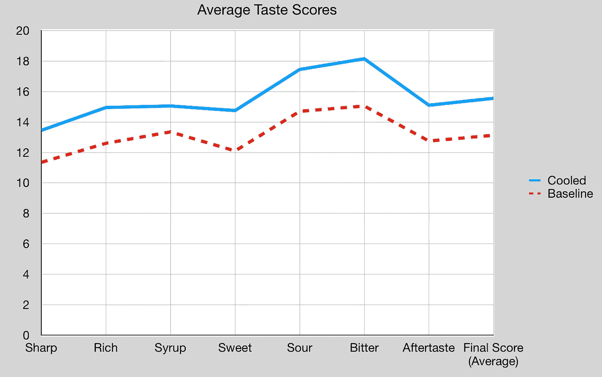
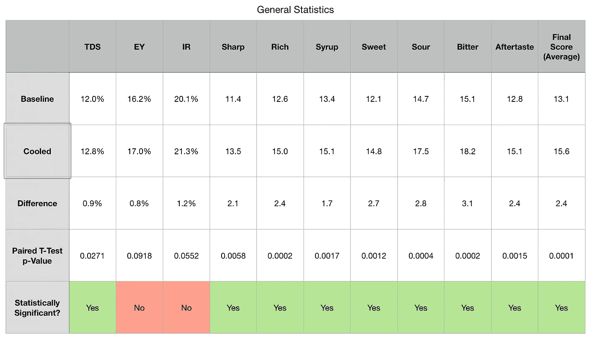

# 浓缩咖啡的萃取冷却

> 原文：<https://towardsdatascience.com/extract-cooling-for-espresso-a628d6755da6>

## 咖啡数据科学

## 运用现代技术破解风味

浓缩咖啡通常是热煮的，但缺点之一是香气会不断蒸发。一般来说，有一种观念认为人们应该在煮好咖啡后立即饮用。问题是浓缩咖啡是热的，我的经验是让一杯冷却到 50C 以下会大大改善味道。不利的一面是，如果一杯放得太久，氧化会破坏味道。如果我们把冲好的酒迅速冷却会怎么样？我们可以通过休·凯利所说的抽气冷却来两全其美

# 历史

我的灵感来自 Nucleus tools 今年(2022 年)推出的 Paragon 滴头。然而，对于意式浓缩咖啡，这个想法在前一年的比赛中被使用。2021 年，在世界咖啡师锦标赛(WBC)上，休·凯利用一些冷却石冷却一杯浓缩咖啡的前半部分，制成了浓缩咖啡。

然而，2021 并不是 WBC 第一次使用这样的技术。[来自台湾的 Berg Wu 在 2016 年 WBC](https://youtu.be/bLqgk1dfhoA) 比赛中使用了 cold portafilters(喷动，不是无底)，意图是冷却镜头的第一部分，他赢了。

但是等等！这不是第一次有人试图快速冷却咖啡。故事的起源至少可以追溯到 2011 年[咖啡杂志](https://www.joulies.com/)上市的时候。他们的目标是将咖啡冷却到可饮用的温度，然后使用沸点接近 70℃的封装材料保持该温度。这意味着物质会从固体变成液体，吸收大量的热量。然后它会重新固化，保持温度更长时间。这家公司似乎不再营业了。

另一家名为[的公司 Joeveo](https://joeveo.com/) 于 2013 年开始在咖啡杯中使用类似技术，目标是 60 摄氏度。这个杯子对于浓缩咖啡来说很大。

这两种技术都没有专注于香气消失的想法，这是马赛丽和他的公司学到的，但这个想法的种子之前因为其他原因而形成。

我不酿造 pourover，但我想我可以做一个黑客来测试这项技术。我对此很感兴趣，因为学术结果还没有出来。

所有图片由作者提供

所以我用了一块玄武岩做的按摩石，我把它放在冰箱里。

前几次测试非常成功，我不想做通常的配对拍摄。但是，我是为了科学。

# 设备/技术

[意式咖啡机](/taxonomy-of-lever-espresso-machines-f32d111688f1) : [像样的意式咖啡机](/developing-a-decent-profile-for-espresso-c2750bed053f)

[咖啡研磨机](/rok-beats-niche-zero-part-1-7957ec49840d) : [小生零](https://youtu.be/2F_0bPW7ZPw)

咖啡:[家庭烘焙咖啡](https://rmckeon.medium.com/coffee-roasting-splash-page-780b0c3242ea)，中杯(第一口+ 1 分钟)

镜头准备:[断奏夯实](/staccato-tamping-improving-espresso-without-a-sifter-b22de5db28f6)

[预灌注](/pre-infusion-for-espresso-visual-cues-for-better-espresso-c23b2542152e):长，约 25 秒

输液:[压力脉动](/pressure-pulsing-for-better-espresso-62f09362211d)

[过滤篮](https://rmckeon.medium.com/espresso-baskets-and-related-topics-splash-page-ff10f690a738) : 20g VST

其他设备: [Atago TDS 计](/affordable-coffee-solubility-tools-tds-for-espresso-brix-vs-atago-f8367efb5aa4)、 [Acaia Pyxis 秤](/data-review-acaia-scale-pyxis-for-espresso-457782bafa5d)

# 绩效指标

我使用了两组[指标](/metrics-of-performance-espresso-1ef8af75ce9a)来评估技术之间的差异:最终得分和咖啡萃取。

[**最终得分**](https://towardsdatascience.com/@rmckeon/coffee-data-sheet-d95fd241e7f6) 是记分卡 7 个指标(辛辣、浓郁、糖浆、甜味、酸味、苦味和回味)的平均值。当然，这些分数是主观的，但它们符合我的口味，帮助我提高了我的拍摄水平。分数有一些变化。我的目标是保持每个指标的一致性，但有时粒度很难确定。

**总溶解固体(TDS)使用折射仪测量，该数字结合一杯咖啡的输出重量和输入重量用于确定提取到杯中的咖啡的百分比，称为**提取率(EY)** 。**

******强度半径定义为 TDS vs EY 的控制图上原点的半径，所以 IR = sqrt( TDS + EY)。这一指标有助于标准化产量或酿造比的击球性能。******

# ******数据******

******我品尝了 20 多对样本中的 8 种咖啡。我发现凉了的饮料味道更好。他们读取的 TDS/EY 略高，但这可能是由于样品温度[较低](/difluid-vs-atago-for-total-dissolved-solids-tds-in-espresso-d474614ad66f)。******

************************

******平均味觉评分全面上升。一个 1 点的增加可能是一个更嘈杂的指标，特别是对于一个小数据集，但大多数有 2 点的平均差异。******

************

******总的来说，除了 EY 和红外，冷却样品的影响在统计上是显著的。******

************

******虽然冷却实验与其说是寻找新东西，不如说是好奇，但我发现我的浓缩咖啡日常工作的一部分已经永远改变了。我继续使用冷却石，因为我发现提取冷却是任何人都可以应用的主要方法改进。也不用花那么多钱，效果立竿见影。******

******对我来说，更大的问题是了解酿造和冷却过程中发生了什么，导致这种影响如此明显。******

******如果你愿意，可以在[推特](https://mobile.twitter.com/espressofun?source=post_page---------------------------)、 [YouTube](https://m.youtube.com/channel/UClgcmAtBMTmVVGANjtntXTw?source=post_page---------------------------) 和 [Instagram](https://www.instagram.com/espressofun/) 上关注我，我会在那里发布不同机器上的浓缩咖啡照片和浓缩咖啡相关的视频。你也可以在 [LinkedIn](https://www.linkedin.com/in/dr-robert-mckeon-aloe-01581595) 上找到我。也可以在[中](https://towardsdatascience.com/@rmckeon/follow)关注我，在[订阅](https://rmckeon.medium.com/subscribe)。******

# ******[我的进一步阅读](https://rmckeon.medium.com/story-collection-splash-page-e15025710347):******

******[我的书](https://www.kickstarter.com/projects/espressofun/engineering-better-espresso-data-driven-coffee)******

******[我的链接](https://rmckeon.medium.com/my-links-5de9eb69c26b?source=your_stories_page----------------------------------------)******

******[浓缩咖啡系列文章](https://rmckeon.medium.com/a-collection-of-espresso-articles-de8a3abf9917?postPublishedType=repub)******

******工作和学校故事集******