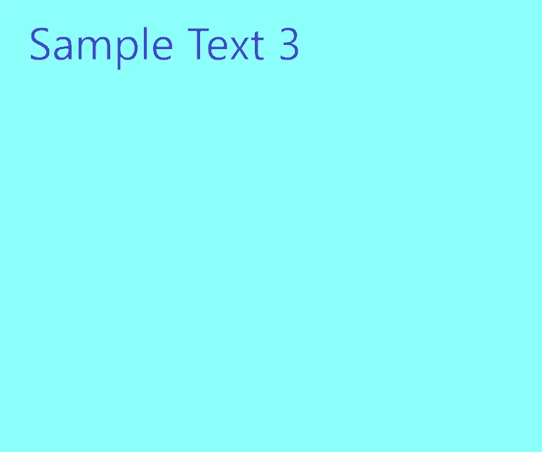
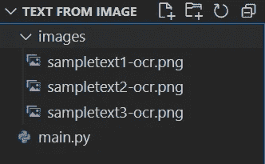

# 使用 Python 从图像中提取文本

> 原文：<https://towardsdatascience.com/extract-text-from-image-using-python-8e8cfbbce743>

## 在本教程中，我们将探索如何使用 Python 从图像中提取文本


伊恩·施耐德在 [Unsplash](https://unsplash.com/s/photos/text-image?utm_source=unsplash&utm_medium=referral&utm_content=creditCopyText) 上拍摄的照片

**目录**

*   介绍
*   样本图像
*   使用 Python 从单个图像中提取文本
*   使用 Python 从多个图像中提取文本
*   结论

# 介绍

从图像中提取文本是企业运营部门(从发票和收据中提取信息)以及其他领域中非常流行的任务。

OCR(光学字符识别)是一种基于电子计算机的方法，将文本图像转换为机器编码的文本，然后可以提取并以文本格式使用。

要继续学习本教程，我们需要:

*   [宇宙魔方](https://tesseract-ocr.github.io/tessdoc/Installation.html)
*   [宇宙魔方](https://pypi.org/project/pytesseract/)
*   [枕头](https://pillow.readthedocs.io/en/stable/)

Tesseract 是一个开源 OCR(光学字符识别)引擎，允许从图像中提取文本。

为了在 Python 中使用它，我们还需要**pyTesseract**库，它是 tesserac 引擎的包装器。

由于我们正在处理图像，我们还需要为 Python 添加图像处理功能的 **pillow** 库。

首先，为你的操作系统搜索[宇宙魔方安装程序](https://tesseract-ocr.github.io/tessdoc/Installation.html)。对于 Windows，你可以在这里找到最新版本的宇宙魔方安装程序[。只需下载。exe 文件并安装在您的计算机上。](https://github.com/UB-Mannheim/tesseract/wiki)

如果您没有安装 Python 库，请打开“命令提示符”(在 Windows 上)并使用以下代码安装它们:

```
pip install pytesseract
pip install pillow
```

# 样本图像

为了继续学习本教程，我们需要一些图片。

以下是我们将在本教程中使用的三幅图像:


作者图片


作者图片



作者图片

在本教程中，我们将使用简单的图像与文本水平对齐，不需要任何额外的图像处理。

# 使用 Python 从单个图像中提取文本

让我们从使用 Python 从单个图像中提取文本开始。

对于这个例子，我们将使用上一节提供的第一幅图像:**sampletext1-ocr.png**

下面是我的文件的结构:



作者图片

所有的图像都放在文件夹**图像**中，代码保存在**主文件夹**中

我们需要的图片的路径是:*images/sample text 1-ocr . png*

我们需要的另一个路径是安装后创建的**tessaract.exe**的路径。在 Windows 上，它应该位于:*C:\ Program Files \ tessera CT-OCR \ tessera CT . exe*

现在，我们已经拥有了所需的一切，可以使用 Python 轻松地从图像中提取文本:

您应该得到:

```
Sample Text 1
```

# 使用 Python 从多个图像中提取文本

在这一节中，我们将探索如何使用 Python 从多个图像中提取文本。

我们知道所有的图像都放在文件夹 **images** 中，而代码驻留在 **main.py** 中

从每个图像中提取文本的一种方法是使用每个图像的文件名，并从这些图像中逐个提取文本。

但是如果文件夹里有 100 张图片呢？使用 **os** 库，我们可以访问给定目录中的所有文件名。

一旦我们访问了 **images** 文件夹中的所有文件名，我们将遍历它们并使用 Python 从每个图像中提取文本:

您应该得到:

```
Sample Text 1
Sample Text 2
Sample Text 3
```

这正是我们在图像中看到的文字。

# 结论

在本文中，我们探讨了如何使用 Python 和 Tesseract 从单幅图像和多幅图像中提取文本。

如果你有任何问题或对编辑有任何建议，请随时在下面留下评论，并查看更多我的 [Python 编程](https://pyshark.com/category/python-programming/)教程。

*原载于 2022 年 5 月 12 日*[*https://pyshark.com*](https://pyshark.com/extract-text-from-image-using-python/)*。*