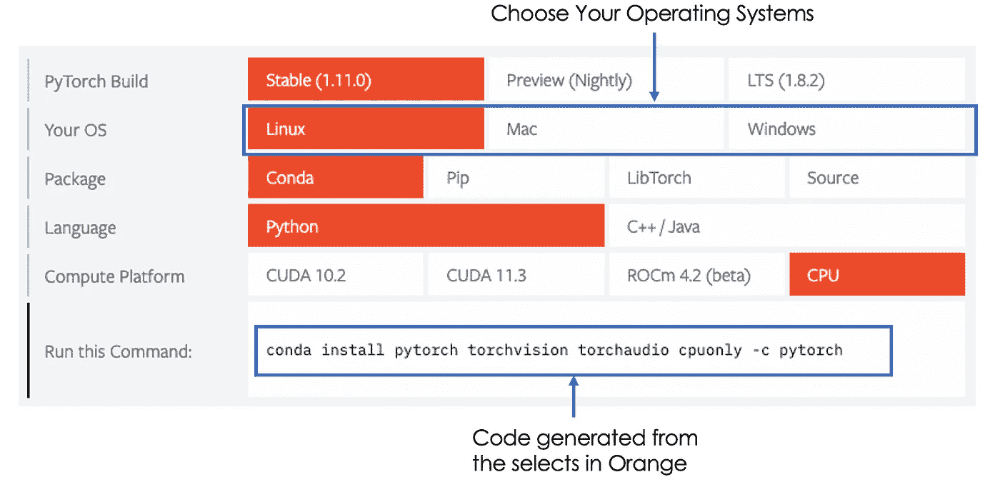
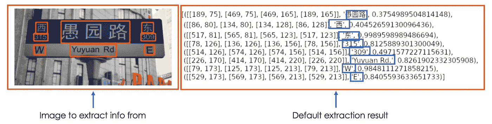
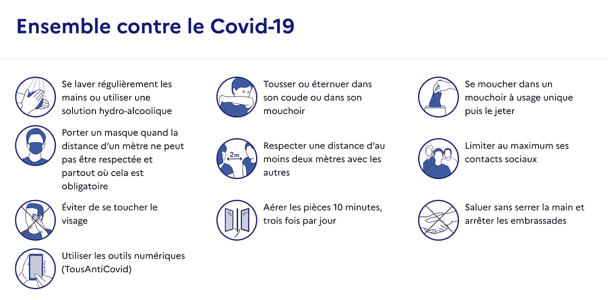
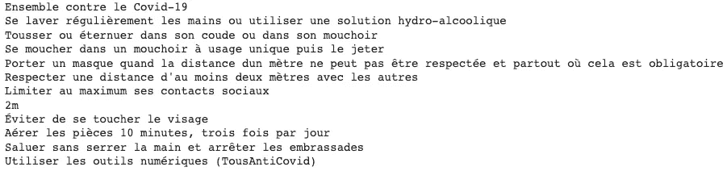
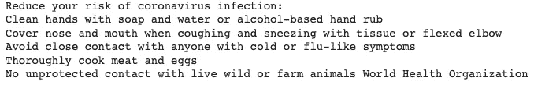
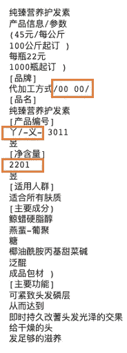
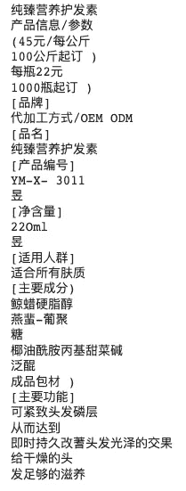

# 用 Python 从图像中提取用不同语言编写的文本

> 原文：<https://towardsdatascience.com/extract-text-written-in-different-languages-from-images-with-python-2348ff021fe5>

## EasyOCR，将多语言图像转换为文本的库

埃里克·克鲁尔在 [Unsplash](https://unsplash.com/photos/Ejcuhcdfwrs) 上拍摄的照片

# 介绍

在这个日益现代化的世界里，简单的截屏足以分享图像格式的文本信息。此外，全球化使得这些信息可以用不同的语言提供。能够有效地从这些图像中提取它们可能是一项至关重要的技能。因此，拥有这种技能的行业和组织可能会在竞争中遥遥领先。

几天前，我偶然发现了一个 python 库，可以用来执行这样的任务。本文通过不同语言中的一些图片示例来介绍什么是`easiocr`。

# easy ocr——是什么？

`easiocr`是一个开源的 python 库，用于光学字符识别，简称 OCR。它目前支持提取 80 多种语言编写的文本。

## 先决条件

为了能够使用`easiocr`，我们需要安装以下两个依赖项:Pytorch 和 OpenCV。

OpenCV 的 ***安装很简单，只需以下指令。***

open_cv_install.py

Pytorch 的 ***安装过程取决于您的操作系统，所有的说明都可以在这个页面上找到[。单击按钮时，会生成如下安装脚本:](https://pytorch.org/)***

Pytorch 安装过程来自[官网](https://pytorch.org/)(图片由作者提供)

下面是之前自动生成的相同代码。

pytorch_install.py

我们终于可以用这个命令行安装`easiocr`了。

easy_ocr_install.py

## 开始

由于`easiocr`是一个多语言库，我们需要加载模型，同时指定我们将使用哪种语言。这是通过使用来自`easiocr`的 **Reader** 类来完成的，该类可以接受语言列表的参数。每种语言都用一个代号来表示；比如法语的 **fr** ，英语的 **en** ，捷克语的 **cs** 等等。整个列表可在[这里](https://www.jaided.ai/easyocr/)获得。

easy_ocr_reader.py

值得注意的是，有些语言是不兼容的，因此在实例化一个**阅读器**(加载模型)时不能在同一个列表中。

在我们的例子中，我们将通过三种语言，英语、法语和汉语来说明`easiocr`的用法。但是我们将只需要如下所示的两个模型。

**加载语言模型**

加载模型可能需要更长的时间，但这是一个一次性的过程。我们不必每次都重新加载相同的模型。

*   **读者(['en '，' fr'])** :这第一个模型是针对英语和法语的，因为英语兼容每一种语言。

en_fr_reader.py

*   **Reader(['ch_sim'])** :仅针对中文的第二款，因为不兼容法语。

ch_reader.py

**文本提取—参数配置**

使用以下指令 ***{model}*** 完成文本提取。`read_text`功能其中 ***{model}*** 是我们之前的一款车型。默认输出是一个元组列表，每个元组都是这样的格式:(*【包围盒坐标】*，*检测到的文本*，*检测到的置信度*)，elow 是一个示例。

检测到的文本在蓝色框中。左边是坐标，右边是置信度。

来自 [easyocr Github](https://github.com/JaidedAI/EasyOCR) 的免授权示例(图片由作者改编)

获得这些细节是好的，但是我们只对蓝框中的文本信息感兴趣。为此，我们可以简单地将**细节**参数设置为零(0)，如下图`read_text(my_image, detail = 0)` **。**还有一个必需的参数是**段。**

*   如果设置为 True，提取将逐块进行，将所有内容放在同一行中。
*   如果设置为 False，提取将按列进行。

由你来设置段落的正确值，但是**设置为 True** 适用于绝大多数情况。

将所有这些信息放在一起就创建了下面的 helper 函数。它返回所有文本，每一个文本占一行，而不是返回一个文本列表。

easy_ocr_read_text.py

**文本提取——最后一步**

现在我们可以骑在巨人的肩膀上从下面的每一张图片中提取文字，所有的 ***免执照*** ！

*   ***图像为法语***

来自[法国政府](https://www.gouvernement.fr/info-coronavirus)的免执照图片

easyocr_fr_image.py

法语执行的输出(图片由作者提供)

我们可以看到，库成功地提取了内容，甚至是第二行第二列中的“2m”。

*   ***形象为英文***

来自 [easyocr Github](https://github.com/JaidedAI/EasyOCR) 的免授权图片

easyocr_en_image.py

执行的输出为英文(图片由作者提供)

**类似于之前的案例**，一切似乎又很棒了！

*   ***图像为中文***

来自 [PaddleOCR](https://github.com/PaddlePaddle/PaddleOCR) 的免执照图片

[easyocr_ch_image.py](https://gist.github.com/keitazoumana/8aa7e4f7067300306f66333f82c826b5#file-easyocr_ch_image-py)

执行脚本的输出为**只有中文**(图片由作者提供)

我不是中文专家，但是看起来图书馆又做了一件伟大的工作。然而，看起来一些非中文信息被错误地提取出来了(在橙色框中)。例如 **OEM ODE** 转化为 **00 00** 、 **220** 到 **2201** 等。这个是**因为模型只针对中国人**。解决此类问题的一个**解决方案**是创建一个既能理解**英语又能理解**中文的模型，如下所示。

[easyocr_ch_en_image.py](https://gist.github.com/keitazoumana/b8db98211c20a2b62fc25d2b7534fb74#file-easyocr_ch_en_image-py)

[ch_en_reader.py](https://gist.github.com/keitazoumana/96e7e43cba4644a33a68934b241dad12#file-ch_en_reader-py)

英汉模式执行的输出(图片由作者提供)

最后的结果看起来比上一个好！

# 结论

恭喜你！🎉 🍾您刚刚学会了如何使用`easiocr`从不同语言的图像中提取文本！如果你还是不愿意用`easiocr`来使用它，那么是时候试一试了，因为最终对那些你回避了很久的图像说 YES 可能会有很大的帮助！

尽管这个库效率很高，但是文本提取过程很慢，这可能不适合具有高实时性约束的应用。

如果你喜欢阅读我的故事，并希望支持我的写作，考虑[成为一个媒体成员](https://zoumanakeita.medium.com/membership)。每月支付 5 美元，你就可以无限制地阅读媒体上的故事。通过使用[我的注册链接](https://zoumanakeita.medium.com/membership)，我将获得一小笔佣金。

另外，你可以在 [LinkedIn](https://www.linkedin.com/in/zoumana-keita/) 、 [Medium](http://zoumanakeita.medium.com/) 和 [YouTube](https://www.youtube.com/channel/UC9xKdy8cz6ZuJU5FTNtM_pQ) 上加我，或者在 [Twitter](https://twitter.com/zoumana_keita_) 上关注我。讨论人工智能，人工智能，数据科学，自然语言处理的东西总是令人愉快的！

[Google Colab 上文章的源代码](https://colab.research.google.com/drive/1M2mFFfFl0XIhzWX3Qj-altvwOe5IONom?usp=sharing)

[Pytorch 官方文档页面](https://pytorch.org/)

[信息冠状病毒](https://www.gouvernement.fr/info-coronavirus)

[铁路安全信号](https://book4yours.blogspot.com/2020/08/panneaux-de-signalisation-et-de-securite-routiere.html)

[划桨 OCR 中文图像](https://github.com/PaddlePaddle/PaddleOCR)

再见🏃🏾