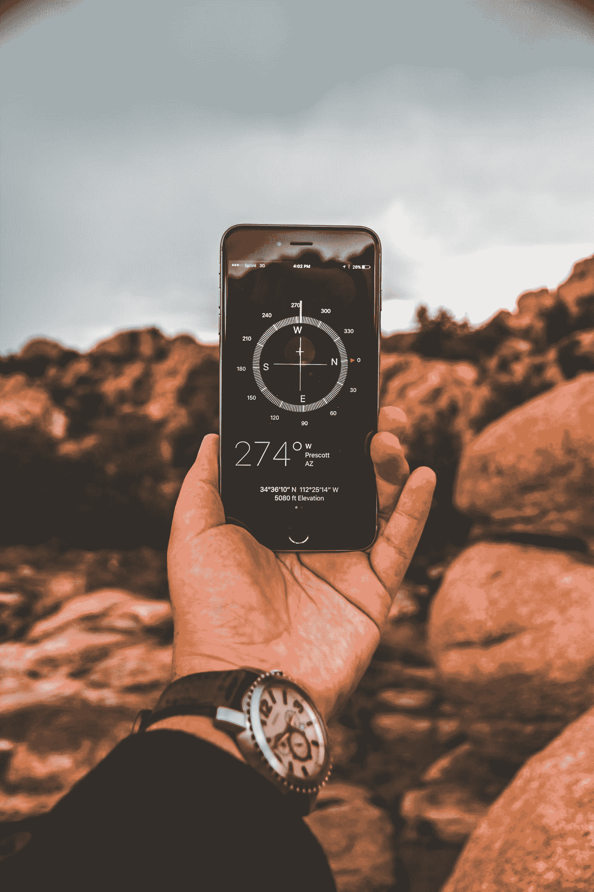
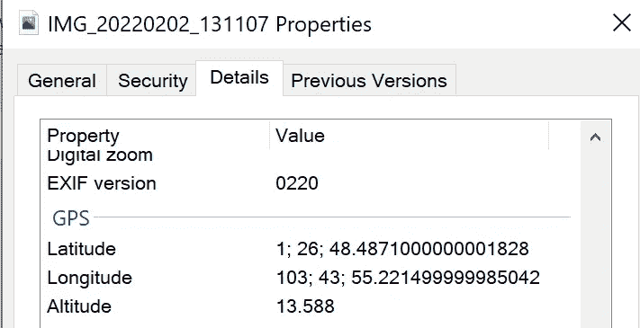
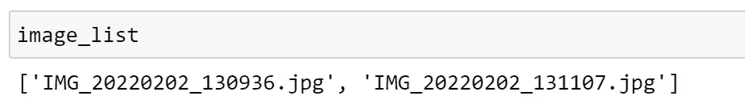
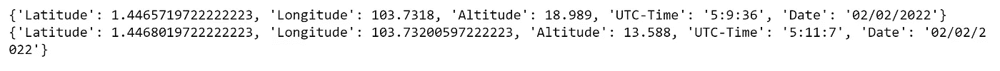
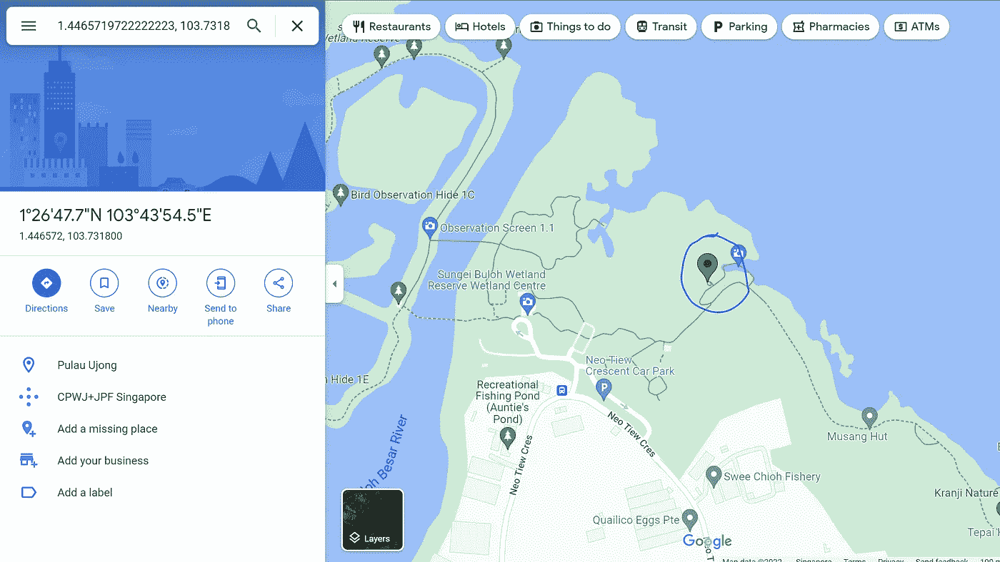

# 使用 Python 从照片中提取 GPS 数据

> 原文：<https://towardsdatascience.com/extracting-gps-data-from-photos-using-python-e8be352acf15>

## 提取元数据的非常简单和直接的指南



罗伯特·佩纳洛萨在 [Unsplash](https://unsplash.com?utm_source=medium&utm_medium=referral) 上拍摄的照片

如今智能手机拍摄的大多数照片都包含大量元数据，包括 GPS 数据。GPS 数据是指照片拍摄地的经纬度坐标。

当我们得到照片的 GPS 坐标时，我们甚至可以将它输入到[谷歌地图](https://support.google.com/maps/answer/18539)中，并看到确切的位置。只需在谷歌地图的搜索栏中输入*【经度】，【纬度】*，我们就能立刻看到位置。

如果我们只是想查看单张照片的 GPS 坐标，那是非常容易的。坐标以及许多其他元数据都可以在图像本身的属性中找到。



Windows 中的图像属性|按作者分类的图像

然而，如果我们有数百张照片，并且我们需要提取 GPS 坐标，该怎么办？

## Python 解决方案

我们将使用 GPSPhoto 库，它可以很容易地通过 pip 安装。

下面的代码将生成我们想要提取 GPS 坐标的照片列表。它将获取指定文件夹中所有以 *jpg* 结尾的照片。

```
pip install GPSPhoto
import os

os.chdir('C:\\Users\\my_personal_profile\\image_folder')
image_list = os.listdir()
image_list = [a for a in image_list if a.endswith('jpg')]

print(image_list)
```

您可能还需要安装库的依赖项，例如 *exifread* 和 *piexif，*也可以通过 pip 安装。

如果我们打印 image_list，我们将得到所有的列表。image_folder 文件夹中的 jpg 图像。



要分析的照片列表|作者提供的图片

一旦我们验证了图像文件名的列表，我们就可以提取 GPS 坐标。

```
from GPSPhoto import gpsphoto

for a in image_list: 
  data = gpsphoto.getGPSData(os.getcwd() + f'\\{a}')
  print(data)
```



输出:GPS 坐标和其他元数据|作者图片

## 激动人心的使用案例

在寻找拍摄地点时，我最近在手机上浏览旧照片，发现了这张美丽的照片。


双溪布洛湿地保护区的一个豆荚里

我很想再去那里拍一张合适的照片。我知道这是双溪布洛湿地保护区的一只豆荚。然而，公园里有几个类似的豆荚，尽管型号略有不同，阳光效果也不同。为了识别它们，我在谷歌上搜索豆荚的名称，例如弹涂鱼豆荚、翠鸟豆荚、鹰角豆荚等，看看是否匹配。然而，我不能确定，因为在谷歌上找到的图片有时会被用户错误标记。

不用去谷歌街景，一个一个地探索这些地方(在公园里很多时候有谷歌街景没有覆盖的区域)，这个解决方案非常有效。我刚刚从我在双溪布洛湿地保护区拍摄的许多照片中提取了 GPS 坐标，我能够得到准确的位置。这帮助我制定了一个好的摄影计划。



精确定位豆荚的确切位置:翠鸟豆荚——图片由作者提供

## 警告

如果你担心你拍摄并上传到社交媒体或通过信息应用分享的照片会泄露你的位置，不要担心！并非所有照片都包含此类信息。我也检查了在谷歌搜索上找到的照片，脸书上朋友上传的照片，甚至我直接在 WhatsApp 上分享的照片。它们不包含这样的信息。如果您共享照片的原始文件，那么照片很可能包含 GPS 坐标。

## 结论

希望这篇文章能帮助你从照片中自动提取 GPS 坐标。如果您想从照片中提取其他元数据，可以使用其他库。但是，如果您只想提取 GPS 数据，这是目前最简单的方法。

查看我的其他文章:

</7-data-visualization-best-practices-everyone-must-know-b68ebe329b1e>  <https://medium.com/illumination/demings-14-management-principles-every-managers-should-know-60d37ce02ad9> 