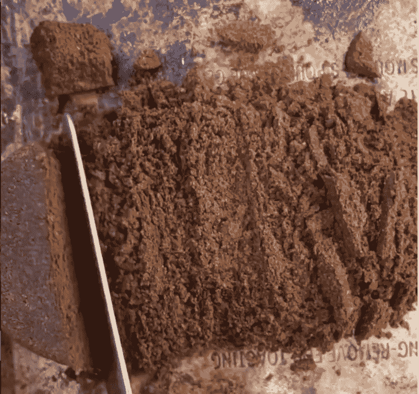
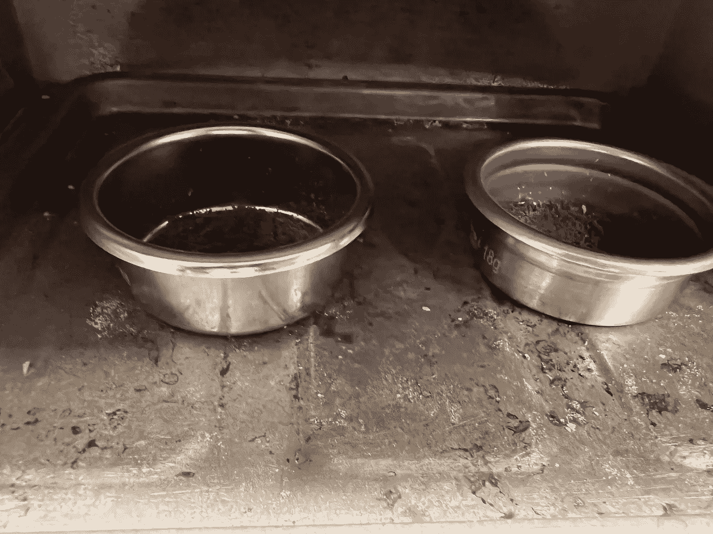
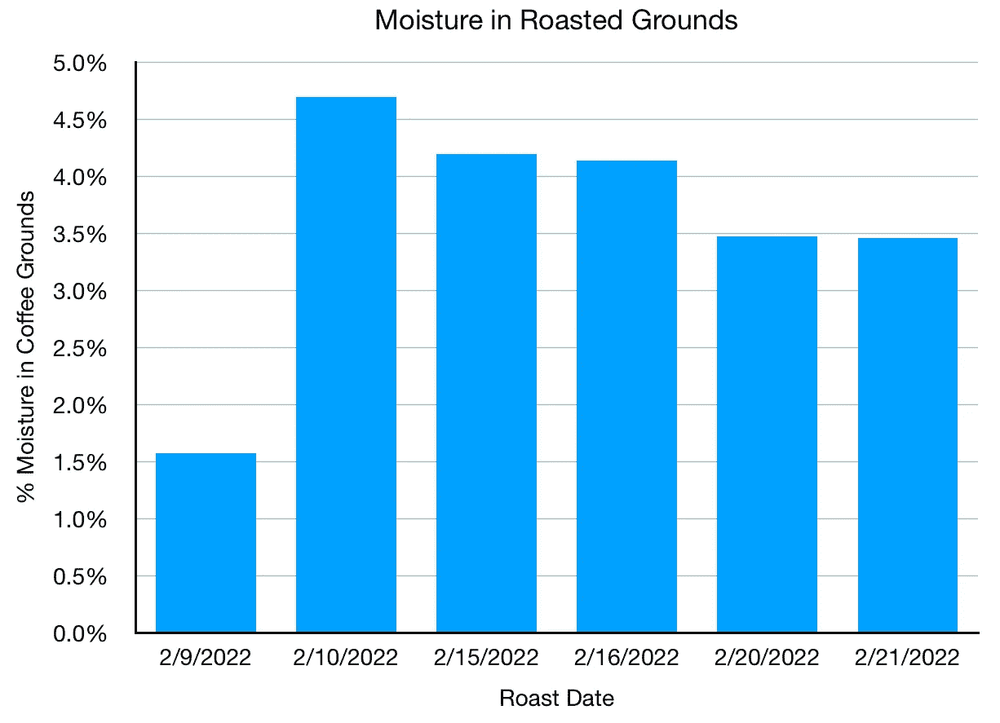
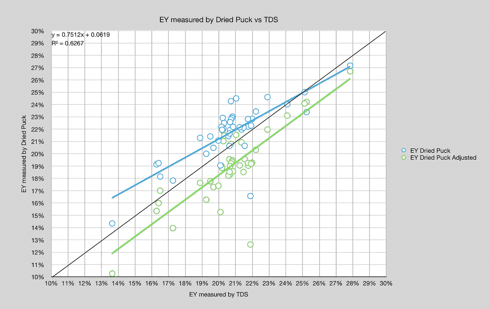
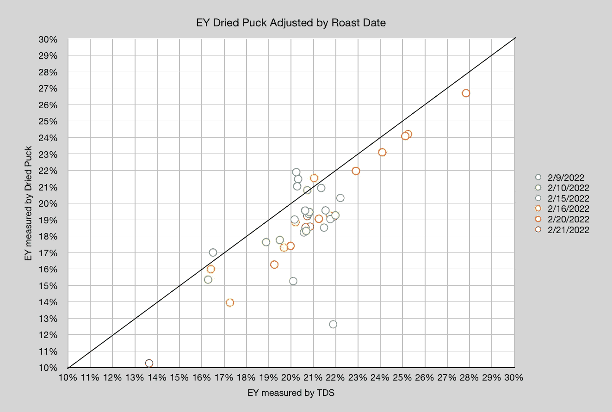
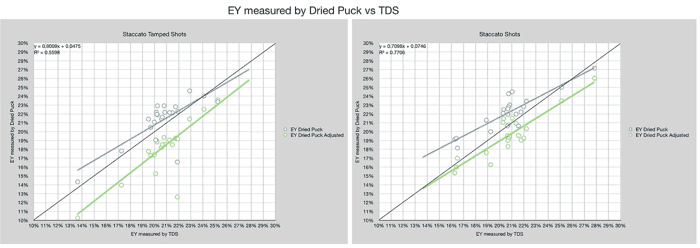
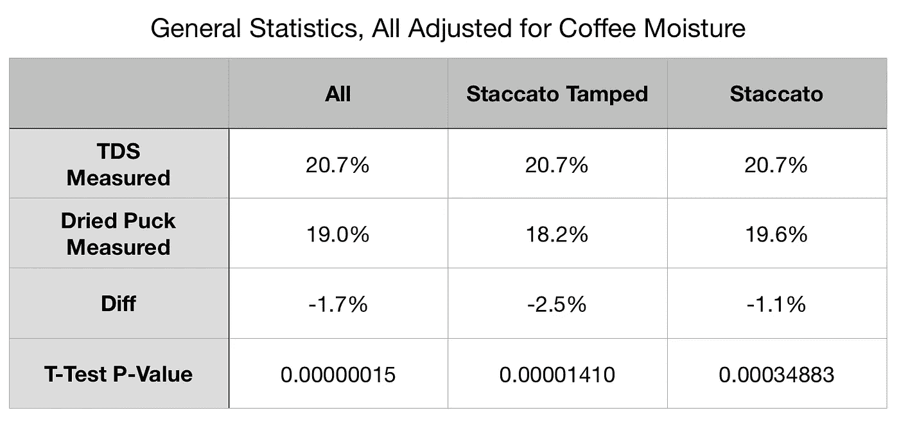

# 使用初始咖啡水分的干咖啡和浓缩咖啡的提取率(EY)

> 原文：<https://towardsdatascience.com/extraction-yield-ey-in-dried-pucks-and-espresso-using-initial-coffee-moisture-f65ee5c2df0e>

## 咖啡数据科学

## 深入探究干冰球、折射计和 ristretto 镜头

几个月前，我买了一台[像样的浓缩咖啡机](/developing-a-decent-profile-for-espresso-c2750bed053f) (DE 代表镜头)，我很兴奋，因为我可以停止镜头，而不像杠杆机器那样继续镜头。杠杆机器没有三通阀来释放圆盘内部的压力。因此，我能够干燥一些用过的咖啡球，并将提取率与我用折射计进行的测量进行比较，折射计类似于[以前的数据](/comparing-methods-for-measuring-extraction-yield-4fd4da584be1)，但侧重于 1:1 拍摄。

# 干燥方法

为了弄干咖啡，我做了以下简单而又能保持一致性的实验:

1.  我把冰球放在托盘上。
2.  把冰球切开
3.  在 200 华氏度的烤箱中干燥 30 分钟

通常，在最初的十分钟里，你可以看到水汽在窗户上积聚，但随后就消失了。

所有图片由作者提供

# 测量基线湿度

首先，我通过干燥新鲜的咖啡渣来测量我正在使用的咖啡渣的湿度。之前没想到这么做是因为我没有添加水分(加湿咖啡加快脱气)。因为我知道我添加了大约 1%的水分，所以我想对现磨咖啡进行地面实况测量。

该实验包括 6 次烘烤，并且水分含量不同。烘烤后我加了 1%的水分来模拟加速脱气的[湿度处理](/humidified-coffee-for-faster-degassing-and-better-espresso-3bdf601b2890)。

该数据对于帮助测量干燥废橡胶圆盘的提取率很重要。

# 设备/技术

[意式咖啡机](/taxonomy-of-lever-espresso-machines-f32d111688f1) : [像样的意式咖啡机](/developing-a-decent-profile-for-espresso-c2750bed053f)

咖啡研磨机:[小生零](/rok-beats-niche-zero-part-1-7957ec49840d)

咖啡:[家庭烘焙咖啡](https://rmckeon.medium.com/coffee-roasting-splash-page-780b0c3242ea)，中杯(第一口+ 1 分钟)

镜头准备:[断奏夯实](/staccato-tamping-improving-espresso-without-a-sifter-b22de5db28f6)和[断奏](https://medium.com/overthinking-life/staccato-espresso-leveling-up-espresso-70b68144f94)

[预灌注](/pre-infusion-for-espresso-visual-cues-for-better-espresso-c23b2542152e):长，约 25 秒

输液:[压力脉动](/pressure-pulsing-for-better-espresso-62f09362211d)

[过滤篮](https://rmckeon.medium.com/espresso-baskets-and-related-topics-splash-page-ff10f690a738) : 20g VST

其他设备: [Atago TDS 计](/affordable-coffee-solubility-tools-tds-for-espresso-brix-vs-atago-f8367efb5aa4)、 [Acaia Pyxis 秤](/data-review-acaia-scale-pyxis-for-espresso-457782bafa5d)

# 性能指标

性能的主要指标是通过干燥圆盘和折光率仪的提取率。

</coffee-solubility-in-espresso-an-initial-study-88f78a432e2c>**用折射仪测量总溶解固体量(TDS)，这个数字结合咖啡的输出重量和输入重量用于确定提取到杯中的咖啡的百分比，称为**提取率(EY)** 。**

**通过使用干燥的用过的圆盘的重量并除以输入的重量来确定来自干燥圆盘的 EY。**

# **答案是 42**

**我在 6 次烘烤中收集了 42 个样本。我从干冰球上看着 EY，然后也调整了 EY。我调整了干帕克 EY 和由 TDS 测量的 EY，以说明咖啡渣中的水分。**

**然后我绘制了这些数据对，如果 TDS 是一个完美的度量，那么所有的点都会落在 y=x 的黑线上。调整后的 EY 的偏移量约为 1.5%。**

****

**我们也可以通过烘烤来观察这一点，它们在很大程度上遵循类似的趋势。**

****

**我们可以通过断奏夯实(最接近常规拍摄)和断奏拍摄的方式来切割这些数据。断续拍显示偏移，而断续拍更接近 y=x 线。我不确定这是为什么，或者在断奏中是否有一些基本的东西，比如糖，与断奏相比更线性地提取。**

****

**我查看了一般统计数据，所有这些分布在双尾配对 t 检验下都具有统计学意义(p 值< 0.05)。**

****

**这类数据的有趣之处在于相对新颖，因为没有多少数据被公布。当然，已经收集了大量的数据，但是像许多咖啡一样，数据被收集数据的人保密。这让咖啡更加神秘，也促使我尽可能多地发布我收集的数据。**

**如果你愿意，可以在推特、 [YouTube](https://m.youtube.com/channel/UClgcmAtBMTmVVGANjtntXTw?source=post_page---------------------------) 和 [Instagram](https://www.instagram.com/espressofun/) 上关注我，我会在那里发布不同机器上的浓缩咖啡照片和浓缩咖啡相关的视频。你也可以在 [LinkedIn](https://www.linkedin.com/in/dr-robert-mckeon-aloe-01581595) 上找到我。也可以关注我在[中](https://towardsdatascience.com/@rmckeon/follow)和[订阅](https://rmckeon.medium.com/subscribe)。**

# **[我的进一步阅读](https://rmckeon.medium.com/story-collection-splash-page-e15025710347):**

**[我未来的书](https://www.kickstarter.com/projects/espressofun/engineering-better-espresso-data-driven-coffee)**

**[我的链接](https://rmckeon.medium.com/my-links-5de9eb69c26b?source=your_stories_page----------------------------------------)**

**[浓缩咖啡系列文章](https://rmckeon.medium.com/a-collection-of-espresso-articles-de8a3abf9917?postPublishedType=repub)**

**工作和学校故事集**