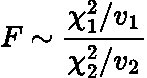
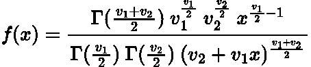
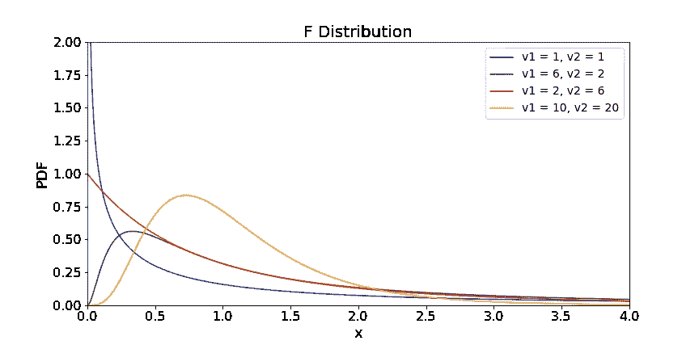

# 简单解释了 f 分布

> 原文：<https://towardsdatascience.com/f-distribution-simply-explained-45d0e6768a4>

## 对 f 分布的简单而简明的描述


马林·图拉德在 [Unsplash](https://unsplash.com?utm_source=medium&utm_medium=referral) 上的照片

# 介绍

在本文中，我们将介绍常用于[方差分析(ANOVA)](https://en.wikipedia.org/wiki/Analysis_of_variance) 测试的 **F 分布**(Fisher–Snedecor 分布)，如果您是数据科学家，这绝对值得了解！

f 分布与**卡方分布**密切相关。如果您不熟悉卡方分布，我强烈推荐您阅读我以前的一篇文章，其中详细介绍了这种特殊分布的复杂性:

[](/chi-square-distribution-simply-explained-87f707ba631a) [## 卡方分布简单解释

### 卡方分布及其起源的简单解释

towardsdatascience.com](/chi-square-distribution-simply-explained-87f707ba631a) 

# 起源

如果随机变量满足以下条件，它就是 F 分布的一部分:



作者在 LaTeX 中创建的方程。


作者在 LaTeX 中创建的方程。

其中 ***χ2*** 是来自两个独立样本的两个不同的卡方分布随机变量，分别具有**自由度*v1***和***v2***。换句话说，它是两个卡方分布随机变量除以其相应自由度的比率。

> 记住卡方分布的自由度是我们平方并求和的正态分布随机变量的数量。如果你对此不熟悉，可以参考我上面链接的“卡方分布简单解释”文章！

所有可能的 F 值的分布导致了 F 分布！

> 如果你一直在密切关注我的文章，你可能已经意识到 f 分布基本上是从二项分布得到的:
> 
> 二项式->泊松->指数->伽马->卡方-> F-Dist。

# 概率密度函数

我们可以从 [**累积密度函数(CDF)**](https://en.wikipedia.org/wiki/Cumulative_distribution_function) 中推导出 [**概率密度函数(PDF)**](https://en.wikipedia.org/wiki/Probability_density_function) ，就像我们对大多数分布所做的那样。然而，由于 F 分布推导的复杂性和穷尽性，我在本文中省略了它。

有兴趣的读者可以在这里 找到一个**的完整推导** [**，里面包含了雅可比矩阵等很多好玩的东西！**](https://statproofbook.github.io/P/f-pdf.html)

然而，F 分布的 PDF 看起来很吓人:



作者在 LaTeX 中生成的方程。

注意所有的**伽马函数**，这是因为**卡方分布是伽马分布的一种特定情况。**因此，这就解释了为什么 F 分布在其 PDF 中有相当多的伽马函数。

# 情节

F 分布的形状由两个自由度值 ***v_1*** 和 ***v_2 控制。***

下面是我用 Python 生成的一些 f 分布图:

```
# import packages
import numpy as np
from scipy.stats import f
import matplotlib.pyplot as plt# get x values
x = np.linspace(0, 4.5, 1000)# get F-Distributions    
f1 = f(1, 1, 0)
f2 = f(6, 2, 0)
f3 = f(2, 6, 0)
f4 = f(10, 20, 0)# plot the distributions
plt.figure(figsize=(12, 6))
plt.plot(x, f1.pdf(x), label = 'v1 = 1, v2 = 1', color = 'blue')
plt.plot(x, f2.pdf(x), label = 'v1 = 6, v2 = 2', color = 'green')
plt.plot(x, f3.pdf(x), label = 'v1 = 2, v2 = 6', color = 'red')
plt.plot(x, f4.pdf(x), label = 'v1 = 10, v2 = 20', color = 'orange')
plt.xlim(0, 4)
plt.ylim(0.0, 2)
plt.xticks(fontsize=16)
plt.yticks(fontsize=16)
plt.xlabel('x', fontsize=18)
plt.ylabel('PDF', fontsize=18)
plt.title("F Distribution",fontsize=20)
plt.legend(fontsize=14)
plt.savefig('f_dist.png')
plt.show()
```



作者用 Python 生成的图。

我们看到一些有趣的特性:

*   随着**自由度变大**，分布开始**向正态分布收敛。**
*   这种分布通常是右偏的**和重尾的**。
*   它总是**正**且**连续。**

# 结论

在本文中，我们解释了 f 分布的来源及其与卡方分布的关系。这篇文章比较短，因为它是为了让读者熟悉 f 分布。在我的下一篇文章中，我们将讨论如何在方差分析测试中使用 f 分布！

# 和我联系！

*   要在媒体上阅读无限的故事，请务必在这里注册！T33*💜*
*   [*在我发布注册邮件通知时获得更新！*](/subscribe/@egorhowell) 😀
*   [*领英*](https://www.linkedin.com/in/egor-howell-092a721b3/) 👔
*   [*碎碎念*](https://twitter.com/EgorHowell) 🖊
*   [*github*](https://github.com/egorhowell)*🖥*
*   *[](https://www.kaggle.com/egorphysics)**🏅***

> ***(所有表情符号都是由 [OpenMoji](https://openmoji.org/) 设计的——开源的表情符号和图标项目。执照: [CC BY-SA 4.0](https://creativecommons.org/licenses/by-sa/4.0/#)***