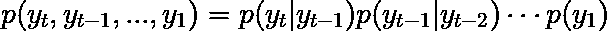
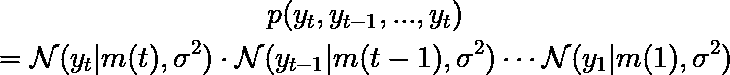
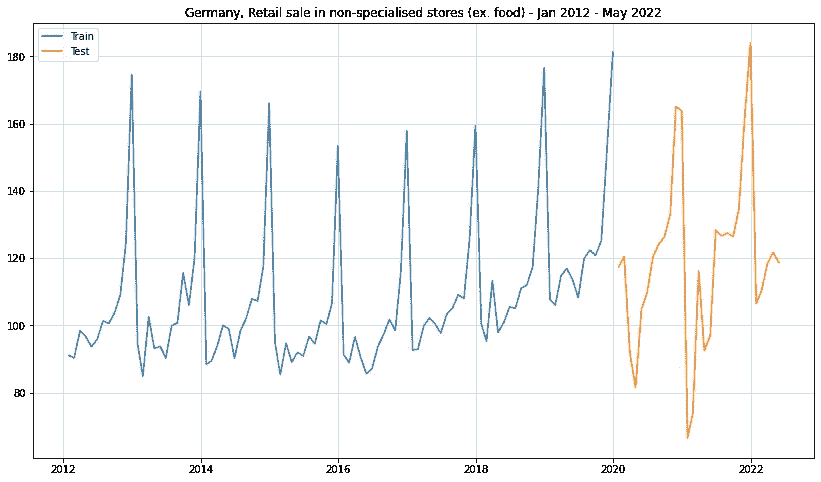
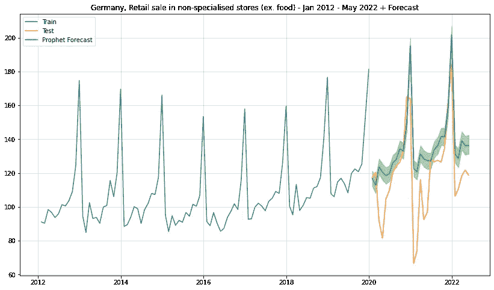
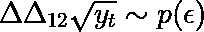
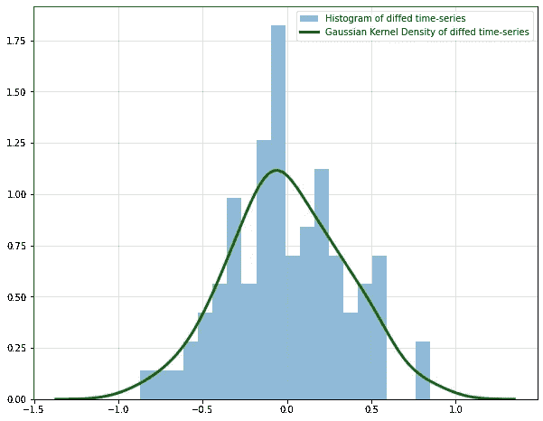
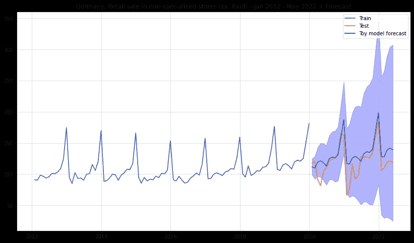
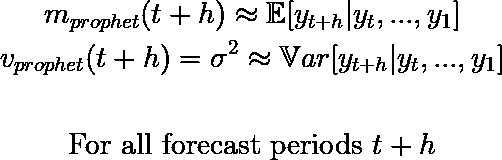

# 脸书先知，柯维德和我为什么不信任先知

> 原文：<https://towardsdatascience.com/facebook-prophet-covid-and-why-i-dont-trust-the-prophet-f70d367fb13a>

## 意见

## 脸书预言家在时间序列预测方面非常受欢迎。让我告诉你为什么我不是一个大风扇，你还可以使用什么。

穆斯塔法·梅拉吉在 [Unsplash](https://unsplash.com/s/photos/binoculars?utm_source=unsplash&utm_medium=referral&utm_content=creditCopyText) 上的照片

# 介绍

脸书先知可以说是时间序列预测和相关任务最广为人知的工具之一。问任何一个处理时间序列数据的数据科学家，他们是否知道 Prophet，答案可能是肯定的，或者是恼火的肯定。

毕竟，脸书预言家已经成为解决时间序列问题的一个颇有争议的工具。有些人不想在没有它的情况下工作，[有些人明显讨厌它](https://medium.com/@valeman/benchmarking-facebook-prophet-53273c3ee9c6)。

然而，不管你喜不喜欢，当涉及到模拟新冠肺炎冲击时, [Prophet 用户似乎面临着相当大的挑战。虽然现在人们已经找到了解决方法，但我认为这些问题是由脸书先知的一个更深层次的问题引起的:](https://github.com/facebook/prophet/issues/1416)

# 脸书先知的根本缺陷

“脸书预言家”最大的问题在于，它将时间序列建模简化为曲线拟合任务。其他方法将自回归动态作为基本假设。另一方面，Prophet 只是试图在时间上对你的数据画一条误差最小的线。

更严格地说，几乎所有动力系统的进化都依赖于过去的实现。我们可以这样写:

(图片由作者提供)

我们只考虑对最后一次观测的依赖，不考虑隐藏态。

大多数时间序列模型集中在右边。然而，脸书先知关心的是等式的左边。更糟糕的是，预言家在上面隐含地做出了以下假设(参见[脸书的预言家论文，](https://peerj.com/preprints/3190/)第 14 页，以供参考):

(图片由作者提供)

这是有问题的，至少有三个原因:

1.  **完全忽略对过去实现的依赖**。在现实世界中，一次大的冲击会迅速改变时间序列的整个未来轨迹。这可以用一个动力学模型来解释，但不能用脸书预言家来解释。
2.  **均值函数需要在观察值范围之外进行外推**。Prophet 框定建模问题的方式不可避免地导致了[非分布泛化](/out-of-distribution-generalization-66b6f8980ef3)的问题。你所有的未来都将在你的训练领域之外。
3.  **方差被假定为常数。**与 1 有关。—如果随机冲击对未来有影响，那么方差(作为不确定性的衡量标准)应该随着我们对未来的预测而增加。

一般的经验法则是:如果模型的预测间隔没有随着时间的推移而增长，那么它可能有问题。除非你确切地知道你在做什么，否则你应该考虑一个替代方案。

# 脸书先知的表现低于玩具基准

为了举例说明上述情况，我对德国经济数据进行了一个非常简单的预测基准。虽然这个例子有点人为，而且太小，不能一概而论，但其含义应该是清楚的。

我使用了以下数据集:**非专业商店的零售额(例如食品)—2012 年 1 月—2022 年 5 月**(每月；此处可用)。训练集由 2021 年 1 月至 2019 年 12 月的所有数据组成；测试集使用 2020 年 1 月至 2022 年 5 月的所有数据:

*不含食品的德国零售销售数据。(图片由作者提供)*

一个合理的预测模型至少应该能够预测随机冲击的可能性。通过增加预测间隔，这通常是可见的。毕竟，我们越往前看，发生重大事件的机会就越多。

在这种情况下，时间序列在受到日冕的冲击后不会完全失常。因此，脸书先知不应该在这里纠缠太多。让我们看看它是如何做到的:

## 简单的预言家预测

*脸书预言家做出的点位预测和预测区间*。(图片由作者提供)

因为平均预测预言家能够合理地预测样本外——至少在某种程度上。然而，预测间隔完全是荒谬的。我们的模型只是从样本内数据中粗略地提取残差，并将它们的区间投射到未来。

这清楚地表明，脸书先知并没有真正学到内在的动力，而仅仅是时间的函数。如果 Covid 对潜在动态的影响更糟，我们甚至可能看不到合理的点位预测。我敢肯定，有许多数据科学家正是如此。

## 一个更简单的预测模型

正如您现在可能已经听到的，Prophet 没有学到任何关于底层系统动力学的知识。因此，我们的目标是现在创造一个竞争对手，它是 **a)** 非常简单并且 **b)** 能够实际模拟动态。

从时间序列图中，我们看到有一个明显的年度季节性。通过[季节差异](https://faculty.fuqua.duke.edu/~rnau/Decision411_2007/Class10notes.htm)移除后。我发现还有一个剩余的积分成分[，我通过另一轮一阶差分将其移除。](https://en.wikipedia.org/wiki/Order_of_integration#:~:text=A%20time%20series%20is%20integrated,times%20yields%20a%20stationary%20process.)

显然，这不是一个完整的诊断，但对于我们简单的玩具例子来说已经足够了。此外，由于时间序列是非负的，我最初通过求平方根来转换它。这确保了重新变换的序列也将是非负的。

综上所述，我们得出以下相对简单的模型:

(图片由作者提供)

总之，我们假设，在“平方根”和差分之后，只剩下一个噪声项。这里，我们甚至假设噪声分布随时间保持不变。更复杂的模型显然应该检查时变噪声。

我们的模型现在唯一需要学习的是噪声的分布。之后，我们抽取噪声样本并重新积分(即重新变换差分运算)。最后，我们估计点和区间预测。

为了了解噪声分布，我使用了 scipy 的`gaussian_kde`函数。这使高斯[核密度估计器](https://en.wikipedia.org/wiki/Kernel_density_estimation)适合数据。然后，我们可以使用该估计值来绘制噪声样本:

*变换后时间序列的直方图和核密度估计*。(图片由作者提供)

接下来，我们抽取样本，并将其重新转换为原始时间序列的预测:

*使用简单玩具模型进行均值和区间预测*。(图片由作者提供)

尤其是预测区间比脸书预言家更有意义。正如所期望的那样，预测间隔随着时间的推移而变大，这意味着不确定性的增加。

让我们再做一个横向比较:

*玩具*模型和脸书预言家预测。(图片由作者提供)

我们也可以计算两种平均预测的 T2 RMSE T3。对于脸书先知，我们得到`**RMSE(Prophet) = 22.49**`，而我们的玩具模型有`**RMSE(Toy Model) = 20.75**`。这对 Prophet 来说很成问题，因为我们的玩具竞争对手实际上只是一个游乐场。

# 专为 Prophet 用户准备的外卖

问题是，我们能从中得到什么？显然,《脸书先知》庞大的长期用户群表明，人们正在从中获得一些价值。此外，脸书/梅塔雇佣了一些非常聪明的人——他们不太可能创建一个完全无用的库。

回到我们最初的考虑，我们可以推断如下:

Prophet 应该工作得很好，只要它正确地描述了条件均值和条件方差。数学上，

(图片由作者提供)

当基础系统处于良好的均衡状态时，例如当经济处于非波动状态时，可能会出现这种情况。然而，一旦出现大的震荡，方差要求几乎肯定会被打破。这正是我们在上面的时间序列示例中看到的。

因此，你应该完全放弃先知吗？如果结果是好的**和**，如果你的预测变得完全疯狂不会有很大的负面影响，我认为你应该保留它。永远不要改变一个正在运行的系统，至少不要一夜之间。

但是，如果你非常依赖一个随时会随机崩溃的模型，你可能要开始寻找替代方案了。

在我看来，脸书先知更有意义的另一个用例是异常值和变化点检测。如果你只是对偏离预期轨迹感兴趣，prophet 可以为你赢得一些快速而简单的胜利。然而，一旦预测质量成为一件事，你就应该小心了。

[神经先知](https://neuralprophet.com/html/index.html)，又名脸书先知 2.0，会让事情变得更好吗？至少他们的 Deep-AR 模块现在考虑过去的实现来预测未来。另一方面，神经先知仍然大量使用曲线拟合。因此，你也应该警惕先知的升级。

如果你决定使用其中一个预言家，我建议你用琐碎的选择作为基准。当一个简单但理论上更合理的模型——如我们的例子——表现相当时，您可能需要重新考虑您的选择。

# 脸书先知的替代品

不尝试提供解决方案就不要抱怨。一方面，这些替代方案将需要更多的人工工作来找到合适的模型。另一方面，该产品很有可能比方便的`Prophet().fit()`更健壮。

*   [**Kats**](https://facebookresearch.github.io/Kats/) :虽然 Kats 是一个用于一般时间序列分析的广泛库，但它也提供了一些预测端点。就像 Prophet 一样，它也被脸书/Meta 开源了。
*   [**飞镖**](https://unit8co.github.io/darts/) :专门针对预测问题。Darts 支持多种建模选项。
*   [**tsfresh**](https://tsfresh.readthedocs.io/en/latest/) :这个包只为你创建一大套时序汇总统计。然后，您可以在自定义预测模型中使用这些功能作为预测器。相当灵活，但也需要更多的体力劳动。

# 结论

尽管广受欢迎，脸书先知包含一些严重的理论问题。这些缺陷很容易使其预测变得无用。一方面，Prophet 让建立大规模预测模型变得轻而易举。然而，这种便利是以相当大的不可靠性为代价的。

综上所述:只要你希望你的时间序列保持一定的稳定性，Prophet 可以是一个有用的即插即用解决方案。然而，不要被先知多次正确所迷惑。最坏的情况是，当它突然不再存在时，你最终会破产。

*原载于 2022 年 8 月 8 日 https://www.sarem-seitz.com*<https://www.sarem-seitz.com/facebook-prophet-covid-and-why-i-dont-trust-the-prophet/>**。**