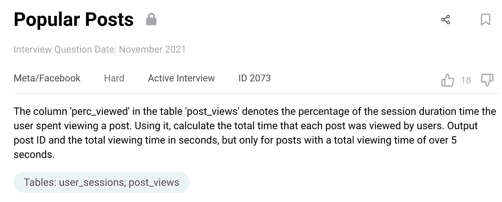
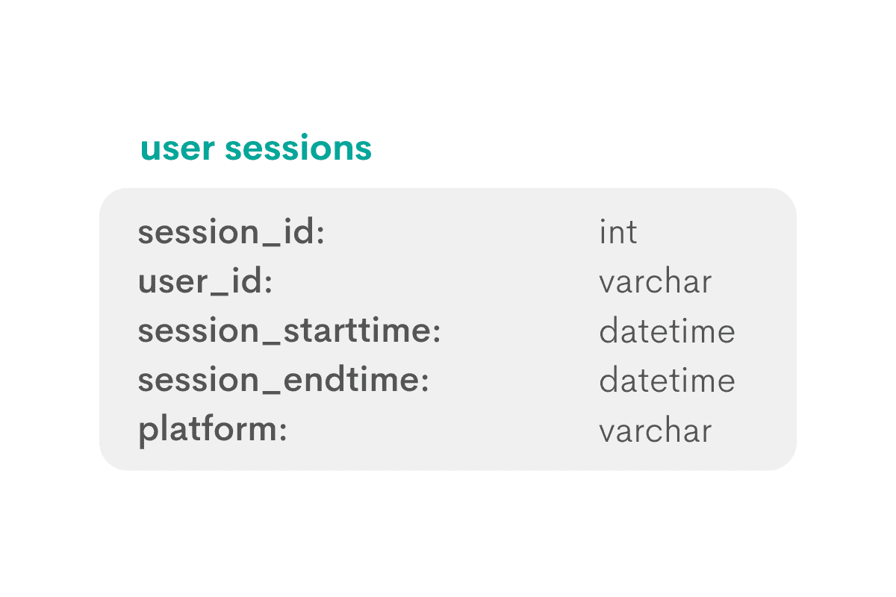
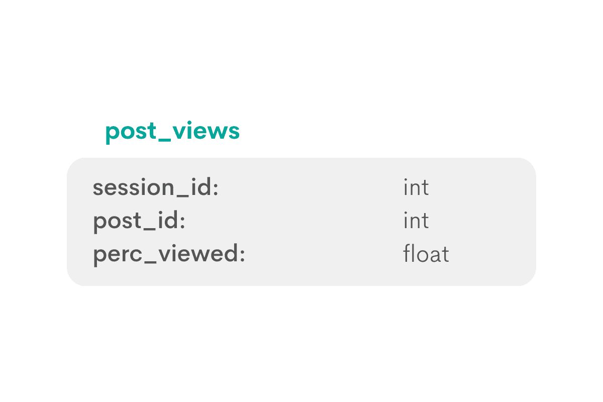
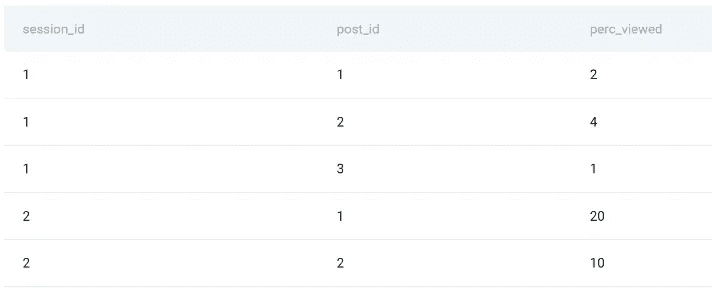
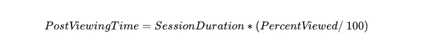
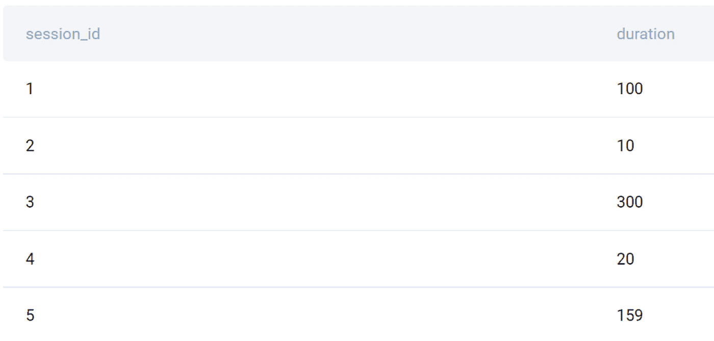
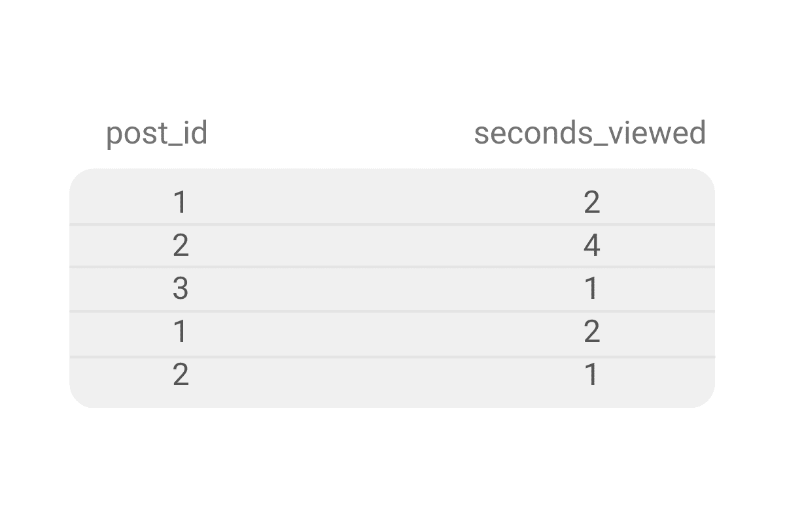
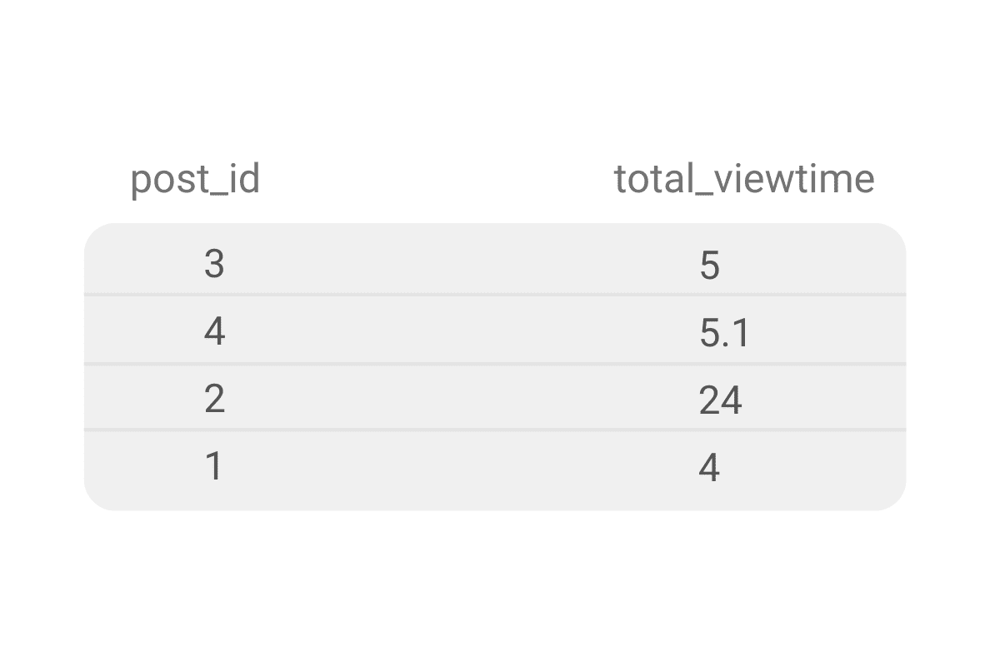
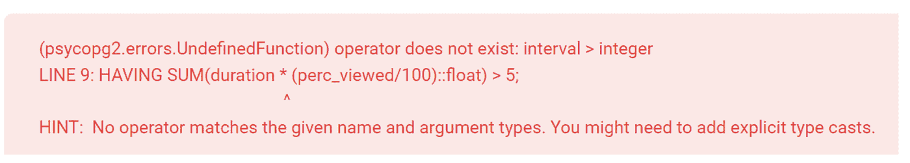
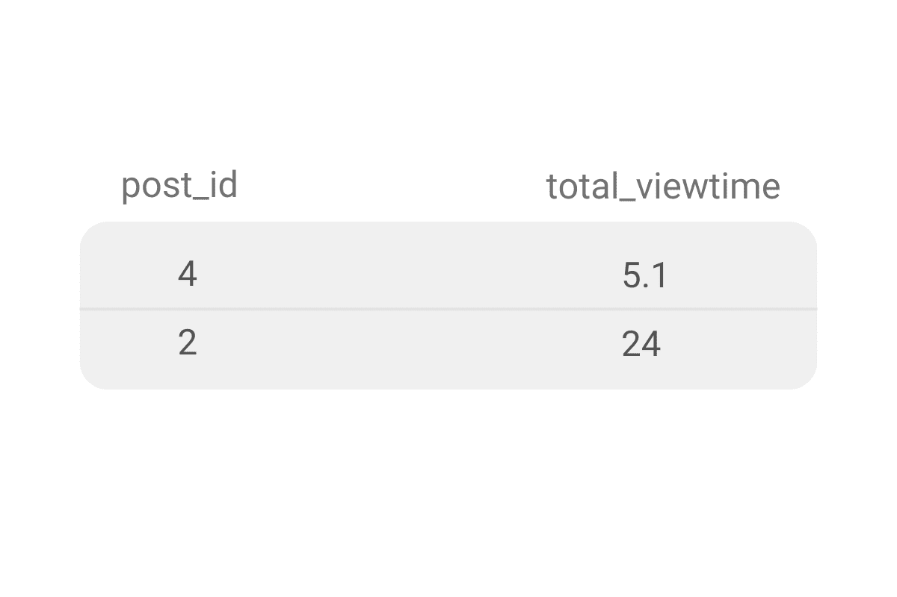

# 脸书 SQL 面试问题演练—热门帖子

> 原文：<https://towardsdatascience.com/facebook-sql-interview-question-walkthrough-popular-posts-614b34ec3861>

## 我们的一系列面试问题演练继续进行！今天我们将处理高级元/脸书 SQL 面试问题。


作者在 [Canva](https://www.canva.com/) 上创建的图片

元/脸书都是关于数据的，而这些数据是你创造的。你作为用户喜欢什么，评论什么，发帖什么，都会定期收集分析。

这一分析体现在我们今天向您展示的面试问题中。为了让解释更加简单，我们制作了一个视频:

# meta/脸书 SQL 面试问题

这个问题会问你以下问题。



这是问题的[链接](https://platform.stratascratch.com/coding/2073-popular-posts?code_type=1&utm_source=blog&utm_medium=click&utm_campaign=medium)，如果你想跟我一起去的话。

你的任务是找出热门帖子，即那些被浏览超过 5 秒钟的帖子。对于所有热门的帖子，你需要找到帖子 ID 和以秒为单位的总观看时间，才能通过这个面试问题。

这个要求看起来很简单，但是这个问题被归类为困难是有原因的。我们建议你通过应用这个简单而有效的框架来解决这个问题，以及所有其他的编码面试问题。

如果你这样做了，你就不会在解决问题的过程中看到所有等待你的陷阱，从而避免做出轻率的——而且大多是错误的——决定。

# 解决元/脸书(和所有其他)SQL 面试问题的解决方案框架


作者在 [Canva](https://www.canva.com/) 创建的图像

该框架由三个步骤组成。我们在许多文章中使用了这个框架，并对其进行了一些修改。

这些是我们在解决面试问题时要用到的步骤。

1.  探索数据集
2.  写出方法
3.  解决方案编码

首先，了解数据集。给你什么桌子，你需要所有的桌子吗？如何连接这些表？表格的列和数据类型是什么，数据显示什么，在表格中是如何表示的？这些都是这一步会帮你回答的问题。

然后考虑你将如何进行编码，你的代码的逻辑构建块，以及你将使用什么函数。如果你还没有，这是吸引面试官的必经步骤。与他们交谈，创造一个对话来验证你的逻辑是否正确。

最后，您可以开始编写您的解决方案了！

# 1.探索数据集

问题给出了表**用户会话**和**帖子视图**。

**user_sessions** 表包含以下数据类型的列。



您可以假设列 session_id 是表的主键。所有其他列为您提供关于特定会话的支持信息。

当分析数据集时，考虑如何创建列和表的叙述。这样，你会更好地理解你面前的数据集。这也给了你一个极好的机会与面试官交流，问问题，澄清你的假设。我们总是建议你在面试中大胆思考。一开始可能会觉得有点尴尬，但是当你看到它是如此的高效时，你很快就会习惯了。

这个表的叙述可以这样构成。每个会话 ID 都是连续的，并且对于用户和平台组合是唯一的。如果用户注销并重新登录，将会创建一个新的会话 ID。如果用户从笔记本电脑切换到移动设备会怎样？这将被记录为两个单独的会话。

由此，您可能会看到重复的用户 id 和 user_id/platform 组合。

第二个表具有以下模式。



session_id 列与第一个表中的相同，因此可以假定它是这个表的外键。可以使用这个公共列来连接这些表。

需要知道的一件重要事情是 perc_viewed 列中的数据是如何表示的。10%显示为 10.0 还是 0.1？你可以做一个假设，或者问面试官。

预览确认百分比是如何显示的。

**表格:**帖子 _ 浏览量



为了继续叙述，可以在单个会话中查看几个帖子。因此，上表中应该有多个会话 id。

此外，将有多个帖子 id，因为帖子可以在不同的会话中被多次查看。

# 2.写出方法

在考虑方法时，考虑输出应该是什么样子。然后，确定您需要什么数据，以及您需要如何操作它来获得所需的输出。

对于这个问题，输出将有两列:post_id 和 total_viewtime。

**1。计算会话持续时间**

持续时间是会话结束时间和开始时间之间的差值，可以在表 **user_sessions** 中找到。

EXTRACT()和 EPOCH 函数是获取会话持续时间(以秒为单位)的绝佳组合。

**2。计算帖子在每个时段的浏览次数**

可以使用以下公式计算观看后时间。



PercentViewed 是查看帖子所花费的会话百分比。这由表 **post_views** 中的 perc _ viewed 列表示。

另外，前面的计算必须转换成一个子查询，并与这个子查询连接。

**3。计算每个帖子在所有会话中的总浏览时间**

此计算需要使用 SUM()聚合函数对 PostViewingTime 求和。

要获得文章级别的值，需要按照 post_id 列对数据进行分组。

**4。仅过滤热门帖子**

请记住，该问题将热门帖子定义为观看时间高于 5 秒的帖子。

因为您将在聚合后过滤数据，所以使用 HAVING 而不是 WHERE。

# 3.解决方案编码

现在让我们使用概述的步骤来编写一个 SQL 解决方案。

**1。计算会话持续时间**

```
SELECT session_id,
 EXTRACT(EPOCH FROM session_endtime) - EXTRACT(EPOCH FROM session_starttime) AS duration
FROM user_sessions;
```

命令 EXTRACT(EPOCH FROM column_name)返回 Unix 时间戳或 Unix Epoch 时间。它是自协调世界时(UTC)1970 年 1 月 1 日星期四 00:00:00 以来经过的秒数。

就其本身而言，这个命令对这个分析没有太大帮助。然而，一旦演绎进入游戏，事情就不一样了。以秒为单位减去两个这样的值相当于以秒为单位获得两个日期时间值之间的时间差。你猜怎么着？这正是你解决这个问题所需要的。

运行上述代码会返回以下输出。



你可能认为有更直接的方法来做同样的事情。例如，通过直接减去结束和开始时间。

```
SELECT session_id,
       (session_endtime - session_starttime) AS duration
FROM user_sessions;
```

是的，是真的；它会给你带来同样的价值和产出——尽管只是表面上的。当直接减去两个日期时，结果是创建一个 interval 数据类型，而不是 float 或 integer。

我们还将向您展示如何使用这种方法来获得解决方案。

**2。计算帖子在每个时段的浏览次数**

在这一步中，添加计算文章查看时间的 SELECT 语句，并将其与前面的查询连接起来。

```
SELECT post_id,
       duration * (perc_viewed/100)::float AS seconds_viewed
FROM post_views p
JOIN
  (SELECT session_id,
          EXTRACT(EPOCH FROM session_endtime) - EXTRACT(EPOCH FROM session_starttime) AS duration
   FROM user_sessions) s ON s.session_id = p.session_id;
```

该查询将输出这些数据。



我们对数据的假设在这里被证明是正确的。每个帖子有多个条目，每个条目代表一个单独会话的一个视图。

**3。计算每个帖子在所有会话中的总浏览时间**

要获得所有会话中每个帖子的总查看时间，您需要在 post_id 级别聚合结果，并对总查看时间求和()。

```
SELECT post_id,
       SUM(duration * (perc_viewed/100)::float) AS total_viewtime
FROM post_views p
JOIN
  (SELECT session_id,
   EXTRACT(EPOCH FROM session_endtime) - EXTRACT(EPOCH FROM session_starttime) AS duration
   FROM user_sessions) s ON p.session_id = s.session_id
GROUP BY post_id;
```



在这个结果中，您获得了独特的职位和他们的总观看时间。在最后一步，你必须过滤数据，只显示热门的文章。

**4。仅过滤热门帖子**

要获得最终输出，需要使用 HAVING 子句。您不能使用 WHERE，因为您需要在聚合后应用过滤器。您可能已经知道了这一点，但是有必要提醒自己:WHERE 之前过滤数据，而 have 在聚合之后过滤数据。


输出显示了两个热门帖子及其各自的总查看时间。

# 可选择的解决方案

还记得我们说过日期可以直接减去吗？让我们试试看这种方法能否给出这个问题的正确答案。

```
SELECT post_id,
       SUM(duration * (perc_viewed/100)::float) AS total_viewtime
FROM post_views p
JOIN
  (SELECT session_id,
          (session_endtime - session_starttime) AS duration
   FROM user_sessions) s ON p.session_id = s.session_id
GROUP BY post_id
HAVING SUM(duration * (perc_viewed/100)::float) > 5;
```

不，它返回一个错误！



出现错误是因为 SUM(duration *(PERC _ viewed/100)::float)输出一个区间，我们将它与一个整数进行比较。

然而，这并不意味着我们不能让这种方法工作！解决方法相当简单；你得把整数转换成区间，就像这样。

```
SELECT post_id,
       SUM(duration * (perc_viewed/100)::float) AS total_viewtime
FROM post_views p
JOIN
  (SELECT session_id,
          (session_endtime - session_starttime) AS duration
   FROM user_sessions) s ON p.session_id = s.session_id
GROUP BY 1
HAVING SUM(duration * (perc_viewed/100)::float) > 5 * '1 sec'::interval;
```

这个对代码的微小修改给了你问题的答案。



# 最佳化

在大多数面试中，你会被问到的一个问题就是优化你的代码。看看解决方案，想想有什么可以优化的。

我想到的是通过使用公共表表达式或 CTE 使代码更具可读性。

这是优化后的解决方案。

```
WITH temp AS 
(SELECT session_id,
  EXTRACT(EPOCH FROM session_endtime) - EXTRACT(EPOCH FROM session_starttime) AS duration
FROM user_sessions)SELECT post_id,
       SUM(duration * (perc_viewed/100)::float) AS total_viewtime
FROM post_views p
JOIN temp ON p.session_id = temp.session_id
GROUP BY post_id
HAVING SUM(duration * (perc_viewed/100)::float) > 5;
```

# 结论

没那么难吧。

我们将这个问题归类为硬级别问题，因为它需要各种技术概念的知识，比如连接、聚合、过滤器、日期时间数据和子查询。

如果你对这些概念很熟悉，你应该很容易找到解决方案。同样重要的是了解您的数据，并预测可能会改变您的代码并使其工作或不工作的不同数据格式。

你现在需要的只是一些练习。查看类似“[脸书 SQL 面试问题](https://www.stratascratch.com/blog/facebook-meta-sql-interview-questions/?utm_source=blog&utm_medium=click&utm_campaign=medium)”和“[脸书数据科学家面试问题](https://www.stratascratch.com/blog/facebook-data-scientist-interview-questions/?utm_source=blog&utm_medium=click&utm_campaign=medium)”的帖子，练习更多真实世界的面试问题。