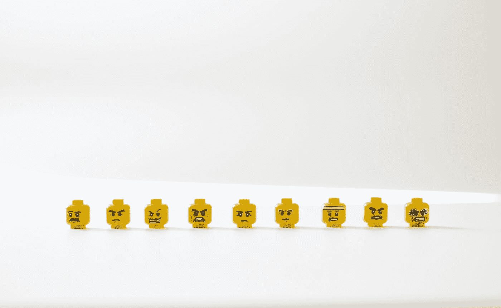
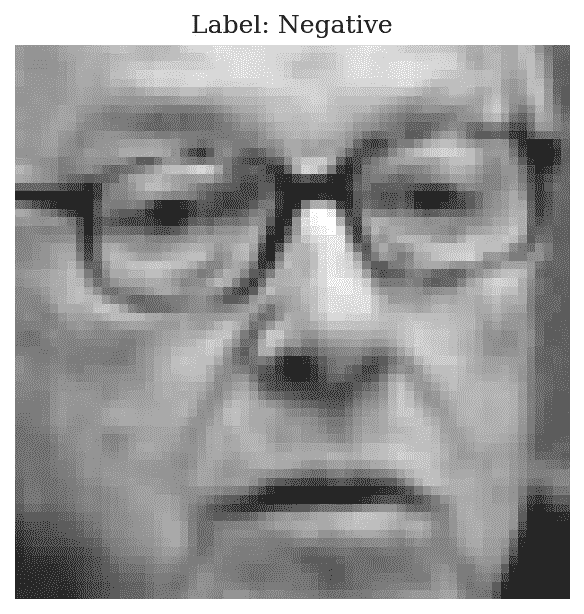
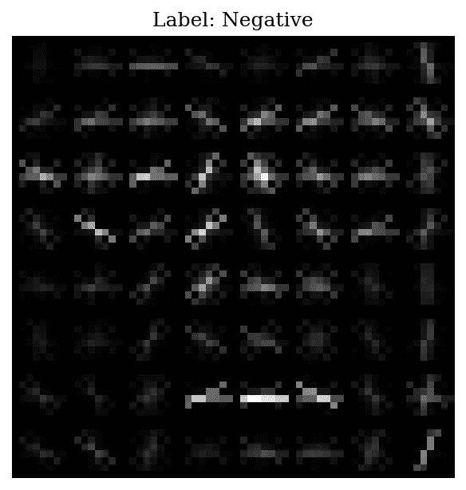
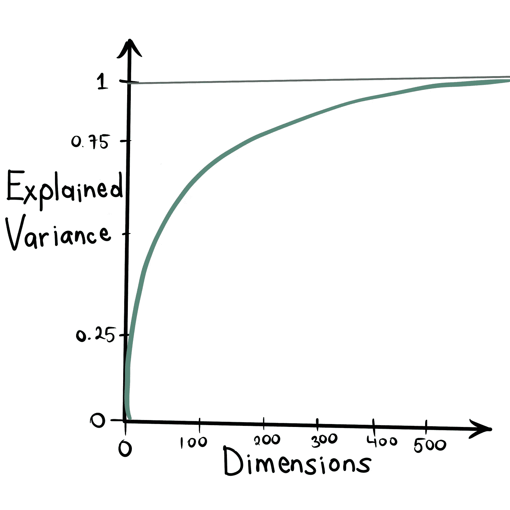
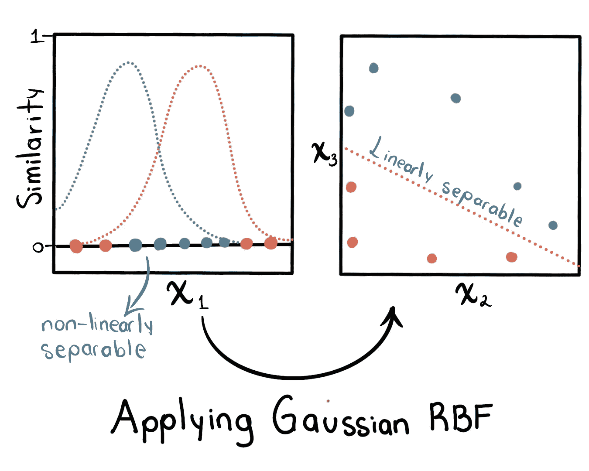
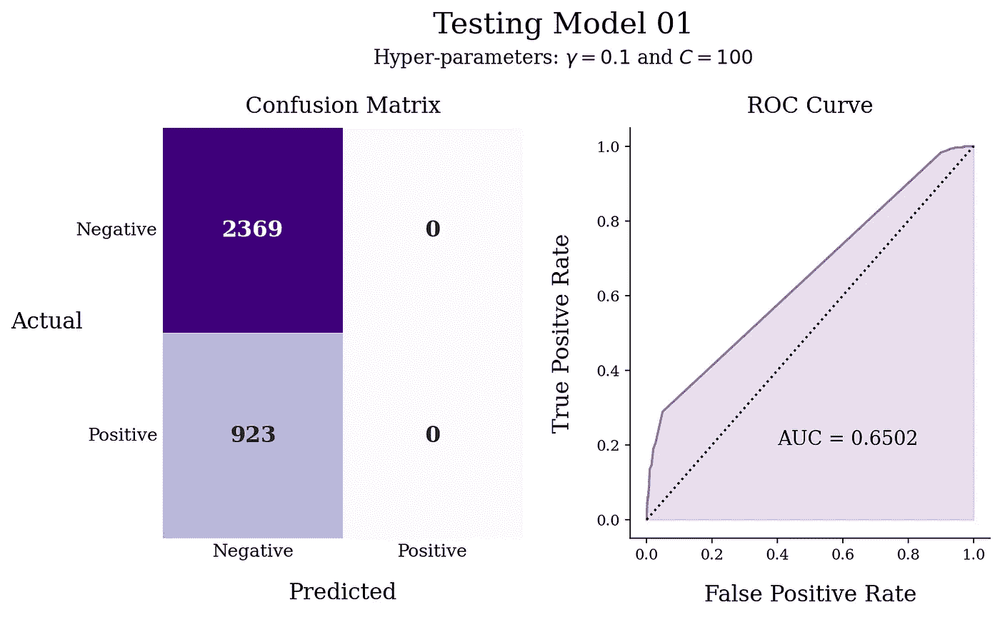
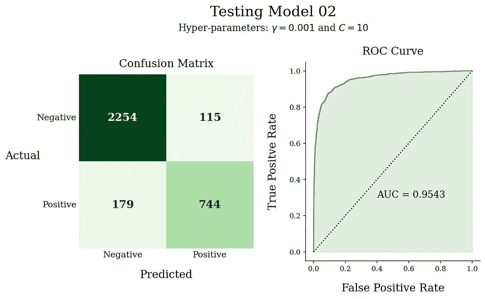
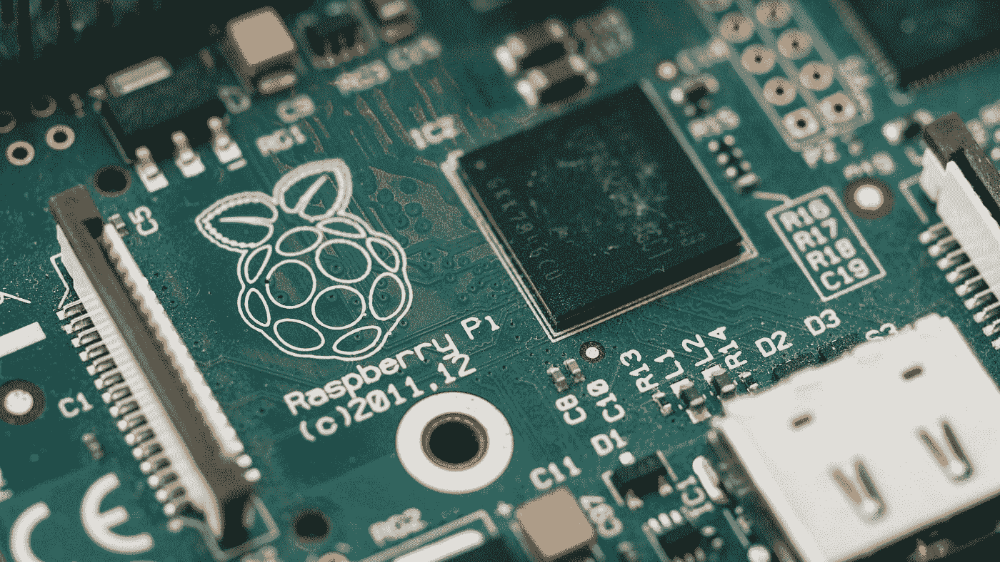

# 无人工神经网络的面部表情识别(FER)

> 原文：<https://towardsdatascience.com/facial-expression-recognition-fer-without-artificial-neural-networks-4fa981da9724>

# 无人工神经网络的面部表情识别(FER)

## SVM、PCA 和 HOG 联手解决了一个计算机视觉问题

照片由[你好我是尼克](https://unsplash.com/@helloimnik?utm_source=medium&utm_medium=referral)在 [Unsplash](https://unsplash.com?utm_source=medium&utm_medium=referral)

# 介绍

## 数据和机器学习

当谈到**机器学习时，**很明显，*从数据中学习*的是计算机编程的科学(和艺术)[1]。但是，这个定义引发了一些问题，第一个就是:数据？Excel 电子表格？

人们首先想到的(或者至少是我首先想到的)是**结构化数据**，比如**。xlsx** 或**。csv** 文件。然而，每个人都说“数据无处不在”，我最喜欢的是**图像**(归根结底，图像只是一组数字)**。**

照片由[西蒙·李](https://unsplash.com/@simonppt?utm_source=medium&utm_medium=referral)在 [Unsplash](https://unsplash.com?utm_source=medium&utm_medium=referral) 上拍摄

计算机对数字图像或视频执行的任务属于**计算机视觉领域。**当计算机视觉与**深度学习**(专注于人工神经网络的机器学习领域)相结合，令人兴奋的项目和应用就出现了。

由于**卷积神经网络(CNN)** 的实现，有许多计算机视觉任务已经涉及到深度学习(如图像分类和对象检测)。

照片由 [Alina Grubnyak](https://unsplash.com/@alinnnaaaa?utm_source=medium&utm_medium=referral) 在 [Unsplash](https://unsplash.com?utm_source=medium&utm_medium=referral) 上拍摄

## 代替卷积神经网络的经典机器学习

很明显，面对任何图像分类问题，CNN 都是最合适的；然而，在这个项目中，我想通过*经典的*机器学习算法找到一个解决方案。

也许有些读者想知道我为什么要这样做。简而言之，我想尝试特征提取方法，探索经典机器学习算法的局限性。

# 放弃

在这个项目中，我旨在探索如何解决这个问题。由 Hivi Ismat Dino 和 Maiwan Bahjat Abdulrazzaq 编写的基于 SVM、KNN 和 MLP 分类器的面部表情分类中规定了该方法。

# 数据和维度的诅咒

> 你可以在这里下载图片和 CSV 文件

在小尺度下，物理现象的表现与普通尺度不同(量子物理 vs 经典物理)；类似的行为发生在更高的维度。

二维向量有两个分量，并且存在于二维空间中:

三维向量有三个分量，存在于三维空间中:

以此类推:

有趣的事情发生在高维空间，例如:

*   高维超立方体中的大多数点都非常靠近边界[1]
*   超立方体中两点之间的平均距离是很重要的。例如，在三维立方体中，任意两点之间的平均距离为 0.66；但是在一个 100 万维的超立方体中，两点之间的平均距离是 408.25 [1]。

发生什么事了？为什么会这样？嗯，在高维空间里有很多空间。因此，数据非常稀疏，导致新实例远离训练数据，使得预测不如低维数据集可靠[1]

使用的数据集是表达两种情绪之一的面部图像的集合:积极的或消极的。这些图像是 64×64 像素，如果每个图像都被转换成一个超矢量，我们最终会得到 4096 个特征数据集，这是一个很大的维度。

## 怎么解决呢？

对于这种情况，有许多处理方法，但值得探索的有:

*   **特征检测。**
*   **降维。**

# 特征检测器:梯度方向直方图(HOG)

**H** 面向**O**G 的特征描述符( **HOG** )是 Dalal 等人在 2005 年提出的特征描述符[2]。该描述符计算特定像素周围像素亮度的变化。这种变化由梯度(变化向量)给出，其具有幅度 ***m*** 和角度𝛉(等式。1 和 Eq。2):

等式 1

等式 2

如果你想深入了解这个技巧，我推荐下面这个视频([此处](https://youtu.be/XmO0CSsKg88))。

图一。示例:原始人脸图像

图二。示例:面部的猪图像

通过应用该技术，特征的数量从 4096 变为 1764(减少了 60%)。

> HOG 可以在**库上找到*scikit-image*** `**from skimage.feature import hog**`

# 降维:主成分分析

多亏了 HOG，维度下降了，但还不够；必须采取下一步措施。

P**P**主成分 **C** 成分 **A** 分析( **PCA** )是减少数据集中特征数量的最流行方法之一。这个**无监督学习**算法找到了保留最大信息量的线性投影。换句话说，PCA 找到最大化数据集方差的超平面[1]。

像 K-Means 一样，我们必须声明我们想要的聚类数；使用 PCA，我们必须给出我们想要减少数据集的特征的数量。用于查找最佳特征数量的标准标准是当**解释的方差**没有显著增加时，类似于 K-Means 上的肘方法。

图 3。**的变化解释了差异。**图形未缩放。图由作者制作。

获得简化特征的最佳数量的另一种方法是给出我们想要保留的信息的百分比(或比例)。

# 分类器:支持向量机

**S**support**V**ector**M**achine(**SVM**)是机器学习中最优雅的算法之一，也是最强大的算法之一。有了正确的预处理数据，SVM 的性能可以达到人工神经网络的高度，就像文章*手写数字识别的降维*【3】中所说的那样

这个算法的一个特点是**内核技巧。**这种技术在不影响计算性能的情况下转换数据的维度，因此它可以是线性可分的[1]。

有一种处理非线性问题的技术，它增加了使用*相似性函数*计算的特征，该函数测量每个实例与特定*地标的相似程度。***高斯*径向基函数*** 是一个相似性函数，加上内核技巧的魔力，在 SVM 上产生了令人难以置信的结果。

图 4。**高斯 RBF** 如何转换数据的例子。原特征为**x1**； **x2** 和 **x3** 是由高斯 RBF 创建的特征。灵感来自[1]。

等式 3。高斯径向基函数

等式 3 向我们展示了高斯 RBF 核，其中 **a** 和 **b** 是超矢量，𝛄(伽马)是超参数。增加𝛄会使钟形曲线变窄(如果模型拟合不足，则增加𝛄)，从而导致每个实例的影响范围变小，而减少𝛄会使钟形曲线变宽(如果模型拟合过度，则减少𝛄 )，从而导致相反的效果。

基于 Sci-kit 学习的高斯 RBF 核 SVM。记住 **C** 也是一个**正则化超参数**。所以 C 的值越大，支持向量的边界就变得越严格。

# 管道

> 除了所讨论的过程之外，在 SVM 分类器之前，数据必须处于相同的尺度；于是有了`**StandardScaler**` 。
> 
> 此外，为了在管道中实现 HOG，必须创建一个新的类

# 第一个模型

## 韵律学

**精度:** 0.71962
**精度:** 0
**回忆:**0
**F1-得分:** 0

## 讨论

使用该模型及其超参数获得了低性能。混淆矩阵显示了导致高准确度的高真阴性；但是，没有检测到真阳性，导致所有其他指标的值为 0。

# 微调模型

为了提高模型的性能，必须修改超参数。手动完成这项任务并跟踪表演是乏味和累人的；为此使用了`**GridSearchCV**`。

## **指标**

**精度:** 0.91069
**精度:** 0.86612
**回忆:**0.80606
**F1-得分:** 0.83502

## 讨论

在应用 GridSearchCV 之后，找到了 SVM 的最佳超参数，并与先前的模型进行了比较；预测到目前为止有所改善。此外，该模型实现了高百分比和良好的平衡，用于将实际上正确的正类人脸从那些预测的人脸中分类出来，而没有很多错误警报。

ROC AUC 和 ROC 曲线的形状显示了良好的预测模型。

# 结论

## 关于项目

多亏了`**GridSearchCV**`，找到了模型的最佳超参数，通过这种方式，模型在精确度、召回率以及 F1 分数方面都取得了高分。重要的是要澄清`**GridSearchCV**`不是要创造一个随机数字的网格。了解这些超参数如何影响算法，可以区分执行的好坏。

支持向量机可以做很多事情。该项目展示了这种算法如何提取 n 维空间的*抽象*特征，并设法进行合理的分类。

## 未来的工作

这个项目的下一步是在一些应用程序中使用最终的模型，或者在外部设备上实现它，例如带有网络摄像头的 Raspberry Pi。

照片由[哈里森·布罗德本特](https://unsplash.com/@harrisonbroadbent?utm_source=medium&utm_medium=referral)在 [Unsplash](https://unsplash.com?utm_source=medium&utm_medium=referral) 上拍摄

## 关于我学到的东西(个人观点)

在这个项目中，我可以探索更多的特征提取过程，如 **HOG** 和 **PCA** 。虽然 **HOG** 不再是一种最先进的技术，但是理解底层计算从来都不是一个坏主意。一旦应用到项目中，这个概念就更容易理解了。

以复杂的问题为例，这些问题已经通过深度学习进行了处理，并尝试用经典的机器学习算法来解决它们，可以帮助更好地理解所看到的概念和新概念的应用。我也相信这样做显示了对同一情况采取不同观点解决问题的能力。

# 贮藏室ˌ仓库

 [## GitHub-isaacarroyov/fer _ without _ ann:机器学习项目

### 机器学习项目，其中面部表情识别(FER)问题的方法是用经典的机器…

github.com](https://github.com/isaacarroyov/fer_without_ann) 

# 关于我

> 我是艾萨克·阿罗约，工程物理学家。我想象自己通过使用数据科学和机器学习工具来解决不同类型的问题。我对数据可视化和无监督学习感兴趣。
> 
> 你可以联系我，或者通过社交媒体(Instagram、Twitter 或 LinkedIn)关注我的工作和经历[这里](https://linktr.ee/unisaacarroyov)。我也用英语和西班牙语创建内容。

# 参考

**【1】**géRon，A. (2019)。*用 Scikit-Learn、Keras 和 Tensorflow 进行动手机器学习:构建智能系统的概念、工具和技术*(第二版。).奥莱利媒体。

达拉勒，n .，&特里格斯，B. (2005 年 6 月)。用于人体检测的方向梯度直方图。2005 年 IEEE 计算机学会计算机视觉和模式识别会议(CVPR’05)(第 1 卷，第 886–893 页)。Ieee。

**【3】**Das，a .，Kundu，t .，& Saravanan，C. (2018)。手写数字识别的降维方法。EAI 认可云系统交易，4(13)。