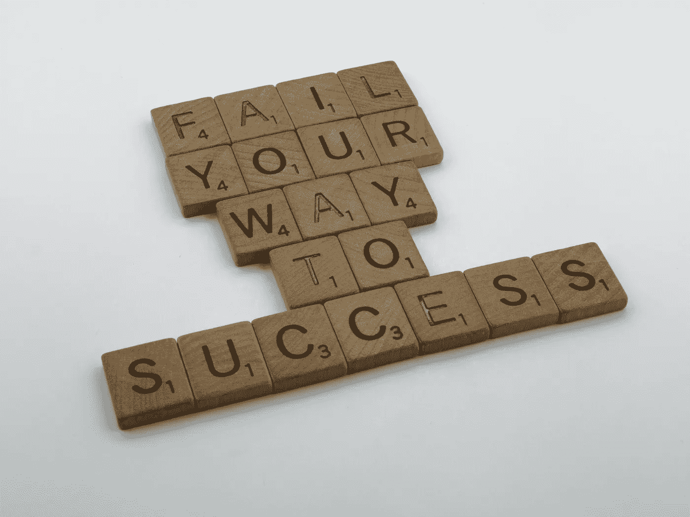

# 数据科学面试失败？这里有一些帮助你成功的建议

> 原文：<https://towardsdatascience.com/failed-in-data-science-interview-here-are-some-tips-to-help-you-succeed-2e9a6bb2b307>

## 基于 10，000+小时的经验和多次失败！

布雷特·乔丹在 [Unsplash](https://unsplash.com/s/photos/success?utm_source=unsplash&utm_medium=referral&utm_content=creditCopyText) 上的照片

首先，如果你最近面试失败。记住，失败不是终点。这是一次学习和下次表现更好的机会。这是我最喜欢的克服失败的名言之一。

> 在我的职业生涯中，我已经错过了 9000 多次投篮。我已经输了将近 300 场比赛。有 26 次我被信任去投决定胜负的一球，但都没投进。我一生中一次又一次地失败。这就是我成功的原因。
> 
> —迈克尔·乔丹

我在许多数据科学工作面试中失败了。我继续在许多事情上失败。我早期的失败非常令人沮丧。这甚至让我怀疑自己的能力。我最终在数据科学领域获得了成功。这篇文章不是要吹嘘我的成功。相反，它是关于从我的失败中吸取的教训。最令人沮丧的是看到人们在非常接近成功后就放弃了。我见过很多人投入大量时间学习数据科学。但是在几次失败后，他们开始怀疑自己的能力并放弃了。如果你曾经在数据科学面试中面临失败，或者你有兴趣从别人的失败中学习。我保证这篇文章不会让你失望。

有些人尝试几次就能成功。有些人需要更长的时间才能找到成功。这里的关键是要有耐心，继续专注于学习。下面是一篇关于一个人花了 475 份工作申请和 6 个月找到成功的文章。

 [## 如何在你梦想的公司找到一份数据科学家的工作——我的 Airbnb 之旅

### 流程、提示和一些资源

towardsdatascience.com](/how-to-land-a-data-scientist-job-at-your-dream-company-my-journey-to-airbnb-f6a1e99892e8) 

没关系，失败过多少次。最重要的是要有一个成长的心态。在这篇文章中，我将讨论在数据科学面试中需要关注的重要领域。

# 1.为开幕做准备

最初的几分钟是面试中最重要的部分。根据这篇[文章](https://theundercoverrecruiter.com/infographic-how-interviewers-know-when-hire-you-90-seconds/)，33%的老板在面试的前 90 秒做出决定。

在大多数面试中，问的第一个问题是“说说你自己吧”。对这个问题做好充分的准备。你可以利用这个问题来推动对你有利的面试讨论。回答这个问题的一个简单公式是，

*   谈谈你目前的角色和项目
*   谈谈你的经历和成就
*   谈谈你的计划，以及这个角色如何与你的职业目标相一致

把你的回答控制在 2 分钟以内，多练习几次。不要重复你简历中的内容，你的面试官肯定会有一份你的简历。下面是 Seek 关于准备这个问题的一篇有趣的文章。

 [## 如何在面试中回答“谈谈你自己”——寻求职业建议

### 你在面试，你已经做完了介绍，现在问题来了:“那么，告诉我关于…

www.seek.com.au](https://www.seek.com.au/career-advice/article/how-to-answer-so-tell-me-about-yourself) 

大多数人几乎不花任何时间准备这个问题。对这个问题有一个好的回答的重要性经常被低估。这常常被认为是理所当然的。

无法预测面试问题。但是你可以为最有可能被问到的问题做好准备。这无疑是求职面试中经常被问到的问题之一。如果你对这个问题有充分的准备，你将会有一个令人印象深刻的开始。

# 2.刷新基础

一旦你在最初的几分钟内给人留下了印象，那么唯一要关注的就是不要给出拒绝你的理由。确保这一点的一个方法是不要在数据科学基础知识上犯任何错误。

您需要熟悉数据科学项目整个生命周期中的基本概念。以下是大多数数据科学项目中常见的关键步骤背后的一些概念参考。在你面试之前修改这些话题是非常重要的。

## **特色工程**

数据从来都不够干净，无法被模型直接使用。它总是需要某种程度的改进。面试官通常很想知道你是否知道通用的特征工程技术。此外，要很好地理解何时使用哪种技术。下面是一个惊人的资源，清楚地解释了特征工程的基础。本文还解释了使用这些技术的基本原理和好处。

 [## 面向机器学习的特征工程基本技术

### 用熊猫例子进行综合数据预处理所需的所有方法。

towardsdatascience.com](/feature-engineering-for-machine-learning-3a5e293a5114) 

下面是一个 Kaggle 笔记本的链接，它实现了常用的特征工程技术。

 [## 特征工程方法参考指南

### 使用 Kaggle 笔记本探索和运行机器学习代码|使用来自多个数据源的数据

www.kaggle.com](https://www.kaggle.com/code/prashant111/a-reference-guide-to-feature-engineering-methods/notebook) 

## **功能选择**

在特性工程之后，下一个明显的步骤是特性选择。我们很少最终使用所有的功能。特征选择是一个重要的步骤，它帮助我们识别关键的特征或者去掉不重要的特征。下面是一个惊人的资源来学习和修改在不同情况下用于特征选择的技术。

 [## 机器学习中的特征选择技术

### 在现实生活中构建机器学习模型时，数据集中的所有变量都有用的情况几乎是罕见的…

www.analyticsvidhya.com](https://www.analyticsvidhya.com/blog/2020/10/feature-selection-techniques-in-machine-learning/) 

## **了解算法**

根据角色和工作级别的不同，此处要求的最低专业技能也有所不同。仅仅列举出可以用来解决特定问题的算法是不够的。但是，理解最适合不同场景的算法是很重要的。下面是一篇有趣的文章，解释了不同的算法及其优缺点。它还涵盖了可以使用算法的场景。

 [## 用哪个机器学习模型？

### 陈述你的问题，并跟随这篇文章来知道使用哪个模型。

towardsdatascience.com](/which-machine-learning-model-to-use-db5fdf37f3dd) 

基于树的集成模型在许多现实生活用例中非常流行。与传统回归算法相比，基于树的集成模型的成功率要高得多。下面是另一篇深入的文章，解释了基于树的集合模型。它讨论了它们的优点、缺点和参数，并做了比较研究。

 [## AdaBoost、随机森林和 XGBoost 的终极指南

### 它们是如何工作的，有何不同，何时应该使用？

towardsdatascience.com](/the-ultimate-guide-to-adaboost-random-forests-and-xgboost-7f9327061c4f) 

## **车型评测**

通常，在开发解决方案时，我们会尝试不同的算法。但最终我们会选择那些与其他公司相比表现更好的公司。模型评估指标用于衡量模型的性能。这里有一个关于不同评估技术的终极指南，可以用于不同的问题。

 [## 机器学习中模型评估和选择的终极指南- neptune.ai

### 在高层次上，机器学习是统计和计算的结合。机器学习的关键在于…

海王星. ai](https://neptune.ai/blog/the-ultimate-guide-to-evaluation-and-selection-of-models-in-machine-learning) 

## **面试中常见的其他概念**

除了上面的题目，这里还有一些题目需要修改。关于这些话题的问题在面试中经常被问到。

*   **降维:**当数据集中有太多特征时，通常使用这种技术。当特征的数量较少时，这意味着较少的内存就足够了，并且可能也需要较少的计算时间。这有助于减少数据集中的噪音。要详细了解优势和不同的技术，请查看下面的文章。

 [## 2021 年你应该知道的 11 种降维技术

### 减少数据集的大小，同时尽可能保留变化

towardsdatascience.com](/11-dimensionality-reduction-techniques-you-should-know-in-2021-dcb9500d388b) 

*   **调整:**用于防止过拟合或欠拟合。套索和脊是最常用的正则化技术。它们之间的一个关键区别是，在 Ridge 中，所有的特征都被保留，而在 Lasso 中，不重要的特征被删除。要修改这两种技术，请查看下面的文章。

 [## 机器学习中的正则化技术

### 每个数据科学从业者面临的最常见问题之一是过度拟合。你解决了这个问题吗…

www.analyticsvidhya.com](https://www.analyticsvidhya.com/blog/2021/05/complete-guide-to-regularization-techniques-in-machine-learning/) 

*   **偏差和方差:**偏差和方差对于研究模型结果非常方便。这两者有一种相反的关系。这意味着不可能有一个低偏差和低方差的模型。在两者之间找到平衡是一门艺术。要修改主题，请参考下面的文章。

 [## 偏差和方差之间的差异

### 理解偏差和方差，这有统计学的根源，是数据科学家参与机器…

www.mastersindatascience.org](https://www.mastersindatascience.org/learning/difference-between-bias-and-variance/) 

# 3.准备项目笔记

项目是我们简历和工作面试的一个重要方面。许多面试讨论是由项目细节驱动的。随着时间的推移，我们的记忆可能会失败。我们可能会忘记项目的一些细节。例如，数据中存在的数据质量问题、项目环境的限制等等。虽然这些在更大的计划中可能是微不足道的，但这些可能是项目一些关键决策背后的原因。这些细节可能会对你的面试产生非同寻常的影响。因此，我总是建议人们记录项目、使用的技术和模型，以及它们使用背后的基本原理。

这些项目笔记不需要很大的文档。如果这是一份很大的文件，那么它对面试准备没有太大的帮助。出于面试的目的，尽量少记笔记。它不应该超过几个要点。以下是一些可以作为参考的问题，

*   1-2 分钟的项目总结
*   项目的关键目标
*   团队和技能组合
*   关键决策及其背后的基本原理
*   技术和非技术问题
*   项目中涉及的步骤
*   技术和工具的详细信息及其使用原理
*   项目的影响
*   可以做的改进/改变

这不仅对你的面试准备有用，而且对更好地理解也很有帮助。

如果你是数据科学的新手，那么你需要首先专注于建立一个好的项目组合。你可以通过在你的文件夹里放一个巨大的项目来破解一次面试。

# 4.阅读工作内容，了解公司

对这个职位或公司不够了解会给面试官发出危险信号。此外，在与面试官进行一般性讨论时，研究公司和工作简介有助于提高你的自信水平。它也发出了你准备充分的明确信号。

你可以更好地了解这个职位和公司的一些地方是，

*   公司网站
*   搜索关于公司的最新消息
*   看看他们的博客
*   查看他们的社交媒体页面
*   搜索并了解他们的比赛
*   关于整个行业的研究
*   浏览 Glassdoor 上关于工作文化和面试流程的员工评论

# 5.从你的错误中学习，并有一个导师

面试失败也没关系，只要你能从中吸取教训。面试结束后，你可以花些时间回顾一下你的回答。你可以写下本可以做得更好的回答。这将有助于你在再次被问到类似问题时做好更充分的准备。了解你表现的另一个方法是直接向招聘人员寻求反馈。

更好地准备的一个方法是与朋友或导师讨论这些问题。他们可以帮助提供你可能不知道的细节。或者，你可以请一位更有经验的专业人士进行模拟面试。模拟面试有助于提高你的自信。在真正的面试之前，这对你更好地控制压力水平很有帮助。它还可以帮助你想出正确的策略。

根据你收到的反馈，检查你的简历是否需要更新。此外，让你在数据科学领域的朋友审阅你的简历，或者让导师审阅更好。有一些惊人的技巧可以写出一份好的简历。下面是一篇此类文章的链接，这篇文章讲述了撰写极具影响力的简历的强大技巧。

 [## 如何打造令人印象深刻的数据科学简历？

### 制作一份引人注目的有影响力的简历的建议

towardsdatascience.com](/how-to-build-an-impressive-data-science-resume-7a9c71f761c5) 

导师在一个人的职业发展中起着非常重要的作用。他们不仅仅帮助提供反馈。他们提供情感支持，也让你接触到他们的网络。人际关系网对了解有趣的工作机会很有帮助。

# 6.更有用的准备材料

下面是一些令人惊艳的面试准备资料。

 [## 2022 年 122 大数据科学面试问答

### 在这个数据科学面试问题博客中，我将向您介绍最常被问到的数据科学面试…

www.edureka.co](https://www.edureka.co/blog/interview-questions/data-science-interview-questions/)  [## GitHub-khanhnamle 1994/破解数据-科学-采访:一系列备忘单、书籍…

### 以下是几个部分:这一部分包含数据科学中的基本概念的备忘单，将在…

github.com](https://github.com/khanhnamle1994/cracking-the-data-science-interview)  [## 50 个机器学习面试问答。数据科学和机器学习

### 50 个机器学习面试问答。

www.kaggle.com](https://www.kaggle.com/questions-and-answers/172221)  [## SQL 问题|测试数据科学专家的 SQL 测验

### 如果有一种语言是每个数据科学专业人员都应该知道的，那就是 SQL。SQL 代表结构化查询…

www.analyticsvidhya.com](https://www.analyticsvidhya.com/blog/2017/01/46-questions-on-sql-to-test-a-data-science-professional-skilltest-solution/)  [## 理想的数据科学家的个人资料是什么样的？

### 分析 1000 份招聘启事的发现

towardsdatascience.com](/what-does-an-ideal-data-scientists-profile-look-like-7d7bd78ff7ab) 

# 最终提示

*   做你自己！做你自己会让你更舒服
*   对面试公司了解不够是一个严重的错误
*   准备好回答你为什么想加入这家公司。
*   准备好讨论你的薪资期望
*   准备好询问关于角色和公司的问题
*   不要谈论你不自信的概念、技术和算法
*   有一个在职业生涯中领先你 3-5 年的导师
*   回答问题时，一定要保持眼神交流

# 保持联系

*   如果你喜欢这篇文章，并对类似的文章感兴趣，[在 Medium](https://rsharankumar.medium.com/) 上关注我。成为[的中级会员](https://rsharankumar.medium.com/membership)，访问数千篇与职业、金钱等相关的文章。
*   我在我的 YouTube 频道上教授和谈论各种数据科学主题。[在这里订阅我的频道](https://www.youtube.com/c/DataSciencewithSharan)。
*   在这里注册[我的电子邮件列表](https://chipper-leader-6081.ck.page/50934fd077)获取更多数据科学技巧，并与我的工作保持联系