# python 中的 Faker 库——数据科学家的一个有趣的权宜之计

> 原文：<https://towardsdatascience.com/faker-library-in-python-an-intriguing-expedient-for-data-scientists-7dd06f953050>

## python 中“Faker”库的安装、使用和应用，它可以在短时间内为数据科学实验生成大量虚拟数据集


马库斯·斯皮斯克在 [Unsplash](https://unsplash.com/s/photos/fake?utm_source=unsplash&utm_medium=referral&utm_content=creditCopyText) 上的照片

> **“一个整洁有序的实验室是不太可能的。毕竟，这是一个错误开始和多次尝试的地方**
> 
> **艾萨克·阿西莫夫**

## **目录**

1.  介绍
2.  Faker 库的安装
3.  生成基本数据点(姓名、地址、工作、日期等。)
4.  生成虚拟配置文件
5.  生成唯一的数据点
6.  生成与货币相关的信息
7.  生成哈希和 UUIDs
8.  生成与互联网相关的数据
9.  生成 JSON 数据
10.  以多种语言生成数据点
11.  生成大型数据集
12.  python 中的类似库
13.  结论
14.  参考

## **简介**

数据是任何数据科学实验的主要基础。虽然数据是丰富的，但信息将是无结构的，需要研究人员在数据获取阶段付出巨大的人工努力，通过许多昂贵的转换和计算过程将其置于结构化和有组织的格式下。

大多数时候，在机器学习研究中建立概念证明(POCs)或观点(POV)时，感兴趣的现象将是检查商业想法或问题的可行性，以测试它是否可以使用最先进的算法来解决。在这种情况下，花费在数据转换和清理上的工作优先级较低，因为总体目标在于建模及其性能评估，以检查预测能力、主要业务可行性和假设。

为了节省时间和精力，研究人员通常会尝试编写一些程序，这些程序可以根据建模过程所需的概率分布、变量和统计数据来生成一些虚拟数据集。Python 已经推出了一个名为“Faker”的有效库，以帮助数据科学社区在短时间内毫不费力地自动完成创建虚拟数据集的过程。在本文中，我们可以了解 Faker 库的优势，以及数据科学家和机器学习工程师如何利用它来减少手动工作。

## **安装 Faker 库**

faker 库的安装非常简单。我们只需要使用一行代码，就像我们通常安装任何其他 python 库**一样。**

```
pip install Faker
```

在安装过程之后，我们需要创建一个 Faker 类的对象。使用这个对象，我们可以生成我们需要的任何类型的虚拟数据。

```
from faker import Faker
fakeobject = Faker()
```

## **生成基本数据点(姓名、地址、职务、日期等。)**

Faker 库提供了许多预定义的方法，通过这些方法我们可以生成属于各种类型信息的数据点，如年龄、地址、工作、日期等。让我们看一些基本的例子来熟悉这些方法

方法'**名称**'可用于生成一个虚拟名称-

```
fakeobject.name()
```

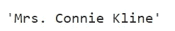

代码片段的输出(在 Jupyter 笔记本中有说明)

方法'**名**和'**姓**'可以用来生成一个虚拟的名和姓-

```
print(fakeobject.first_name())
print(fakeobject.last_name())
```


代码片段的输出(在 Jupyter 笔记本中有说明)

方法'**地址**可用于生成虚拟地址-

```
fakeobject.address()
```

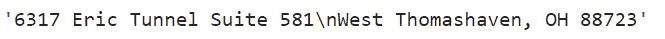

代码片段的输出(在 Jupyter 笔记本中有说明)

方法'**作业**'可用于生成虚拟作业-

```
print(fakeobject.job())
```

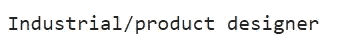

代码片段的输出(在 Jupyter 笔记本中有说明)

方法'**城市**'可用于生成虚拟城市-

```
print(fakeobject.city())
```


代码片段的输出(在 Jupyter 笔记本中有说明)

方法'**纬度**'和'**经度**'可用于生成虚拟经纬度-

```
print(fakeobject.latitude(), fakeobject.longitude())
```


代码片段的输出(在 Jupyter 笔记本中有说明)

方法'**文本'**可用于生成虚拟文本。这种方法对于生成可用于任何类型的 NLP 实验的文本数据非常有用

```
print(fakeobject.text())
```

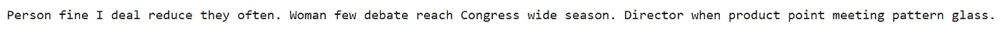

代码片段的输出(在 Jupyter 笔记本中有说明)

方法'**字**可用于生成虚拟字-

```
#This statement generates a dummy word
print(f'single word: {fakeobject.word()}')#This statement genetaes a list of 5 dummy words
print(f'list of 5 words: {fakeobject.words(5)}')
```

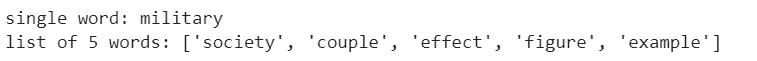

代码片段的输出(在 Jupyter 笔记本中有说明)

除了随机生成单词之外，还可以定义一个预定义的单词列表，并从该列表中选择随机的唯一单词。以下代码片段包含一个预定义的 5 个单词的列表，Faker 库从中随机选择 3 个唯一的单词-

```
listofwords = ['laptop', 'technology', 'science', 'mathematics', 'space']
print(f'random unique words: {fakeobject.words(3, listofwords, True)}')
```


代码片段的输出(在 Jupyter 笔记本中有说明)

还有一系列方法可以生成一些伪数字-

```
print(f'Random int: {fakeobject.random_int()}')
print(f'Random int: {fakeobject.random_int(0, 10)}')
print(f'Random digit: {fakeobject.random_digit()}')
```

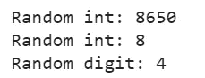

代码片段的输出(在 Jupyter 笔记本中有说明)

下面的代码片段由一些方法组成，这些方法可以生成一些与“**日期**和“**时间**”相关的虚拟信息-

```
print("Faker methods related to Date and Time")
print(f'Date of birth: {fakeobject.date_of_birth()}')
print(f'Year: {fakeobject.year()}')
print(f'Month: {fakeobject.month()}')
print(f'Month name: {fakeobject.month_name()}')
print(f'Day of week: {fakeobject.day_of_week()}')
print(f'Day of month: {fakeobject.day_of_month()}')
print(f'Time zone: {fakeobject.timezone()}')
```

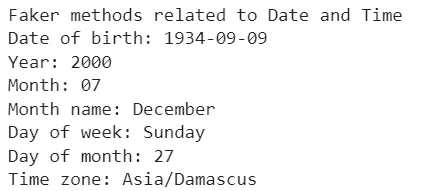

代码片段的输出(在 Jupyter 笔记本中有说明)

## **生成虚拟轮廓**

在上面的例子中，我们试图分别生成不同的数据点，如年龄、地址等。Faker 还提供了一种方法来生成一个人的虚拟个人资料，该资料将以组合格式包含所有上述信息。

```
profile1 = fakeobject.simple_profile()
profile2 = fakeobject.simple_profile('M')
profile3 = fakeobject.profile(sex='F')print(profile1)
print(profile2)
print(profile3)
```

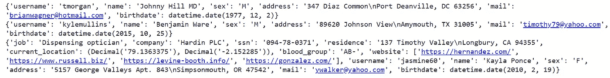

代码片段的输出(在 Jupyter 笔记本中有说明)

## **生成唯一数据点**

对于上述所有方法，当我们多次执行代码片段时，我们将得到不同的输出。因此，不能保证一个虚拟数据点是唯一的，当我们在循环中执行这些方法 1000 次时，很有可能最终生成重复的条目。为了克服这一挑战，Faker 提供了一种叫做“ **unique** 的方法，确保我们在上下文或循环中生成的每个数据点都是唯一的。

让我们看看这个方法的代码片段

```
names = [fakeobject.unique.name() for i in range(10)]
for i in range (0,len(names)):
  print(names[i])
```


代码片段的输出(在 Jupyter 笔记本中有说明)

在某些情况下，我们可能需要在程序的多个部分重新生成相同的数据点。可以使用 **seed()** 方法，给出一些 id 来唯一标识虚拟数据点，并在不同的上下文中重新生成它们。这种方法在其他各种 python 包中也非常流行。让我们用一个简单的例子来理解这个概念——

```
Faker.seed(10)
print(fakeobject.name())
```

这里，我在 seed 方法中提供了参数值“10”。在下一个编码语句中，我生成了一个假名。让我们检查一下上面代码语句的输出-

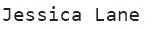

代码片段的输出(在 Jupyter 笔记本中有说明)

我们得到的输出是“杰西卡·莱恩”。

现在，让我们执行不包含种子方法的第二行代码-

```
print(fakeobject.name())
```


代码片段的输出(在 Jupyter 笔记本中有说明)

我们可以看到代码现在生成了一个不同的输出(“Robert Colon”)。但是如果我们想要重新生成之前的输出，我们可以通过使用相同的参数值来引用 seed 方法来执行相同的代码片段，如下所示

```
Faker.seed(10)
print(fakeobject.name())
```


代码片段的输出(在 Jupyter 笔记本中有说明)

这里，使用具有相同参数值(10)的种子方法，我们能够重新生成我们的旧虚拟名称(“Jessica Lane”)。

## **生成货币相关信息**

Faker 提供了各种方法来生成与货币相关的信息。下面的代码片段可以生成一些信息，如**货币名称，货币代码**等。

```
print(f'currency: {fakeobject.currency()}')
print(f'currency name: {fakeobject.currency_name()}')
print(f'currency code: {fakeobject.currency_code()}')
```

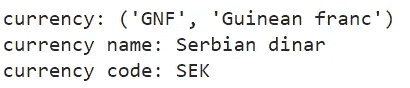

代码片段的输出(在 Jupyter 笔记本中有说明)

对于**加密货币**可以生成相同的信息

```
print(f'currency name: {fakeobject.cryptocurrency_name()}')
print(f'currency code: {fakeobject.cryptocurrency()}')
```

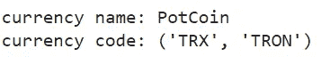

代码片段的输出(在 Jupyter 笔记本中有说明)

## **生成哈希和 uuid**

Faker 库还可以生成一些虚拟的“**通用唯一标识符(UUID)”**。UUIDs 是 128 位标签，用于在计算机系统中识别信息。用于实时生成 UUIDs 的一些散列算法是安全散列算法(sha)、消息摘要方法(md5)等。以下代码片段生成一些假散列和一个 UUID 值-

```
print(f'sha256: {fakeobject.sha256()}')
print(f'md5: {fakeobject.md5()}')
```

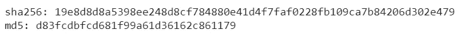

代码片段的输出(在 Jupyter 笔记本中有说明)

## **生成互联网相关数据**

Faker 还提供生成与互联网相关的虚拟数据的方法，如电子邮件地址、域信息、互联网协议信息等。

```
print("Domain related information")
print(f'Host name: {fakeobject.hostname()}')
print(f'Domain name: {fakeobject.domain_name()}')
print(f'Domain word: {fakeobject.domain_word()}')
print(f'TLD: {fakeobject.tld()}')
print(*f*'URL: {fakeobject.url()}')
print("")print("Email related information")
print(f'Email: {fakeobject.email()}')
print(f'Safe email: {fakeobject.safe_email()}')
print(f'Free email: {fakeobject.free_email()}')
print(f'Company email: {fakeobject.company_email()}')
print("")print("Internet protocol related information")
print(f'IPv4: {fakeobject.ipv4()}')
print(f'IPv6: {fakeobject.ipv6()}')
print(f'MAC address: {fakeobject.mac_address()}')
```

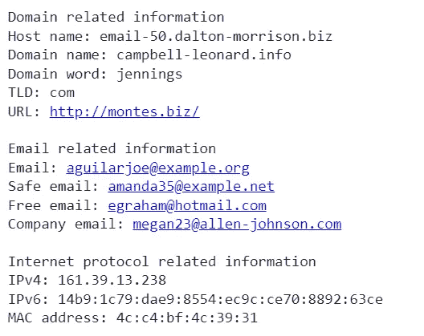

代码片段的输出(在 Jupyter 笔记本中有说明)

## **生成 JSON 数据**

Faker 还提供按照 JSON 格式生成对象的功能。可以通过生成一个单独的文件来存储数据。下面的代码片段生成两个随机雇员的详细信息，包括他们的雇员 Id、姓名、地址、工作和城市，最后生成一个单独的 JSON 文件，可以在其他任何地方使用。

```
#Import libraries
from faker import Faker
import json
from random import randint#Initilaiize the object
fakeobject = Faker()#Method to generate dummy details of the employees
def input_data(x):
    employee_data ={} for i in range(0, x):
      employee_data[i]={}
      employee_data[i]['Employee Id']= randint(1, 10)
      employee_data[i]['name']= fakeobject.name()
      employee_data[i]['address']= fakeobject.address()
      employee_data[i]['job']= fakeobject.job()
      employee_data[i]['city']= fakeobject.city()
      print(employee_data) #dictionary dumped as json in a json file
    with open('employee.json', 'w') as fp:
      json.dump(employee_data, fp)#defining the main method
def main():
    #variable to assign the number of employees
    number_of_employees = 2
    input_data(number_of_employees)#Invoking the main method
main()
```

输出文件将如下所示-

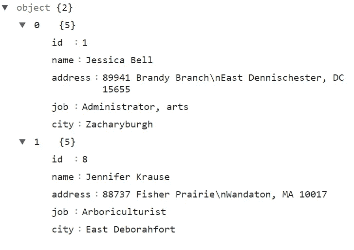

代码片段的输出(在 Jupyter 笔记本中有说明)

## **以多种语言生成数据点**

Faker 提供了在某些地区生成虚拟数据的特定方法。库中使用的默认选项是英语地区。我们可以在实例化 Faker 类的一个对象时提供一个参数，以使用我们需要生成虚拟数据的特定区域设置。

以下代码片段生成了一个日语姓名列表-

```
from faker import Faker
fakeobject = Faker('ja_JP')
for i in range(1,6):
    print(i," ",fakeobject.name())
```


代码片段的输出(在 Jupyter 笔记本中有说明)

## **生成大型数据集**

在前面的章节中，我们讨论了生成单个数据点的方法。但是我们需要 pandas 数据框架结构中的数据，该数据框架结构由任何类型的数据科学实验的多个数据点组成。使用 Faker 创建这样的数据框非常容易。以下代码片段生成一个虚拟数据帧，其中包含 5 个不同人员的个人资料信息-

```
from faker import Faker
import pandas as pd
fakeobject = Faker()
person_data = [fakeobject.profile() for i in range(5)]
dataframe = pd.DataFrame(person_data)
dataframe
```

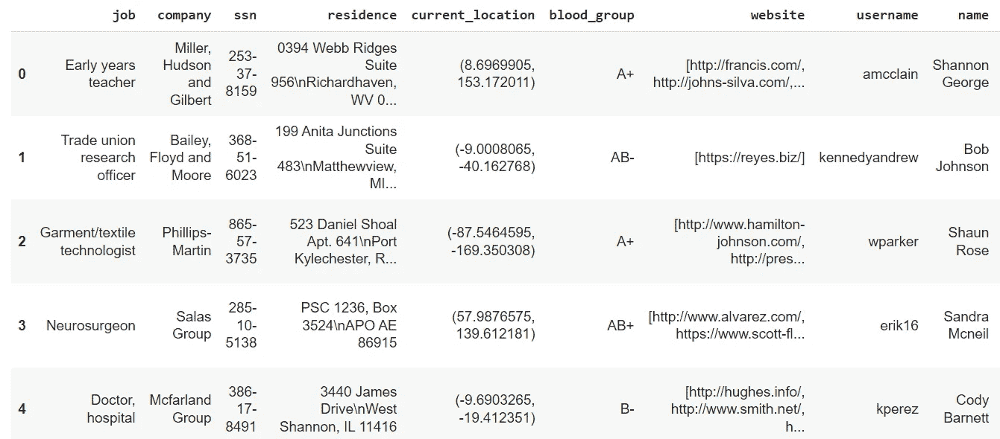

代码片段的输出(在 Jupyter 笔记本中有说明)

## **python 中的类似库**

虽然 Faker 目前正在成为数据科学家的首选，但也有其他结构良好且经过测试的库可以考虑作为 Faker 的替代品。有些是-

*   [模仿](https://mimesis.name/en/master/)
*   [FauxFactory](https://fauxfactory.readthedocs.io/en/latest/)
*   [雷达](https://radar-python.readthedocs.io/en/latest/)
*   [皮卡](https://pika.readthedocs.io/en/stable/)等。

## **结论**

在本文中，我们讨论了数据科学实验对虚拟数据的需求和使用，以及研究人员如何利用 Faker 库来获得优势。此外，我们学习了 Faker 库的各种方法和功能的各种实时编码示例。

下面的 URL 将所有的编程示例上传到 GitHub 库，这样你就可以根据自己的需求来玩代码了- [URL](https://github.com/Sanjay-Nandakumar/Faker_Library.git)

我希望现在你对 Faker 库有了直观的了解，这些概念将帮助你构建一些真正有价值的项目。

您可以通过以下平台与我联系-

1.  [Quora](https://www.quora.com/profile/Sanjay-Kumar-563?q=sanjay%20kumar)
2.  [领英](https://www.linkedin.com/in/sanjay-nandakumar-8278229b/)
3.  Gmail—sanjayjsw05@gmail.com

## 参考

1.  [官方文件](https://faker.readthedocs.io/en/master/)
2.  [Python 包 URL](https://pypi.org/project/Faker/)