# 爱上你的环境设置

> 原文：<https://towardsdatascience.com/fall-in-love-with-your-environment-setup-779dfbf047ba>

## Python 开发人员关于协作、生产就绪性和时间节约的最佳设置指南

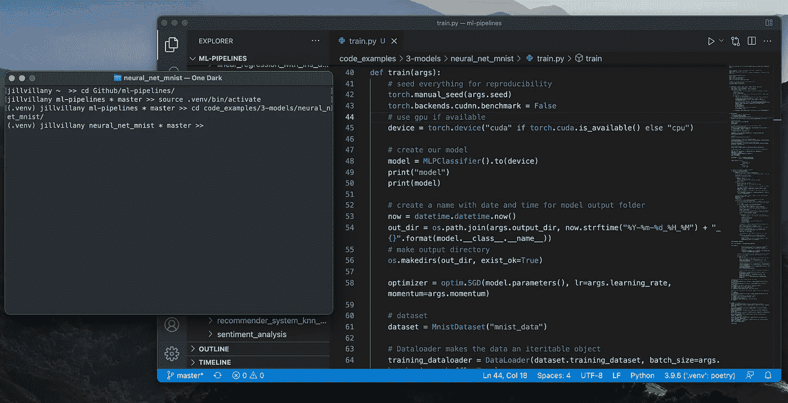

作者图片

*注意:推荐工具的设置说明/有用命令可以在*[*python-dev-setup*](https://github.com/jillvillany/python-dev-setup)*repo 中找到，整篇文章都会引用到*

## 编码班背叛了我。我开始了我的第一个专业 Python 项目，但是我的机器上什么都没有设置好:

*   我的 Windows 命令提示符与旨在简化项目设置的 BASH shell 脚本不兼容。
*   我没有一个好的集成开发环境(IDE)来使用。py 而不是。ipynb 文件。
*   当我尝试运行代码时，它很快出错，因为我的 Python 包版本与我的团队成员安装的版本不同。

我习惯于在从 Anaconda 和 pip 启动的 Jupyter 笔记本上运行代码，安装任何需要的软件包。真正开发的理想环境设置不是我学到的一课。

我手忙脚乱，拼命不让自己显得无能，因为我所受教育的一个关键部分被忽略了。

照片由[JESHOOTS.COM](https://unsplash.com/@jeshoots?utm_source=medium&utm_medium=referral)在 [Unsplash](https://unsplash.com?utm_source=medium&utm_medium=referral) 上拍摄

事实是，在教育环境中，您可能知道很多关于 Python 编码的知识，但是如果您对环境设置一无所知，那么当您在生产环境中开始您的第一个项目时，您将会猛然醒悟

# 我说的“环境设置”到底是什么意思？

我的意思是拥有高效执行以下 5 项任务所需的所有工具:

1.  从命令行运行脚本
2.  对代码进行版本控制
3.  编辑和调试您的代码
4.  管理用于运行代码的 Python 版本
5.  管理用于运行代码的 Python 包版本

# 为什么环境设置很重要？

有一个好的设置是至关重要的，原因有很多:

## 1.团队协作

由[布鲁克·卡吉尔](https://unsplash.com/@brookecagle?utm_source=medium&utm_medium=referral)在 [Unsplash](https://unsplash.com?utm_source=medium&utm_medium=referral) 拍摄的照片

当多人在同一个代码库上工作时，如果所有团队成员的环境设置不一致，就很难进行协作。如果一个团队成员使用不同版本的 python 或 python 包，当另一个团队成员尝试在他们的机器上运行代码时，在另一个团队成员的机器上运行的代码可能会中断。

## 2.生产准备就绪

布拉登·科拉姆在 [Unsplash](https://unsplash.com?utm_source=medium&utm_medium=referral) 拍摄的照片

这个问题超越了团队协作，延伸到了生产领域。如果生产环境与您开发的机器不同，代码可能会在部署后中断。在编程中，控制尽可能多的外部变量以使生产行为尽可能可预测是至关重要的。

## 3.节约时间

照片由 [Aron 视觉效果](https://unsplash.com/@aronvisuals?utm_source=medium&utm_medium=referral)在 [Unsplash](https://unsplash.com?utm_source=medium&utm_medium=referral) 上拍摄

当您第一次开始一个新项目或测试其他人的代码时，如果环境设置不简单，您可能会浪费大量时间来准备您的机器运行他们的代码。

而且浪费的时间不仅限于项目的开始——如果设置不标准化，开发人员将继续浪费时间来排除版本不兼容错误，而这些错误本来是可以很容易避免的。

# 我听到了，但是我需要做什么？

环境设置可能会令人困惑和复杂。我自己也在这个过程中挣扎过很多次。

用于完成环境设置的 5 个关键任务的各种选项(参见*“环境设置”的确切含义是什么？*以上章节)可能会让人不知所措。

为了节省您的时间、精力和挫折，我在下面列出了我认为最有帮助的工具(以及它们的关键特性)。我已经在不同的操作系统上测试了这些工具，以确保在任何操作系统下都能实现最佳设置。请继续阅读在您的机器上创建一个良好的环境设置所需的所有内容，并参考 [python-dev-setup repo](https://github.com/jillvillany/python-dev-setup) 获取安装说明/技巧！

# 1.从命令行运行脚本

## 推荐:Mac 用户用终端，Windows 用户用 WSL

当在集成系统中开发时，您将不得不抛弃笔记本，习惯于从命令行运行脚本/命令。Mac 的终端应用程序非常适合这一点，因为 Mac 有一个基于 Linux 的操作系统，并且由于其成本效益，大多数应用程序都部署到生产中的 Linux 机器上。

因为 Window 不是基于 Linux 的操作系统，所以可以用 WSL 建立一个 Linux 虚拟环境。参见 [python-dev-setup](https://github.com/jillvillany/python-dev-setup) repo 的[设置 WSL 环境](https://github.com/jillvillany/python-dev-setup#Set-Up-a-WSL-Environment) 部分的说明。

## 格式化您的命令行界面

无论您使用哪种命令行界面(CLI ),它都有助于将您的 CLI 格式化为与 Git 协同工作，以便您知道您正在处理哪个分支，并且不会意外地将代码提交到错误的分支。

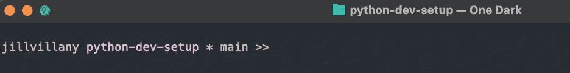

作者图片

参见 [python-dev-setup](https://github.com/jillvillany/python-dev-setup) repo 的 [Format Your Terminal](https://github.com/jillvillany/python-dev-setup#Format-Your-Terminal) 部分以获取说明。

# 2.对代码进行版本控制

## **推荐:Git**

Git 是 Github 和 Bitbucket 背后的强大软件。它不仅有助于基本的版本控制，也是以下方面的关键:

*   团队协作——在将代码推送到团队共享的远程代码库之前，您可以在本地机器上对代码进行更改/测试。此外，您可以在主分支之外创建分支，这样您的开发工作就不会影响团队的其他成员或生产中的代码。最后，当开发完成时，您可以很容易地将其他团队成员的分支合并到您自己的分支或主分支中。
*   发布管理——分支系统也是发布管理的关键。根据项目需求的不同，不同的增强可能会有不同的时间表来决定何时将它们部署到生产环境中。通过将新特性隔离在单独的分支中，您可以轻松地独立部署每个特性。

有关 Git 的更多信息，请参见:[什么是 Git，为什么要使用它？](https://www.nobledesktop.com/learn/git/what-is-git)

## 要开始使用 Git:

1.  安装 Git — [Mac](https://github.com/jillvillany/python-dev-setup#Mac-Git-Install) ，[Windows WSL(Ubuntu Linux)](https://github.com/jillvillany/python-dev-setup#Windows-WSL-Git-Install)，[红帽 Linux](https://github.com/jillvillany/python-dev-setup#Red-Hat-Linux-Git-Install)
2.  按照这些步骤设置您的 git 配置用户名和电子邮件
3.  按照[的步骤](http://Configure-SSH-Auth)配置 SSH 验证，这样你就不需要每次拉/推你的 Github/Bitbucket repo 时都输入你的用户名/密码
4.  参考这个[有用的 git 命令列表](https://github.com/jillvillany/python-dev-setup#Useful-Git-Commands)
5.  下载 [archive_branch.sh](https://github.com/jillvillany/python-dev-setup/blob/main/archive_branch.sh) 脚本，并将其添加到项目的根目录，以自动化归档非活动 git 分支的繁琐过程
6.  下载 [sync_git_branches.sh](https://github.com/jillvillany/python-dev-setup/blob/main/sync_git_branches.sh) 脚本，并将其添加到项目的根目录，以自动提取/更新所有远程分支，并删除不再连接到远程 ref 的本地分支。

# 3.编辑和调试您的代码

## **推荐:VS 代码**

虽然有很多 IDE，但对于本地代码编辑，Visual Studio Code (VS Code)是我最喜欢的编辑器(我也尝试过 Atom、PyCharm 和 Spyder)。我喜欢用于 Python 开发的 VS 代码，因为它具有跨嵌套文件跟踪函数/类定义的卓越能力。在 PyCharm 中，随着跟踪变得越来越复杂，这个特性将停止工作。

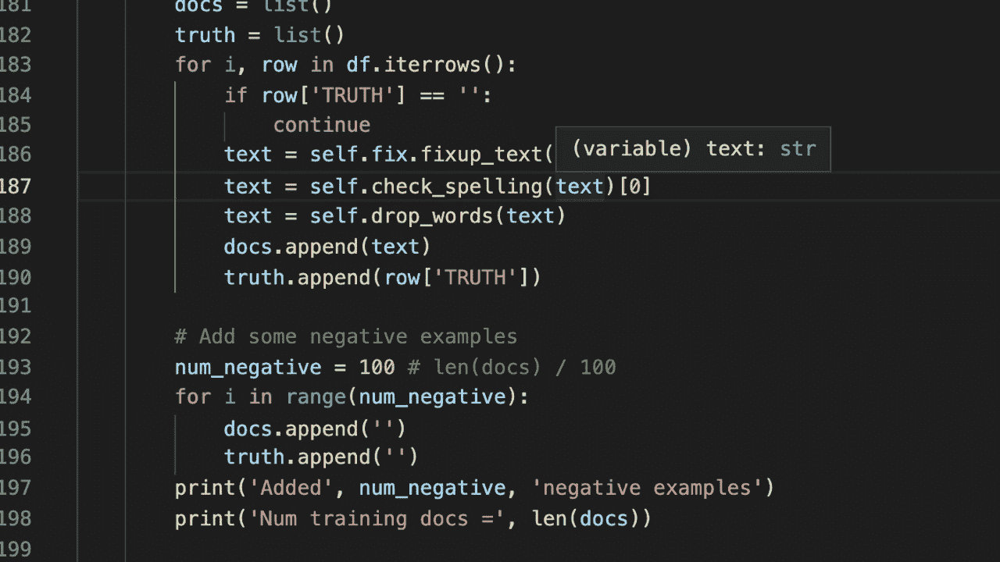

Gif 由作者使用[https://www.onlineconverter.com/](https://www.onlineconverter.com/)

VS 代码也有很好的源代码控制特性:

1.  你可以很容易地在屏幕的左下方看到你正在查看的回购分支

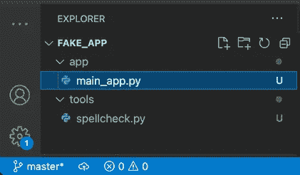

作者图片

2.如果您跨多个回购协议工作(即，使用一个回购协议作为标准工具库，作为本地可编辑的包导入)，您可以轻松查看回购协议的变更，而无需多次“cd”和“git status”。例如，如果您在下面的应用程序和工具库中都添加了脚本，您可以在 VS 代码的源代码控制选项卡中同时查看这些更改。

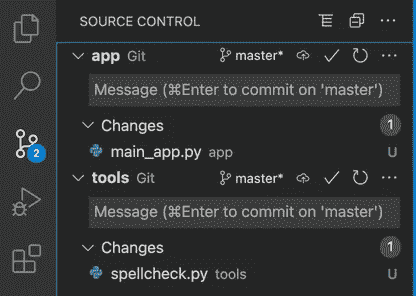

作者图片

此外，VS Code 的调试工具非常有用，只要你知道以下技巧:

*   将您的 Python 解释器设置为您的项目根目录中的 venv 或您的 conda venv ( **注:**我们稍后将详细讨论 venv)

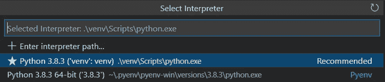

作者图片:venv 在项目的根目录下

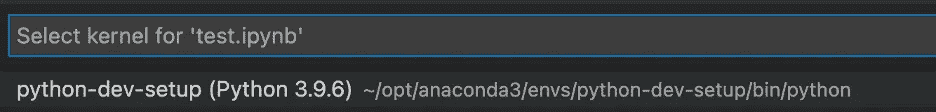

作者图片:conda venv

*   选择要运行的 Python 文件
*   通过单击左侧空白处设置断点(如果需要)
*   导航到调试选项卡，为调试配置
    **选择“Python 文件——调试当前活动的 Python 文件”注意:**要使其工作，您的 VS 代码工作区必须对脚本要运行的目录开放。因此，最简单的方法是构建从项目根目录运行的脚本。

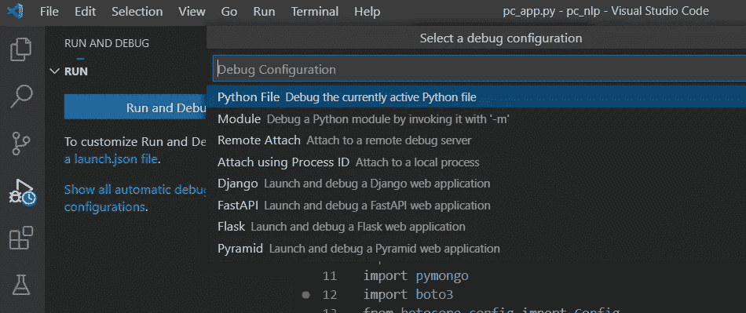

作者图片

*   逐句通过代码并查看过程中创建的变量/数据。

作者图片

最后，当适合使用 Jupyter 笔记本文件时(例如测试代码片段)，VS 代码有一个 Jupyter 扩展来支持它。您所需要做的就是将内核设置为项目根目录下的 venv 或 conda venv，并在出现提示时安装 ipykernel 包。

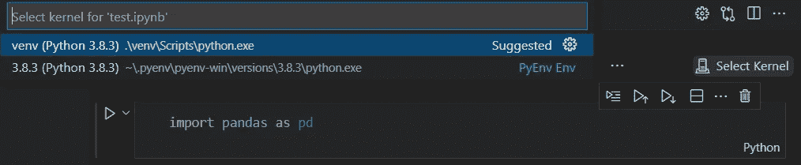

作者图片

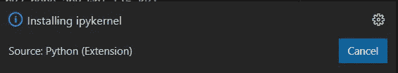

作者图片

## 要开始使用 VS 代码:

1.  [安装 VS 代码和密钥扩展](https://github.com/jillvillany/python-dev-setup#Install-VS-Code-and-Key-Extensions)
2.  [使用带有 WSL 的 VS 代码](https://github.com/jillvillany/python-dev-setup#use-vscode-with-wsl)(仅限 Windows 用户)
3.  [配置远程 SSH 编辑](https://github.com/jillvillany/python-dev-setup#configure-remote-ssh-editing)(只有在远程 Linux 机器上工作时才需要)

# 4.管理用于运行代码的 Python 版本

## **推荐:曼巴福吉**

[Mambaforge](https://mamba.readthedocs.io/en/latest/) 是一个[开源](https://github.com/mamba-org/mamba)包管理器，允许你在特定版本的 Python 上无缝地创建一个虚拟环境。它支持大多数 conda 命令，但与 Anaconda 不同，它可以免费用于商业用途，并且比 miniconda 更轻。

## 要开始使用 Mambaforge:

1.  安装曼巴福吉— [Mac](https://github.com/jillvillany/python-dev-setup#mac-mambaforge-install) ， [Windows WSL/ Linux](https://github.com/jillvillany/python-dev-setup#windows-wsl-linux-mambaforge-install)
2.  参考这个[有用的 mambaforge 命令列表](https://github.com/jillvillany/python-dev-setup#useful-mambaforge-commands)

## 。bashprofile vs .bashrc

在 Linux 中，您可以使用 crontab 来调度作业。执行脚本的 Cron 作业使用非交互式 shell 登录，该登录从。bashrc 文件(不是。bash_profile 文件)。在安装说明中。bash_profile 已经更新，但是如果您将使用非交互式 shell 登录，请确保您也更新了您的。bashrc 文件相应。参见本文了解更多关于。bashrc vs .bash_profile。

# 5.管理用于运行代码的 Python 包版本

## 推荐:诗歌

创建 Python 虚拟环境对于依赖性管理至关重要。关于什么是虚拟环境以及为什么你应该总是使用虚拟环境的更多信息，请查看[这篇文章](/why-you-should-use-a-virtual-environment-for-every-python-project-c17dab3b0fd0)。

虽然从指定硬编码包版本的最新 requirements.txt 文件安装 pip 总比什么都没有好，但是这种方法无法考虑您的依赖项的依赖性。例如，你可能认为你只安装了 pandas 来运行你的代码，但是 pandas 库实际上依赖于另外 5 个包。

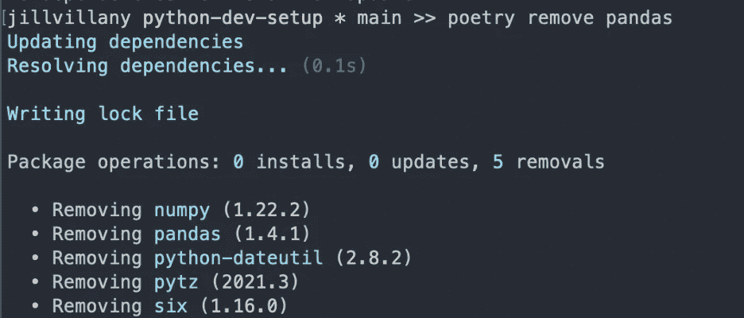

作者图片

在从 requirements.txt 创建虚拟环境时，您很容易出错，例如:

*   您指定的 numpy 版本与您指定的 pandas 版本不兼容
*   您指定的软件包版本的 numpy 版本与您的 pandas 版本所需的 numpy 版本不兼容

即使在从 requirements.txt 文件创建虚拟环境时没有错误，团队成员可能会以稍微不同的子依赖版本结束，这可能会导致问题。

考虑子依赖关系很容易让你晕头转向。令人欣慰的是，[poems](https://python-poetry.org/)考虑到了所有这些相互关联的依赖关系，并创建了一个“poetry.lock”文件，您可以将它推送到您的 repo 中。所有你的队友需要做的镜像你的设置是运行“诗安装”命令。

## 是否存在锁文件实际上可能导致团队成员之间出现问题的情况？

是的，但这次是例外。例如，如果您的代码正在加载其他回购作为本地可编辑的包，您不会希望您的团队成员被锁定在您的空间的绝对路径中，在那里您可能正在子回购的不同 git 分支上工作。

如果您遇到这样的情况，在使用 pyenv 控制您的 Python 版本之后，您总是可以从具有硬编码版本的 requirements.txt 恢复到 pip 安装依赖项。

## 要开始学习诗歌:

1.  [装诗](https://github.com/jillvillany/python-dev-setup#Install-Poetry)
2.  使用诗歌将项目依赖关系安装到您的 conda 环境中
3.  参考这些[有用的诗歌命令](https://github.com/jillvillany/python-dev-setup#Useful-Poetry-Commands)

# 如果您按照本文中的说明进行操作…

照片由[阿格涅什卡·博斯克](https://unsplash.com/@kundeleknabiegunie?utm_source=medium&utm_medium=referral)在 [Unsplash](https://unsplash.com?utm_source=medium&utm_medium=referral) 拍摄

# 恭喜，您现在有了一个很棒的环境设置！

## 您拥有高效工作所需的所有工具:

1.  从命令行运行脚本
2.  对代码进行版本控制
3.  编辑和调试您的代码
4.  管理用于运行代码的 Python 版本
5.  管理用于运行代码的 Python 包版本

我希望这有所帮助，你会发现自己在下次开始一个新项目时已经准备好了。