# Python 开发人员的终极漫游指南

> 原文：<https://towardsdatascience.com/fall-in-love-with-your-environment-setup-vagrant-edition-40ee9313291b>

*注:本文引用了* [*流浪汉-python-setup*](https://github.com/jillvillany/vagrant-python-setup) *回购*

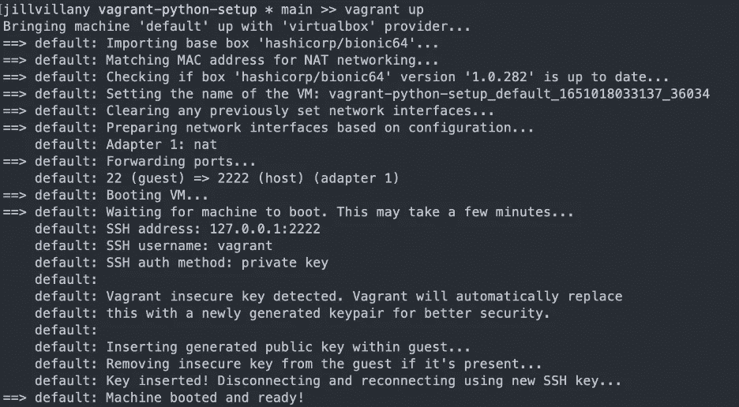

作者图片

# 什么是流浪？

vagger 是一个虚拟化工具，用于创建开发环境，可以在团队成员之间一致且轻松地重新生成。这一点很重要，因为团队成员可以在本地操作系统不可知的环境中工作，消除了特定于机器的设置问题。

更多信息，请参见:[https://www.vagrantup.com/intro](https://www.vagrantup.com/intro)

# 流浪是怎么工作的？

travel 基于 travel file 中的规范构建一个 VM。此外，它会在 VM 中的“/vagger”下创建一个共享文件夹，该文件夹会自动同步项目目录中的文件。这意味着无需担心数据可访问性/持久性的装载/卷。

# 流浪档案是什么样子的？

从文件中删除信息性注释，可以简化为以下代码:

如您所见，所有的动作都发生在第 4–6 行(只有 3 行代码！).

*   第 4 行指定要使用的 VirtualBox 基本映像。“hashicorp/bionic64”是在《流浪者入门教程》中使用的 Ubuntu 机器，所以为了简单起见，我想我还是坚持使用它。
*   第 5 行将虚拟机上的端口 80 转发到本地端口 8000。这一点很重要，例如，当使用 flask 并访问托管在 VM 上的站点时。
*   第 6 行运行 install.sh 脚本来配置虚拟机。
    - **注意:** privileged 设置为 false，这样脚本就不会以 root 用户身份运行。如果安装脚本作为根用户运行，安装的东西，如诗歌，将无法访问的流浪者用户。
    -您仍然可以在安装脚本中需要根级别访问的特定命令前指定 sudo。

# install.sh 脚本中发生了什么？

install.sh 一开始可能看起来有点让人不知所措，但它可以分解为 5 个关键部分:

**第 1 部分(第 3–6 行):**安装 Python 安装所需的 linux 包

**第 2 部分(第 8-17 行):**安装指定的 Python 版本

**第 3 部分(第 19–26 行):**安装并激活诗歌

第 4 部分(第 28 -41 行):终端格式

*   将“auto_activate_.venv.txt”文件中定义的函数添加到。bashrc 文件来自动激活项目根目录下的 venv
*   获取。bash_prompt 文件在。bashrc 文件并象征性地链接。bash_prompt 文件从 repo 复制到 VM 中的相关位置。这将把终端提示符转换为以“{用户名} {文件夹名} * {git branch} > >”格式显示
*   在登录到虚拟机时，将一个条件添加到 cd 的/vagger 文件夹(与您的本地文件同步的文件夹)

**第 5 部分(第 41-43 行):**使用诗歌创作项目的 venv

*   `poetry env use`告诉 poem 使用我们安装的特定 Python 版本
*   `poetry install`安装锁文件中指定的依赖项
    - **注意:**依赖项中指定的 ipykernel 包需要在 VS 代码的 Jupyter 笔记本中工作

# 流浪汉使用烧瓶的注意事项

如上所述，从本地机器上的浏览器访问托管在 VM 中的 flask 应用程序需要端口转发。在 vantage 中使用 Flask 时，您还需要了解一些规范:

1.  你需要使用 sudo 运行 flask 应用程序，以获得访问 80 端口的权限:`sudo python flask_test.py`

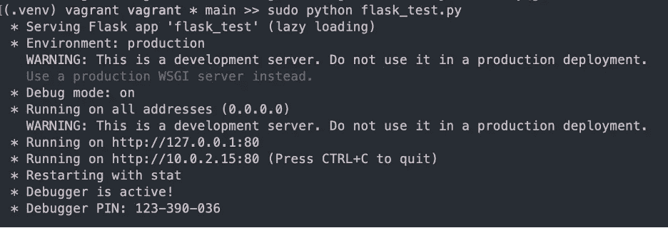

作者图片

2.当您在本地机器的浏览器中输入 URL 时，请确保您指定了端口“8000 ”,而不是直接复制具有端口“80”的 URL，端口“80”是应用程序在 travang VM 中运行的端口

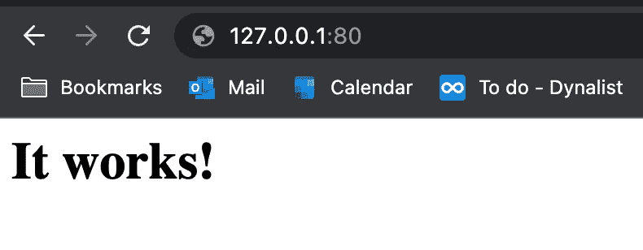

作者提供的图片:端口 80 的输出—连接到流浪虚拟机端口 80 的注释

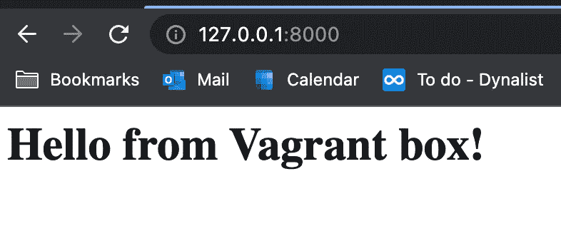

图片来自作者:端口 8000 的输出—实际的烧瓶站点

# 流浪汉和码头工人有什么区别？

从高层次上来说，vagger 是用来打造开发空间的，Docker 是用来容器化生产代码的。

更多详情请见[https://www . the server side . com/answer/Vagrant-vs-Docker-How-these-cloud-native-tools-different](https://www.theserverside.com/answer/Vagrant-vs-Docker-How-these-cloud-native-tools-differ)。

# 流浪汉听起来不错——有什么好处？

配置一个 linux VM 来满足您的需求并不像一些文章看起来那么简单。我发现安装 Python3 需要不同的 linux 包，当我尝试使用 VS Code 的调试和笔记本功能时，我尝试的每种组合都会留下一些配置错误。

为了避免您浏览无数的故障排除文章，我在这里整合了我的研究，并提供了一个示例来创建一个镜像我喜欢的本地设置的环境设置。

# 按照下面的步骤，看看你如何保持无缝的本地环境设置与流浪者的感觉！

## 安装[流浪汉](https://www.vagrantup.com/downloads)

*   注意:流浪者建议 Mac 用户不要使用自制软件进行安装

## 安装 [VirtualBox](https://www.virtualbox.org/)

## 克隆[流浪者-python-setup](https://github.com/jillvillany/vagrant-python-setup) repo

*   `git clone git@github.com:jillvillany/python-dev-setup.git`
    -注 1:这里假设您已经在本地配置了 Git SSH 连接。如果您没有设置这个，请参见[python-dev-setup repo](https://github.com/jillvillany/python-dev-setup)
    的 [Git: Configure SSH Auth 部分](https://github.com/jillvillany/python-dev-setup#Configure-SSH-Auth)-注意 2:如果您使用指定了用户名的 git ssh 配置文件，url 应该修改如下:`git clone git@github-{your username}:jillvillany/python-dev-setup.git`

## 从流浪汉文件中指定的映像创建虚拟机

*   这可以通过运行`vagrant up`非常简单地完成，大约需要 10 分钟
    ——注意:可能会出现一些常见错误——如果您遇到错误，请参见下面的“排除流浪错误”部分
*   一旦创建了 VM，您将看到已经安装的诗歌需求(VM 配置中的最后一步)。

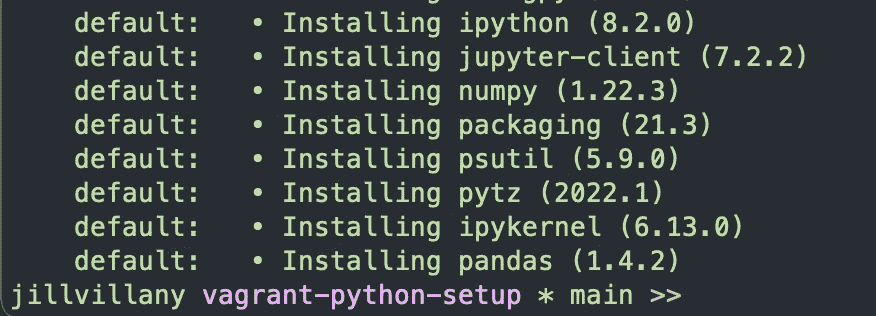

作者图片

## 疑难解答向上漫游错误

1.  Mac 安全设置阻止扩展

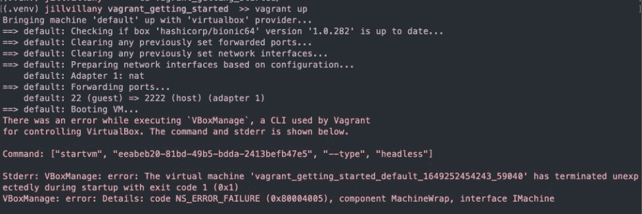

作者图片

如果你在 Mac 上，你可能会在第一次运行`vagrant up`时得到“执行` VBoxManage '时出错，这是一个由 vagger 用于控制 VirtualBox 的 CLI”错误。您必须按照本文[中的说明](https://scriptcrunch.com/solved-vboxmanage-error-component-machinewrap/)在您的安全设置中允许新的系统扩展，重启您的计算机并再次运行`vagrant up`。

2.端口已被使用错误

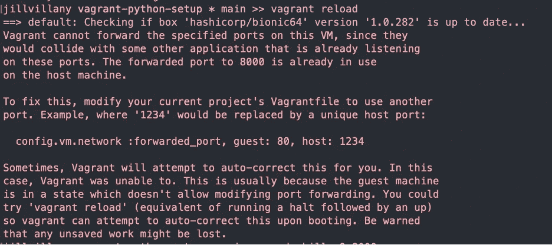

作者图片

您必须找到在指定端口上运行的活动的 PID，并终止该活动。如果使用 Mac，请遵循本文[中的](https://stackoverflow.com/questions/12397175/how-do-i-close-an-open-port-from-the-terminal-on-the-mac)进行说明。

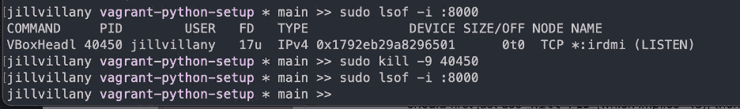

作者图片

# 确保你的流浪者设置和你喜欢的本地环境设置一样无缝

在之前的一篇文章[爱上你的环境设置](/fall-in-love-with-your-environment-setup-779dfbf047ba)中，我展示了我发现的对完成以下 5 个关键开发任务最有用的工具:

1.  从命令行运行脚本
2.  对代码进行版本控制
3.  编辑和调试您的代码
4.  管理用于运行代码的 Python 版本
5.  管理用于运行代码的 Python 包版本

虽然大多数建议将保持不变，但有 3 个主要区别:

1.  Windows 和 Mac 用户使用的 shell 没有区别。您将使用您启动的 Linux 机器的 bash shell。
2.  不用使用包管理器来控制您的 Python 版本，您可以只在 VM 中安装您需要的 Python 版本。使用包管理器会增加复杂性，并可能导致内存问题。
3.  创建一个 Python venv 来安装诗歌需求(因为您不会为 Python 版本创建 venv)。

## 继续读下去，看看你如何能够无缝地执行上面提到的 5 个关键开发任务。

## 1.从命令行运行代码:Bash shell

*   `vagrant ssh`
*   这将启动虚拟机的终端(它会自动 cd 到“/vagger”同步文件夹，并根据中的规范激活项目的 venv。bashrc 文件)

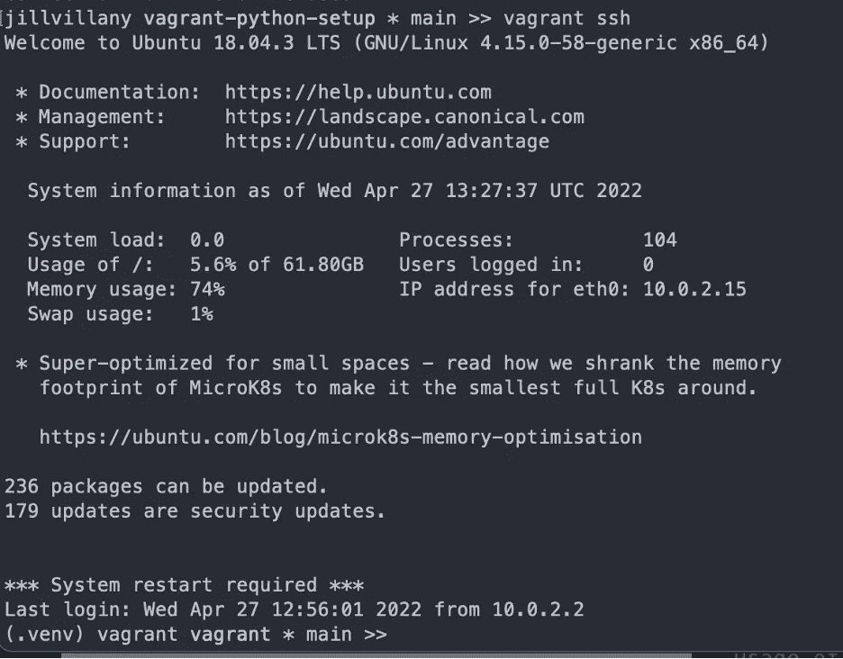

作者图片

*   注意:如果您搞不清是在本地机器上还是在流浪的虚拟机上，请检查用户名(终端提示中的第一个变量)。在流浪者虚拟机中，用户名是“流浪者”,在你的机器上它将是你的名字。

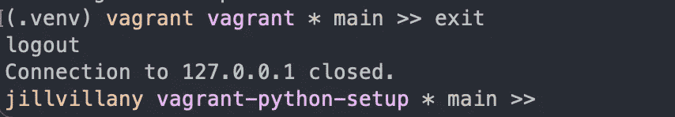

作者图片

## 2.版本控制你的代码:Git

您的本地项目文件和存储在浮动虚拟机的“/vagger”中的文件是自然同步的，因此您可以从本地机器自动提交到 Git。然而，为了在 vagger VM 上获得真正无缝的体验，您可以在那里设置 Git SSH 连接。

因为您将是 VM 上的唯一用户，所以使用`vagrant ssh`SSH 进入流浪 VM，并遵循 [python-dev-setup repo](https://github.com/jillvillany/python-dev-setup) 的[配置 SSH 验证部分](https://github.com/jillvillany/python-dev-setup#Configure-SSH-Auth)中的私有机器指令集。

*   将您的 git 用户名和电子邮件添加到 git 配置中，这样您就可以在 VS 代码 UI
    -`git config user.name {username}`-
    -`git config user.email {email}`中使用 git

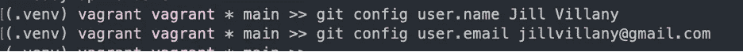

作者图片

## 3.编辑和调试您的代码:VS 代码

*   通过 SSH 到 VS 代码中的流浪虚拟机，您可以无缝地在 VS 代码中工作
*   前置请求:安装 VS 代码远程— SSH

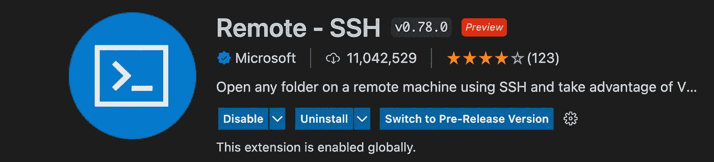

作者图片

*   如果仍在上一步的漫游虚拟机中，输入命令`exit`退出虚拟机

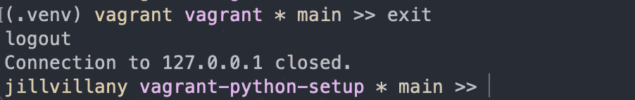

作者图片

*   运行命令`vagrant ssh-config`并复制输出

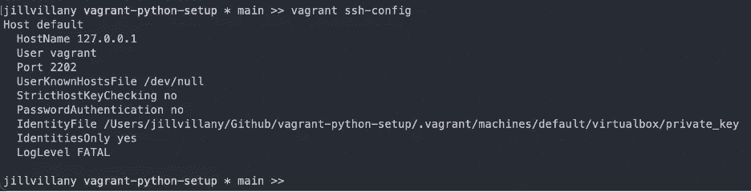

作者图片

*   在 VS 代码`shift + cmd + p`中打开命令面板，选择“Remote-SSH:Open SSH Configuration File”
*   选择 ssh 主文件夹中的配置文件:
    ——例如，在 Mac 上:/Users/{username}/。ssh/config
*   将浮动 ssh-config 粘贴到文件的底部，并将主机名从“default”更改为项目文件夹的名称

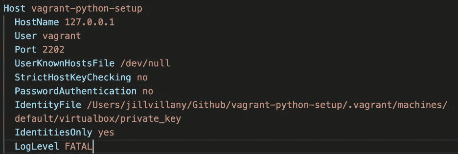

作者图片

*   导航到左侧的 Remote Explorer 选项卡，并单击带有项目名称的主机旁边的新建文件夹图标

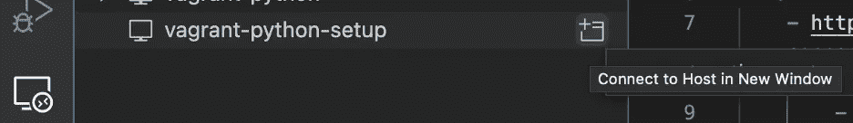

*   注意:第一次远程访问 VS 代码时，需要花一些时间在浮动虚拟机中安装 VS 代码

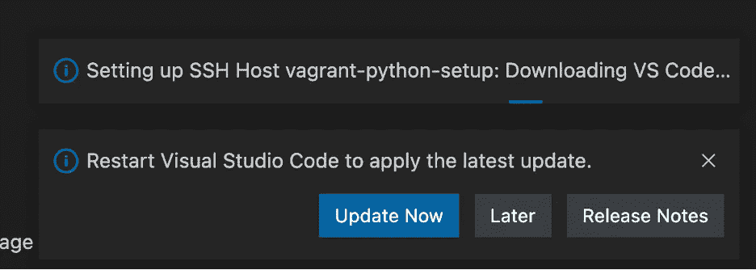

作者图片

*   新窗口加载后，在资源管理器中选择打开文件夹，并指定路径“/vagger”。然后，按 enter 键或单击确定。

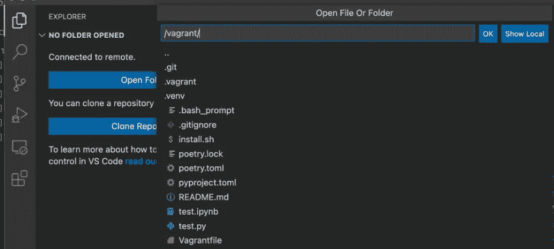

*   安装有用的扩展(即使它们安装在您的本地机器上),因为它们必须安装在 VM
    中的 VS 代码上——参见 [python-dev-setup repo](https://github.com/jillvillany/python-dev-setup) 的[安装 VS 代码和关键扩展部分](https://github.com/jillvillany/python-dev-setup#Install-VS-Code-and-Key-Extensions)以获得您可能想要安装的扩展的完整列表
*   **注意:python 扩展是 python 林挺/调试/运行笔记本所必需的，所以你必须至少安装这个扩展**

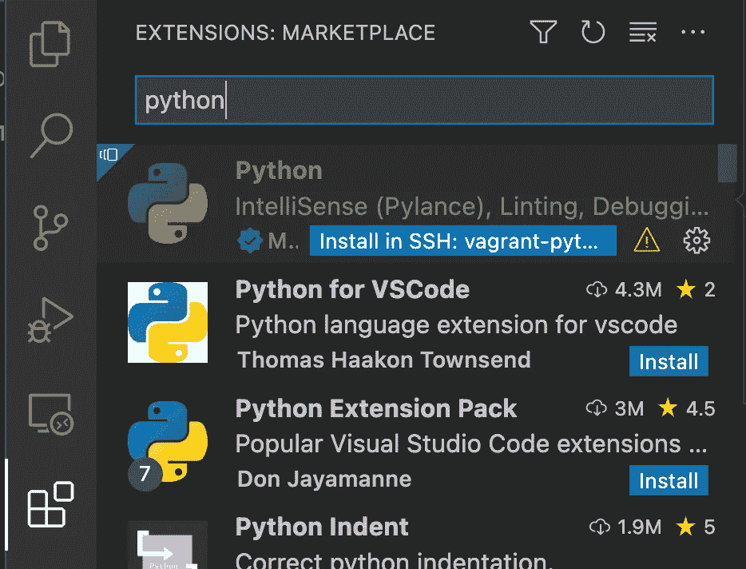

作者图片

*   安装 Python 扩展后，当您打开 Python 文件时，您会看到您的诗歌 venv 被设置为项目的 Python 解释器

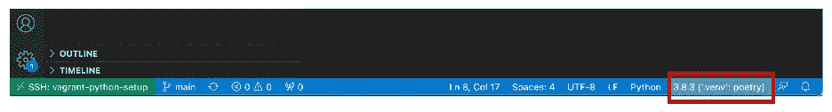

作者图片

*   通过设置断点并选择“Python 文件”调试配置，像平常一样进行调试

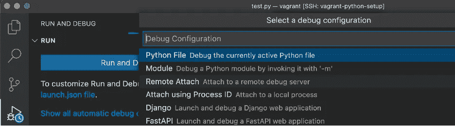

作者图片

*   以 test.py 文件为例:

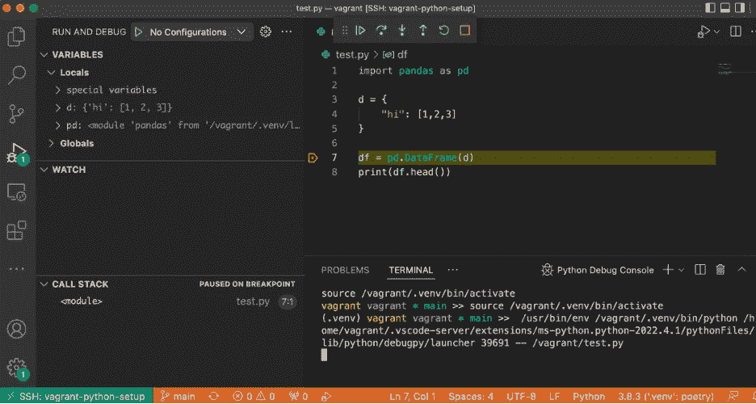

作者图片

*   选择诗歌 venv 作为你的内核来运行一个笔记本

作者图片

## 4.管理用于运行代码的 Python 版本:VM 中安装的 Python 版本

这是在 `install.sh` 脚本中的虚拟机供应期间处理的:)

## 5.管理用于运行代码的 Python 包版本:诗歌

这是在 `install.sh` 脚本中配置虚拟机的过程中处理的:)

# 我希望这有所帮助，你现在很高兴给流浪者一个尝试！