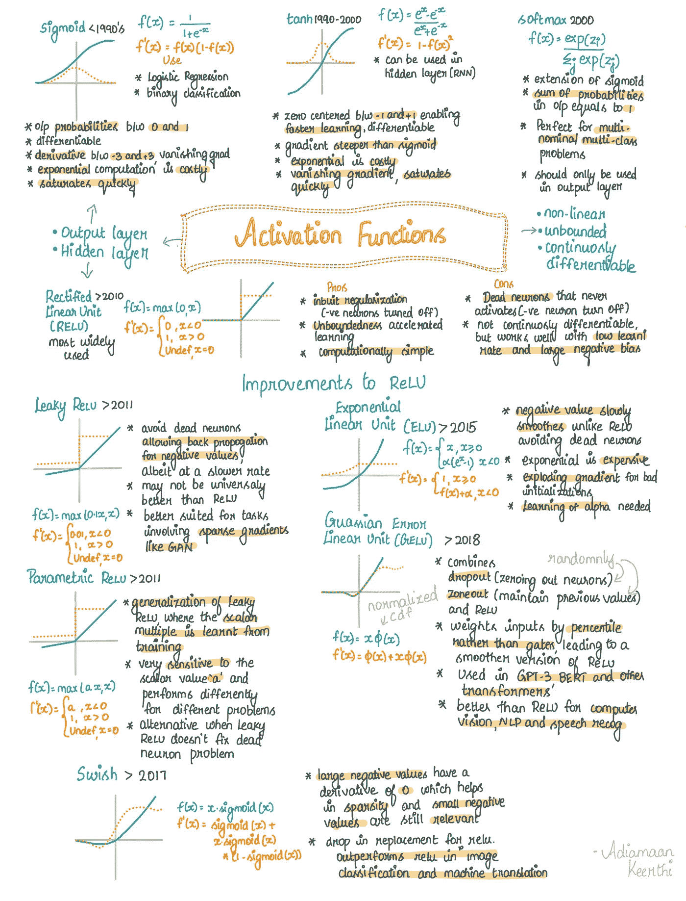
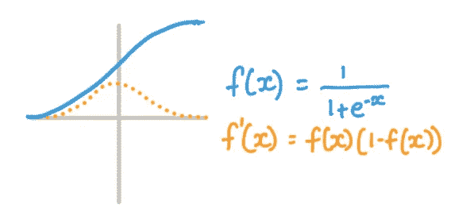
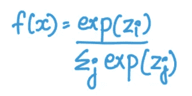
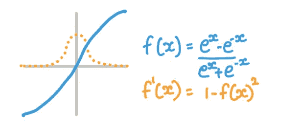
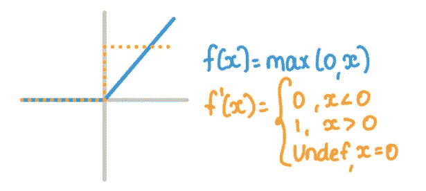
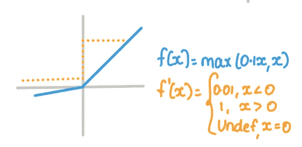
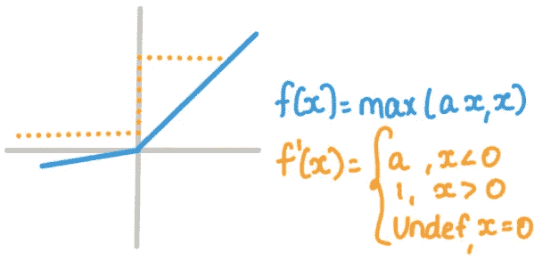
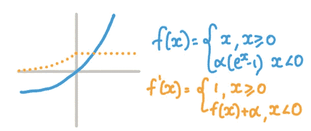
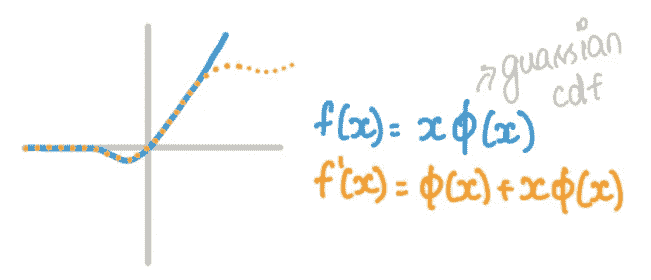
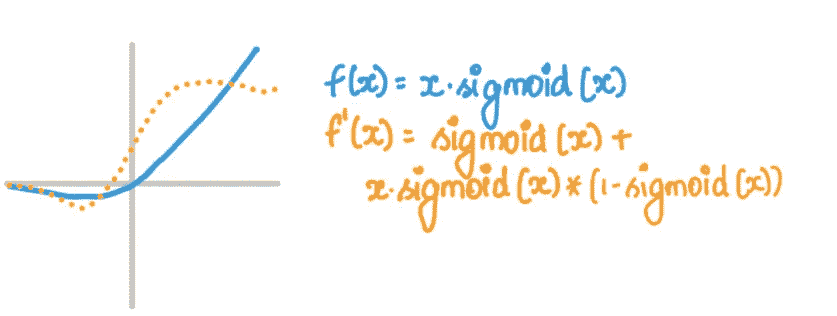

# 奇妙的激活功能以及何时使用它们

> 原文：<https://towardsdatascience.com/fantastic-activation-functions-and-when-to-use-them-481fe2bb2bde>

## 十大激活功能，它们的优缺点，何时使用它们，以及一个备忘单

作者图片

与权重和偏差一样，激励函数是 ML 模型中的一个重要组成部分。他们在使深度神经网络训练成为现实方面发挥了重要作用，并且他们是一个不断发展的研究领域。在这篇博文中，我们将它们进行对比，观察它们的优缺点，何时使用它们，以及它们的发展。

[Paperswithcode](https://paperswithcode.com/methods/category/activation-functions) 列出了 48 个激活函数，每年都有新的和改进的激活函数被提出。在本文中，我列出了 10 个最常见的激活函数，它们代表了所有其他的激活函数。

根据在 ML 模型中的使用方式，激活函数有两种类型。

1.  ML 模型的 ***输出层*** 中用到的激活函数(想想分类问题)。这些激活函数的主要目的是将值压缩在像 0 到 1 这样的有界范围内。
2.  用于神经网络 ***隐层*** 的激活函数。这些激活函数的主要目的是提供非线性，没有非线性，神经网络就不能模拟非线性关系。

隐藏层中使用的激活函数应该理想地满足以下条件，

1.  ***非线性，*** 让神经网络学习非线性关系。[通用逼近定理](https://en.wikipedia.org/wiki/Universal_approximation_theorem)陈述了使用非线性激活函数的两层神经网络可以逼近任何函数。
2.  ***无界，*** 使学习更快，避免过早饱和。当范围无限时，基于梯度的学习是高效的。
3.  *连续可微，这个性质虽然不是决定性的，但却是可取的。ReLU 就是一个突出的例子，它的函数不可微≤ 0，但在实践中仍然表现很好。*

## *备忘单*

*为没有耐心的人准备的文章的备忘稿，*

**

*作者图片*

# *输出层激活功能*

## *乙状结肠的*

*这些激活函数于 20 世纪 90 年代初推出，其优点是将输入压缩到 0 和 1 之间的值 ***，从而完美地模拟概率。函数是可微的，但是 ***快速饱和*** ，因为在深度神经网络中使用时，有界性导致 ***消失梯度*** 。指数计算的成本*很高，当你必须训练一个有数百层和神经元的模型时，这种成本就会增加。*****

**函数界于 0 和 1 之间，第 ***e 导数界于-3 和 3*** 之间。 ***输出在零附近不对称*** ，这将导致所有神经元在训练期间采用相同的符号，使其不适合训练隐藏层。**

****

**聪明的老乙状结肠。作者图片**

****用途:**一般用于 logistic 回归，输出层的 ***二元分类模型*** 。**

## **Softmax**

*****利用 0 和 1 之间的输出范围扩展 sigmoid*** 激活功能。这主要用于多类、多项分类问题的输出层，具有一个有用的属性 ***输出概率的总和等于 1*** 。换句话说，这是将 sigmoid 应用于输出上的每个神经元，然后将其归一化为和 1。**

****

**功利的 **softmax。**作者图片**

****用途:** ***多项*** 和 ***多类*** 分类。**

## **双曲正切**

**在 20 世纪 90-2000 年代广泛使用，它通过 ***扩展范围以包括-1 到 1*** 克服了 sigmoid 激活功能的缺点。这导致 ***零居中*** ，这导致隐藏层的权重的平均值接近零。这导致更容易和更快的学习。这个函数是 ***可微的和*** 平滑的，但是使用指数函数要付出 ***的代价*** 。当用于深层神经网络的隐藏层时，它很快饱和，消失梯度渗透进来。导数比 sigmoid 的更陡。**

****

**值得信赖的 tanh。作者图片**

****用途:**可用于 ***RNN*** 的隐藏图层。但是有更好的选择，比如 ReLU**

**虽然 sigmoid 和 tanh 函数可以用在隐藏层中，但由于其正有界性，训练很快饱和，并且消失的梯度使得不可能在深度神经网络设置中使用它们。**

# **隐藏层激活功能**

## **输入 ReLU**

**整流线性单元是激活功能的*。这是最广泛使用的*和大多数类型问题的 goto 激活功能。从 2010 年左右开始，一直 ***广泛研究*** 。负的时候有界到 0，正的时候无界。这种 ***有界和无界的混合创建了一个内置的正则化*** ，这对于深度神经网络来说很方便。正则化提供了一种 ***稀疏表示*** ，导致计算上高效的训练和推断。****

**正无界 ***加速梯度下降*** 的收敛，同时保持 ***计算简单*** 的计算。ReLU 唯一的主要缺点是神经元死亡。由于对 0 的负有界性，在训练过程中早期被关闭的一些 ***死亡神经元*** 永远不会被打开。函数从 x >为 0 时的无界快速切换到 x ≤ 0 时的有界，使其 ***连续不可微*** 。但在现实中，由于学习率低和负偏差大，这可以被克服，而不会对性能产生任何残余影响。**

****

**摇滚明星 **ReLU。**图片卜作者**

****用途:** CNN 的，RNN 的，以及其他深度神经网络。**

**ReLU 是隐藏层激活功能的明显赢家。自 2010 年以来，人们一直在研究 ReLU 的优缺点，并提出了新的激活函数，这些函数有助于提高 ReLU 的性能，同时解决其困难。**

## ****对 ReLU** 的改进**

## **泄漏 ReLU**

**2011 年引入，通过 ***允许负值*** 存在，直接解决了 ReLU 的担忧。这使得负值能够反向传播，从而 ***克服 ReLU 的死神经元问题*** 。负值被积极地缩放，这导致较慢的训练。即使有了这种改进，Leaky ReLU 也不是普遍比 ReLU 更好。**

****

****泄漏的 ReLU** 。作者图片**

****用途:**涉及稀疏渐变的任务像 ***甘*** 。**

## **参数 ReLU**

**这改进了 Leaky ReLU，其中标量倍数不是任意选择的，而是根据数据训练的。这是一把双刃剑，因为来自数据的训练导致模型对缩放参数(a)敏感，并且对于不同的 a 值表现不同。**

****

**可训练的参数 ReLU。图片作者。**

****用途:**可用于 ***修复 Leaky ReLU 不起作用时的死神经元*** 问题。**

## **ELU**

**指数线性单位，2015 年推出，正无界，使用 ***对数曲线表示负值*** 。这是一个稍微不同的处理死神经元问题的方法，不像 Leaky 和 Parameter ReLU。与 ReLU 不同的是，负值会慢慢变平滑并变得有界，从而避免死神经元。但是负斜率使用指数函数建模，这使得 ***成本*** 。当采用次优初始化策略时，指数函数有时会导致 ***爆炸梯度*** 。**

****

**昂贵的 **ELU** 。图片作者。**

## **格鲁**

**高斯误差线性单元，2018 年推出，是该模块中的新成员，显然是 NLP 相关任务 的 ***赢家。它用于 SOTA 算法，如 GPT-3、BERT 和其他基于变压器的架构。GeLU 结合了*(对稀疏网络随机清零神经元) ***zone out*** (保持先前值)，以及 ReLU。它 ***通过百分点而不是门*** 对输入进行加权，从而产生更平滑版本的 ReLU。******

**

*新潮的**葛鲁。**图片作者。*

***用途:**自然语言处理、计算机视觉和语音识别*

## *嗖嗖*

*2017 年推出。大的负值将具有 0 的导数，而 ***小的负值仍然与捕捉潜在模式*** 相关。可作为 ReLU 的替代产品。导数有一个有趣的形状。*

**

*谷歌**嗖嗖。**图片作者。*

***用途:**在图像分类和机器翻译方面匹配或优于 ReLU。*

*更多小抄，
[https://github.com/adiamaan92/mlnotes_handwritten](https://github.com/adiamaan92/mlnotes_handwritten)*

## *关于作者:*

*我是一名数据科学家，在🛢️石油和⛽.天然气公司工作如果你喜欢我的内容，请关注我👍🏽在 [LinkedIn](https://www.linkedin.com/in/adiamaan-keerthi/) 、 [Medium](https://blog.adiamaan.com/) 和 [GitHub](https://github.com/adiamaan92) 上。订阅,每当我在媒体上发帖时都会收到提醒。*