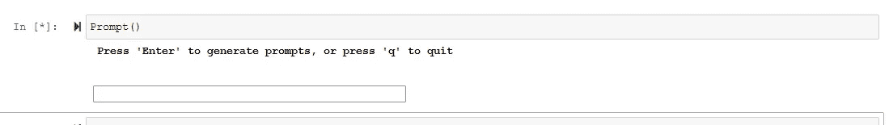
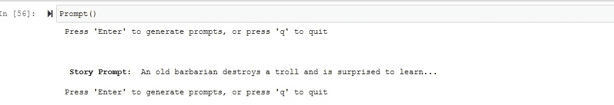
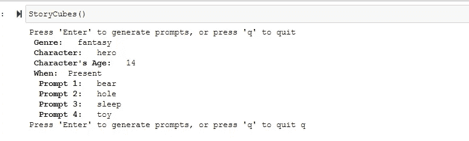

# 幻想故事提示生成器

> 原文：<https://towardsdatascience.com/fantasy-story-prompt-generator-2f56bf98dbfa>

## 充分利用 Python 的“随机”库


塞德里克·范登堡在 [Unsplash](https://unsplash.com/s/photos/fantasy?utm_source=unsplash&utm_medium=referral&utm_content=creditCopyText) 上拍摄的照片

白天，我是一名数据分析师。我编写 SQL 脚本来生成非常具体的报告和审计。我完全按照客户的要求构建仪表板。我遵守规则，而且做得很好。

不过，我也有创意的一面。作为一名自出版作家和自由撰稿人，我喜欢在业余时间发挥自己的想象力。

例如，今年，我开始了我的第一份奇幻小说时事通讯，你可以在这里[免费注册。](https://www.foreverfantasyreaders.com/)

无论如何，我觉得人们通常要么善于分析，要么富有创造力，但我想挑战这种思维模式。

在下面的项目中，我结合了我的 python 知识和对小说的热爱，创建了一个随机幻想故事提示生成器。此外，我还尝试重新制作了一个我喜欢的游戏——故事方块。

虽然这个过程花了我不少时间，但现在初稿已经完成，我意识到实际上只有四个步骤:

1.  导入随机库
2.  创建一个循环
3.  构建您的选项/路径
4.  相应地随机选择

我将详细介绍每一个步骤。

首先，您只需要导入适当的库。你的整个项目都将以此为基础。

```
import random
```

下一步只是设置循环，以便用户可以选择提示。我定义了一个函数 Prompt()，然后构建了基本的循环。可以在下面找到相关代码:

```
def Prompt():
    while True:
        # We put this here, so that the user can chose to generate another prompt or quit.
        action = input("\033[1m "+ "Press 'Enter' to generate prompts, or press 'q' to quit " + "\033[0m \n"
                      + "\n"
                      +"\n").strip()if action.lower() == "q":
            break
```

这是基本模板。之后，我决定我要产生什么样的故事，这需要更多的创造力。在我的第一轮中，我列出了角色的类型和他们要走的路。

```
adjective=["An old", "A young", "A troubled", "A wise", "An injured", "A dying", "A sick", "A persuasive", "A clever"]characters=["wizard", "sorcerer", "elf",  "dwarf", "mage", "witch", "hobbit", "bard", "knight", "barbarian", "goblin", "centaur", "giant" , "fairy",  "dragon"]actiona=["finds ",  "discovers ", "searches for ", "tracks down "]
actionb=["protects ", "saves ", "loves "]
actionc=["fights ", "destroys "]
actiond=["travels to ", "runs from ", "escapes "]objecta=["a ring ", "a treasure ", "magic ", "a secret ", "a book ", "their destiny "]
objectb=["their friend ","their leader ", "their family ", "their home ", " their powers " ]
objectc=["a monster ", "a demon ", "the enemy ", "dark magic ", "a troll "]
objectd=["their home ", "another world ", "a prison ", "the castle "]
```

如你所见，有 15 个角色选项，然后我根据一组随机的动作和物体创建了四条路径。

接下来，为了让用户有所思考，我让提示保持开放:

```
##path  a,c,d
prep1=["but loses...", "but fails to find...", "but doesn't realize..." , "and is surprised to learn..."]
##path b
prep2=["but finds...", "and discovers..", "but discovers...", "and finds...", "but loses..."]
```

然后，我根据我提供的选项生成路径。

```
patha=random.choice(actiona) + random.choice(objecta)  + random.choice(prep1)
        pathb=random.choice(actionb) + random.choice(objectb) + random.choice(prep2)
        pathc=random.choice(actionc) + random.choice(objectc) + random.choice(prep1)
        pathd=random.choice(actiond) + random.choice(objectd) + random.choice(prep1)

        paths=[patha, pathb, pathc, pathd]
```

最后一部分是打印最终的故事提示。我还使用加粗和换行符使输出更容易阅读。

```
print("\033[1m  Story Prompt: \033[0m " +random.choice(adjective), random.choice(characters), random.choice(paths) + '\n'  )
```

最后，我只需要调用我的函数。

```
Prompt()
```

作为用户，一旦你运行单元格，它会给你一个输入框



作者输出的屏幕截图

然后你可以决定按下回车键产生一个提示或按下' q '然后回车退出程序。

这就是你得到的:



作者的代码和输出截图

很酷，对吧？

当我正忙着的时候，我决定尝试重新创建一个我自己的游戏，用来产生故事想法。它叫做罗里的故事方块。基本上，有九个骰子，你滚动它们来得到提示你的故事的图片。

为了重现这一点，我随机掷出四个骰子，每个掷出一个单词。我还生成了流派、人物、年龄和时间/背景。以下是完整的代码:

```
import random def StoryCubes():
    while True:

        action = input("Press 'Enter' to generate prompts, or press 'q' to quit ").strip()if action.lower() == "q":
            break

        character=["human", "animal", "monster", "hero", "villian"]
        time=["Past", "Present", "Future"]
        genre=["fantasy", "horror", "thriller",  "fairytale", "sci-fi", "mystery", "poetry"]
        d1 = ["spaceship", "turtle", "running", "wall", "Earth", "New York", "spark", "castle", "bear", "monster", "book", "television"]
        d2=["car", "street", "hole", "light", "power", "tall", "music", "fight", "ocean", "mountains", "wall", "swim"]
        d3=["house", "beach", "school" , "walk", "trip", "stairs", "sneak", "sleep", "eat", "drink", "food", "desert"]
        d4=["toy", "dog", "cat", "produce", "dry", "sound", "fire", "princess", "frog", "monster", "capture", "escape"]

        print("\033[1m Genre: \033[0m ", random.choice(genre))
        print("\033[1m Character: \033[0m ", random.choice(character) )
        print("\033[1m Character's Age: \033[0m ", random.choice(range(10, 55)))
        print("\033[1m When:\033[0m ", random.choice(time))
        print("\033[1m  Prompt 1: \033[0m ", random.choice(d1))
        print("\033[1m  Prompt 2: \033[0m ", random.choice(d2))
        print( "\033[1m  Prompt 3: \033[0m " ,random.choice(d3))
        print("\033[1m  Prompt 4: \033[0m " ,random.choice(d4))
```

正如你所看到的，它与上面的故事提示生成器是相同的基本模板，但这个模板旨在给用户更多的自由，但只是使用随机单词来提示想法。

当我调用 StoryCubes()并按 enter 键时，我得到了下面的输出:



作者输出的 StoryCubes()

**结论:**

这个项目对我来说很有趣，因为我有机会尝试以不同的方式使用随机库。也有一个名为 [Wonderwords](https://wonderwords.readthedocs.io/en/latest/) 的库可以用于此。然而，我发现它有点小故障，我更喜欢自己编码选项。

下一步，我想为每种风格建立不同的提示生成器，并可能扩展选项。

我也在考虑随机选择图片/图像来配合提示。为此，我考虑使用 [Unsplash 的 API](https://github.com/yakupadakli/python-unsplash) 。

我希望这篇教程对那些像我一样也有创造性的数据科学家和技术专家有所帮助。

点击这里查看 github 上的基本笔记本:[https://github . com/meag VO/towards data science/blob/main/Story % 20 cubes . ipynb](https://github.com/meagvo/TowardsDataScience/blob/main/StoryPrompts.ipynb)

## 编码快乐，写作快乐！