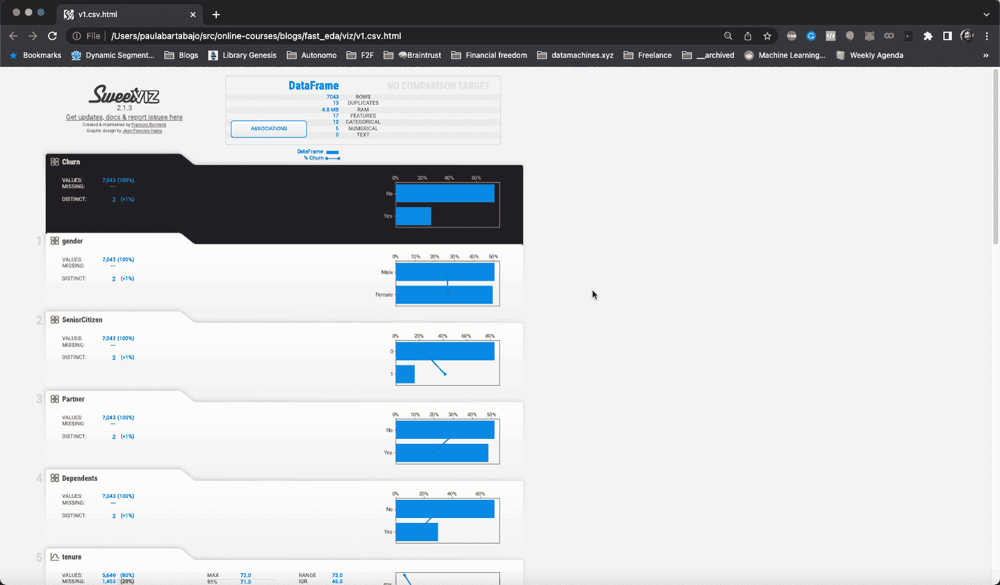
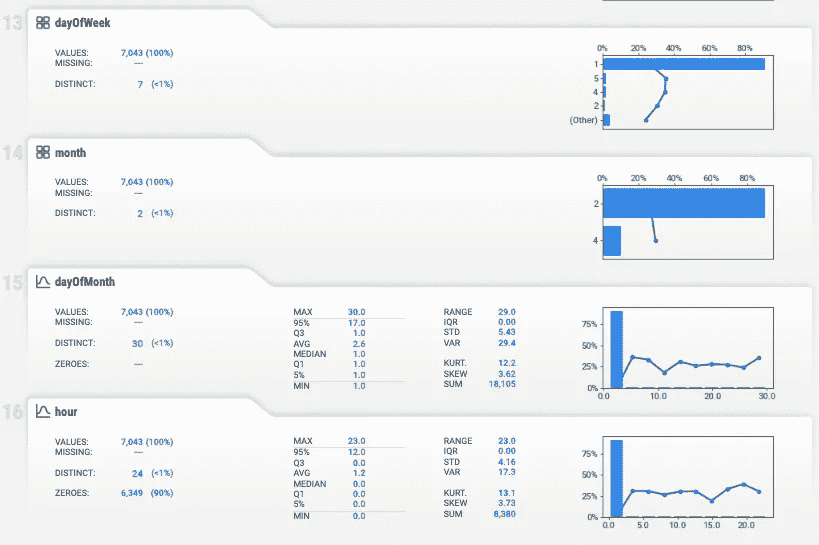
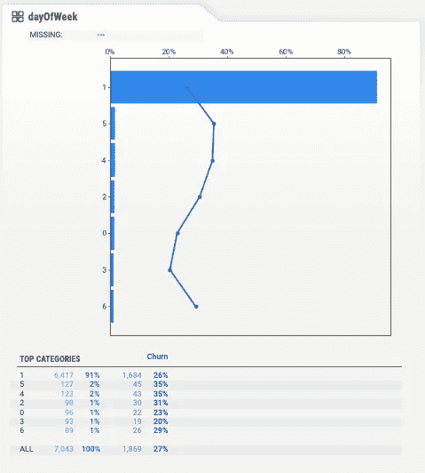
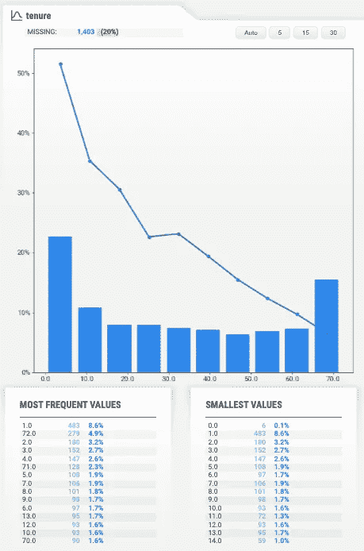
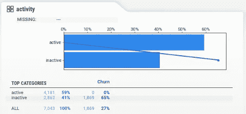

# 用于机器学习的快速简单的数据探索

> 原文：<https://towardsdatascience.com/fast-and-easy-data-exploration-for-machine-learning-3fbee7d9c16b>

## 开源库 Sweetviz 是一种方式


乌尤尼盐沼的贾戈达(图片由作者提供)

厌倦了在训练机器学习模型之前花费“太多时间”进行数据探索？

在开始训练您的 ML 模型的有趣部分之前，您是否在寻找一种更快理解数据问题和模式的方法？

想学习如何通过发现和修复数据中的问题来训练更好的 ML 模型吗？

你来对地方了。

在这篇文章中，你将学习如何以光速进行**数据探索**。

让我们来看一个你可以在 [**这个 GitHub 库**](https://github.com/Paulescu/fast_eda) 中找到的实际例子和代码。

# 问题是

你需要在每个现实世界的 ML 项目开始时生成你的训练数据。

通常，您访问一个 SQL 类型的数据库，并编写一个很长的查询，从几个表中提取数据，对其进行聚合，并将其合并到最终的训练集中。数据集包含一组要素和一个要预测的目标度量。

> ***生成训练数据集的问题？*** 如果您在这一阶段陷入困境，我推荐您阅读[我以前的文章](/how-to-generate-training-data-faster-and-better-e84d05884dc0)关于使用 SQL 和 Python 生成数据集的最佳实践👇🏼

</how-to-generate-training-data-faster-and-better-e84d05884dc0>  

一旦你有了这些数据，你就非常想训练你的第一个 ML 模型。

这是一个大错误。

相反，您应该留出几分钟时间来进行数据探索。

## 但是，为什么我需要数据探索？

因为，改善结果的最有效的方法不是通过尝试更复杂的模型，或者通过调整超参数(真实世界的 ML！= Kaggle)。

相反，您应该专注于提高数据的质量。你可以通过**数据探索**来做到这一点。

浏览数据集时，您需要特别注意:

*   **数据漏洞**。有没有什么奇怪的事情，可能显示数据中的错误？
*   **缺失数据**。每个特征的缺失观测值的百分比是多少？
*   **数据泄露**。有没有看起来极具预测性，而且“好得难以置信”的特征？

那么问题是…

> *有没有一种* ***快速*** *的方式来探索一个数据集？*

是的，有。

它的名字叫 [Sweetviz](https://github.com/fbdesignpro/sweetviz) ，一个你会爱上的开源库。

让我们来看一个实际的例子和我为 ML 项目开发的 Python 脚本。

我呈现的所有源代码都可以在 [**这个 GitHub 资源库**](https://github.com/Paulescu/fast_eda) 中公开获得。你可以在下一个 ML 项目中随意使用它。

# 例子

假设您在一家电信公司(又名 Telco)担任数据科学家。

电信公司面临的一个常见问题是**高客户流失率**。这一领域的竞争非常激烈，这意味着客户通常会从竞争对手那里找到更有吸引力的交易，所以他们会转向其他行业。

为了减轻这种情况，营销团队向您提出了一个想法:

*“你能开发一个模型来预测客户流失吗？”*

有了这种模式，他们可以采取预防措施，比如向即将流失的客户发送特别优惠，并留住他们。

那听起来像一个计划。

## 第一步。生成训练数据

你回到你的笔记本电脑，做你在每个现实世界的 ML 项目中需要做的第一件事:你生成训练集。您可以在此处 找到我在本例中使用的确切数据集 [**，**](https://raw.githubusercontent.com/Paulescu/fast_eda/main/data/v1.csv)

每个客户端在数据集中都有一行，每一列都有一些分类和数字特征，加上您想要预测的二元目标`Churn`，它取值:

*   `Churn = "Yes"`意为顾客翻炒。
*   `Churn = "No"`表示客户没有流失。

您从数据库中提取的功能如下:

除了这些*的原始*特性，你还可以设计一些其他特性，比如`month`、`dayOfMonth`、`dayOfWeek`或`hour`，来捕捉流失率的时间模式。

总而言之，这是您最终拥有的一整套功能(原始+工程):

尽管您很想进入建模部分，但您(明智地)留出了一些时间来仔细查看数据集。

## 第二步。数据探索

现在您已经有了数据，可以开始研究它了。

为此，您可以使用我的 GitHub repo 中的[**EDA . py**](https://github.com/Paulescu/fast_eda/blob/main/eda.py)**脚本。它使用 Sweetviz，这是一个开源库，可以在几秒钟内生成数据探索报告。**

**要浏览数据集，只需从命令行调用该文件，作为参数传递:**

*   **您想要浏览的数据集，`v1.csv`**
*   **目标变量的名称，`Churn`**

```
$ python eda.py --file v1.csv --target Churn
```

**几秒钟后，Sweetviz 函数`analyze()`为您生成了一个漂亮的 HTML 报告。**

****

**Sweetviz 报告(图片由作者提供)**

## **问题 1。数据错误**

**如果你观察时间特征`dayOfWeek`、`month`、`dayOfMonth`和`hour`，你会发现它们的分布非常不均衡。**

****

**时间特征(图片由作者提供)**

**比如，90%以上的观测值，`dayOfWeek`是`1`(表示星期二)。**

****

**dayOfWeek 专题(图片由作者提供)**

**这看起来很奇怪，所以你去问团队中的数据工程师 Mark。**

**"*嘿，马克！我们 90%的客户流失事件怎么可能发生在周二？***

**他回应道:**

**“*那一定是在流失* `*date*` *字段中的 bug。几周前，我不得不重新处理该表，我想我一定是用更新表中记录的日期覆盖了实际的客户流失日期。***

**这正是这里正在发生的事情。如果你看看其他时间特征，你会很快意识到马克在 2022 年 2 月 1 日覆盖了 90%的`date`记录。**

**您发现了一个数据错误，这个错误可以被修复，这将帮助您构建一个更强大的模型。干得好！**

## **问题二。缺失数据**

**真实世界的数据集可能会受到缺失数据的困扰。有时，你不能做太多的补救。然而，通常情况下，丢失的数据可以由您的数据工程师朋友 Mark 在上游解决。**

**从 Sweetviz 报告中，您可以清楚地看到`tenure`与`Churn`有很强的负相关性。太好了，这意味着`tenure`是一个预测功能。**

**唯一的问题是 20%的样本没有`tenure`。**

****

**任期特征(图片由作者提供)**

**如果您使用数据来训练您的模型，您必须:**

*   **用样本中值估算这 20%的缺失值**
*   **或者干脆从我们的培训数据中去掉这 20%的客户。**

**无论哪种方式，您的模型结果都将比您试图在上游解决数据质量问题的结果更差。所以你去问马克:**

**"*我们有所有客户的* `*tenure*` *数据吗？我这么问是因为我在客户流失预测项目*的训练集中缺少很多数据。”**

**马克惊讶地看着你，说道:**

**我们有所有客户的数据。我敢打赌，你为生成训练数据而编写的 SQL 查询中有一个错误**

**事实证明马克是 100%正确的。**

**您修复了查询，缺失的`tenure`值的百分比变为 0。超级棒。**

## **问题三。数据泄露**

**您研究数据以了解哪些特征显示与`Churn`高度相关。有时候，你会碰巧发现*看起来好得不像真的*的特征。**

**例如，`activity`是一个分类特征，有两个可能的值:**

*   **`activity = "active"`表示客户在流失率前两周使用了他们的手机。**
*   **`activity = "inactive"`否则。**

**如果你看一下 Sweetviz 的报告，你会发现它与`Churn`有极大的相关性。特别是，所有的用户都没有流失…这似乎太好了，难以置信🤨**

****

**活动特征看起来好得不像真的(图片由作者提供)**

**而你恰好是对的:`activity`是一个用户级的特性，每天都会更新，所以它反映的是你生成训练数据时用户**的状态，而不是流失事件发生前的时间段。****

**因此，`activity`不是一个可以用来训练模型的特性，因为它使用的是未来的信息。**

**这就是我们所说的**数据泄露**，也就是你认为你可以用来训练你的模型的一段数据，但是你不应该，因为在推理的时候你不会拥有它。**

**数据泄漏产生了 ML 模型，当你训练它们时，它们似乎工作得非常好，但当你部署它们时，它们却悲惨地失败了。**

# **包装它**

**数据探索是发现您的 ML 项目中 3 大阻碍因素的唯一方法:**

*   **数据错误**
*   **缺失数据**
*   **数据泄露**

**请随意使用我在这篇文章中分享的脚本，并在您的下一个 ML 项目中为您自己节省一些时间(和头痛)。**

**你可以在 [**本回购**](https://github.com/Paulescu/fast_eda) 中找到所有代码。**

> **🔔提交人与 Sweetviz 没有任何关系🔔**

# **想支持我吗？**

**你喜欢阅读和学习现实世界中的 ML、数据科学和自由职业吗？**

**无限制地访问我在 Medium 上发布的所有内容，并支持我的写作。**

**👉🏽今天使用我的 [**推荐链接**](https://pau-labarta-bajo.medium.com/membership) 成为会员。**

**<https://pau-labarta-bajo.medium.com/membership>  

👉🏽订阅 [***datamachines* 简讯**](https://datamachines.xyz/subscribe/) **。**

👉🏽关注我 [**中**](https://pau-labarta-bajo.medium.com/)[**Twitter**](https://twitter.com/paulabartabajo_)[**LinkedIn**](https://www.linkedin.com/in/pau-labarta-bajo-4432074b/)。

祝你愉快🤗

避寒胜地**