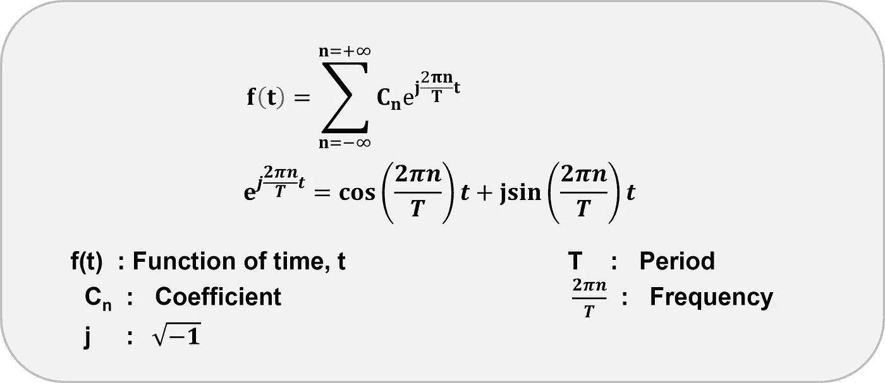
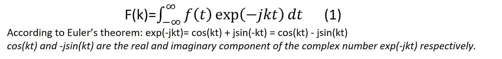
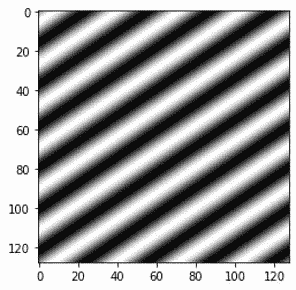
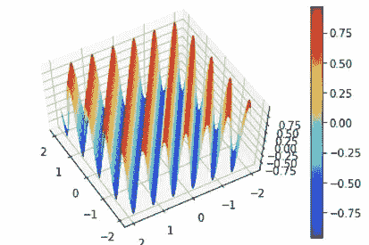
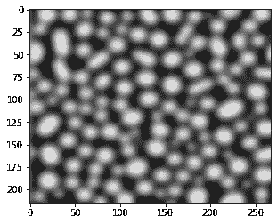
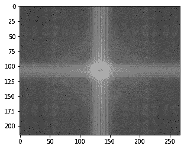
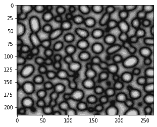
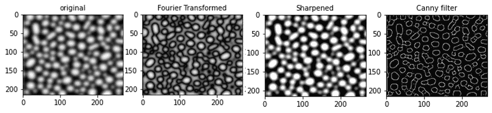

# 显微组织分析的快速傅立叶变换

> 原文：<https://towardsdatascience.com/fast-fourier-transforms-for-microstructural-analysis-9663ddfa9931>

## 用快速傅立叶变换分析微观结构特征

[马太·亨利](https://unsplash.com/@matthewhenry?utm_source=unsplash&utm_medium=referral&utm_content=creditCopyText)在 [Unsplash](https://unsplash.com/s/photos/electrical-impulse?utm_source=unsplash&utm_medium=referral&utm_content=creditCopyText) 上拍照

**背景**

这个宇宙中所有的能量都具有粒子-波双重特性。傅立叶级数和傅立叶变换是广泛使用的数学运算，它们分解来自不同能量的波信号以提取有价值的数据。在解决一个关于热传导的问题时，法国数学家[约瑟夫·傅立叶](https://en.wikipedia.org/wiki/Joseph_Fourier)分析了热波的正弦分量，这导致了傅立叶级数和傅立叶分析的发展。

虽然这些数学运算主要用于处理电磁辐射，如无线电、音频和电信号，但它们也广泛应用于图像处理以收集信息。*电磁辐射产生的信号与时间相关，而图像产生的信号与空间相关。*

在这里，我将讨论为什么和如何傅立叶变换是有助于解释图像。作为一名材料科学家，我将特别强调这一工具在材料表征方面的优势。

为了便于理解这篇文章，我将从傅立叶级数和傅立叶变换的简要概述开始。

**傅立叶级数、傅立叶变换和快速傅立叶变换(FFT)简介**

一个 [**傅立叶级数**](https://en.wikipedia.org/wiki/Fourier_series) 是一个**和**，它将一个**周期函数**表示为**正弦**和**余弦波**的和。这是描述这个数列的方程式。

作者图片:傅立叶系列

周期性函数以规则的间隔重复，称为**时间**周期**周期**。例如，下面的函数 f(x)以 2π的规则间隔重复自身:

f(x) = sin(x)

**频率**是周期的倒数。

**傅立叶变换**操作将时域的**信号变换到频域**或将空间域的**信号变换到空间频域**(也称为倒易空间)并由以下等式表示。

F(k)是频率 k 的函数；j 是虚数√-1。由于频率和时间(或空间坐标)变量是从-∞到+∞变化的连续值，上述等式表示**连续傅里叶变换**。此外，我们还可以对离散点/样本应用变换算子，该操作称为**离散傅立叶变换(DFT)。** DFT 变换连续积分(方程式。2)变成一个离散的和:

对 N 个点或样本的总和的评估涉及与 O(N)成比例的[计算复杂度](https://eng.libretexts.org/Bookshelves/Electrical_Engineering/Introductory_Electrical_Engineering/Electrical_Engineering_(Johnson)/05%3A_Digital_Signal_Processing/5.08%3A_DFT_-_Computational_Complexity)，其中 O 表示复杂度的阶。 [Cooley 和 Tukey](https://en.wikipedia.org/wiki/Cooley%E2%80%93Tukey_FFT_algorithm) 在 1965 年实现了分治算法(O(NlogN))来加速和(Eq。3).库利-图基算法是 FFT 的第一个实现。麻省理工学院的 Frigo 和 Johnson 进一步发展了 FFT 算法，并创造了在世界范围内广泛使用的 [FFTW](http://fftw.org/) (西方最快的傅立叶变换)。(注意: [pyFFTW](https://pypi.org/project/pyFFTW/) 是 FFTW 周围的 pythonic 包装器)。

现在让我们了解如何使用 FFT 来分析数字图像。

**数字图像中 FFT 的相关性**

一幅数字图像由称为**像素**的基本单元组成，每个像素被赋予一个在 0 到 255 之间变化的特定亮度值。图像的空间域包含关于真实空间中的像素强度和像素坐标的信息。

现在让我们使用 NumPy 从 2D 周期函数 f(x，y) = sin(2πx +3πy)生成一个图像，如下所示。

图片作者:2D 由周期函数生成的图像:f(x，y) = sin(2πx +3πy)

图像的相应 3D 表示完美地捕捉了波动特征，从而证明了对图像的傅立叶变换操作是正确的。因此，通过傅立叶变换处理图像信号可以为科学家和工程师挖掘隐藏的但重要的数据。

作者提供的图像:上面图像的 3D 显示，展示了波浪的性质

*点击* [*此处*](https://bjoyita.github.io/Tutorial_1.html) *了解 Python 中的函数生成图像。*

**用于微结构加工的 FFT**

在材料科学中，[显微照片](/materials-data-mining-via-image-processing-of-micrographs-4814e7112e40)是用来探索和挖掘最终会影响材料性能的数据的图像。

现在让我演示一个图像(显微照片)处理过程，使用傅立叶滤波器来检索微结构特征的精确边缘。我考虑了一个散焦图像(如下所示),显示边缘无法准确识别的圆形颗粒。

作者图片:散焦显微照片

我用过 NumPy 的 FFT 库，写图像处理的代码。*(可以使用 pyFFTW，比较相对执行时间。pyFFTW 什么时候打败 numpy.fft？)*

在这里，我写下了将 FFT 应用于上图的主要步骤:

‣我使用了 **imread 将图像的 jpg 文件转换成一个矩阵** (A)，它的元素存储了关于每个像素的信息(它的坐标和强度)。

‣ **从** **实空间到傅立叶空间的变换:**我将 np.fft.fft2 函数应用于图像矩阵 a，以将其从实(空间)域变换到频域，随后将偏离中心的零频率分量移回到中心。代码输出如下所示👇：

代码输出:将零频率分量移至中心后倒易空间中的图像

‣ **屏蔽图像:**由于粒子的边缘对应于高频，所以只允许这样的频率通过的屏蔽被应用于从先前步骤获得的变换图像。这有助于突出边缘。

‣ **最终滤波后的图像:**最后，我们需要通过对掩蔽后的图像部署 np.fft.ifft2 函数，从空间频率空间回到真实空间。我在下面分享了处理过的带有明显颗粒边缘的图像。人们可以很容易地测量具有确定边界的颗粒的尺寸。

真实空间中的滤波图像

**与其他图像处理滤波器的比较**

为了进行比较研究，我在上面的显微照片上应用了另外两个图像滤镜——Canny[和 unsharp masking](https://scikit-image.org/docs/dev/api/skimage.feature.html#skimage.feature.canny)滤镜。

可以清楚地看到(如下所示)，傅立叶过滤器在识别颗粒边缘以进行精确测量方面优于 Canny 和 unsharp 遮罩过滤器。傅立叶滤波器具有优势，因为它能够在信号的幅度、频率、方向和相位方面精确地对信号进行去卷积。

代码输出-处理过的图像:三种图像过滤器的比较

点击[**这里的**](https://github.com/bjoyita/ImageFilters) 到查看全部代码。

**关键要点**

傅立叶级数仅可**应用于周期性函数，而傅立叶变换工具也可用于非周期性函数。**

图像大多是非周期性的。然而，通过考虑表示图像的信号的离散跨度，在假设周期性的情况下，傅立叶变换被广泛用于图像处理中。这个概念为 DFT 奠定了基础。DFT 是使用 FFT 算法以数字方式实现的。

FFT 将波信号从时域转换到频域，或者从实空间转换到倒易(空间频率)空间。

在图像处理中，实空间中的像素信息被转换成倒易(空间频率)空间中的像素信息。

傅立叶过滤器可以定性和定量地精确检测显微照片中的特征。

*详情请访问* [*我的网站*](https://bjoyita.github.io/index.html) *。*

感谢您的阅读！