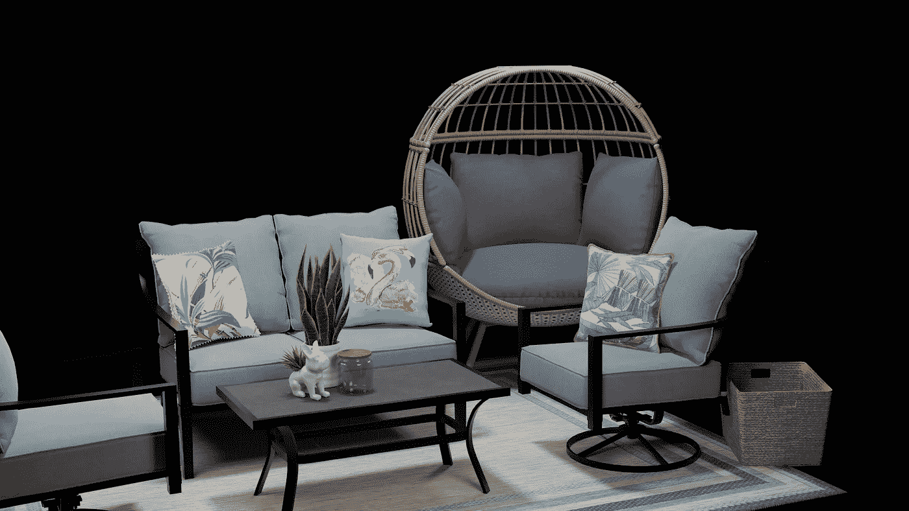
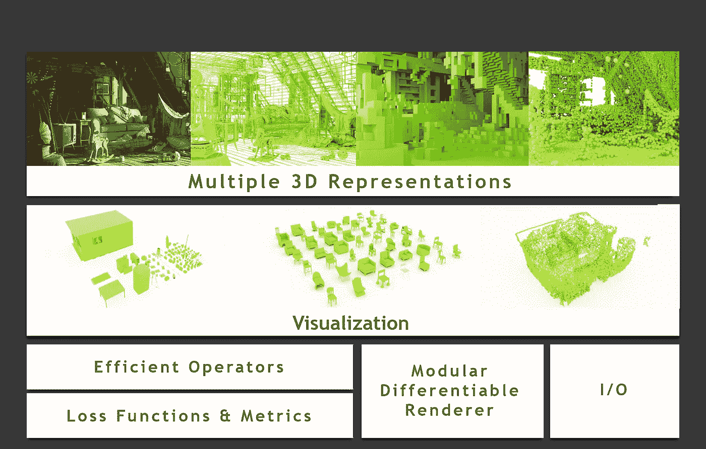
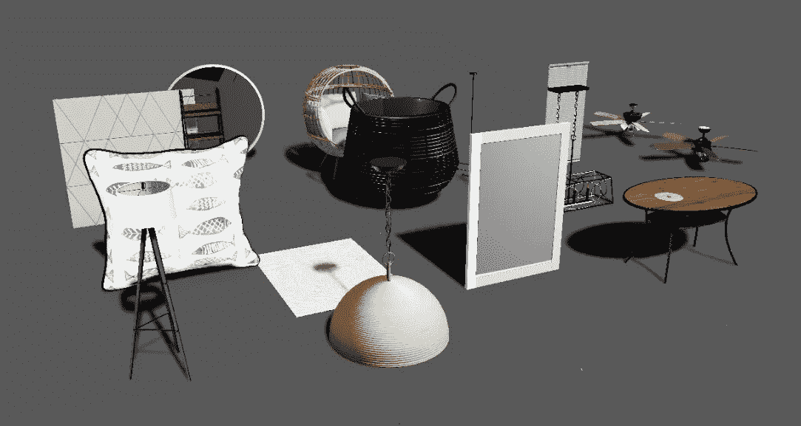

# 使用 NVIDIA Omniverse 高岭土快速合成数据

> 原文：<https://towardsdatascience.com/fast-synthetic-data-with-nvidia-omniverse-kaolin-d96c75465b80>

## 高岭土应用程序如何在几分钟内制作转盘风格的合成数据集的美元文件

来自 Lowe's Open Builder 数据集的美元资产集合将用于 NVIDIA Omniverse Kaolin[作者使用来自 [Lowe's Open Builder](https://lowesopenbuilder.com/terms/) 的资产拍摄的照片]。

# 概观

对 3D 深度学习的兴趣一直在以极快的速度加速增长。随着 [PyTorch3D](https://pytorch3d.org/) 、[高岭土](https://developer.nvidia.com/nvidia-kaolin)、 [Open3D](http://www.open3d.org/) 、SIGGRAPH、CVPR 和 ECCV 的大量论文，以及从[特斯拉](https://youtu.be/ABbDB6xri8o)、[亚马逊](https://www.amazon.science/latest-news/at-amazon-robotics-simulation-gains-traction)和[宝马](https://control.com/news/bmw-joins-automotive-manufacturers-in-utilizing-digital-twin-technology-in-automotive-sector/)涌现出的工业案例研究，仅举几个例子，很明显[空间计算](https://www.scientificamerican.com/article/spatial-computing-could-be-the-next-big-thing/)革命已经开始。此外，[以数据为中心的人工智能](https://mitsloan.mit.edu/ideas-made-to-matter/why-its-time-data-centric-artificial-intelligence)运动激发了人们对用模拟引导 CV 应用的兴趣。了解如何处理单视场相机、立体相机、360°相机、激光雷达、结构光扫描、地理空间数据、航空照片，以及如何将它们融合在一起，正成为一项基本技能。

NVIDIA 正在构建一个庞大的可扩展工具和应用程序集合，用于在 NVIDIA Omniverse 内部进行无缝、高保真的模拟和设计。Omniverse 不仅仅是英伟达在元宇宙的赌博。他们正在使它成为未来对 3D 内容永无止境需求的核心工具套件，渗透到游戏、工业可视化、视觉效果、自动化、空间零售、模拟和几乎所有其他行业的不断增长的市场。

他们称之为 Omniverse，因为他们的价值主张的核心是互操作性和协作。这是由 [Omniverse Connect](https://www.nvidia.com/en-us/omniverse/) 提供支持的，这是一组扩展，允许各种 3D 应用程序与 Omniverse 实时交换数据。连接器列表包括虚幻引擎，3DS Max，Maya，Revit 和每天更多。这个特性的一个关键因素是对标准的严重依赖，特别是 MDL、PhysX 和 Pixar 的 USD，NVIDIA 首席执行官黄仁勋声称这些标准将成为“元宇宙的 HTML”

NVIDIA Omniverse 与 Maya 连接:Maya 中的编辑通过实时光线跟踪反映在 Omniverse 中。

毫无疑问，他们对于 Omniverse 作为整个 3D 资产生态系统的唯一真实来源的价值主张将是非常有价值的，如果它确实能够实现这一点的话。NVIDIA 正在投入大量资源来实现其潜力。只有时间能证明一切。现在，让我们来看看 Omniverse，特别是 Kaolin 应用程序，如何在今天被用来生成合成数据，以开发您自己的计算机视觉应用程序。

# 高岭土

高岭土库概述【来自 NVIDIA 的[高岭土库，根据](https://github.com/NVIDIAGameWorks/kaolin) [Apache 许可证版本授权。2.0](https://www.apache.org/licenses/LICENSE-2.0.html) 。

[Kaolin](https://developer.nvidia.com/nvidia-kaolin) 是 NVIDIA 基于 PyTorch 构建的 3D 深度学习高级 Python 库。它提供了可区分的渲染器、光栅化工具、用于操纵网格、顶点、面、UV 贴图和纹理的帮助器、常见的损失函数，如切角距离和 IoU、文件 IO、各种 3D 表示的转换、图形卷积、结构化点云等等。

不要与高岭土库混淆，高岭土*应用*是高岭土库的伴侣，是 Omniverse 应用套件的一部分。迄今为止，它包含三个主要特性:

*   **数据集可视化器** —在 3D 界面中查看和检查 USD 模型集合。
*   **数据生成器** —从一组 USD 文件中创建用于计算机视觉应用的合成训练数据。包括用于分段的注释器、2D & 3D 边界框、法线、点云等等。
*   **训练可视化器** —查看来自深度学习会话的网格、点云以及其他 3D 数据结构随时间的训练输出。

使用高岭土应用程序的高级工作流程如下:

1.  使用**数据集可视化器**检查您的 3D 资产集合。
2.  使用**数据生成器**生成数据集。
3.  使用高岭土库在数据集上训练模型。
4.  用**训练可视化器**将训练结果进行三维可视化。

希望当我看完一个例子后，所有的问题都会迎刃而解。首先，让我们下载一些 3D 资源来使用。

## 劳氏开放式建造机

NVIDIA Omniverse Kaolin 中的 Lowe's Open Builder 资产[作者使用来自 [Lowe's Open Builder](https://lowesopenbuilder.com/terms/) 的资产拍摄的照片]。

Lowe's (是的，五金店)正在元宇宙表明自己的主张。他们最近发布了 [Lowe's Open Builder](https://lowesopenbuilder.com/) ，这是一个 GLB 和 USDZ 格式的超过 500 个 3D 资产的数据集，任何人都可以免费下载和使用(关于使用条款，请阅读这里的)。它包括橱柜、工作台面、水槽、灯具、地毯、花盆、桌子、架子和许多你能在劳氏商店找到的产品。该网站使搜索、检查和下载模型变得很容易，因此我们将使用这些资源中的一些来进行高岭土实验。至少找到一个你喜欢的并下载 USDZ 文件。

# 数据集可视化工具

现在我们有了我们的资产，让我们使用高岭土应用程序来查看它们。数据集可视化工具可以在给定目录中搜索任何。美元，。美国农业部或者。usdc 文件，并将它们自动加载到查看器中。其主要目的是快速检查 3D 资产的集合，以了解和识别训练中可能存在的问题。

目前，它不支持。usdz 文件，但是有一个简单的解决方法。如果您熟悉 USD 格式，您可能知道,. usdz 文件只是一个未压缩的归档文件，其中包含某种形式的 USD 文件及其媒体资产(在此处阅读有关 USDZ 规范[的更多信息](https://graphics.pixar.com/usd/release/spec_usdz.html))。因此，您可以简单地使用 7zip、`unzip`或另一个归档工具来提取每个文件。您下载的 usdz 文件。继续拉开拉链。使用适合您系统的归档实用程序将 usdz 文件下载到它自己的目录中。在里面你应该看到一个. usdc 文件和一些纹理在一个文件夹里。现在，在 Dataset Visualizer 中打开父目录应该可以成功加载这些模型。它递归地在指定的目录中搜索任何。美元，。美国农业部或者。usdc 文件。

下面的视频将引导您使用数据集可视化工具。

数据集可视化工具演练

这个应用程序只有几个简单的选项。您可以更改对象的数量，旋转它们，调整间距，以正常大小或正常比例查看它们，以及调整上轴。例如，使用这个可视化工具来查看您的模型的比例和方向是否正确。如果“正常化尺寸”未选中，书架和花瓶的尺寸应该会有很大不同。如果选中，它们看起来应该差不多一样大。如果资产看起来不垂直，也检查向上轴。您可能需要调整 USD 文件的“upAxis”属性。所有这些资产看起来都很好，y 轴向上。

# 数据生成程序

现在我们知道我们的资产大小合适，并且完全纹理化，我们可以用它们生成一些训练数据。“数据生成器”选项卡就是为此而设计的。此功能用于快速连续地生成资源集合的转盘样式图像，还可以选择对照明、相机姿势和材质进行随机化。

目前，数据生成器支持以下标签类型:

*   RGB
*   深度
*   法线
*   语义分割
*   实例分割
*   2D 边界框(紧密或松散)
*   3D 边界框
*   点云
*   相机姿势

以下视频将引导您使用数据生成器。

数据生成器演练

借助 Omniverse Kaolin 中的数据生成器，您可以训练机器学习模型进行分类、对象检测、语义/实例分割、深度估计、3D 场景理解、3D 重建等。然而，您可能会问自己:为什么我可能想要生成 3D 模型的训练数据？虽然[领域差距](https://analyticsindiamag.com/closing-the-gap-between-real-and-synthetic-data/)使得将合成数据用于现实世界的应用成为一项重要任务，但每天都有越来越多的合成数据解锁功能的例子，这些功能在以前是不可能或难以获得真实数据的。看看最近来自[特斯拉](https://youtu.be/ABbDB6xri8o)、 [OpenAI](https://youtu.be/MsDuypVMLkM) 、[亚马逊](https://venturebeat.com/2022/03/22/nvidias-omniverse-virtual-simulations-move-to-the-cloud/)、 [Meta](https://siliconangle.com/2021/12/27/report-meta-boosts-metaverse-push-help-synthetic-data-startup-ai-reverie/) (他们最近收购了合成数据初创公司 AI。遐想)等等。它还可以用于增强计算机视觉应用的原型开发，而不需要在硬件或标签上进行任何投资。

# 培训可视化工具

顾名思义，训练可视化工具对于实时监控 ML 模型的训练非常有用。你可能想知道“这不就是 Tensorboard 的用途吗？”Tensorboard 对于监控损耗、重量和输出数据日志是不可或缺的，而 Training Visualizer 支持实时渲染 3D 数据的光线跟踪。您还可以在训练迭代中滑动，可视化模型拓扑和纹理在整个训练过程中如何演变。

下面的视频将引导您使用培训可视化工具。

培训可视化工具演练

此时，您有两个选择:您可以 a)尝试使用高岭土库对您的数据训练模型，或者 b)下载我创建的训练日志，以立即试用训练可视化工具。

## 选项 A:安装高岭土

为了训练一个模型，我们需要[安装高岭土库](https://github.com/NVIDIAGameWorks/kaolin)。如果你喜欢冒险，继续按照安装说明进行操作，进入 [DIB-R 光栅化教程](https://github.com/NVIDIAGameWorks/kaolin/blob/master/examples/tutorial/dibr_tutorial.ipynb)。简而言之，这将使模板网格(在这种情况下是球体)变形，以通过仅使用输入图像、遮罩和姿态的优化来近似 3D 模型。您可以用刚刚创建的训练数据集的路径替换`rendered_path`。完成后，在培训可视化工具中打开`logs_path`中的输出。

## 选项 B:下载培训日志

如果您想让事情变得简单，请随意[下载此培训课程日志](https://masonmcgough-data-bucket.s3.us-west-2.amazonaws.com/kaolin-optimized_mesh.zip)自行查看结果。从该文件中提取文件夹，然后在 Training Visualizer 中打开它(确保打开顶层文件夹，因为应用程序可能对文件夹结构非常挑剔)。您应该会看到类似上面视频中的结果。

# 结论

希望这有助于您使用 Omniverse 和 Kaolin 应用程序为 3D 深度学习生成 USD 3D 模型的标记合成数据集。这是一种快速有效的方法，可以为计算机视觉和 3D 深度学习实验生成数据集。如果你正在寻找驱动一个更复杂的模拟 ML 训练，你也可以尝试一下 [Omniverse Replicator SDK](https://developer.nvidia.com/nvidia-omniverse-platform/replicator) 。

如果一切顺利，我将发表一篇后续文章，详细介绍如何使用 [Kaolin Wisp](https://developer.nvidia.com/blog/research-neural-fields-your-way-with-nvidia-kaolin-wisp/) ，这是一套新发布的工具，建立在 Kaolin 库之上，专门用于神经渲染技术，以便您可以在我们创建的数据上训练 NeRF。敬请期待！