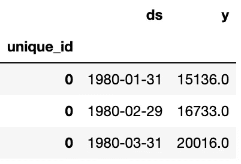
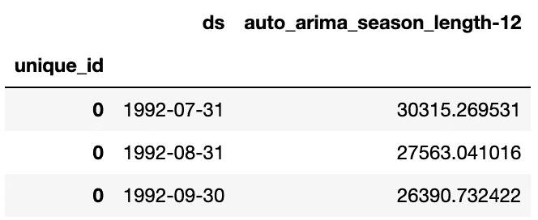
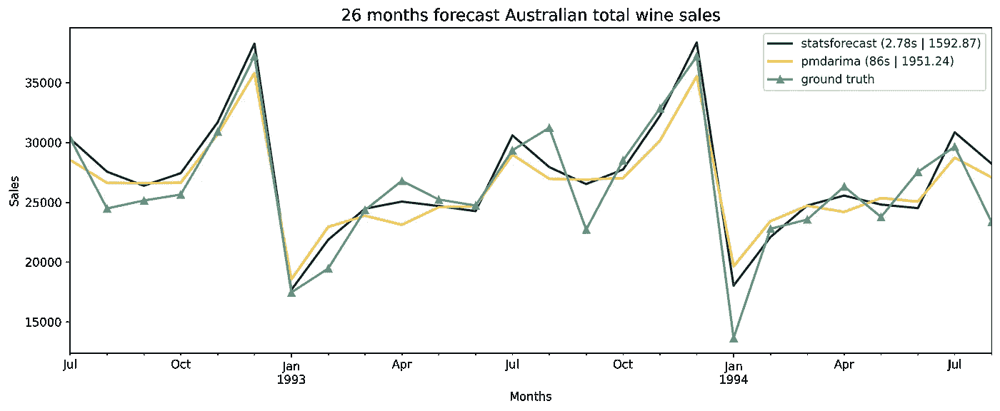
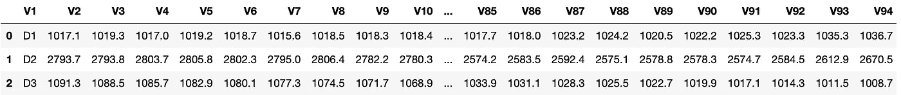
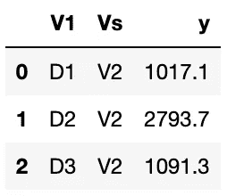
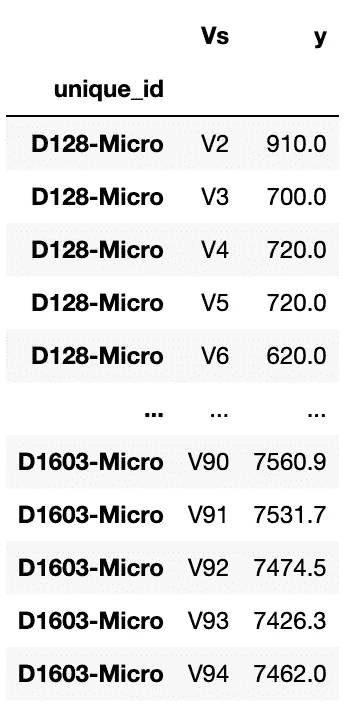
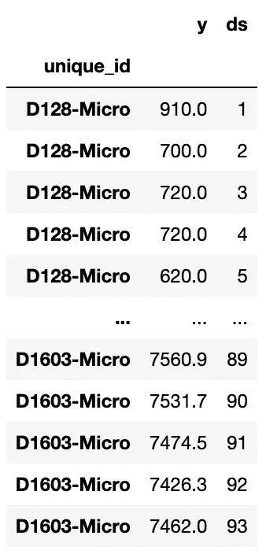

# 基于 StatsForecast 的快速时间序列预测

> 原文：<https://towardsdatascience.com/fast-time-series-forecasting-with-statsforecast-694d1670a2f3>

## 用 Nixtla 的 StatsForecast 软件包快速预测单变量时间序列


照片由[皮克斯拜](https://pixabay.com/de/photos/donner-blitz-sturm-himmel-nacht-4963719/)拍摄。

StatsForecast 是一个[包](https://github.com/Nixtla/statsforecast)，它附带了一组统计和计量经济学模型来预测**单变量**时间序列。它与**大型时间序列**完美配合，不仅声称比已知的 [pmdarima](https://alkaline-ml.com/pmdarima/) 包快**20 倍**，而且比 [fb prophet](https://facebook.github.io/prophet/) 快**500 倍**。

本文为您提供了 StatsForecast 软件包的**第一概述**和**如何使用它**。为了展示它的超快性能以及它对单个和多个时间序列的使用，我们将使用两个数据集。

我们将使用单一时间序列的[澳大利亚葡萄酒总销售额](https://alkaline-ml.com/pmdarima/1.6.1/modules/generated/pmdarima.datasets.load_wineind.html)数据集。该数据集将用于比较 StatsForecast 的`auto_arima`函数与众所周知的 [pmdarima 包](https://alkaline-ml.com/pmdarima/)中的函数。第二个是 [M4](https://zenodo.org/record/4656548#.Yh-ViBO1KgV) 数据集的摘录，包含 1.476 个时间序列。第二个示例背后的想法是向您展示如何使用包准备数据来预测多个时间序列。

# 为什么这么快？

在我们开始之前，你可能会怀疑，想知道它这么快的秘密是什么。这有两个主要原因。

一、StatsForecast 使用 [**Numba**](https://numba.pydata.org/) 。Numba 是一个用于 Python 的**实时(JIT)编译器**，它可以很好地处理 NumPy 代码，并翻译数组、代数函数等部分。在**中，快速机器代码**。

第二，它还使用了**并行计算**，在处理**多个时间序列**时显示了它的优势。

# 入门和先决条件

要安装 StatsForecast，只需运行以下命令，如果您想安装带有 pip 的软件包:

```
pip install statsforecast
```

要使用 conda run 安装它:

```
conda install -c nixtla statsforecast
```

## 数据结构

StatsForecast 需要具有特定结构中的时间序列数据**:**

```
+-----------+----------+-------+
| unique_id |    ds    |   y   |
+-----------+------------------+
|     0     | Jan 2021 |  100  |
|     0     | Feb 2021 |  200  |
|     0     | Mar 2021 |  150  |
+-----------+------------------+
```

*   一个名为**唯一标识**的**索引列**
*   包含**日期**或**数值**的 **ds** 列
*   **y** 列是我们的**单变量**时间序列的**目标变量**

索引列表示相应时间序列的索引。如果只使用一个**单一时间序列**，则索引**始终为 0** 或**常量**。如果在一个数据帧中有**多个时间序列**，索引用于**区分它们之间的**并启用并行计算。例如，第一个时间序列的索引为 0，第二个时间序列的索引为 1，依此类推。

# 使用统计预测进行预测

现在我们已经熟悉了所需的数据结构，让我们从建模和预测开始。

**澳大利亚葡萄酒总销售额(单一时间序列)**

首先，我们必须以正确的形式呈现数据。销售数据是以日期(年月)为索引的序列(*行 8* )。

由于是一个**单时间序列**，我们将整个数据的**索引**设置为 **0** ，为日期创建一个 **ds** 列，为销售额创建一个 **y** 列(*第 11-17 行*)。

在这一步之后，我们将 **ds** 列转换为 *datetime* ( *第 18 行*)。总的葡萄酒数据是每月一次。当我们用*日期时间*、*、*进行转换时，我们得到一个*年-月-日*格式，总是从一个月的第一天开始。这可能会在以后使用预测方法时导致问题(结果日期总是月末)。这就是为什么我们在这里加上*MonthEnd①*。

最后，我们将数据分为训练集和测试集。我们数据的最终结果如下所示:



图一。转换后的澳大利亚葡萄酒总销售额数据集摘录。

将数据整理成正确的形状后，我们可以开始初始化 StatsForecast:

StatsForecast 需要以下**参数**:

*   (训练)数据框
*   您想要用作带有模型名称和相应参数(auto_arima，12)的元组**的模型**
*   频率(“M”代表月份，“Y”代表年份，等等。)
*   可选的是 *n_jobs，*可以用来在处理多个时间序列时启用并行计算。

正如开头提到的，StatsForecast 附带了一堆其他的**统计**和**计量经济学模型**。您可以将模型参数(*第 7 行*)作为元组提供给多个模型参数及其特定参数。**的**完整列表**所有提供的型号**可以在 [**这里**](https://nixtla.github.io/statsforecast/models.html) 找到。

在本例中，我们仅使用`auto_arima`模型，并将季节长度参数设置为 12。默认情况下，n_job 参数设置为 1。只有当我们的数据集中有多个时间序列时，增加它才有意义。

现在我们已经配置了我们的预测器，我们可以预测即将到来的 26 个月。

**计算时间**刚好用了 **2.78 秒**

StatsForecast 的预测以数据帧的形式返回(图 2)。每一列(除了当时的 ds)显示由定义的模型产生的预测。



图二。使用 auto_arima 的 StatsForecast 预测摘录。

现在我们有了结果，让我们计算平均绝对误差(MAE)。各种时间序列误差指标的完整概述可在[这里](/time-series-forecast-error-metrics-you-should-know-cc88b8c67f27?source=your_stories_page----------------------------------------)找到。

我们得到了**的一个**MAE**of**的一个**MAE**MAE】。56629 . 68686868626

## 与 pmdarima 包的比较

现在让我们比较一下 pmdarima 软件包的`auto_arima` 功能的性能和精度。

使用统计预测`auto_arima`方法，我们有一个**的计算时间**为 **86** 秒**和一个**的平均时间**为**秒****

比较两个软件包的性能，并将预测结果绘制成图表(图 3)，我们可以看到 StatsForecast 的`auto_arima`比 pmdarima 的快 30 倍**，并且**比 pmdarima 的**更准确。**



图 3。26 个月预测结果。

# M4 数据(多个时间序列)

因为我们现在已经熟悉了预测单个时间序列，所以我们现在关注一个更高级的例子。M4 的数据可以在这里找到。为了****简单**和**演示**，我们只关注微观经济时间序列的每日数据(1.476 个不同的时间序列)。如上所述，本节的目的是向您展示如何在 StatsForecast 的**右侧形状**中引入多个时间序列。**

**我们首先加载部分 M4 数据集，并将列转换为行:**

**原始数据(图 4)将被转换成下面的形状(图 5)。**

****

**图 4。加载的 M4 每日数据集摘录。**

****

**图 5。转换后的 M4 每日数据集摘录。**

**在此步骤之后，我们将关于数据集的信息(主要是其类别)添加到我们的测试和训练数据帧中(*第 2–3 行*)。我们还创建了一个 **unique_id** 索引，其中包含每个时间序列的类别和 id(*第 5–6 行*)。**

**这一争论步骤之后的结果如下所示:**

****

**图 6。操作后的训练数据集摘录。**

**与第一个例子不同，我们的索引现在有了多个值。每个值代表一个时间序列。这有助于软件包运行**并行计算**或预测。**

**只差最后一步了:我们必须添加或创建一个 **ds** 列。我们通过运行以下代码来实现这一点:**

**该代码为每个时间序列添加一个数字序列(从 1 开始)，代表相应的日期。**记住**:**ds**-列可以包含**数值**或**日期**。结果看起来像这样:**

****

**图 7。带 ds 列的训练数据集摘录。**

**现在我们已经有了所有需要的数据，我们可以进入最后的建模步骤。**

**我们将季节长度设置为 7，将频率设置为“D ”,因为我们有每日数据。与我们的第一个例子不同，我们没有将 n_jobs 设置为 1，而是设置为我们想要预测的不同时间序列的数量。n_jobs 由可用内核的数量和不同的时间序列决定。如果时间序列比可用内核多，`min`函数将返回可用内核的数量。**

**执行预测花费了**3 分 11 秒**和**的 MAE。48659 . 63838638631****

# **结论**

**StatsForecast 的表现确实令人印象深刻。正如你在他们的 [github](https://github.com/Nixtla/statsforecast) 页面上看到的，团队正在努力修复漏洞和实现新功能。
即使他们目前的[文档](https://nixtla.github.io/statsforecast/)有限，但正在制作中，你可以在他们的 github 页面上找到很多例子，以及一篇关于 [towardsdatascience](/time-series-forecasting-with-statistical-models-f08dcd1d24d1) 的写得很好的详细文章。**

**如果我可以许三个愿望，那么我希望有置信区间和预测区间、模型汇总函数(提供更多关于模型的统计信息)以及 StatsForecast 在其他包中的集成。**

# **更多链接**

**👉StatsForecast 的 [github 页面](https://github.com/Nixtla/statsforecast)**

**👉联合创始人 Federico Garza Ramírez 撰写的 TDS 文章**

**👉Pmdarima 的 [github 页面](https://github.com/alkaline-ml/pmdarima)**

**👉[时序误差指标概述](/time-series-forecast-error-metrics-you-should-know-cc88b8c67f27)**