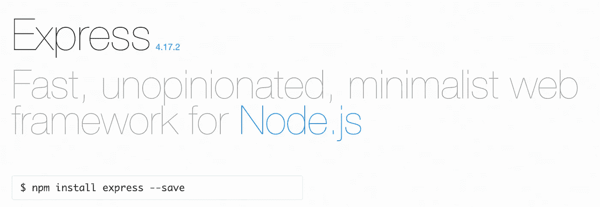
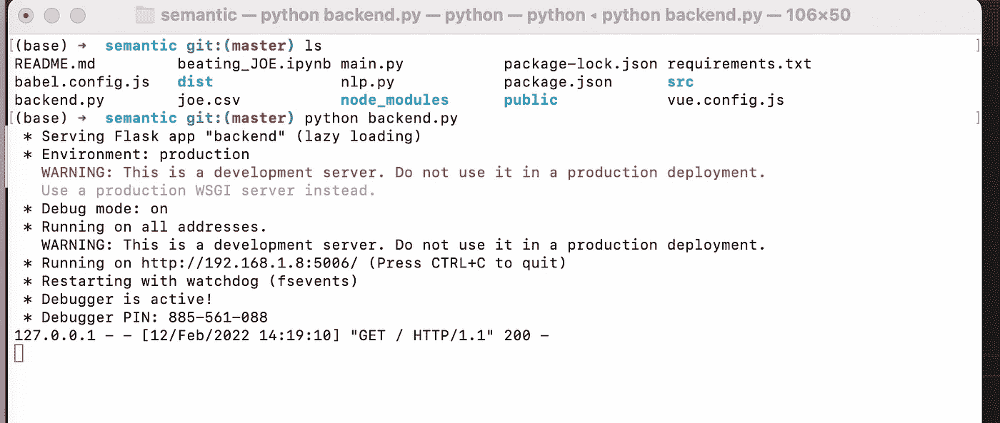
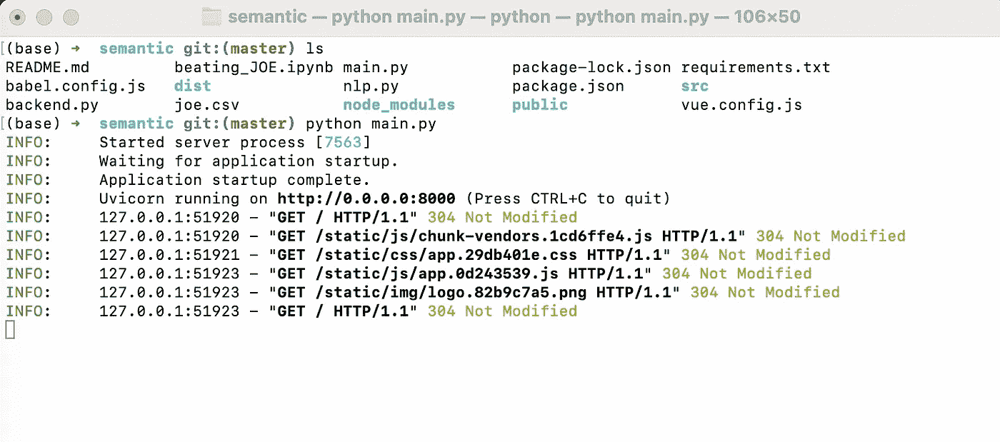
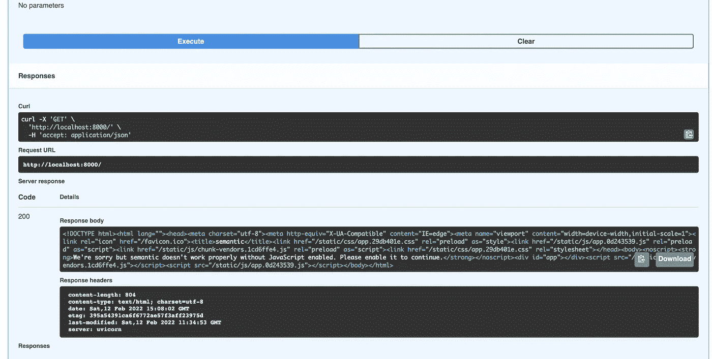

# FastAPI 对 Flask

> 原文：<https://towardsdatascience.com/fastapi-versus-flask-3f90adc9572f>

## 这是怎么回事？我们不是已经有姜戈了吗？

在 [Unsplash](https://unsplash.com?utm_source=medium&utm_medium=referral) 上由 [Tharoushan Kandarajah](https://unsplash.com/@tharoushan?utm_source=medium&utm_medium=referral) 拍摄的照片

最近，在我看来，有一个关于作为替代 Python web 框架的 [FastAPI](https://fastapi.tiangolo.com/) 的讨论。我从来没有那么喜欢 Django，因为它对于我的特定用例来说似乎太重了，但是我一直喜欢 [Flask](https://flask.palletsprojects.com/en/2.0.x/) 因为它构建起来又快又容易。所以现在我们有了一个敢于自称为 FastAPI 的框架，自然地，鉴于我对跑车的热爱，我只需要做一个项目，然后，嗯，带着它转一圈！。

# 我如何使用烧瓶

因为我已经到达了**“web 框架经销店”**，所以最好描述一下我通常开的车，这种思考可以为试驾提供所需的背景。

我使用带有内置开发服务器的 Flask 进行快速原型或本地开发的概念验证工作。因此，这对于有限的本地机器用户来说很好。然而，当我在公共互联网上部署到 [Heroku](https://www.heroku.com/) 或 [AWS 虚拟机](https://aws.amazon.com/getting-started/hands-on/launch-windows-vm/)时，我使用了不同的方法。我用烧瓶，带 [Gunicorn](https://medium.com/django-deployment/which-wsgi-server-should-i-use-a70548da6a83) 或 [uWSGI](https://uwsgi-docs.readthedocs.io/en/latest/) 和 [Nginx](https://www.nginx.com/) 。现在，我相信你会知道这一点，我们正在谈论一个带有 API 服务的 Python 后端。Python 后端服务于我的用例，因为有像 [scikit-learn](https://scikit-learn.org/stable/) 和 [nltk](https://www.nltk.org/) 这样的库。我甚至毫不费力地在 RaspberryPi 计算机上部署了我最喜欢的堆栈。

你可以[在这里](https://youtu.be/xZXdYkbPi7Y)观看一个视频，在这里我用 Python 和 Flask 演示了整个项目。另外，我做了一个系列，从头到尾讲解了整个开发过程，[这里有](https://youtube.com/playlist?list=PL_7kiTrbF7bggIoU3ESx_5CAdZrA7Nr_V)。最后，我在支持视频系列的媒体上写了[文章](https://towardsdatascience.com/tagged/dofromscratch)。

我总是在前端使用 [vue.js](https://vuejs.org/) 和 [bootstrap](https://bootstrap-vue.org/) 进行我的造型。我甚至写了如何让 [Python 后端服务器和 vue 应用程序运行良好](https://medium.com/towards-data-science/using-a-python-back-end-b9e4f9ac5d)，而没有我在最近的许多文章中读到的所有 [Docker 容器对话](https://testdriven.io/blog/developing-a-single-page-app-with-fastapi-and-vuejs/)和 [CORS](https://developer.mozilla.org/en-US/docs/Web/HTTP/CORS) 问题。

所以我是一个固执己见的买家。像任何潜在买家一样，我脑海中有一个小小的声音在说…

[https://expressjs.com/](https://expressjs.com/)—图片来自快报网站

停下来！好吧，毕竟我们都忽略了脑子里那些小小的声音，不是吗？毕竟,是正品。我承认我使用 Express，明显的优势是后端和前端使用相同的编码语言。然而，不情愿地，我也不得不承认 Express 的响应看起来和感觉起来比同等烧瓶配置的响应快得多。

它不是一个单一的**‘网络框架经销商’；这是一个挤满经销商的拥挤商场。我看到 [Java](https://ssaurel.medium.com/create-a-simple-http-web-server-in-java-3fc12b29d5fd) 经销店再往下，脑子里那个声音越来越大；停下来！！**

# 去哪里转一圈？

前几天我试驾了一辆高尔夫 GTI。你打赌他们没让我走远，因为车没油了。所以试驾的路程大约是 1 英里，因为我担心汽油用完。那些家伙！后来我说不用了，谢谢！

让我们回顾一下我早期的一个项目，并带着 FastAPI 和那个用例做一个简短的介绍。

 [## 语义突出显示

### 为 NLP 构建和添加用户界面

towardsdatascience.com](/semantic-highlighting-d2fba3da2822) 

语义突出是我当前项目的一部分，利用 NLP 服务帮助人们处理他们的[简历和求职](https://medium.com/p/90e6aed661a3)。用于 spin 的 [Github 库](https://github.com/CognitiveDave/semantic)包含了这两种方法。原始的[烧瓶](https://github.com/CognitiveDave/semantic/blob/master/backend.py)方法和新的 [FastAPI](https://github.com/CognitiveDave/semantic/blob/master/main.py) 工艺。

## **带烧瓶**

用 Mac Mini M1 运行 Flask 后端——图片由作者提供

带有 Vue.js 的前端应用程序演示了语义突出显示——图片由作者提供

所以我们知道我们要去哪里，也知道我们在试驾中会看到什么。****

# 试驾

好，我们开始吧！

FastAPI 后端运行— localhost —图片由作者提供

作者的照片——精彩！是一样的！我用了不同的端口号！

最大的区别是没有来自 Flask 开发服务器的警告。最好打开引擎盖，看看发动机；也许那是不同的！我脑中的声音说，“你对发动机了解多少”停下来！！！！！！

乍一看，代码似乎没有什么不同！我们不导入 Flask，而是导入 fastapi。还有一个 app . route(“/”)现在是 app . get(“/”)。我们甚至有第 15 行，它将后端服务器指向 dist 文件夹，在那里我们有 vue.js 应用程序的构建版本。提醒一下，我们必须构建 vue.js 应用程序，它在一个名为 dist 的文件夹中创建 index.html 和相关文件。你可以阅读资源库中的[自述文件](https://github.com/CognitiveDave/semantic)中的说明。

好了，我们从试驾回来了，坦率地说，我们仍然可以做我们可以用 Flask 做的事情！打哈欠！

# 物质享受呢？

你一定会喜欢那些销售人员的！他们总是有一个角度。

[http://localhost:8000/docs](http://localhost:8000/docs)

使用 FastAPI，尝试导航到/docs，让您的下巴离开地面！

Swagger UI 界面来自/docs —图片由作者提供。

不用多说，我买了！

使用内置的 Swagger-UI 页面测试我的单个端点——作者图片

如果你做全栈开发，就像你的后端和前端工作一样，你可能知道用户界面代码库中需要的每一个数据都有许多前端和后端步骤。所以连接 API 调用和使用这些 API 会变得有点复杂，特别是如果你使用一个"[Mud 设计模式](https://medium.com/pragmatic-programmers/big-ball-of-mud-pattern-d64c713a1cf0) n "的大球的话。

使用 FastAPI 对我来说比 Flask 更有优势。首先，我得到了 Swagger-UI 页面，它帮助我考虑我的端点和文档，甚至使用更好的工程模式。但是，更重要的是，我可以用一种更加用户友好的方式测试我的端点，当然还有速度！

# 这是怎么回事？

在 FastAPI 的引擎盖下有一堆 [gobblygook](https://www.urbandictionary.com/define.php?term=Gooblygook) ，很多关于[异步对同步](https://developer.mozilla.org/en-US/docs/Web/API/XMLHttpRequest/Synchronous_and_Asynchronous_Requests)的讨论，但是它归结为:-

*   异步ˌ非同步(asynchronous)
*   等待

 [## 关于 JavaScript 中的 Async Await，您只需要知道

### 如何使用异步 Await 关键字

medium.com](https://medium.com/technofunnel/javascript-async-await-c83b15950a71)  [## Django Async vs FastAPI vs WSGI Django:ML/DL 推理服务器的选择——回答一些燃…

### 是时候从 Django 转换到 FastAPI 了吗？提前阅读，自己决定。

ai .平原英语. io](https://ai.plainenglish.io/django-async-vs-fastapi-vs-wsgi-django-choice-of-ml-dl-inference-servers-answering-some-burning-e6a354bf272a) 

在我的上下文中，我正在设计一个处理文本文档的应用程序，包括对 NLP 例程的调用，并且需要为我的用户保持快速的响应时间。长时间运行的文本处理程序会挂起前端，并很快疏远我的用户。所以现在，有了 FastAPI，我可以利用 JavaScript 的 Express 服务器的优势和 Python 库的机器学习优势，而不会对我的最终用户造成重大影响。

这是令人兴奋的，可能是时候了！

照片由[雅各布·欧文斯](https://unsplash.com/@jakobowens1?utm_source=medium&utm_medium=referral)在 [Unsplash](https://unsplash.com?utm_source=medium&utm_medium=referral)

 [## 通过我的推荐链接-大卫·摩尔加入媒体

### 作为一个媒体会员，你的会员费的一部分会给你阅读的作家，你可以完全接触到每一个故事…

cognitivedave.medium.com](https://cognitivedave.medium.com/membership)