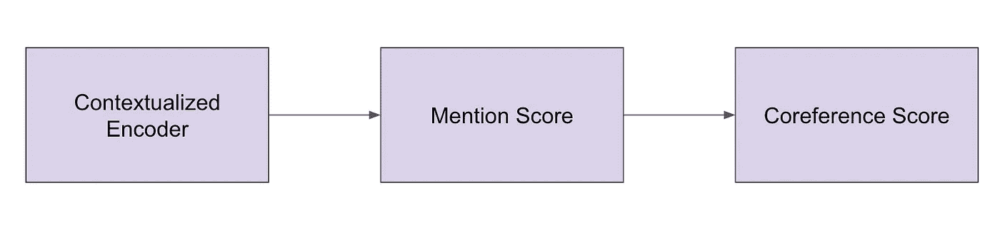
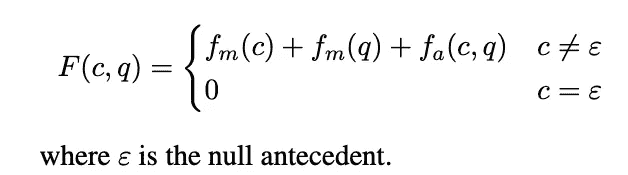
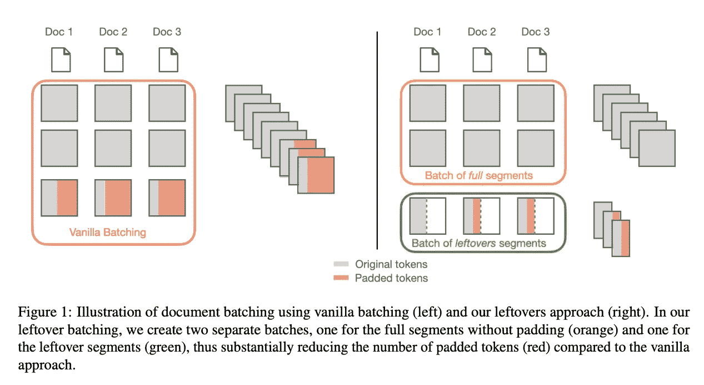
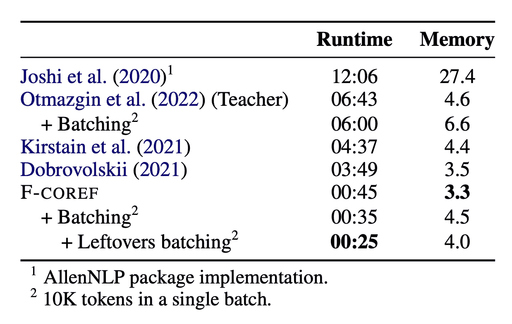

# fastcoref——一个实用的共指消解包

> 原文：<https://towardsdatascience.com/fastcoref-a-practical-package-for-coreference-resolution-bfbcb749e464>

## 理解自然语言处理中的共指消解的 F-coref 模型背后的主要工作，以及如何通过 fastcoref 直观包使用它


fastcoref——瑞安·斯通在 [Unsplash](https://unsplash.com/?utm_source=medium&utm_medium=referral) 上拍摄的照片

# 介绍

本周，以色列巴尔伊兰大学的 Shon Otmazgin，Arie Cattan 和 Yoav Goldberg 教授发布了一个名为'*【fastcoref '*【2】的共指消解包，它快速、准确且易于使用。在本文中，我们将了解这个包背后的主要工作以及如何使用它。你也可以在由 Ari Bronstein 创建的 huggingface 中看到这个伟大包的一个[演示。](https://huggingface.co/spaces/pythiccoder/FastCoref)

共指消解是识别文本提及(又名:提及检测)和链接文档中相互引用的实体(又名:共指决策)的任务。让我们看看劳拉·杨的这幅漫画，试着理解哪些实体是相同的。


劳拉·杨关于杨经济学的漫画

“爸爸”、“他”和“他的”指的是同一个实体，识别这些实体并将它们链接到它们的前身是我们在 NLP 共指解析中所说的。我假设你知道共指消解任务和模型，如果不知道的话[这里](https://galhever.medium.com/a-review-to-co-reference-resolution-models-f44b4360a00)是一篇很好的文章，可以给你更多的 Gal Hever 的背景知识。

共指任务是用于附加 NLP 任务的基本任务，例如:信息抽取、问题回答、摘要、机器翻译等等。尽管它作为一个基本的 NLP 任务很重要，但当前的研究未能实现快速工作或在有限资源下工作的体面模型。作者介绍的模型，*F-coref’*【1】，由于结合了**硬目标蒸馏模型**和**高效分批实现**(他们命名为“剩余分批”)。

# 背景——S2E 和林姆斯模型

一般的神经协同参考模型由三个模块组成。一个语境化的编码器，将单词嵌入到向量中，一个提及记分器，一旦我们有了提及，一个共指记分器。



通用共同参考模型管道

*F-coref* 模型基于 S2E 模型[3]。S2E 是一个神经模型，它将每个区间表示为其开始和结束标记的函数。它的架构包括:Longformer(一个上下文化的编码器)，一个参数化的提及评分函数(f_m)和一个参数化的成对先行评分函数(f_a)。

注意，为了节省计算时间，antecedent 函数只对提及分数最高的λT 区间进行评分。T-令牌数。λ-修剪超参数设置为 0.4，以实现高提及召回率。

分数计算为两个提及分数和配对前提分数之和。



分数计算为两个提及分数和配对前提分数的总和[1]

整个模型由 26 层和 494M 参数组成。

最近的工作，LINGMESS 模型[4]，通过为每种类型的提及引入多个评分器来提高共指准确性。这导致了 SOTA 精确度，但是该模型不如 S2E 有效。

# F-coref 模型

现在让我们来了解一下 *F-coref* 的要素是什么，才能达到极高的效率。我们将首先讨论知识提炼，然后讨论最大化并行性。

# 知识蒸馏—缩小模型尺寸

知识提炼是将知识从大模型转移到小模型的过程。当我们的目标是建立快速模型时，我们需要较少的参数。知识提炼是减少模型中的参数数量，同时仍然保持其大部分准确性的一个很好的方法。


[主持人](https://unsplash.com/@sofatutor)在 [Unsplash](https://unsplash.com/?utm_source=medium&utm_medium=referral) 上拍摄的“师生蒸馏”照片

## 师生模式

为了训练 F-coref，作者使用 LINGMESS 作为教师模型。学生模型的构建与 S2E 模型相似，但稍有修改:层数更少，因此参数也更少，相对较慢的 Longformer 被 DistilRoBERTa 取代。总的来说，参数的数量从 494M 减少到 91M，层数从 26 层减少到 8 层。
他们用**硬目标知识提炼**。也就是说，教师模型充当未标记数据的注释器，学生模型从这些注释中学习，而不是学生根据教师模型的逻辑进行学习的软版本。软提取对于共指任务不起作用的原因是提及修剪和传递性的违反(这很有趣，可以帮助您选择提取模型，您可以在论文[1]中了解更多)。

# 最大化并行性——让它更快

作者使用了更低的λ进行修剪(0.25 而不是 0.4)，他们声称这在不影响性能的情况下减少了 2.56 对的数量。他们还使用了一个新版本的动态批处理，将文档数量分批到某个阈值，他们将其命名为*“剩余文件分批”*。


[Richad Bell](https://unsplash.com/@maplerockdesign) 在[Unsplash](https://unsplash.com/?utm_source=medium&utm_medium=referral) 上拍摄的“剩余配料”照片

## 剩菜配料

共指模型中最耗时的部分是编码器。传统上，长文档被分割成不重叠的 *max_length* 的片段，每个片段被编码。如果文档比 *max_length* 长，它将被分割成两个或多个片段，最后一个片段将被填充到 *max_length* 。这导致大量填充令牌。

作者建议的改变是创建两个单独的批次，一个用于没有填充的完整片段，另一个用于剩余片段。然后，他们将第二批填充到*最大剩余长度*，而不是将剩余部分填充到*最大长度*。注意，这种剩余的批处理对其他 ML 任务也是有用的。



传统配料与剩余配料的比较[1]

# *F-coref* 结果

现在我们要测试新模型在推理时间和 F1 分数方面的表现。我们预计 F1 的分数会比 SOTA 联合参考模型略低，但推断时间会快得多。

实验装置使用多新闻数据集对笔记数据集训练师生模型。F-coref 的 F1 平均得分为 78.5。如果我们将其与之前讨论的两个模型进行比较， *F-coref* 与 LINGMESS(老师)相比下降了 2.9 F1 分，与 s2e 模型相比下降了 1.8 F1 分。

现在，作者比较了 2.8K 文档推理的每个共指模型的时间。我们看到 *F-coref* 比之前最快的型号平均三次跑快一个**数量级。我们看到最显著的时间减少是由于蒸馏模型。后来，配料和剩余配料进一步将时间减少到只有 25 秒。**



F-coref 比以前最快的模型快一个数量级[1]

对于应用数据科学来说，这种权衡看起来很好，因为在应用数据科学中，资源有限，需要快速的推理时间。

# 一个直观的软件包

作者还发布了一个非常直观的软件包供您使用。让我们看看如何使用它。

1.  **安装包**
    包是 pip 可安装的

```
pip install fastcoref
```

2.**导入模型**
导入 *F-coref* 模型

```
from fastcoref import FCoref
model = FCoref(device='cuda:0')
```

3.**预测共指**

```
preds = model.predict(
 texts=[‘Fastcoref is a great package. I am glad Noa introduced it to me.’]
)preds[0].get_clusters()>> [['Fastcoref', 'it'], ['I', 'me']]
```

当比较 *F-coref* 和 LingMessCore 模型在 CPU 上的简单示例的推理时间时，我们看到 *F-coref* 实现了 1/5 的 wall 时间和 1/18 的 CPU 时间。

F-coref

```
CPU times: user 595 ms, sys: 22 ms, total: 617 ms
Wall time: 494 ms
```

凌梅斯科尔

```
CPU times: user 10.7 s, sys: 617 ms, total: 11.3 s
Wall time: 2.42 s
```

请注意，您也可以训练蒸馏您自己的模型(参见 github 的说明)

# 结论

如果你有一个需要大规模处理的共指任务，我相信使用 *fastcoref* 是合适的。该软件包易于使用，速度快，并保持同样的精度。

# 资源

1.F-COREF:快速、准确且易于使用的共指消解(Otmazgin 等人)

[](https://arxiv.org/abs/2209.04280) [## F-COREF:快速、准确且易于使用的共指消解

### 我们介绍 fastcoref，这是一个 python 包，用于快速、准确且易于使用的英语共指解析。的…

arxiv.org](https://arxiv.org/abs/2209.04280) 

2.Fastcoref 软件包(Otmazgin 等人)

[](https://github.com/shon-otmazgin/fastcoref) [## GitHub - shon-otmazgin/fastcoref

### fastcoref Python 包为共指信息提供了一个简单快速的 API，只需要几行代码…

github.com](https://github.com/shon-otmazgin/fastcoref) 

3.无跨度表示的共指消解(Kirstain 等人，ACL 2021)

 [## 无跨度表示的共指消解

### 尤瓦尔·克尔斯坦，奥里·拉姆，奥迈尔·利维。计算科学协会第 59 届年会论文集

aclanthology.org](https://aclanthology.org/2021.acl-short.3/) 

4.LingMess:基于语言学的多重专家打分器，用于共指消解

[](https://arxiv.org/abs/2205.12644) [## LingMess:基于语言学的多重专家打分器，用于共指消解

### 虽然共指消解通常涉及各种语言挑战，但最近的模型是基于单个…

arxiv.org](https://arxiv.org/abs/2205.12644)