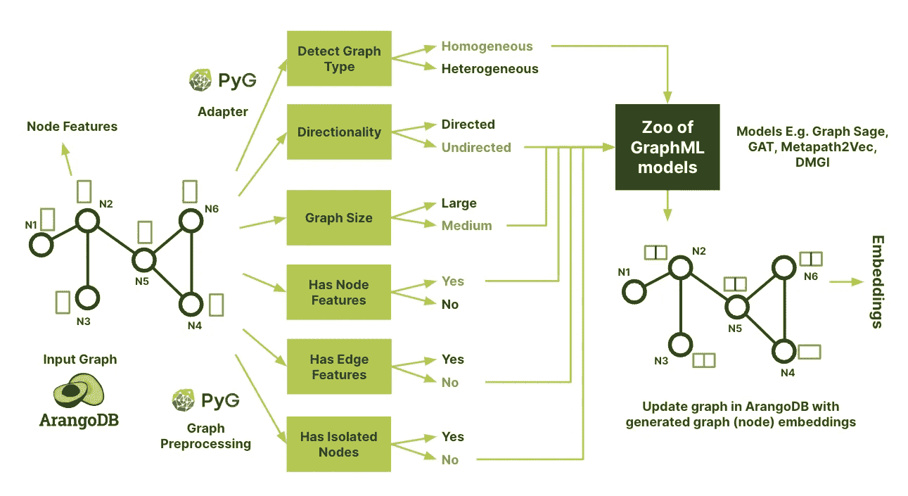
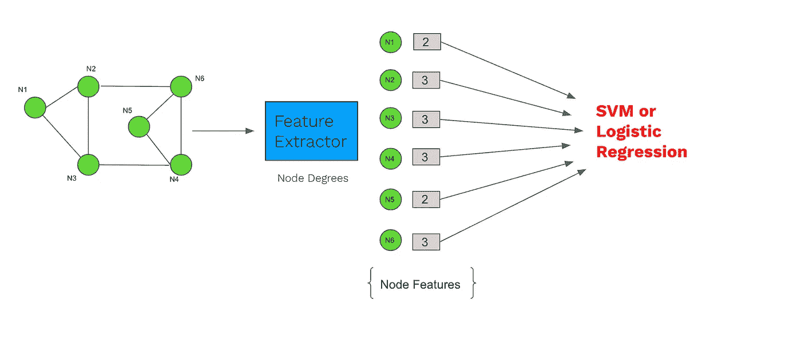
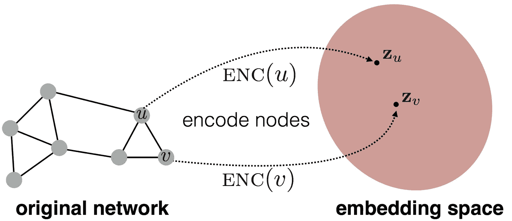
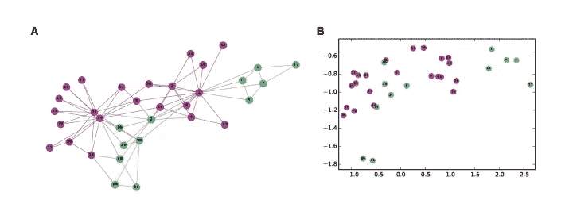
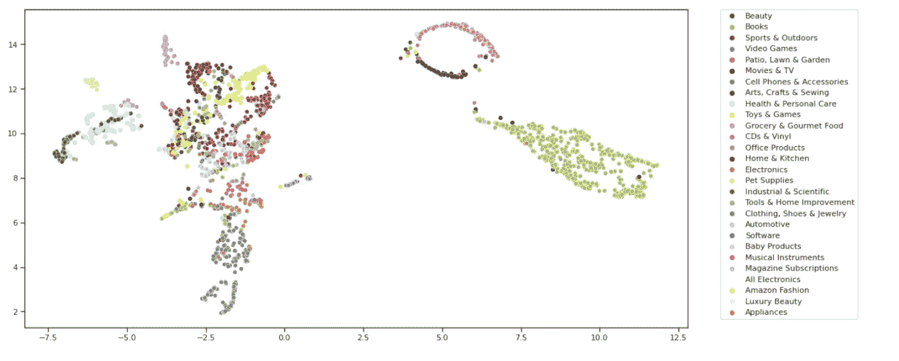
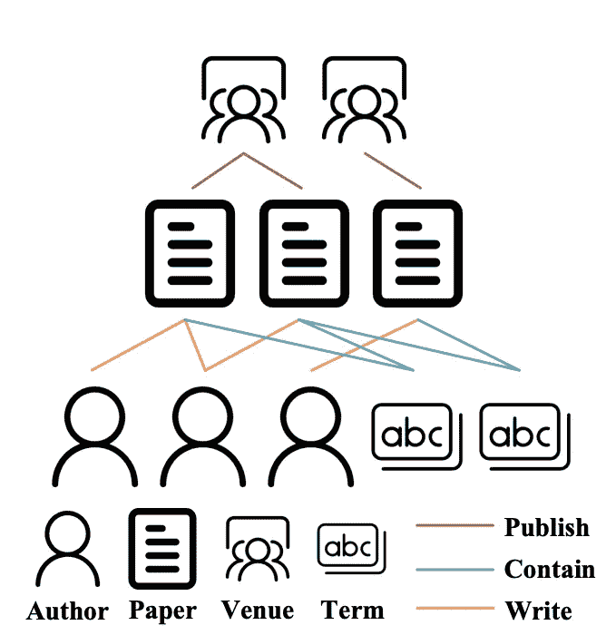
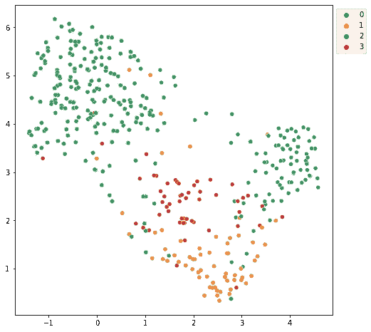
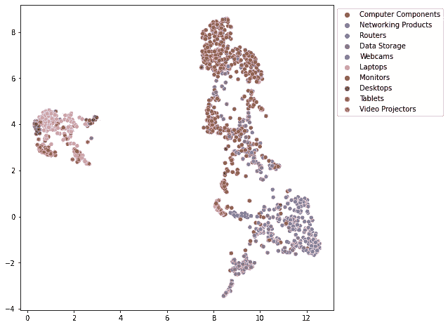

# fastgraphml:一个加速图机器学习模型开发过程的低代码框架

> 原文：<https://towardsdatascience.com/fastgraphml-a-low-code-framework-to-accelerate-the-graph-machine-learning-model-development-9a43863299f>

## *用低代码民主化图形机器学习*



[fastgraphml](https://github.com/arangoml/fastgraphml) (图片由作者提供)

图机器学习是机器学习的一个快速发展的领域。它吸引了从社会科学到化学、生物、物理和电子商务等各个领域的大量人员。这背后的原因是图形结构的数据无处不在。今天，许多现实世界的应用程序都由 Graph ML 支持来运行它们的预测服务。例如， [UberEats](https://www.uber.com/en-DE/blog/uber-eats-graph-learning/) 利用 Graph ML 向用户建议他们下一步可能喜欢的菜肴、餐馆和美食。 [Pinterest](https://medium.com/pinterest-engineering/pinsage-a-new-graph-convolutional-neural-network-for-web-scale-recommender-systems-88795a107f48) 利用 Graph ML 进行视觉推荐，Google [Deep Mind](https://www.deepmind.com/blog/traffic-prediction-with-advanced-graph-neural-networks) 利用 Graph ML 进行流量预测。鉴于这一迷人领域的兴起，我们很自豪地发布了 [**fastgraphml**](https://github.com/arangoml/fastgraphml) 包(构建在 [PyG](https://pytorch-geometric.readthedocs.io/en/latest/) 之上)，它可以帮助用户仅用 3 行代码构建 graphml 模型。第一个版本集中于提供图形嵌入(或节点嵌入)作为功能，因为它充当所有图形 ML 问题(节点分类、链接预测、图形分类)的基础。此外，该框架使用 [ArangoDB](https://www.arangodb.com/) (下一代图形数据和分析平台)作为后端，将图形直接导出到 fastgraphml 包中。在这篇博文中，我们将探讨以下内容:

*   为什么我们需要图形嵌入？
*   什么是图嵌入，它们是如何工作的？
*   什么是同构和异构图嵌入？
*   图嵌入的应用有哪些？
*   如何开始使用 fastgraphml 进行图形嵌入？
*   结论

# 为什么我们需要图形嵌入？

一旦在合并了图的所有实体(节点)之间有意义的关系(边)之后创建了图。想到的下一个问题是找到一种方法来将关于图结构的信息(例如，关于图中节点的全局位置或其局部邻域结构的信息)集成到机器学习模型中。从图中提取结构信息(或特征)的一种方式是使用节点度、聚类系数、页面等级、核函数或手工设计的特征来计算其图统计，以估计局部邻域结构。一旦这些特征被提取，它们可以被用作 ML 分类器的输入，例如 SVM 或逻辑回归



图上的传统 ML。节点特征由特征提取器提取，然后用作 ML 算法的输入。(图片由作者提供)

然而，上述方法在某种意义上是有限的，因为它们是算法相关的，并且发现了图表中存在的特定预测信号。例如，聚集系数特征提取器将测量图中的节点倾向于聚集在一起的程度(有助于社区检测和链接预测问题)。类似地，页面排名检测图中节点的重要性。这些方法缺乏对图形特征的端到端学习，即在训练过程中不能借助损失函数来学习特征。此外，设计这些特征提取器可能是一个耗时且昂贵的过程(因为它需要手动特征工程)。

另一方面，图嵌入(又名图表示学习)寻找一组更一般化的特征来表示图，而不是捕捉特定的特征。手动调整的特征提取器和图形嵌入之间的主要区别在于它们如何处理为机器学习表示图形的挑战。第一种方法将它作为预处理步骤，第二种方法使用数据驱动的方法(机器学习训练过程的一部分)来学习概括图拓扑的嵌入。因此，通过数据驱动的方法学习嵌入比试错的手工特征工程节省了大量时间。

# 什么是图(节点)嵌入，它们是如何工作的？

通过端到端过程提取图特征的一种方法是采用表示学习方法，该方法将关于图的结构信息编码到 d 维欧几里得空间(也称为向量空间或嵌入空间)中。图形表示学习背后的关键思想是学习一个映射函数，它将节点或整个(子)图(来自非欧几里德)作为低维向量空间中的点嵌入(到嵌入空间)。得到的 d 维向量被称为图(节点)嵌入。



图形表示学习中的映射过程(图片鸣谢:[斯坦福-cs224w](https://snap-stanford.github.io/cs224w-notes/machine-learning-with-networks/node-representation-learning)

W orking:目标是优化这种映射，使得原始网络中邻近的节点在嵌入空间(向量空间)中也应该保持彼此靠近，同时将未连接的节点推开。因此，通过这样做，我们可以为图嵌入中的下游任务(例如，链接预测、节点/图分类、社区检测和节点聚类)保留原始网络的几何关系和语义。

让我们用 Zachary 空手道俱乐部社交网络的图结构中的一个有趣的例子来更直观地理解工作。在该图中，节点表示人，并且如果两个人是朋友，则在他们之间存在边。图表中的颜色代表不同的社区。图 A)表示扎卡里空手道俱乐部社交网络，B)示出了从空手道图创建的节点嵌入的 2D 可视化。如果您分析这两个图，您会发现从图结构(非欧几里德或不规则域)到嵌入空间(图 B)的节点映射是以这样的方式完成的，即嵌入空间中节点之间的距离反映了原始图中的接近程度(保留了节点邻域的结构)。例如，在空手道图中，标记为紫色和绿色的人的群体与彼此远离的紫色和海绿色的群体相比，共享很近的距离。同样的模式也可以在图 b 中看到。



图像学分:[图形表示学习](https://arxiv.org/pdf/1709.05584.pdf)

# 同质图嵌入

齐次图是那些只由一种类型的节点和一种类型的链接(关系)组成的(无向图)。例如，[亚马逊产品图](https://ogb.stanford.edu/docs/nodeprop/) (ogbn-products)，其中节点表示亚马逊产品(例如，玩具、书籍、电子产品、家庭&厨房等)。)和边对应的是一起买的产品。从这种类型的图生成的嵌入被称为同构图嵌入。



使用 GraphSage 的亚马逊产品图(节点)嵌入的 2D 可视化。图片作者。

# 异构图嵌入

异构图是那些能够包含不同类型的节点和链接(或关系)的图。例如，书目图(又名学术图)可以描述由四种类型的节点(即作者、论文、会议和术语)和三种类型的关系(即作者-作者-论文、论文-包含-术语和会议-发表-论文)组成的异构图。



一个有 4 种节点和 3 种边的学术图(图片来源:[小王等人的异构图调查](https://arxiv.org/pdf/2011.14867.pdf))

从这种类型的图生成的嵌入被称为异构图嵌入。下图展示了使用 [DBLP](https://pytorch-geometric.readthedocs.io/en/latest/_modules/torch_geometric/datasets/dblp.html) 数据集(一个异构学术图)的作者节点嵌入的 2D 可视化。作者节点属于四个研究领域之一——数据库、数据挖掘、人工智能和信息检索。



使用 metapath2vec 对 DBLP 数据集中的作者节点嵌入进行 2D 可视化。图片作者。

# 图嵌入的应用

一旦生成了图(节点)嵌入，它们可以用于各种下游机器学习任务，例如:

*   它可以用作下游 ML 任务(例如，社区检测、节点分类和链接预测)的特征输入
*   我们可以从嵌入中构造一个 KNN/余弦相似图。该图表可用于提出建议(例如产品建议)
*   通过使用 U-Map 和 t-SNE 算法(例如执行聚类)将数据减少到 2 或 3 维，对数据进行可视化探索。
*   邻近搜索，即给定图中的任何输入节点，定位靠近该输入节点的节点(使用结构和语义信息)。
*   药物发现
*   欺诈检测
*   数据集比较
*   迁移学习

# 使用 fastgraphml 的图形嵌入

fatgraphml——给定一个输入图，它使用构建在 PyG 之上的低代码框架生成图嵌入。该软件包支持在支持 GPU 和 CPU 的机器上进行培训。与 CPU 相比，GPU 上的训练作业在处理大型图形时会带来更快的执行速度和更高的性能。此外，该框架提供了与 ArangoDB 的紧密集成，arango db 是一个可伸缩的、完全托管的图形数据库、文档存储和搜索引擎。一旦生成图嵌入，它们可以用于各种下游机器学习任务，如节点分类、链接预测、可视化、社区检测、相似性搜索、推荐等。

> 通过 fastgraphml 生成图形嵌入感觉起来轻而易举。

## 装置

必需的依赖关系

1.  PyTorch `1.12.*`是必需的。

*   使用与您的 CUDA 版本匹配的先前版本进行安装: [PyTorch](https://pytorch.org/get-started/previous-versions/)
*   要找到您安装的 CUDA 版本，请在您的终端上运行`nvidia-smi`。

2. [pyg](https://pytorch-geometric.readthedocs.io/en/latest/notes/installation.html)

3.失败

*   注意:对于 FAISS-CPU，需要`numba==0.53.0`

安装 fastgraphml

```
pip install fastgraphml
```

一旦安装了 fastgraphml，我们就可以开始使用 ArangoDB 中的图形或者只使用 PyG 图形数据对象来生成图形嵌入。

让我们看看不同的使用案例:

## 使用存储在 ArangoDB 中的图形生成图形嵌入:

> 同质图

```
from fastgraphml.graph_embeddings import SAGE, GAT
from fastgraphml.graph_embeddings import downstream_tasks
from fastgraphml import Datasets 
from arango import ArangoClient

# Initialize the ArangoDB client.
client = ArangoClient("http://127.0.0.1:8529")
db = client.db('_system', username='root', password='')

# Loading Amazon Computer Products dataset into ArangoDB
Datasets(db).load("AMAZON_COMPUTER_PRODUCTS")

# Optionally use arangodb graph
# arango_graph = db.graph('product_graph')

# metadata information of arango_graph
metagraph = {
    "vertexCollections": {
        "Computer_Products": {"x": "features", "y": "label"}, # mapping features attribute present in collection to x (node feature)
    },                                                        # mapping label attribute present in collection to y (node label)
    "edgeCollections": {
        "bought_together": {},
    },
}

# generating graph embeddings with 3 lines of code
model = SAGE(db,'product_graph', metagraph, embedding_size=256) # define graph embedding model
model._train(epochs=6, lr=0.0001) # train
embeddings = model.get_embeddings() # get embeddings
```

```
Homogeneous Graph Detected ........ 

{'Nodes': 13471, 'Node_feature_size': 767, 'Number_of_classes': 10, 'Edges': 491722, 'Edge_feature_fize': None, 'Graph Directionality': 'Undirected', 'Average node degree': '36.50', 'Number of training nodes': 10777, 'Number of val nodes': 1347, 'Number of test nodes': 1347, 'Has isolated nodes': False}
Training started .........
Epoch: 001, Train_Loss: 1.3626, Val: 0.7996, Test: 0.8048
Val Acc increased (0.00000 --> 0.79955).  Saving model ...
Epoch: 002, Train_Loss: 1.2654, Val: 0.8211, Test: 0.8233
Val Acc increased (0.79955 --> 0.82108).  Saving model ...
Epoch: 003, Train_Loss: 1.1866, Val: 0.8300, Test: 0.8315
Val Acc increased (0.82108 --> 0.82999).  Saving model ...
Epoch: 004, Train_Loss: 1.0630, Val: 0.8293, Test: 0.8344
Epoch: 005, Train_Loss: 1.0818, Val: 0.8352, Test: 0.8382
Val Acc increased (0.82999 --> 0.83519).  Saving model ...
```

此外，该库还提供了各种低代码助手方法来执行许多下游任务，如可视化、相似性搜索(推荐)和链接预测(即将添加)。

## 下游任务 1:图形嵌入可视化

该方法通过使用 U-Map 将生成的图形嵌入减少到二维，有助于生成图形嵌入的可视化。

```
class_names = {0: 'Desktops',1: 'Data Storage',2: 'Laptops',3: 'Monitors',4: 'Computer Components',
 5: 'Video Projectors',6: 'Routers',7: 'Tablets',8: 'Networking Products',9: 'Webcams'}

# emb visualization
# model.G access PyG data object
downstream_tasks.visualize_embeddings(model.G, embeddings, class_mapping=class_names, emb_percent=0.1) 
```



亚马逊计算机产品(图)节点嵌入的 2D 可视化。图片作者。

## 下游任务 2:使用 Faiss 的可扩展相似性搜索(推荐)

Faiss 是由脸书开发的一个工具，它可以在任意大小的向量集中执行相似性搜索，直到那些可能不适合 RAM 的向量。我们目前支持两种类型的搜索:

1.  精确搜索:精确的相似性搜索，但代价是可伸缩性。
2.  近似搜索:用于可扩展的相似性搜索，但会损失一些精度。

让我们执行推荐——给定任何一款计算机产品，哪一款产品可以一起购买？

```
# returns top 50 similar products (ids) along with similarity distance 
distance, nbors = downstream_tasks.similarity_search(embeddings, top_k_nbors=50) 
```

```
# Let's pick a random computer prodcut for which we want recommendation
# model.G.y access PyG node labels
class_names[model.G.y[5].item()]
```

```
'Data Storage'
```

```
# recommend computer product that can be bought together with 'Data Storage' product
class_names[model.G.y[nbors[5][40]].item()]
```

```
'Networking Products'
```

## 基于图嵌入的节点分类

在现实世界中，大多数数据集是没有标签的(或者只有很少的标签),并且经常是不平衡的。类别不平衡和稀疏标签使得监督学习成为一项具有挑战性的任务。它还会导致更高的假阴性，不平衡的数据集会导致模型出现更多的假阳性。因此，用无监督的目标训练 gnn 并在下游使用它们的潜在表示(节点嵌入)可以提供有希望的结果。一旦使用无监督学习生成了图(节点)嵌入，它们就可以被用作机器学习分类模型的特征输入，以执行节点分类的任务。

下面的代码显示，甚至更少的训练数据(带标签)即 10%也可以很好地概括看不见的数据(测试数据)，这与上面的 SAGE 类形成对比，在上面的 SAGE 类中，我们使用 80%的数据作为训练来测试生成的图形嵌入的性能。

```
# Dataset Splitting
X_train, X_test, y_train, y_test = train_test_split(
    embeddings, model.G.y, train_size=0.1, test_size=None, stratify=model.G.y, random_state=42)
```

```
# Training with Logistic Regression
clf = LogisticRegression(max_iter=1000, solver="lbfgs")
clf.fit(X_train, y_train)
```

```
y_pred = clf.predict(X_test)
# evalute accuracy on test set
accuracy_score(y_test, y_pred)
```

```
0.8094688221709007
```

## 在 ArangoDB 中存储同构图嵌入

fastgraphml 还提供了一个助手方法 *store_embeddings* 来存储 ArangoDB 中生成的图嵌入。

N 注:如果 nearest_nbors_search=True， *store_embeddings* 方法将生成的图嵌入与 top_k 最近邻(具有相似嵌入的节点 id)及其相应的相似性得分(即余弦距离)一起保存在 ArangoDB 中。

```
model.graph_util.store_embeddings(embeddings, collection_name='computer_products_embeddings', batch_size=100,
                                 class_mapping=class_names, nearest_nbors_search=True)
```

> 异构图

```
from fastgraphml.graph_embeddings import METAPATH2VEC
from fastgraphml.graph_embeddings import downstream_tasks 
from arango import ArangoClient
from sklearn.model_selection import train_test_split
from sklearn.metrics import accuracy_score
from sklearn.linear_model import LogisticRegression
```

```
# Initialize the ArangoDB client.
client = ArangoClient("http://127.0.0.1:8529")
db = client.db('_system', username='root')
```

```
# Loading ArangoDB Graph
arango_graph = db.graph("DBLP")
# metadata information of arango_graph (we assume DBLP graph already exists in ArangoDB)
metagraph = {
    "vertexCollections": {

        "author": { "x": "x", "y": "y"},  
        "paper": {"x": "x"},
        "term": {"x": "x"},
        "conference": {}
    },
    "edgeCollections": {
        "to": {},
    },
}

# APCPA
metapaths = [('author', 'to', 'paper'), 
             ('paper', 'to', 'conference'),
             ('conference', 'to', 'paper'),
            ('paper', 'to', 'author'), ]
```

```
# generating graph embeddings with 3 lines of code
model = METAPATH2VEC(db, arango_graph, metagraph, metapaths, key_node='author', 
                     embedding_size=128, walk_length=5, context_size=6, walks_per_node=10, 
                     num_negative_samples=10,sparse=True) # define model
model._train(epochs=15, lr=0.03) # train
embeddings = model.get_embeddings() # get embeddings
```

```
Heterogeneous Graph Detected .......... 

{'Nodes': 26128, 'Edges': 239566, 'node_types': ['author', 'paper', 'term', 'conference'], 'edge_types': [('author', 'to', 'paper'), ('paper', 'to', 'author'), ('paper', 'to', 'term'), ('paper', 'to', 'conference'), ('term', 'to', 'paper'), ('conference', 'to', 'paper')], 'Graph Directionality': 'Directed', 'Has isolated nodes': True, 'node stats': {'Number of author nodes': 4057, 'Number of train author nodes': 3245, 'Number of val author nodes': 406, 'Number of test author nodes': 406, 'Number of classes in author nodes': 4, 'number of paper nodes': 14328, 'number of term nodes': 7723, 'number of conference nodes': 20}}
Training started .........
Epoch: 001, Train_Loss: 8.7637, Val: 0.3399, Test: 0.3842
Val Acc increased (0.00000 --> 0.33990).  Saving model ...
Epoch: 002, Train_Loss: 6.0169, Val: 0.5000, Test: 0.5369
Val Acc increased (0.33990 --> 0.50000).  Saving model ...
Epoch: 003, Train_Loss: 4.9843, Val: 0.6749, Test: 0.6650
Val Acc increased (0.50000 --> 0.67488).  Saving model ...
Epoch: 004, Train_Loss: 4.3761, Val: 0.7980, Test: 0.7956
Val Acc increased (0.67488 --> 0.79803).  Saving model ...
Epoch: 005, Train_Loss: 3.4619, Val: 0.8719, Test: 0.8522
Val Acc increased (0.79803 --> 0.87192).  Saving model ...
Epoch: 006, Train_Loss: 2.9975, Val: 0.8867, Test: 0.8695
Val Acc increased (0.87192 --> 0.88670).  Saving model ...
Epoch: 007, Train_Loss: 2.4220, Val: 0.9163, Test: 0.8818
Val Acc increased (0.88670 --> 0.91626).  Saving model ...
Epoch: 008, Train_Loss: 2.0990, Val: 0.9187, Test: 0.8867
Val Acc increased (0.91626 --> 0.91872).  Saving model ...
Epoch: 009, Train_Loss: 1.8748, Val: 0.9163, Test: 0.8793
Epoch: 010, Train_Loss: 1.6358, Val: 0.9089, Test: 0.9015
Epoch: 011, Train_Loss: 1.6156, Val: 0.9138, Test: 0.9089
Epoch: 012, Train_Loss: 1.4696, Val: 0.9261, Test: 0.9089
Val Acc increased (0.91872 --> 0.92611).  Saving model ...
Epoch: 013, Train_Loss: 1.2789, Val: 0.9163, Test: 0.8892
Epoch: 014, Train_Loss: 1.2143, Val: 0.9187, Test: 0.9138
```

```
# Metapath2Vec compute embeddings for those nodes which are present in metapath
embeddings
```

```
{'author': array([[ 0.3469685 , -0.73929137, -0.3658532 , ..., -0.07065899,
          0.01433279, -0.00440213],
        [-0.18779977,  0.0759825 , -0.38714892, ..., -0.13985269,
         -0.7717297 , -0.55180293],
        [-0.27399492, -0.1742627 ,  0.01303964, ...,  0.08810424,
         -0.4031429 ,  0.20701364],
        ...,
        [ 0.1659177 ,  0.11282699, -0.14390166, ...,  0.17577603,
         -0.28433827,  0.16120055],
        [ 0.01443969,  0.1374461 ,  0.5134789 , ...,  0.33182082,
          0.2584621 ,  0.00462335],
        [ 0.22391362, -0.50708103,  0.34233156, ...,  0.03449561,
          0.16480075,  0.39390147]], dtype=float32),
 'conference': array([[-2.1632937e-01, -5.3228494e-02,  1.5947707e-01, ...,
          5.1428860e-01,  8.5533451e-04, -3.4591302e-01],
        [ 6.9806822e-02,  5.0240862e-01, -2.3461170e-01, ...,
         -4.9915221e-01,  1.5349187e-01, -1.8434562e-01],
        [-5.0854170e-01, -9.7937733e-02, -1.0179291e+00, ...,
         -1.8171304e-01,  6.6947944e-02, -3.5466689e-01],
        ...,
        [ 6.2907688e-02, -8.9021228e-02,  3.4244403e-02, ...,
         -1.6124582e-02,  5.2124184e-01,  3.5454047e-01],
        [-1.1044691e+00,  3.7697849e-01, -3.7053806e-01, ...,
         -2.4933312e-02,  7.9877669e-01,  3.4990273e-02],
        [-8.0069518e-01,  6.9776934e-01, -5.1909280e-01, ...,
         -2.3521569e-03, -7.8969456e-02,  9.5190950e-02]], dtype=float32),
 'paper': array([[-1.6482981 ,  0.7253625 ,  1.0436039 , ...,  1.4693767 ,
         -1.5437169 , -0.0564078 ],
        [-0.22423816,  0.34060782, -0.09682338, ..., -0.3744318 ,
         -0.4454421 , -1.3889308 ],
        [-0.00360703, -1.0357887 , -0.6753541 , ..., -0.6235587 ,
         -0.2809864 , -0.6067877 ],
        ...,
        [-0.08141378,  1.0001668 ,  0.57556117, ..., -1.494264  ,
         -0.13634554,  1.0170926 ],
        [-1.0099323 ,  0.67756116,  0.5964136 , ..., -0.6101154 ,
         -1.1644614 ,  0.04493611],
        [ 0.09980668,  0.178698  ,  0.52335536, ..., -1.1220363 ,
         -1.161221  ,  0.35191363]], dtype=float32)}
```

## 相似性搜索/推荐

```
# returns top 10 similar authors(ids) along with similarity distance 
distance, nbors = downstream_tasks.similarity_search(embeddings['author'], top_k_nbors=10)
```

```
# recommend similar authors based on common research areas and common conferences
nbors
```

```
array([[   0,  670,   14, ..., 1132,  230, 2585],
       [   1,   14, 1132, ...,  404,   22, 1730],
       [   2, 3718, 1201, ..., 3784, 3848, 3820],
       ...,
       [4054, 1795, 2235, ..., 1389, 4012, 3991],
       [4055, 3104, 2803, ..., 2530, 1364, 3900],
       [4056, 3979, 2630, ..., 4013, 4006, 3991]])
```

## 基于图嵌入的节点分类

```
# Dataset Splitting
X_train, X_test, y_train, y_test = train_test_split(
    embeddings['author'], model.G['author'].y.cpu().numpy(), train_size=0.1, test_size=None, 
    stratify=model.G['author'].y.cpu().numpy(), random_state=42)
# Training with Logistic Regression
clf = LogisticRegression(max_iter=1000, solver="lbfgs")
clf.fit(X_train, y_train)
y_pred = clf.predict(X_test)
# evalute accuracy on test set
accuracy_score(y_test, y_pred)
```

```
0.9173055859802848
```

## 在 ArangoDB 中存储异构图嵌入

```
model.graph_util.store_embeddings(embeddings['author'], collection_name='author_embeddings', node_type='author')
```

## 使用 PyG 图生成图嵌入:

```
from fastgraphml.graph_embeddings import SAGE, GAT
from fastgraphml.graph_embeddings import downstream_tasks 
from torch_geometric.datasets import Planetoid

# load pyg dataset
dataset = Planetoid(root='/tmp/Cora', name='Cora')
data = dataset[0]

# generating graph embeddings with 3 lines of code
model = SAGE(pyg_graph=data, embedding_size=64) # define graph embedding model
model._train(epochs=10) # train
embeddings = model.get_embeddings() # get embeddings
```

# 结论

在本文中，我们了解了在图形上进行机器学习的传统方法——图形特征提取器，如节点度、聚类系数等。以及它们的局限性。然后，我们研究了图形嵌入相对于手工图形特征工程的重要性。此外，我解释了什么是图嵌入——在 d 维向量空间中对结构和语义信息进行编码的图的总结。之后，我们看到了同构和异构图嵌入的非常高层次的直观解释。在最后一节中，我们讨论如何开始使用 fastgraphml——一个快速构建图形机器学习模型的低代码包。fastgraphml 包提供了许多功能——用 3 行代码构建图形 ml 模型，为同构和异构图形生成图形嵌入，图形嵌入可视化，用图形嵌入进行相似性搜索，从 ArangoDB 导出图形并将图形嵌入保存到 ArangoDB，以及直接从 PyG 数据对象生成图形嵌入。ArangoGraphML 团队也在构建一个 [GraphML 平台](https://www.arangodb.com/arangodb-for-machine-learning/)(企业就绪，以图形为动力的机器学习作为云服务)，目前作为测试程序开放。

欢迎对下一版本的任何反馈和功能要求！！

# 感谢

我要感谢 [**ArangoDB**](https://www.arangodb.com/) 的整个 ML 团队在我编写这个包的时候给了我宝贵的反馈。

想联系我: [**Linkedin**](https://www.linkedin.com/in/sachin-sharma-4198061a9/?originalSubdomain=de)